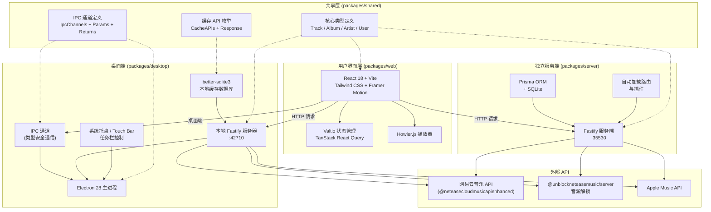

R3PLAYX 是一款**高颜值的第三方网易云音乐播放器**，基于 React + Electron 构建，同时提供桌面端和 Web 端两种运行形态。项目采用 Turborepo 管理的 Monorepo 架构，将桌面应用、Web 前端、独立服务端和共享类型层拆分为四个独立但紧密协作的包（Package），通过 PNPM 工作区统一依赖管理和构建编排。当前版本为 **2.7.6 Beta**，以 AGPL-3.0 许可证开源，API 源码源自 [Binaryify/NeteaseCloudMusicApi](https://github.com/Binaryify/NeteaseCloudMusicApi) 的增强版本。

Sources: [README.md](README.md#L1-L55), [package.json](package.json#L1-L49), [CLAUDE.md](CLAUDE.md#L6-L14)

## 核心特性

R3PLAYX 作为一款以音乐播放为核心的第三方客户端，在功能设计上刻意剥离了网易云原版的社交功能，专注于纯粹的听歌体验，同时扩展了多个音源渠道和视觉增强能力。以下表格概括了项目的主要特性矩阵：

| 特性类别 | 功能 | 说明 |
|---------|------|------|
| **账号体系** | 网易云账号登录 | 支持扫码、手机号、邮箱三种登录方式 |
| **播放能力** | 音乐播放 / MV 播放 / 私人 FM | 基于 Howler.js 音频引擎，支持多音质（h/m/l）切换 |
| **音源扩展** | Unblock 音源解锁 / Apple Music / YouTube | 通过 `@unblockneteasemusic/server` 绕过地区限制，ytdl-core 支持 YouTube 音源 |
| **歌词系统** | 歌词展示 / 桌面歌词窗口 | 内嵌歌词渲染，独立歌词窗口可置顶/钉住 |
| **视觉增强** | 全局动态背景 / 主题系统 / 封面取色 | 模糊背景、呼吸背景效果，Accent Color 自动提取 |
| **跨平台** | macOS / Windows / Linux | Electron 打包分发，macOS 支持 Touch Bar 和 Dock Menu |
| **部署方式** | Docker / Vercel / 独立服务端 | 前后端分离部署，docker-compose 一键启动 |
| **本地化** | 中文 / 英文 | 基于 i18next 的国际化支持 |

Sources: [README.md](README.md#L27-L38), [CLAUDE.md](CLAUDE.md#L6-L14), [packages/desktop/main/index.ts](packages/desktop/main/index.ts#L88-L103)

## 整体架构概览

R3PLAYX 的核心架构思路是 **"一套 UI，两种后端"**——Web 端和桌面端共享同一套 React 前端代码（`packages/web`），但通过不同的通信路径与后端交互：桌面端通过 Electron IPC + 本地 Fastify 服务器，Web 端通过独立 Fastify 服务端。`packages/shared` 作为类型和接口的桥梁，确保两端的数据结构一致性。



上图展示了 R3PLAYX 的三层架构：**用户界面层**统一使用 React 构建，**中间通信层**根据运行环境选择 IPC 或 HTTP，**后端服务层**通过 Fastify 路由代理至外部音乐 API。`packages/shared` 作为贯穿全栈的类型契约层，保证了从 UI 到数据库的字段类型一致性。

Sources: [CLAUDE.md](CLAUDE.md#L102-L137), [packages/desktop/main/appServer/appServer.ts](packages/desktop/main/appServer/appServer.ts#L1-L44), [packages/server/src/app.ts](packages/server/src/app.ts#L1-L21)

## 技术栈全景

项目在每个包中采用了精确匹配的技术选型，下表按包维度汇总了所有关键技术组件：

| 维度 | desktop (桌面端) | web (前端) | server (服务端) | shared (共享层) |
|------|-----------------|-----------|----------------|----------------|
| **运行时** | Electron 28 | 浏览器 / Vite Dev | Node.js | TypeScript (编译时) |
| **框架** | Electron + Fastify | React 18 | Fastify 4 | — |
| **构建工具** | esbuild + tsx | Vite 4 + SWC | tsc + esbuild | tsc |
| **数据库** | better-sqlite3 | — | Prisma + SQLite | 类型定义 |
| **状态管理** | electron-store | Valtio + React Query | — | 类型定义 |
| **音频** | — | Howler.js | — | — |
| **样式** | — | Tailwind CSS + Framer Motion | — | — |
| **API 代理** | Fastify 路由 + http-proxy | Vite proxy (开发) | Fastify 路由 | API 接口类型 |
| **测试** | Vitest | Vitest + Testing Library | — | — |
| **关键依赖** | electron-store, electron-updater | react-virtuoso, i18next, hls.js | @fastify/autoload, fastify-cli | — |

Sources: [packages/desktop/package.json](packages/desktop/package.json#L1-L69), [packages/web/package.json](packages/web/package.json#L1-L87), [packages/server/package.json](packages/server/package.json#L1-L47), [CLAUDE.md](CLAUDE.md#L9-L13)

## Monorepo 项目结构

项目采用 PNPM 工作区 + Turborepo 的标准 Monorepo 方案。`pnpm-workspace.yaml` 声明了 `packages/*` 为工作区成员，`turbo.json` 定义了构建流水线的依赖关系和缓存策略——构建顺序遵循 `shared → {server, web} → desktop` 的依赖链，确保共享类型先于消费者构建完成。

```
music/                              # Monorepo 根目录
├── packages/
│   ├── desktop/                    # 🔵 桌面端 (Electron 主进程)
│   │   ├── main/                   #   Electron 主进程入口与核心逻辑
│   │   │   ├── index.ts            #     主进程启动类 Main
│   │   │   ├── ipcMain.ts          #     IPC 通道处理
│   │   │   ├── appServer/          #     本地 Fastify 服务器 + 路由
│   │   │   ├── db.ts               #     SQLite 数据库操作
│   │   │   ├── cache.ts            #     API 缓存管理
│   │   │   ├── tray.ts             #     系统托盘
│   │   │   ├── touchBar.ts         #     macOS Touch Bar
│   │   │   ├── keyboardShortcuts.ts#     全局快捷键
│   │   │   └── store.ts            #     electron-store 配置
│   │   ├── migrations/             #   数据库迁移脚本
│   │   ├── build/                  #   构建脚本
│   │   └── scripts/                #   SQLite 编译 & 主进程构建
│   │
│   ├── web/                        # 🟢 前端 (React + Vite)
│   │   ├── App.tsx                 #   应用入口 (桌面/移动布局切换)
│   │   ├── pages/                  #   页面组件
│   │   │   ├── My/                 #     我的音乐
│   │   │   ├── Discover.tsx        #     发现页
│   │   │   ├── Browse/             #     浏览分类
│   │   │   ├── Album/              #     专辑详情
│   │   │   ├── Artist/             #     歌手详情
│   │   │   ├── Playlist/           #     歌单详情
│   │   │   ├── Search/             #     搜索
│   │   │   ├── Settings/           #     设置
│   │   │   └── Lyrics/             #     歌词
│   │   ├── components/             #   UI 组件库
│   │   ├── states/                 #   Valtio 状态仓库
│   │   ├── hooks/                  #   自定义 React Hooks
│   │   ├── api/                    #   API 请求封装
│   │   ├── i18n/                   #   国际化资源
│   │   └── utils/                  #   工具函数 & 播放器逻辑
│   │
│   ├── server/                     # 🟠 独立服务端 (Fastify)
│   │   ├── src/
│   │   │   ├── app.ts              #     Fastify 应用入口 (AutoLoad)
│   │   │   ├── routes/             #     API 路由
│   │   │   │   ├── netease/        #       网易云 API 代理
│   │   │   │   └── apple-music/    #       Apple Music 集成
│   │   │   └── plugins/            #     Fastify 插件
│   │   └── prisma/                 #   数据模型 & 迁移
│   │
│   └── shared/                     # 🟡 共享类型层
│       ├── interface.d.ts          #   Track / Album / Artist / User 等
│       ├── IpcChannels.ts          #   IPC 通道枚举 + 参数 + 返回类型
│       ├── CacheAPIs.ts            #   缓存 API 枚举 + 响应类型映射
│       ├── playerDataTypes.ts      #   播放器数据类型 (RepeatMode 等)
│       ├── defaultSettings.ts      #   默认设置 (含跨平台快捷键)
│       ├── AppleMusic.ts           #   Apple Music 类型定义
│       ├── api/                    #   API 响应类型
│       └── db/                     #   数据库模型类型
│
├── turbo.json                      # Turborepo 构建流水线
├── pnpm-workspace.yaml             # PNPM 工作区声明
├── .env.example                    # 环境变量模板
├── docker-compose.yml              # Docker 部署配置
└── package.json                    # 根 package (脚本 + 全局依赖)
```

Sources: [pnpm-workspace.yaml](pnpm-workspace.yaml#L1-L3), [turbo.json](turbo.json#L1-L38), [CLAUDE.md](CLAUDE.md#L104-L116)

## 通信架构：桌面端 vs Web 端

R3PLAYX 最关键的架构决策在于**同一套 UI 代码如何适配两种运行环境**。桌面端启动时，Electron 主进程会同时拉起本地 Fastify 服务器（端口 42710）和网易云音乐 API 代理服务（端口 30001），渲染进程通过 IPC 通道与主进程通信（窗口控制、缓存读写、元数据同步），通过 HTTP 请求访问本地 Fastify 路由（API 数据获取）。Web 端则直接向独立服务端（端口 35530）发起 HTTP 请求，无需 IPC 通道。

| 通信方式 | 桌面端 | Web 端 |
|---------|--------|--------|
| **UI ↔ 后端数据** | HTTP → 本地 Fastify (:42710) | HTTP → 远程 Fastify (:35530) |
| **窗口控制** | IPC (`Minimize` / `MaximizeOrUnmaximize` / `Close`) | 浏览器原生 |
| **播放状态同步** | IPC (`SyncProgress` / `Play` / `Pause` / `Next`) | — |
| **缓存读写** | IPC (`GetApiCache` / `ClearAPICache`) → better-sqlite3 | 服务端 Prisma → SQLite |
| **设置持久化** | IPC → electron-store | localStorage / cookies |
| **主题/外观** | IPC (`SyncTheme` / `SyncAccentColor`) | 直接 Valtio 状态 |
| **网易云 API** | 本地代理 → `@neteasecloudmusicapienhanced/api` | 服务端代理 → 同 |
| **音源解锁** | 本地路由 → `@unblockneteasemusic/server` | 服务端路由 → 同 |

桌面端开发时，Vite 开发服务器运行于 42710 端口，通过 proxy 配置将 `/netease/` 请求转发至 30001 端口的网易云 API 服务；生产构建时，Vite 产物被嵌入 Electron，Fastify 直接通过 `@fastify/static` 托管静态文件。

Sources: [CLAUDE.md](CLAUDE.md#L118-L137), [packages/web/vite.config.ts](packages/web/vite.config.ts#L96-L109), [packages/desktop/main/appServer/appServer.ts](packages/desktop/main/appServer/appServer.ts#L22-L44), [packages/desktop/main/index.ts](packages/desktop/main/index.ts#L47-L64)

## 环境变量与端口配置

项目的运行时配置通过根目录 `.env` 文件管理，以下三个环境变量控制着核心端口和 API 路径：

| 变量名 | 默认值 | 用途 |
|-------|--------|------|
| `ELECTRON_WEB_SERVER_PORT` | `42710` | 桌面端本地 Fastify 服务器端口（也是 Vite 开发服务器端口） |
| `ELECTRON_DEV_NETEASE_API_PORT` | `30001` | 桌面端开发模式下网易云 API 代理端口 |
| `VITE_APP_NETEASE_API_URL` | `/netease` | 前端请求网易云 API 的 URL 前缀路径 |

Web 端独立部署时，服务端固定监听 `35530` 端口（在 `packages/server/package.json` 的 `start` 脚本中指定），Docker 部署通过 `docker-compose.yml` 将前端映射至 `2222` 端口、后端映射至 `35530` 端口。

Sources: [.env.example](.env.example#L1-L3), [packages/server/package.json](packages/server/package.json#L8-L9), [docker-compose.yml](docker-compose.yml#L1-L19)

## 开源许可与社区

R3PLAYX 采用 **AGPL-3.0** 许可证开源，这意味着任何基于此项目的衍生作品**必须同样开源**并在项目说明中明确注明来源。项目的 API 核心源自 [Binaryify/NeteaseCloudMusicApi](https://github.com/Binaryify/NeteaseCloudMusicApi) 的增强版本 `@neteasecloudmusicapienhanced/api`，音源解锁能力依赖 `@unblockneteasemusic/server`。项目目前处于 Beta 阶段，开发者可通过 Telegram 群组参与讨论。

Sources: [README.md](README.md#L46-L55), [LICENSE](LICENSE#L1-L10)

## 阅读导航

作为项目概述，本文档建立了对 R3PLAYX 整体架构的宏观认知。以下是基于目录结构的推荐阅读路径，帮助你从快速上手逐步深入到各子系统的实现细节：

**第一步：快速上手**
1. [快速启动：开发环境搭建与运行](2-kuai-su-qi-dong-kai-fa-huan-jing-da-jian-yu-yun-xing) — 搭建开发环境，运行你的第一个 Hello World
2. [Monorepo 项目结构总览](3-monorepo-xiang-mu-jie-gou-zong-lan) — 深入理解包间依赖关系与构建流程
3. [Docker 容器化部署](4-docker-rong-qi-hua-bu-shu) — 将应用部署到生产环境

**第二步：架构深入**
4. [Turborepo 构建编排与 PNPM 工作区](5-turborepo-gou-jian-bian-pai-yu-pnpm-gong-zuo-qu) — 理解构建流水线的依赖图与缓存策略
5. [客户端-服务端通信架构：桌面端与 Web 端的差异](6-ke-hu-duan-fu-wu-duan-tong-xin-jia-gou-zhuo-mian-duan-yu-web-duan-de-chai-yi) — 深入 IPC 与 HTTP 双通道的设计取舍
6. [Electron 进程间通信（IPC）：通道定义与类型安全](7-electron-jin-cheng-jian-tong-xin-ipc-tong-dao-ding-yi-yu-lei-xing-an-quan) — 掌握 IPC 通道的三位一体类型约束

**第三步：按兴趣深入** — 根据你的关注点选择桌面端核心、Web 前端、独立服务端或共享类型体系的专题文档。