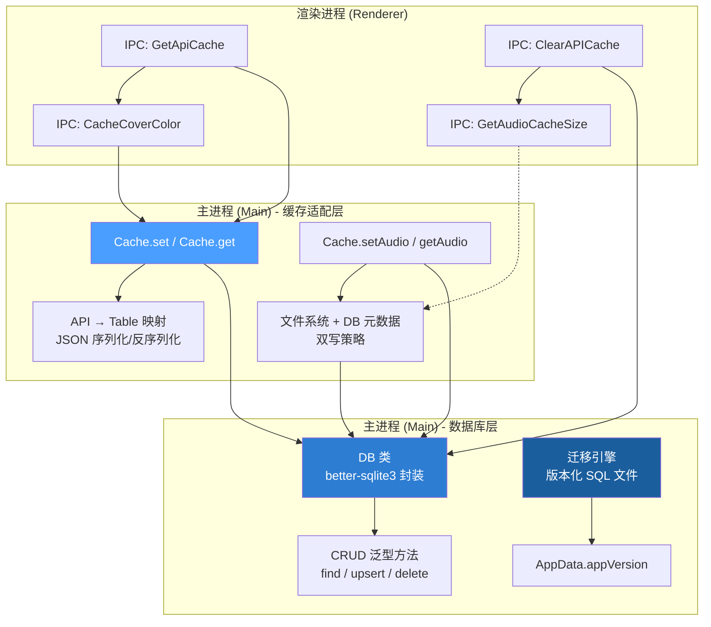
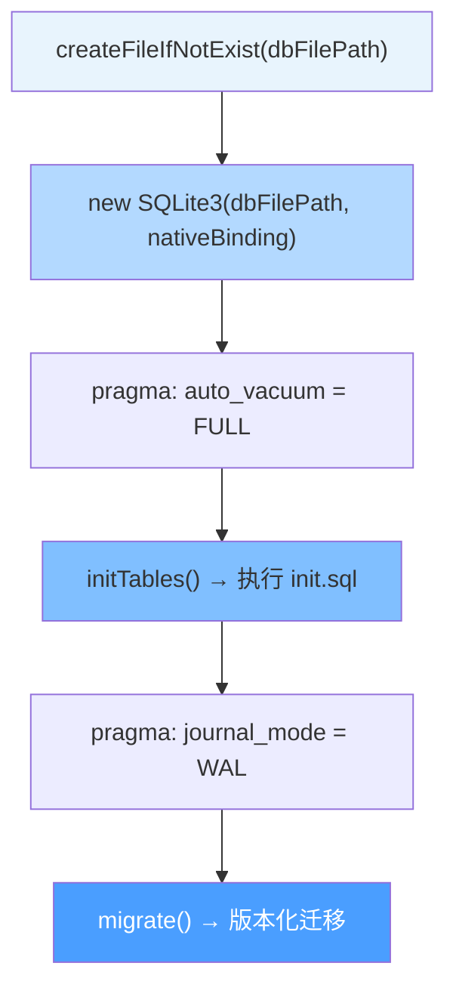
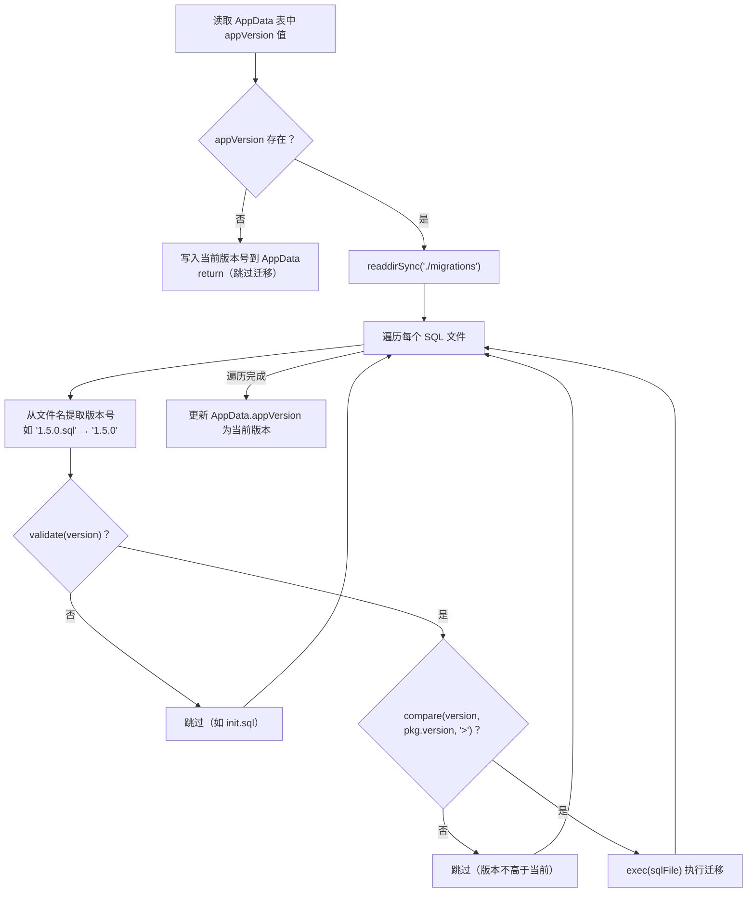
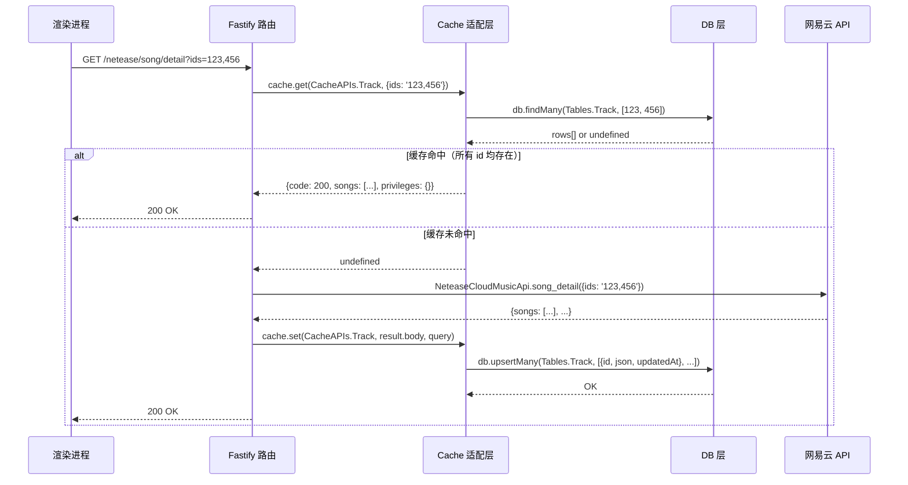

R3PLAYX 桌面端选择 **better-sqlite3** 作为本地持久化引擎，承担 API 响应缓存、音频元数据索引、版本迁移等核心职责。不同于 Web 端依赖服务端 Prisma ORM（参见 [Prisma ORM 与 SQLite 数据模型](21-prisma-orm-yu-sqlite-shu-ju-mo-xing)），桌面端在 Electron 主进程中直接操控 SQLite，通过一个泛型 DB 类和 Cache 适配层，将网易云音乐 API 的异构响应统一序列化为 `{id, json, updatedAt}` 行结构。本文将从数据库初始化、Schema 设计、缓存路由、Native Binary 构建、迁移机制五个维度进行深度剖析。

Sources: [db.ts](packages/desktop/main/db.ts#L1-L248), [cache.ts](packages/desktop/main/cache.ts#L1-L349)

## 架构总览：三层分离的缓存体系

桌面端数据持久化分为三个职责明确的层次：



**渲染进程**通过 IPC 通道（详见 [Electron 进程间通信（IPC）：通道定义与类型安全](7-electron-jin-cheng-jian-tong-xin-ipc-tong-dao-ding-yi-yu-lei-xing-an-quan)）发起缓存读写请求；**Cache 适配层**负责将不同 API 的异构响应映射到对应的 DB 表，处理 JSON 序列化与响应重建；**DB 层**提供类型安全的泛型 CRUD 操作，并管理 Schema 初始化与版本迁移。三层分离使得缓存逻辑的变更（如新增 API 缓存）不波及底层 SQL 操作，而数据库引擎的替换（如从 better-sqlite3 迁移到 sql.js）也不会影响上层的 API 映射。

Sources: [ipcMain.ts](packages/desktop/main/ipcMain.ts#L262-L287), [db.ts](packages/desktop/main/db.ts#L82-L104)

## DB 类：better-sqlite3 同步封装与泛型类型安全

### 初始化流程

DB 类在模块加载时即实例化为单例（`export const db = new DB()`），其构造函数执行三阶段初始化：



数据库文件存储于 Electron 的 `userData` 目录下 `api_cache/db.sqlite`。`createFileIfNotExist` 工具函数确保父目录与文件存在（空文件即可，better-sqlite3 会自行初始化 SQLite 格式）。初始化后立即设置两个关键 PRAGMA：**`auto_vacuum = FULL`** 在每次事务提交时自动回收已删除数据的空间，避免数据库文件无限膨胀；**`journal_mode = WAL`**（Write-Ahead Logging）将写操作追加到 WAL 文件，读操作不阻塞写、写操作不阻塞读，显著提升 Electron 单线程模型下的 I/O 并发能力。

Sources: [db.ts](packages/desktop/main/db.ts#L82-L128), [utils.ts](packages/desktop/main/utils.ts#L32-L37)

### 表枚举与类型结构映射

DB 类的核心设计是将表名（`Tables` 枚举）与行结构（`TablesStructures` 接口）建立 **编译时类型关联**，使得所有 CRUD 方法都能根据表名自动推断参数和返回值类型：

| Tables 枚举 | 主键类型 | 行结构模式 | 用途 |
|---|---|---|---|
| `Track` | `number` | `{id, json, updatedAt}` | 歌曲详情缓存 |
| `Album` | `number` | `{id, json, updatedAt}` | 专辑详情缓存 |
| `Artist` | `number` | `{id, json, updatedAt}` | 歌手详情缓存 |
| `Playlist` | `number` | `{id, json, updatedAt}` | 歌单详情缓存 |
| `ArtistAlbum` | `number` | `{id, json, updatedAt}` | 歌手专辑列表缓存 |
| `Lyrics` | `number` | `{id, json, updatedAt}` | 歌词缓存 |
| `Unblock` | `number` | `{id, json, updatedAt}` | 音源解锁结果缓存 |
| `AppleMusicAlbum` | `number` | `{id, json, updatedAt}` | Apple Music 专辑缓存 |
| `AppleMusicArtist` | `number` | `{id, json, updatedAt}` | Apple Music 歌手缓存 |
| `AccountData` | `string` | `{id, json, updatedAt}` | 账户级数据（歌单列表、喜欢列表等） |
| `Audio` | `number` | `{id, bitRate, format, source, queriedAt}` | 音频文件元数据 |
| `CoverColor` | `number` | `{id, color, queriedAt}` | 封面主色调缓存 |
| `AppData` | `string` | `{id, value}` | 应用级键值存储（版本号等） |

大多数表采用 **JSON-as-Column** 模式——将完整的 API 响应对象序列化为 `json` 字段存储。这种反范式设计的核心权衡是：牺牲 SQL 层面的字段级查询能力，换取对异构 API 响应的零 Schema 维护成本。网易云音乐 API 返回结构复杂且版本迭代频繁，若为每个 API 维护独立列定义，迁移成本将远高于当前方案。

例外的是 `Audio`、`CoverColor` 和 `AppData` 三张表，它们使用结构化列而非 JSON，因为这些数据需要按特定字段（如 `bitRate`、`format`、`source`、`color`、`value`）进行直接查询和更新，JSON 解析开销在此场景下不可接受。

Sources: [db.ts](packages/desktop/main/db.ts#L14-L74)

### 泛型 CRUD 方法族

DB 类的方法签名通过 `TableNames` 类型约束与 `TablesStructures` 索引类型实现端到端类型安全：

```typescript
// 示例：find 方法根据表名推断返回类型
find<T extends TableNames>(table: T, key: TablesStructures[T]['id']): TablesStructures[T] | undefined
```

当调用 `db.find(Tables.Track, 123456)` 时，TypeScript 自动推断返回值为 `CommonTableStructure | undefined`，而 `db.find(Tables.Audio, 123456)` 则返回 `{id, bitRate, format, source, queriedAt} | undefined`。方法族包含以下操作：

| 方法 | SQL 策略 | 事务包裹 | 说明 |
|---|---|---|---|
| `find` | `SELECT ... WHERE id = ? LIMIT 1` | 否 | 单行精确查询 |
| `findMany` | `SELECT ... WHERE id = X OR id = Y ...` | 否 | 多行批量查询 |
| `findAll` | `SELECT *` | 否 | 全表扫描 |
| `create` | `INSERT INTO` | 否 | 插入（可选跳过已存在行） |
| `createMany` | `INSERT OR IGNORE INTO` | **是** | 批量插入，事务保证原子性 |
| `upsert` | `INSERT OR REPLACE INTO` | 否 | 存在则替换，不存在则插入 |
| `upsertMany` | `INSERT OR REPLACE INTO` | **是** | 批量 upsert，事务保证原子性 |
| `delete` | `DELETE WHERE id = ?` | 否 | 单行删除 |
| `deleteMany` | `DELETE WHERE id = X OR id = Y` | 否 | 批量删除 |
| `truncate` | `DELETE FROM` | 否 | 清空整表（不重置自增） |
| `vacuum` | `VACUUM` | 否 | 物理回收空间 |

**`upsert`/`upsertMany`** 是缓存场景下最核心的操作——API 数据频繁更新，需要幂等写入。`INSERT OR REPLACE` 语义保证同一主键的记录总是被最新数据覆盖。批量操作通过 `better-sqlite3` 的 `db.transaction()` 包裹，确保整批写入要么全部成功、要么全部回滚，避免部分写入导致的数据不一致。

值得注意的是 `findMany` 方法采用字符串拼接构建 `WHERE` 子句（`` keys.map(key => `id = ${key}`).join(' OR ') ``），而非参数化查询。这在当前场景下可接受——`keys` 来源于内部 `Cache` 类的类型化调用，而非外部输入。但若未来开放更灵活的查询接口，此处需重构为参数化查询以防 SQL 注入。

Sources: [db.ts](packages/desktop/main/db.ts#L162-L244)

## Cache 类：API 响应到数据库表的路由映射

Cache 类是 DB 层与业务逻辑之间的**适配器**，它解决了"不同 API 响应结构各异，如何统一存入有限数量的表"这一核心问题。其 `set()` 和 `get()` 方法通过 `switch` 语句将 `CacheAPIs` 枚举值映射到具体的表操作与数据变换逻辑。

### 写入路径（Cache.set）

`set(api, data, query)` 接收三个参数：API 名称、响应数据、请求参数。根据 API 类别执行不同的数据提取和存储策略：

| CacheAPIs 类别 | 目标表 | 数据变换逻辑 |
|---|---|---|
| 用户数据类（UserPlaylist, UserAccount, Likelist 等） | `AccountData` | 直接 `JSON.stringify(data)` 整体存储，id 为 API 名称字符串 |
| Track | `Track` | 从 `data.songs` 数组提取，每首歌一行，批量 `upsertMany` |
| Album | `Album` | 合并 `data.album.songs = data.songs`，单曲行存储 |
| ArtistAlbum | `Album` + `ArtistAlbum` | **双写**：先 `createMany` 到 Album 表存储专辑详情，再将 `hotAlbums` 替换为 id 数组后存入 ArtistAlbum |
| Unblock | `Unblock` | 仅当 `data.id && data.url` 存在时存储 |
| Lyric | `Lyrics` | 使用 `query.id`（而非响应中的 id）作为主键 |
| CoverColor | `CoverColor` | 正则校验颜色格式 `^#([a-fA-F0-9]){3}$|[a-fA-F0-9]{6}$` 后存储 |
| AppleMusicAlbum/Artist | 对应表 | 专辑/歌手不存在时存储字符串 `'no'` 作为否定缓存 |

**ArtistAlbum 的双写策略**值得特别说明：API 返回的 `hotAlbums` 是完整的专辑对象数组，Cache 先将每个专辑对象独立存入 `Album` 表（确保其他地方按专辑 id 查询时也能命中），然后将 `hotAlbums` 字段替换为 id 数组后存入 `ArtistAlbum` 表。读取时再从 `Album` 表按 id 批量取回完整数据，重新组装为原始结构。这种**规范化存储**策略避免了专辑数据在 Album 表和 ArtistAlbum 表中的冗余副本。

**否定缓存**（Negative Caching）是 Apple Music 数据的策略特点：当 Apple Music 未找到对应专辑或歌手时，存储 `json: 'no'` 而非 `undefined`，使得后续相同查询能直接返回"无结果"而无需再次请求 API。

Sources: [cache.ts](packages/desktop/main/cache.ts#L18-L144)

### 读取路径（Cache.get）

`get(api, params)` 执行写入路径的逆操作——从数据库查询原始行，反序列化 JSON，重建 API 响应结构。部分 API 有特殊的读取逻辑：

- **Track**：按 `params.ids`（逗号分隔字符串）批量查询 `Track` 表，**仅当所有 id 都命中时才返回结果**——任意一个 Track 缺失即返回 `undefined`，触发完整的 API 请求
- **Artist**：**双源合并**——同时查询 `Artist` 表（网易云数据）和 `AppleMusicArtist` 表，若 Apple Music 有数据则用其 `artwork.url` 和 `artistBio` 增强网易云歌手的 `img1v1Url` 和 `briefDesc`
- **ArtistAlbum**：先查 `ArtistAlbum` 表获取 id 数组，再从 `Album` 表批量取回完整专辑对象，按原始顺序重组
- **CoverColor**：直接返回 `color` 字段（非 JSON），是最轻量的缓存读取
- **AppleMusicAlbum/Artist**：检查 `json !== 'no'` 后才解析返回，否定缓存命中时返回 `undefined`

Sources: [cache.ts](packages/desktop/main/cache.ts#L147-L273)

### 音频缓存：文件系统与数据库的双写

音频文件是唯一不直接存储在 SQLite 中的缓存数据。`Cache.setAudio()` 实现了**文件系统 + 数据库元数据**的双写策略：

1. **文件写入**：音频 Buffer 写入 `${userData}/audio_cache/${id}-${bitRate}.${format}` 文件
2. **元数据提取**：使用 `music-metadata` 库解析 Buffer，提取编码格式（MP3/FLAC/OPUS 等）和比特率
3. **音源识别**：根据 URL 域名推断来源（`googlevideo.com` → YouTube, `126.net` → Netease）
4. **数据库记录**：将 `{id, bitRate, format, source, queriedAt}` upsert 到 `Audio` 表

读取时 `getAudio()` 从文件系统读取音频 Buffer，设置 HTTP 206 Partial Content 响应头以支持流式播放，同时更新 `Audio` 表的 `queriedAt` 时间戳（LRU 淘汰的依据）。若文件为空，则同时删除数据库记录和文件。

Sources: [cache.ts](packages/desktop/main/cache.ts#L276-L345), [audio.ts](packages/desktop/main/appServer/routes/netease/audio.ts#L18-L69)

## Schema 初始化：init.sql 的 CREATE IF NOT EXISTS 策略

所有表定义集中在 [init.sql](packages/desktop/migrations/init.sql) 中，采用 `CREATE TABLE IF NOT EXISTS` 语句。这种幂等创建策略意味着 `initTables()` 可安全地在每次应用启动时执行，已存在的表不会被重建或清空。

```mermaid
erDiagram
    AccountData {
        TEXT id PK
        TEXT json
        DATETIME updatedAt
    }
    AppData {
        TEXT id PK
        TEXT value
    }
    Track {
        INTEGER id PK
        TEXT json
        DATETIME updatedAt
    }
    Album {
        INTEGER id PK
        TEXT json
        DATETIME updatedAt
    }
    Unblock {
        INTEGER id PK
        TEXT json
        DATETIME updatedAt
    }
    Artist {
        INTEGER id PK
        TEXT json
        DATETIME updatedAt
    }
    ArtistAlbum {
        INTEGER id PK
        TEXT json
        DATETIME updatedAt
    }
    Playlist {
        INTEGER id PK
        TEXT json
        DATETIME updatedAt
    }
    Audio {
        INTEGER id PK
        INTEGER bitRate
        TEXT format
        TEXT source
        DATETIME queriedAt
    }
    Lyrics {
        INTEGER id PK
        TEXT json
        DATETIME updatedAt
    }
    AppleMusicAlbum {
        INTEGER id PK
        TEXT json
        DATETIME updatedAt
    }
    AppleMusicArtist {
        INTEGER id PK
        TEXT json
        DATETIME updatedAt
    }
```



值得注意的是，`CoverColor` 表在 `Tables` 枚举和 `TablesStructures` 接口中有定义（`{id: number, color: string, queriedAt: number}`），但 **init.sql 中缺少其 CREATE TABLE 语句**。这意味着应用启动后对 `CoverColor` 表的任何操作（如通过 `IpcChannels.CacheCoverColor` 写入封面颜色）将抛出 `SQLITE_ERROR: no such table: CoverColor` 运行时异常。这是一个需要通过迁移文件或补全 init.sql 来修复的 Schema 缺陷。

Sources: [init.sql](packages/desktop/migrations/init.sql#L1-L85), [db.ts](packages/desktop/main/db.ts#L23-L67)

## 版本迁移机制：基于语义化版本的 SQL 文件编排

迁移引擎在 `initTables()` 之后执行，其设计意图是支持**语义化版本命名的增量 SQL 文件**自动应用：



迁移文件的命名约定为 `<version>.sql`，如 `1.5.0.sql`、`2.0.0.sql`。`compare-versions` 库的 `validate()` 函数过滤掉非版本号文件名（如 `init.sql` 提取出 `init`，校验不通过则跳过）。核心判定逻辑 `compare(version, pkg.version, '>')` 检查迁移文件的版本号是否**大于**当前应用版本——若大于则执行该迁移。

当前仓库中 `migrations/` 目录仅包含 `init.sql`，尚无版本化迁移文件，因此迁移循环实际上不会执行任何 SQL。该机制为未来的 Schema 变更预留了扩展点：当需要新增表或修改列定义时，只需添加形如 `2.8.0.sql` 的文件即可。

> **注意**：迁移判定逻辑中 `compare(version, pkg.version, '>')` 的语义值得推敲。若应用从旧版本升级到新版本，应当执行版本号**高于旧版本**的迁移文件，但当前实现是高于**当前应用版本**（`pkg.version`），这可能导致升级场景下迁移文件不被执行。实际效果是：只有迁移文件版本号高于**当前**应用版本的"未来迁移"才会被执行——这在语义上更接近"预发布迁移"而非"升级迁移"。开发者在添加迁移文件时应注意此行为特征。

Sources: [db.ts](packages/desktop/main/db.ts#L130-L160)

## Native Binary 管理：better-sqlite3 的跨平台构建与分发

better-sqlite3 是 C++ 原生 addon，依赖 `better_sqlite3.node` 二进制文件。在 Electron 环境中，此二进制必须针对 Electron 的 Node.js ABI 版本编译，而非系统 Node.js。R3PLAYX 实现了一套完整的**构建-分发-加载**流水线：

### 构建阶段（postinstall）

`pnpm install` 后自动执行 `tsx scripts/build.sqlite3.ts`，该脚本对每个目标架构执行"下载优先、本地编译兜底"策略：

| 平台 | 架构 | 策略 |
|---|---|---|
| macOS | x64 + arm64 | 优先从 GitHub Release 下载预编译二进制，失败则本地 `@electron/rebuild` |
| Windows | x64 | 同上 |
| Linux | x64 + arm64 | 同上 |

下载的预编译文件来自 `better-sqlite3` 官方 Release，文件名格式为 `better-sqlite3-v{version}-electron-v{moduleVersion}-{platform}-{arch}.tar.gz`。下载后解压提取 `better_sqlite3.node`，重命名为 `better_sqlite3_{platform}_{arch}.node` 并存放到项目根目录的 `tmp/bin/` 目录下。若下载失败（网络问题或版本不匹配），回退到 `@electron/rebuild` 本地编译，编译产物同样复制到 `tmp/bin/`。

Sources: [build.sqlite3.ts](packages/desktop/scripts/build.sqlite3.ts#L1-L174)

### 打包阶段（electron-builder afterPack）

[.electron-builder.config.js](packages/desktop/.electron-builder.config.js) 配置 `afterPack: './scripts/copySQLite3.js'`，在 electron-builder 打包完成后将对应平台/架构的 `.node` 文件复制到应用包的 `Resources/bin/` 目录下：

| 平台 | 目标路径 |
|---|---|
| macOS | `{app}.app/Contents/Resources/bin/better_sqlite3.node` |
| Windows | `{app}/resources/bin/better_sqlite3.node` |
| Linux | `{app}/resources/bin/better_sqlite3.node` |

macOS 构建支持 x64 和 arm64 双架构，`universal` 架构跳过（因为 x64 和 arm64 已分别复制）。Windows 仅构建 x64。electron-builder 配置中 `npmRebuild: false` 和 `buildDependenciesFromSource: false` 明确禁止自动重新编译原生模块，确保使用预先构建的二进制。

Sources: [copySQLite3.js](packages/desktop/scripts/copySQLite3.js#L13-L64), [.electron-builder.config.js](packages/desktop/.electron-builder.config.js#L19-L23)

### 运行时加载（DB.getBinPath）

DB 构造函数中 `getBinPath()` 根据环境返回不同的 native binding 路径：

```typescript
// 开发环境：tmp/bin/better_sqlite3_{platform}_{arch}.node
// 生产环境：
//   macOS: {exe}/../../Resources/bin/better_sqlite3.node
//   Windows: {exe}/../resources/bin/better_sqlite3.node
//   Linux: {exe}/../resources/bin/better_sqlite3.node
```

开发环境路径指向 `tmp/bin/` 下包含架构后缀的文件名，生产环境路径则指向打包时复制的无架构后缀的 `better_sqlite3.node`。`new SQLite3(dbFilePath, { nativeBinding })` 的 `nativeBinding` 选项告诉 better-sqlite3 从指定路径加载 `.node` 文件，而非默认的 `node_modules` 路径。

Sources: [db.ts](packages/desktop/main/db.ts#L106-L120)

## IPC 集成：渲染进程的缓存访问通道

渲染进程通过四个 IPC 通道与缓存层交互：

| IPC 通道 | 模式 | 用途 | DB 操作 |
|---|---|---|---|
| `GetApiCache` | `ipcMain.on`（同步） | 读取 API 缓存 | `cache.get()` → `db.find()` |
| `GetApiCache` | `ipcMain.handle`（异步） | 读取用户账户缓存 | `cache.get()` → `db.find()` |
| `CacheCoverColor` | `ipcMain.on`（同步） | 写入封面颜色 | `cache.set()` → `db.upsert()` |
| `ClearAPICache` | `ipcMain.on`（同步） | 清除所有缓存 | `db.truncate()` × 6 + `db.vacuum()` |
| `GetAudioCacheSize` | `ipcMain.on`（同步） | 获取音频缓存大小 | 文件系统扫描 |
| `Logout` | `ipcMain.handle`（异步） | 退出登录 | `db.truncate(AccountData)` |

`GetApiCache` 同时注册了 `on`（同步返回）和 `handle`（异步返回）两种模式——同步模式用于通用缓存读取（`event.returnValue`），异步模式专用于 `user/account` API 以避免阻塞主进程。`ClearAPICache` 清空六张核心表后执行 `VACUUM` 物理回收空间，确保用户清理缓存后磁盘占用即时释放。

Sources: [ipcMain.ts](packages/desktop/main/ipcMain.ts#L184-L339), [IpcChannels.ts](packages/shared/IpcChannels.ts#L5-L46)

## 数据流全景：从 API 请求到缓存命中

将上述各层组合，完整的缓存读写流程如下：



对于音频请求（`/netease/song/url/v1`），路由层实现了**三级回退**策略：本地音频缓存 → 网易云官方音源 → Unblock 音源解锁（含 YouTube 回退）。每一级命中后都会写入对应缓存，后续相同请求直接从缓存返回。

Sources: [netease.ts](packages/desktop/main/appServer/routes/netease/netease.ts#L8-L39), [audio.ts](packages/desktop/main/appServer/routes/netease/audio.ts#L146-L263)

## 缓存 API 枚举与类型映射

`CacheAPIs` 枚举定义了所有可缓存的 API 端点，`CacheAPIsParams` 和 `CacheAPIsResponse` 接口分别为每个 API 提供请求参数和响应体类型约束。这套类型体系位于 `shared` 包中，同时被主进程（Cache 类）和渲染进程（IPC 调用）引用，确保两端类型一致：

| CacheAPIs 枚举值 | 请求参数 | 响应类型 | 缓存表 |
|---|---|---|---|
| `album` | `{id: number}` | `FetchAlbumResponse` | Album |
| `artists` | `{id: number}` | `FetchArtistResponse` | Artist + AppleMusicArtist |
| `artist/album` | `{id: number}` | `FetchArtistAlbumsResponse` | ArtistAlbum + Album |
| `likelist` | `void` | `FetchUserLikedTracksIDsResponse` | AccountData |
| `lyric` | `{id: number}` | `FetchLyricResponse` | Lyrics |
| `personalized` | `void` | `FetchRecommendedPlaylistsResponse` | AccountData |
| `playlist/detail` | `{id: number}` | `FetchPlaylistResponse` | Playlist |
| `recommend/resource` | `void` | `FetchRecommendedPlaylistsResponse` | AccountData |
| `song/detail` | `{ids: string}` | `FetchTracksResponse` | Track |
| `user/account` | `void` | `FetchUserAccountResponse` | AccountData |
| `user/playlist` | `void` | `FetchUserPlaylistsResponse` | AccountData |
| `unblock` | `{track_id: number}` | `UnblockResponse` | Unblock |
| `cover_color` | `{id: number}` | `string \| undefined` | CoverColor |
| `apple_music_album` | `{id: number}` | `AppleMusicAlbum \| 'no'` | AppleMusicAlbum |
| `apple_music_artist` | `{id: number}` | `AppleMusicArtist \| 'no'` | AppleMusicArtist |

Sources: [CacheAPIs.ts](packages/shared/CacheAPIs.ts#L1-L99)

## 共享层类型定义的分层设计

`shared/db/` 目录下包含三组类型定义文件，与 `db.ts` 中的 `Tables` 枚举和 `TablesStructures` 接口形成互补关系：

- **[netease.ts](packages/shared/db/netease.ts)**：定义 `NeteaseTables` 枚举和 `NeteaseTablesStructures` 接口，覆盖网易云相关的 8 张表，Audio 表的 `type` 字段与 DB 类中 `format` 字段命名不同（历史遗留的命名不一致）
- **[appleMusic.ts](packages/shared/db/appleMusic.ts)**：定义 `AppleMusicTables` 枚举和 `AppleMusicTablesStructures` 接口，仅包含 Album 和 Artist 两张表，结构更简（无 `updatedAt`）
- **[replay.ts](packages/shared/db/replay.ts)**：定义 `ReplayTables` 枚举、`ReplayTableKeys` 和 `ReplayTableStructures` 接口，覆盖 CoverColor 和 AppData 两张表

这三组类型定义目前**未被 DB 类直接引用**——DB 类在 `db.ts` 中重新定义了自己的 `Tables` 枚举和 `TablesStructures` 接口，与 shared 层存在一定程度的类型重复。这暗示共享层的类型定义可能为未来重构（如将 DB 类泛化为可复用模块）预留的接口契约。

Sources: [netease.ts](packages/shared/db/netease.ts#L1-L43), [appleMusic.ts](packages/shared/db/appleMusic.ts#L1-L15), [replay.ts](packages/shared/db/replay.ts#L1-L19)

---

**下一步阅读**：理解了桌面端数据库层后，建议继续阅读 [桌面端本地 Fastify 服务器与 API 路由](9-zhuo-mian-duan-ben-di-fastify-fu-wu-qi-yu-api-lu-you) 了解缓存层如何嵌入 Fastify 路由中间件，以及 [缓存 API 枚举与类型映射](25-huan-cun-api-mei-ju-yu-lei-xing-ying-she) 了解完整的类型定义体系。