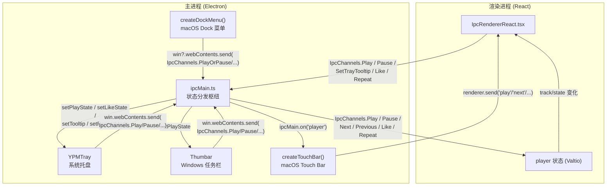

R3PLAYX 桌面端通过三个 OS 级集成模块，将播放控制能力延伸至应用窗口之外——**系统托盘**（跨平台上下文菜单）、**Windows 任务栏缩略图按钮**（ThumbarButtons）和 **macOS Touch Bar**（触控栏），外加 **macOS Dock 菜单**作为补充。这四者共享同一套 IPC 通信骨架：渲染进程上报播放状态，主进程桥接到各 OS 模块；用户在 OS 原生控件上的操作则通过反向 IPC 驱动播放器。本页将从架构总览出发，逐一拆解各模块的实现细节与状态同步机制。

Sources: [index.ts](packages/desktop/main/index.ts#L1-L71), [tray.ts](packages/desktop/main/tray.ts#L1-L30), [touchBar.ts](packages/desktop/main/touchBar.ts#L1-L17), [windowsTaskbar.ts](packages/desktop/main/windowsTaskbar.ts#L1-L16), [dockMenu.ts](packages/desktop/main/dockMenu.ts#L1-L7)

## 架构总览：状态双向同步



上图概括了**状态双向流**的核心回路。渲染进程中的 `IpcRendererReact` 组件监听 Valtio `player` 状态变化，通过 IPC 将播放/暂停/喜欢/循环模式等信息推送到主进程；主进程的 `ipcMain.ts` 将这些事件分别分发到 Tray、Thumbar、Touch Bar 三个模块。反向路径上，用户在托盘菜单、任务栏按钮、Touch Bar 上的点击操作，通过 `win.webContents.send()` 或 `renderer.send()` 发送 IPC 回渲染进程，由 [ipcRenderer.ts](packages/web/ipcRenderer.ts#L16-L75) 中注册的监听器驱动 `player` 状态变更。

Sources: [IpcRendererReact.tsx](packages/web/IpcRendererReact.tsx#L1-L79), [ipcMain.ts](packages/desktop/main/ipcMain.ts#L38-L49), [ipcRenderer.ts](packages/web/ipcRenderer.ts#L16-L75)

## 主进程初始化与平台分流

`Main` 类在 `app.whenReady()` 回调中按顺序创建所有 OS 集成模块，并通过平台判断决定哪些模块需要实例化：

```typescript
// 主进程启动序列（简化）
app.whenReady().then(async () => {
  await initAppServer()
  this.createWindow()
  this.createTray()       // 所有平台：创建系统托盘
  this.createTouchBar()   // macOS Touch Bar（无条件创建，Electron 内部处理平台兼容）
  this.createThumbar()    // 仅 Windows：创建任务栏缩略图按钮
  initIpcMain(this.win, this.tray, this.thumbar, store)
})
```

`createTray()` 在所有平台上都会执行，但额外为 macOS 创建 Dock 菜单；`createThumbar()` 通过 `isWindows` 条件守卫仅初始化 Windows 任务栏按钮；`createTouchBar()` 无条件调用，由 Electron 内部在非 macOS 平台上静默忽略。

| 模块 | 平台 | 创建入口 | 状态接口 |
|------|------|----------|----------|
| 系统托盘 | macOS / Windows / Linux | `createTray(win)` | `YPMTray` 接口 |
| Dock 菜单 | macOS | `createDockMenu(win)` | 无（静态菜单） |
| Touch Bar | macOS | `createTouchBar(window)` | `ipcMain.on('player')` |
| 任务栏按钮 | Windows | `createTaskbar(win)` | `Thumbar` 接口 |

Sources: [index.ts](packages/desktop/main/index.ts#L48-L63), [index.ts](packages/desktop/main/index.ts#L88-L103), [env.ts](packages/desktop/main/env.ts#L1-L7)

## 系统托盘（Tray）：跨平台上下文菜单

### 接口设计与图标资源

`YPMTray` 接口定义了托盘对外暴露的五个状态更新方法，采用接口隔离原则，使 `ipcMain.ts` 仅依赖抽象而非具体实现：

```typescript
export interface YPMTray {
  setTooltip(text: string): void      // 设置鼠标悬停提示
  setCoverImg(coverImg: string): void // 设置托盘图标（当前已注释）
  setLikeState(isLiked: boolean): void // 切换喜欢/取消喜欢菜单项可见性
  setPlayState(isPlaying: boolean): void // 切换播放/暂停菜单项可见性
  setRepeatMode(mode: RepeatMode): void // 设置循环模式单选项
  updateTray(): void                   // 语言切换后重建菜单
}
```

图标资源从 `assets/icons/tray/` 目录加载，开发环境与生产环境通过 `NODE_ENV` 区分根路径。托盘图标使用 `menu@88.png` 并缩放至 20×20 像素以适配系统托盘尺寸要求。

Sources: [tray.ts](packages/desktop/main/tray.ts#L23-L30), [tray.ts](packages/desktop/main/tray.ts#L11-L35), [tray.ts](packages/desktop/main/tray.ts#L43-L60)

### 菜单模板与平台差异

`createMenuTemplate()` 方法构建上下文菜单，存在一个关键的平台分支：**Linux 额外添加"显示主面板"菜单项**。这是因为 Linux 桌面环境下托盘点击行为不如 macOS/Windows 一致，需要显式的"显示窗口"入口。同时，托盘的 `click` 事件在 macOS/Windows 上直接调用 `win.show()` 恢复窗口：

| 菜单项 | 图标 | 行为 | 可见性控制 |
|--------|------|------|-----------|
| 显示主面板 | — | `win.show()` | 仅 Linux，始终可见 |
| 播放 | play.png | 发送 `IpcChannels.Play` | 当未播放时可见 |
| 暂停 | pause.png | 发送 `IpcChannels.Pause` | 当播放中时可见 |
| 上一首 | left.png | 发送 `IpcChannels.Previous` | 始终可见 |
| 下一首 | right.png | 发送 `IpcChannels.Next` | 始终可见 |
| 循环模式 | repeat.png | 子菜单：关闭循环/列表循环/单曲循环/随机播放 | 始终可见 |
| 加入喜欢 | like.png | 发送 `IpcChannels.Like` | 当未喜欢时可见 |
| 取消喜欢 | unlike.png | 发送 `IpcChannels.Like` | 当已喜欢时可见 |
| 退出 | exit.png | `app.exit()` | 始终可见 |

播放/暂停和喜欢/取消喜欢各是一对互斥菜单项，通过 `visible` 属性交替显示，模拟 Toggle 按钮效果。循环模式子菜单使用 `type: 'radio'` 实现单选互斥。

Sources: [tray.ts](packages/desktop/main/tray.ts#L73-L170)

### 国际化支持

菜单标签根据 `store.get("settings.language")` 的值在中文和英文之间切换。当渲染进程通过 `IpcChannels.SyncSettings` 同步设置且语言发生变化时，`ipcMain.ts` 中调用 `main.tray?.updateTray()` 重建整个菜单模板，确保新语言立即生效：

```typescript
on(IpcChannels.SyncSettings, (event, settings) => {
  const lang = store.get('settings.language')
  store.set('settings', settings)
  if (settings.language !== lang) {
    main.tray?.updateTray()  // 语言变更时重建菜单
  }
})
```

Sources: [tray.ts](packages/desktop/main/tray.ts#L62-L67), [tray.ts](packages/desktop/main/tray.ts#L74-L76), [ipcMain.ts](packages/desktop/main/ipcMain.ts#L167-L174)

### 窗口关闭与托盘协同

在 `handleWindowEvents()` 中，窗口关闭行为与托盘形成协同——macOS 上始终隐藏窗口而非退出（`e.preventDefault()` + `win.hide()`），Windows/Linux 上则取决于 `settings.closeWindowInMinimize` 设置。这意味着在"最小化到托盘"模式下，用户关闭窗口后应用仍在托盘区运行，点击托盘图标即可恢复窗口。

Sources: [index.ts](packages/desktop/main/index.ts#L242-L257)

## Windows 任务栏缩略图按钮（ThumbarButtons）

### 架构设计

Windows 任务栏集成采用与托盘类似的接口模式，但更为精简——`Thumbar` 接口仅暴露 `setPlayState()` 方法，因为任务栏缩略图按钮只承载三个核心操作（上一首、播放/暂停、下一首），不包含喜欢和循环模式：

```typescript
export interface Thumbar {
  setPlayState(isPlaying: boolean): void
}
```

`ThumbarImpl` 使用 `Map<ItemKeys, ThumbarButton>` 管理四类按钮定义（Play / Pause / Previous / Next），但最终只向 Windows API 提交三个按钮——`_previous`、`_playOrPause`、`_next`，其中 `_playOrPause` 根据播放状态在 Play 和 Pause 按钮之间切换引用。

Sources: [windowsTaskbar.ts](packages/desktop/main/windowsTaskbar.ts#L50-L83)

### 按钮布局与状态切换

```
┌──────────────────────────────────────────┐
│  Windows 任务栏缩略图                      │
│  ┌──────┐  ┌──────────┐  ┌──────┐       │
│  │ ◀◀   │  │  ▶ / ⏸  │  │  ▶▶  │       │
│  │上一首 │  │ 播放/暂停 │  │下一首 │       │
│  └──────┘  └──────────┘  └──────┘       │
└──────────────────────────────────────────┘
```

`setPlayState()` 的实现逻辑是：根据 `isPlaying` 参数从 Map 中取出对应的按钮定义赋给 `_playOrPause`，然后调用 `_updateThumbarButtons(false)` 刷新任务栏。`_updateThumbarButtons` 接受一个 `clear` 参数，传入 `true` 时提交空数组可清空所有按钮。

图标资源独立存放于 `assets/icons/taskbar/` 目录（play.png、pause.png、previous.png、next.png），与托盘图标分开放置，这是因为任务栏缩略图按钮对图标尺寸和样式有独立的 Windows 设计规范要求。

Sources: [windowsTaskbar.ts](packages/desktop/main/windowsTaskbar.ts#L26-L78)

### IPC 状态同步

任务栏按钮的状态同步在 `initTaskbarIpcMain()` 中注册，仅监听 `IpcChannels.Play` 和 `IpcChannels.Pause` 两个通道——任务栏按钮不需要关注喜欢状态或循环模式：

```typescript
function initTaskbarIpcMain(thumbar: Thumbar | null) {
  on(IpcChannels.Play, () => { thumbar?.setPlayState(true) })
  on(IpcChannels.Pause, () => thumbar?.setPlayState(false))
}
```

Sources: [ipcMain.ts](packages/desktop/main/ipcMain.ts#L152-L157)

## macOS Touch Bar（触控栏）

### 按钮布局

Touch Bar 采用三段式布局，以 `TouchBarSpacer({ size: 'flexible' })` 弹性间距分隔三个功能区：

```
┌─────────────────────────────────────────────────────────────────┐
│  ◀页  ▶页  🔍    │    ◀◀  ▶/⏸  ▶▶    │    ♡  ⏭              │
│  导航区           │    播放控制区        │    喜欢与待播         │
└─────────────────────────────────────────────────────────────────┘
```

| 区域 | 按钮 | 图标 | IPC 通道 | 功能 |
|------|------|------|----------|------|
| 导航 | 上一页 | page_prev.png | `routerGo` / `back` | 浏览器后退 |
| 导航 | 下一页 | page_next.png | `routerGo` / `forward` | 浏览器前进 |
| 导航 | 搜索 | search.png | `search` | 触发搜索 |
| 播放 | 上一首 | backward.png | `previous` | 上一曲目 |
| 播放 | 播放/暂停 | play.png / pause.png | `play` | 播放或暂停 |
| 播放 | 下一首 | forward.png | `next` | 下一曲目 |
| 操作 | 喜欢 | like.png / like_fill.png | `like` | 切换喜欢状态 |
| 操作 | 下一首待播 | next_up.png | `nextUp` | 待播列表 |

Sources: [touchBar.ts](packages/desktop/main/touchBar.ts#L17-L103)

### 动态图标更新机制

Touch Bar 的状态更新走了一条与托盘/任务栏不同的路径——它直接监听 `ipcMain.on('player', ...)` 事件，而非通过 `YPMTray` / `Thumbar` 接口。当渲染进程发送 `player` 事件并携带 `{ playing, likedCurrentTrack }` 时，`playButton` 图标在 `play.png` 与 `pause.png` 之间切换，`likeButton` 图标在 `like.png`（空心）与 `like_fill.png`（实心）之间切换：

```typescript
ipcMain.on('player', (e, { playing, likedCurrentTrack }) => {
  playButton.icon = playing ? createNativeImage('pause.png') : createNativeImage('play.png')
  likeButton.icon = likedCurrentTrack
    ? createNativeImage('like_fill.png')
    : createNativeImage('like.png')
})
```

值得注意的是，Touch Bar 的按钮点击使用**非标准 IPC 通道名**（如 `'routerGo'`、`'search'`、`'nextUp'`），这些通道不在 [IpcChannels.ts](packages/shared/IpcChannels.ts#L5-L46) 枚举中定义，属于 Touch Bar 模块的私有通信协议。其中 `'play'`、`'previous'`、`'next'`、`'like'` 与标准通道名重名但通过 `renderer.send()` 直接发送而非 `win.webContents.send()`。图标资源存放在 `assets/icons/touchbar/` 目录，遵循 Apple Human Interface Guidelines 的 Touch Bar 图标设计规范。

Sources: [touchBar.ts](packages/desktop/main/touchBar.ts#L80-L86), [touchBar.ts](packages/desktop/main/touchBar.ts#L1-L10)

## macOS Dock 菜单

Dock 菜单是 macOS 独有的快捷入口——用户右键点击 Dock 栏中的应用图标即可看到。与托盘上下文菜单不同，Dock 菜单是一个**无状态的静态菜单**，不随播放状态变化更新可见性：

| 菜单项 | IPC 通道 | 参数 |
|--------|----------|------|
| PlayOrPause | `IpcChannels.PlayOrPause` | — |
| Next | `IpcChannels.Next` | — |
| Previous | `IpcChannels.Previous` | — |
| Like | `IpcChannels.Like` | — |
| Repeat | `IpcChannels.Repeat` | `RepeatMode.On` |
| RepeatOff | `IpcChannels.Repeat` | `RepeatMode.Off` |
| RepeatOne | `IpcChannels.Repeat` | `RepeatMode.One` |
| Shuffle | `IpcChannels.Repeat` | `RepeatMode.Shuffle` |

Dock 菜单使用 `PlayOrPause` 而非分离的 Play/Pause，因为它不跟踪播放状态，无法显示正确的标签。在 `createTray()` 中，Dock 菜单的创建被守卫在 `isMac` 条件下，通过 `app.dock.setMenu()` 注入。

Sources: [dockMenu.ts](packages/desktop/main/dockMenu.ts#L1-L58), [index.ts](packages/desktop/main/index.ts#L92-L99)

## 渲染进程状态上报

`IpcRendererReact` 是渲染进程侧的状态上报枢纽，它作为 React 组件挂载在组件树中，通过 `useSnapshot(player)` 响应式监听播放器状态变化并同步到主进程：

| 触发条件 | IPC 通道 | 数据 |
|----------|----------|------|
| `track` 变化 | `SetTrayTooltip` | `{ text: "歌名 - R3PLAYX", coverImg }` |
| `track` 变化 | `MetaData` | `{ track: JSON.stringify(track) }` |
| `userLikedSongs` 或 `track` 变化 | `Like` | `{ isLiked: boolean }` |
| `trackID` 变化 | `Play` | `{ trackID }` |
| `state` 变为 Playing/Loading | `Play` | `{}` |
| `state` 变为 Paused | `Pause` | — |
| `progress` 变化 | `SyncProgress` | `{ progress }` |

其中 `SetTrayTooltip` 同时携带歌曲名称和封面 URL——虽然 `setCoverImg()` 方法当前被注释掉（下载远程封面并设置托盘图标的功能尚未完成），但数据流已预留完整。

Sources: [IpcRendererReact.tsx](packages/web/IpcRendererReact.tsx#L25-L66)

## 三模块状态同步对比

| 特性 | 系统托盘 | Windows 任务栏 | macOS Touch Bar |
|------|----------|---------------|-----------------|
| 平台 | 全平台 | 仅 Windows | 仅 macOS |
| 状态接收方式 | `YPMTray` 接口方法 | `Thumbar` 接口方法 | `ipcMain.on('player')` |
| 播放状态 | ✅ 播放/暂停切换 | ✅ 播放/暂停切换 | ✅ 图标动态切换 |
| 喜欢状态 | ✅ 喜欢/取消切换 | ❌ | ✅ 图标动态切换 |
| 循环模式 | ✅ radio 子菜单 | ❌ | ❌ |
| 导航操作 | ❌ | ❌ | ✅ 前进/后退/搜索 |
| 待播列表 | ❌ | ❌ | ✅ nextUp 按钮 |
| 退出操作 | ✅ | ❌ | ❌ |
| 图标资源目录 | `assets/icons/tray/` | `assets/icons/taskbar/` | `assets/icons/touchbar/` |
| IPC 反向通道 | `IpcChannels.*` 枚举 | `IpcChannels.*` 枚举 | 私有通道名 |

三模块的功能覆盖呈互补关系：托盘提供最完整的控制集（播放、喜欢、循环、退出），任务栏聚焦核心播控，Touch Bar 则独占导航与待播功能。这种差异化设计源于各 OS 原生控件的交互范式差异——托盘菜单适合多级嵌套操作，任务栏缩略图按钮限三个且无嵌套，Touch Bar 则适合扁平的快速操作。

Sources: [tray.ts](packages/desktop/main/tray.ts#L73-L170), [windowsTaskbar.ts](packages/desktop/main/windowsTaskbar.ts#L26-L83), [touchBar.ts](packages/desktop/main/touchBar.ts#L17-L103)

## IPC 通道汇总

下表列出与 OS 集成直接相关的 IPC 通道及其数据流向：

| 通道 | 方向 | 数据 | 消费模块 |
|------|------|------|----------|
| `SetTrayTooltip` | 渲染→主 | `{ text, coverImg }` | Tray |
| `Play` | 渲染→主 | `{ trackID? }` | Tray, Thumbar, Touch Bar |
| `Pause` | 渲染→主 | — | Tray, Thumbar |
| `Like` | 渲染→主 | `{ isLiked }` | Tray |
| `Repeat` | 渲染→主 | `{ mode: RepeatMode }` | Tray |
| `Play` | 主→渲染 | `{ trackID }` | ipcRenderer (托盘/任务栏触发) |
| `Pause` | 主→渲染 | — | ipcRenderer |
| `Next` | 主→渲染 | — | ipcRenderer |
| `Previous` | 主→渲染 | — | ipcRenderer |
| `Like` | 主→渲染 | — | ipcRenderer |
| `Repeat` | 主→渲染 | `RepeatMode` | ipcRenderer |
| `PlayOrPause` | 主→渲染 | — | ipcRenderer (Dock 菜单触发) |
| `player` | 渲染→主 | `{ playing, likedCurrentTrack }` | Touch Bar |
| `routerGo` | 主→渲染 | `'back'` / `'forward'` | Touch Bar (私有) |
| `search` | 主→渲染 | — | Touch Bar (私有) |
| `nextUp` | 主→渲染 | — | Touch Bar (私有) |

Sources: [IpcChannels.ts](packages/shared/IpcChannels.ts#L5-L46), [IpcChannels.ts](packages/shared/IpcChannels.ts#L80-L96), [ipcMain.ts](packages/desktop/main/ipcMain.ts#L128-L157), [touchBar.ts](packages/desktop/main/touchBar.ts#L80-L86)

## 延伸阅读

- [Electron 进程间通信（IPC）：通道定义与类型安全](7-electron-jin-cheng-jian-tong-xin-ipc-tong-dao-ding-yi-yu-lei-xing-an-quan)——理解 IPC 通道的类型安全体系与 `IpcChannels` 枚举设计
- [Electron 主进程启动流程与窗口生命周期](8-electron-zhu-jin-cheng-qi-dong-liu-cheng-yu-chuang-kou-sheng-ming-zhou-qi)——`Main` 类的完整启动序列与窗口关闭行为
- [跨平台键盘快捷键系统](27-kua-ping-tai-jian-pan-kuai-jie-jian-xi-tong)——另一套跨平台 OS 级集成，与托盘/任务栏共享同一套 IPC 播放控制通道