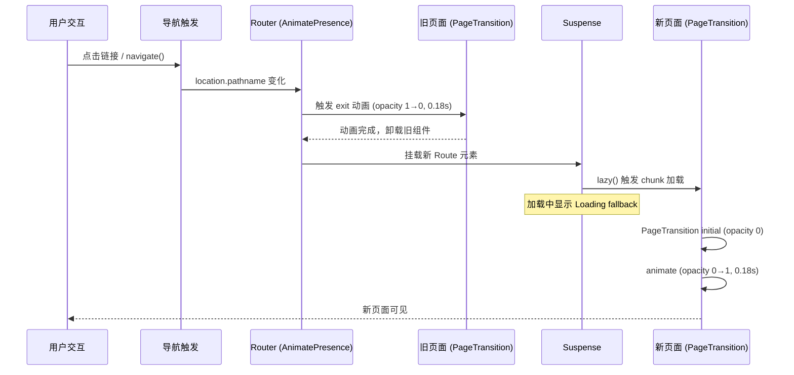
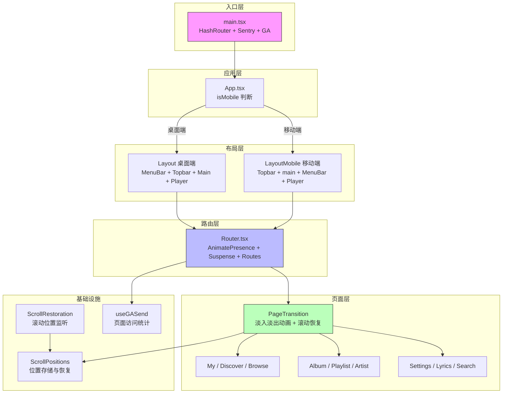

R3PLAYX 的 Web 前端采用 React Router v6 的 HashRouter 作为路由基础，结合 React.lazy 实现页面级代码分割，并通过 Framer Motion 驱动页面切换时的淡入淡出动画。整个路由层的设计围绕三个核心目标展开：**兼容 Electron 桌面端的静态文件服务**（HashRouter）、**首屏加载性能优化**（懒加载）、**视觉体验连贯性**（页面过渡动画与滚动位置恢复）。本文将逐层拆解路由配置、页面映射、动画机制及滚动恢复策略的实现细节。

Sources: [main.tsx](packages/web/main.tsx#L1-L67), [Router.tsx](packages/web/components/Router.tsx#L1-L56), [PageTransition.tsx](packages/web/components/PageTransition.tsx#L1-L43)

## 路由基础：为什么是 HashRouter

应用在 `main.tsx` 的入口渲染中使用 `HashRouter` 包裹整个 App 组件，而非 `BrowserRouter`。这一选择并非随意——R3PLAYX 同时作为 Web 应用和 Electron 桌面端运行，桌面端通过本地文件协议（`file://`）或本地 Fastify 服务器提供静态资源。`BrowserRouter` 依赖 HTML5 History API，要求服务器对所有路径返回 `index.html`（即 fallback 路由），而本地文件服务无法提供这种重写能力。`HashRouter` 将路由信息编码在 URL 的 hash 片段中（如 `/#/album/123`），完全在客户端解析，不依赖服务端配合，因此成为跨平台部署的最优解。

在路由初始化的同时，Sentry 错误监控通过 `reactRouterV6Instrumentation` 集成到了路由层，自动捕获路由切换时的性能追踪数据；Google Analytics（`react-ga4`）也在入口完成初始化，配合 `Router` 组件内的 `useGASend` Hook 实现页面访问统计。

Sources: [main.tsx](packages/web/main.tsx#L58-L66), [main.tsx](packages/web/main.tsx#L31-L51), [useGA.ts](packages/web/api/hooks/useGA.ts#L29-L40)

## 路由配置与页面映射

路由定义集中在 `Router.tsx` 组件中，使用 React Router v6 的声明式 `<Routes>` / `<Route>` 语法。所有页面组件均通过 `React.lazy()` 动态导入，配合 `<Suspense>` 提供加载态降级 UI。完整的路由映射如下：

| 路由路径 | 页面组件 | 懒加载导入 | 说明 |
|---|---|---|---|
| `/` | `My` | `lazy(() => import('@/web/pages/My'))` | 默认首页，我的音乐 |
| `/discover` | `Discover` | `lazy(() => import('@/web/pages/Discover'))` | 发现页，封面墙 |
| `/browse` | `Browse` | `lazy(() => import('@/web/pages/Browse/Browse'))` | 浏览页，分类推荐 |
| `/album/:id` | `Album` | `lazy(() => import('@/web/pages/Album'))` | 专辑详情，动态参数 |
| `/playlist/:id` | `Playlist` | `lazy(() => import('@/web/pages/Playlist'))` | 歌单详情，动态参数 |
| `/artist/:id` | `Artist` | `lazy(() => import('@/web/pages/Artist'))` | 艺人详情，动态参数 |
| `/settings` | `Settings` | `lazy(() => import('@/web/pages/Settings'))` | 设置页 |
| `/lyrics` | `Lyrics` | `lazy(() => import('@/web/pages/Lyrics/Lyrics'))` | 歌词页（内嵌） |
| `/desktoplyrics` | `LyricsDesktop` | `lazy(() => import('@/web/pages/Lyrics/LyricsDesktop'))` | 歌词页（独立窗口） |
| `/search/:keywords` | `Search` | `lazy(() => import('@/web/pages/Search'))` | 搜索结果，嵌套子路由 |
| `/search/:keywords/:type` | `Search` | 同上 | 搜索结果分类 |

路由配置的关键设计决策包括：**动态路径参数**用于专辑、歌单、艺人等详情页（`:id`），搜索页支持嵌套子路由（`:keywords/:type`）；`VideoPlayer` 组件作为非路由元素与 `<Routes>` 并列放置，确保视频播放器不受路由切换影响而保持挂载状态；`<Routes>` 通过 `location={location} key={location.pathname}` 绑定当前路径，确保路径变化时整个路由树卸载重建，配合 `AnimatePresence` 实现退出动画。

Sources: [Router.tsx](packages/web/components/Router.tsx#L1-L56)

## 懒加载机制与代码分割

所有 10 个页面组件均以 `React.lazy()` 方式导入，Vite 在构建时自动将每个 `lazy()` 调用点拆分为独立的 chunk。这意味着用户访问首页 `/` 时只需下载 `My` 页面的代码，其他页面按需加载，显著减少首屏 bundle 体积。

```tsx
// Router.tsx 中的懒加载声明
const My = lazy(() => import('@/web/pages/My'))
const Discover = lazy(() => import('@/web/pages/Discover'))
const Album = lazy(() => import('@/web/pages/Album'))
// ... 其余页面同理
```

懒加载的降级 UI 由 `<Suspense>` 的 `fallback` 属性提供——一个居中显示的旋转加载图标（`<Loading />`）。`Loading` 组件实现极简，仅包含一个带 `animate-spin` 类名的 SVG 图标，确保加载态本身不会成为性能负担。整个 `<Suspense>` 被 `AnimatePresence` 包裹，为路由切换提供退出动画支持。

值得注意的是，`Router` 组件通过 `React.memo` 包裹后导出，避免父组件（`Main`）的无关状态变化导致路由树不必要的重渲染。

Sources: [Router.tsx](packages/web/components/Router.tsx#L8-L17), [Router.tsx](packages/web/components/Router.tsx#L25-L49), [Router.tsx](packages/web/components/Router.tsx#L53-L55), [Loading.tsx](packages/web/components/Animation/Loading.tsx#L1-L14)

## 页面切换动画：PageTransition 与 AnimatePresence

页面切换动画的实现分为两层架构：**路由层退出动画**（`AnimatePresence` + `motion.div` 的 `exit` 属性）和**页面层进入动画**（`PageTransition` 组件的 `initial` / `animate` 属性）。

### 路由层的 AnimatePresence

`Router.tsx` 中 `<AnimatePresence>` 包裹 `<Suspense>`，当路由切换导致子树卸载时，Framer Motion 会在移除 DOM 前先播放退出动画。配合 `<Routes>` 的 `key={location.pathname}`，每个路径对应独立的组件实例，路径变化时旧实例触发 exit 动画、新实例触发 enter 动画。

### PageTransition 组件

每个页面组件内部通过 `<PageTransition>` 包裹内容，实现标准化的淡入淡出效果。该组件的核心逻辑如下：

```tsx
// 桌面端：Framer Motion 淡入淡出
<motion.div
  initial={{ opacity: disableEnterAnimation ? 1 : 0 }}
  animate={{ opacity: 1 }}
  exit={{ opacity: 0 }}
  transition={{ duration: 0.18 }}
>
  {children}
</motion.div>
```

关键参数与行为说明：

| 参数/行为 | 值 | 说明 |
|---|---|---|
| `initial.opacity` | `0`（默认）/ `1`（禁用） | 进入动画起始透明度 |
| `animate.opacity` | `1` | 进入动画目标透明度 |
| `exit.opacity` | `0` | 退出动画目标透明度 |
| `transition.duration` | `0.18s` | 动画时长，极短以保持响应感 |
| `disableEnterAnimation` | `boolean` | 禁用进入动画的开关 |
| 移动端行为 | 直接渲染 children | 不应用任何动画 |

`disableEnterAnimation` 属性用于特定场景——例如 `Discover` 页面传入 `disableEnterAnimation={true}`，因为发现页作为高频访问页面，首次加载时不需要淡入效果以提升感知速度。移动端则完全跳过动画，直接渲染子组件，这是考虑到移动设备的性能约束和触控交互对即时反馈的需求。

`MotionConfig` 组件设置了全局缓动曲线 `ease: [0.4, 0, 0.2, 1]`（Material Design 标准缓动），与项目全局常量保持一致，确保所有页面切换动画的缓动手感统一。

Sources: [PageTransition.tsx](packages/web/components/PageTransition.tsx#L1-L43), [Router.tsx](packages/web/components/Router.tsx#L25-L49), [const.ts](packages/web/utils/const.ts#L4-L4), [Discover.tsx](packages/web/pages/Discover.tsx#L93-L97)

## 动画架构流程

以下流程图展示了从用户触发导航到页面动画完成的完整链路：



Sources: [Router.tsx](packages/web/components/Router.tsx#L1-L56), [PageTransition.tsx](packages/web/components/PageTransition.tsx#L1-L43)

## 滚动位置恢复：ScrollPositions

单页应用的路由切换不会触发浏览器原生的滚动恢复，R3PLAYX 通过自定义的 `ScrollPositions` 类解决这一问题。该机制分为两个协作组件：

### ScrollRestoration：监听与存储

`ScrollRestoration` 组件在 `App` 层级全局挂载，通过 `useLayoutEffect` 监听 `<main>` 元素的滚动事件（200ms 节流），将当前 `pathname` 与 `scrollTop` 存入 `scrollPositions` 状态对象。

### ScrollPositions 类：智能路径匹配

`ScrollPositions` 类对路径进行分层管理，区分**嵌套路径**和**普通路径**：

- **嵌套路径**（`/artist`、`/album`、`/playlist`、`/search`）：同一前缀下的不同子路径作为独立条目存储，例如 `/album/123` 和 `/album/456` 各自维护滚动位置。每个前缀最多缓存 10 条记录，超出时淘汰最旧的。
- **普通路径**（`/`、`/discover`、`/browse` 等）：直接以完整 pathname 为 key 存储单一滚动值。

`PageTransition` 组件的 `useLayoutEffect` 在页面挂载时从 `scrollPositions` 读取对应路径的滚动位置并恢复，确保用户返回之前访问的页面时能回到之前的浏览位置。

Sources: [ScrollRestoration.tsx](packages/web/components/ScrollRestoration.tsx#L1-L21), [scrollPositions.ts](packages/web/states/scrollPositions.ts#L1-L55), [PageTransition.tsx](packages/web/components/PageTransition.tsx#L17-L22)

## 布局与路由的协作

路由系统与布局系统紧密协作，根据设备类型呈现不同的布局结构。`App.tsx` 通过 `useIsMobile()` Hook 决定使用 `Layout`（桌面端）还是 `LayoutMobile`（移动端）。

### 桌面端布局中的路由嵌入

桌面端 `Layout` 组件将 `Router` 嵌入 `Main` 组件中，`Main` 作为 `<main>` 元素承载路由内容。关键布局参数包括：左侧菜单栏占据 144px，右侧播放器占据 382px（当有歌曲播放时），顶部 Topbar 占据 132px，内容区域有 132px 的上边距避让 Topbar。`Main` 组件使用 Framer Motion 的 `useAnimation` 控制主区域的显示/隐藏动画——当播放器最小化状态变化时，先淡出内容、调整宽度、再淡入，避免布局突变造成的视觉跳动。

### 移动端布局的差异

移动端 `LayoutMobile` 简化了布局结构：无固定侧边栏，底部固定菜单栏和播放器，内容区域占据全屏。`<main>` 元素直接包裹 `Router`，带有底部 padding 避开底部固定栏。值得注意的是，移动端的 `PageTransition` 不执行任何动画，`LayoutMobile` 也不使用 `Main` 组件的动画控制逻辑。

### 桌面歌词窗口的特殊路由

`/desktoplyrics` 路由是 Electron 桌面端独立歌词窗口的专属路径，在 `Layout` 和 `LayoutMobile` 中均有特殊判断——当路径匹配时跳过所有布局装饰（菜单栏、Topbar、播放器等），直接渲染 `Router` 内容，确保歌词窗口呈现纯净的歌词展示界面。

Sources: [App.tsx](packages/web/App.tsx#L10-L27), [Layout.tsx](packages/web/components/Layout.tsx#L26-L120), [LayoutMobile.tsx](packages/web/components/LayoutMobile.tsx#L16-L87), [Main.tsx](packages/web/components/Main.tsx#L13-L55)

## 导航机制：多入口的路径切换

R3PLAYX 提供了多种导航方式，覆盖不同的用户交互场景：

### 侧边菜单栏导航

`MenuBar` 组件定义了四个核心导航标签，每个标签对应一个主路由路径：

| 标签名 | 路径 | 图标 |
|---|---|---|
| MY MUSIC | `/` | `my` |
| DISCOVER | `/discover` | `explore` |
| BROWSE | `/browse` | `discovery` |
| LYRICS | `/lyrics` | `lyrics` |

点击标签时通过 `useNavigate()` 进行路径跳转，同时触发图标缩放动画（scale 0.8→1）提供触觉反馈。移动端还支持 `navigator.vibrate(20)` 的震动反馈。菜单栏下方的 `TabName` 组件以竖排文字显示当前页面名称，配合 Framer Motion 的淡入淡出动画在页面切换时更新。

### 顶部导航栏

`TopbarDesktop` 提供三种导航入口：**前进/后退按钮**（`NavigationButtons`）通过 `navigate(-1)` / `navigate(1)` 操作浏览器历史栈，点击时附带水平位移微动画；**搜索框**（`SearchBox`）在回车时跳转至 `/search/:keywords`，同时提供实时搜索建议面板，建议项可直达专辑或艺人详情页；**设置按钮**（`SettingsButton`）直接导航至 `/settings`。

### 内容区域的程序化导航

页面内容中的导航通过 `useNavigate` Hook 实现，分布在不同组件中：`CoverRow` 中的专辑/歌单封面点击导航至 `/album/:id` 或 `/playlist/:id`；`ArtistsInLine` 中的艺人名称点击导航至 `/artist/:id`；`Search` 页面的搜索结果项导航至对应详情页。这些导航还配合数据预取——例如 `CoverRow` 在 `onMouseOver` 时调用 `prefetchAlbum` / `prefetchPlaylist`，提前触发 React Query 的数据缓存，确保点击跳转时页面数据已就绪。

Sources: [MenuBar.tsx](packages/web/components/MenuBar.tsx#L12-L33), [MenuBar.tsx](packages/web/components/MenuBar.tsx#L83-L144), [NavigationButtons.tsx](packages/web/components/Topbar/NavigationButtons.tsx#L10-L58), [SearchBox.tsx](packages/web/components/Topbar/SearchBox.tsx#L141-L197), [SettingsButton.tsx](packages/web/components/Topbar/SettingsButton.tsx#L6-L21), [CoverRow.tsx](packages/web/components/CoverRow.tsx#L24-L29), [ArtistsInLine.tsx](packages/web/components/ArtistsInLine.tsx#L19-L26)

## 页面组件的结构模式

所有页面组件遵循统一的结构模式：以 `PageTransition` 包裹内容，页面特有的 UI 逻辑在 `PageTransition` 内部实现。各页面的目录组织也保持一致性——复杂页面（如 Album、Artist、Settings）拆分为独立子组件存放在同名目录中，通过 `index.tsx` 导出默认组件；简单页面（如 Discover）直接以单文件形式存在。

```
pages/
├── Album/           # 复杂页面：目录组织
│   ├── Album.tsx    # 主组件
│   ├── Header.tsx   # 页面头部
│   ├── MoreByArtist.tsx
│   └── index.tsx    # 导出入口
├── Artist/
│   ├── Artist.tsx
│   ├── Header/
│   ├── Popular.tsx
│   └── index.tsx
├── Discover.tsx     # 简单页面：单文件
├── Browse/
│   └── Browse.tsx
├── Search/
│   └── Search.tsx
└── Settings/
    ├── Settings.tsx
    └── index.ts
```

这种结构使得 `Router.tsx` 中的 `lazy()` 导入路径统一指向目录（如 `import('@/web/pages/Album')`），由目录的 `index.tsx` 解析到具体组件，既保持了路由配置的简洁性，又允许页面内部自由拆分模块。

Sources: [pages/](packages/web/pages), [Album/index.tsx](packages/web/pages/Album/index.tsx#L1-L3), [Artist/index.tsx](packages/web/pages/Artist/index.tsx#L1-L4)

## 整体架构总览

以下架构图展示了路由系统各层级之间的协作关系：



Sources: [main.tsx](packages/web/main.tsx#L58-L66), [App.tsx](packages/web/App.tsx#L10-L27), [Layout.tsx](packages/web/components/Layout.tsx#L18-L123), [LayoutMobile.tsx](packages/web/components/LayoutMobile.tsx#L16-L87), [Router.tsx](packages/web/components/Router.tsx#L19-L51), [PageTransition.tsx](packages/web/components/PageTransition.tsx#L7-L40), [ScrollRestoration.tsx](packages/web/components/ScrollRestoration.tsx#L5-L18), [scrollPositions.ts](packages/web/states/scrollPositions.ts#L1-L55)

## 延伸阅读

- 路由切换时页面组件的状态管理由 Vtalio 响应式状态驱动，详见 [状态管理架构：Valtio 响应式状态与持久化](13-zhuang-tai-guan-li-jia-gou-valtio-xiang-ying-shi-zhuang-tai-yu-chi-jiu-hua)
- 页面内的数据获取与缓存策略依赖 TanStack React Query，详见 [API 数据层：TanStack React Query 与请求缓存](15-api-shu-ju-ceng-tanstack-react-query-yu-qing-qiu-huan-cun)
- 桌面端独立歌词窗口的 IPC 通信机制，详见 [Electron 进程间通信（IPC）：通道定义与类型安全](7-electron-jin-cheng-jian-tong-xin-ipc-tong-dao-ding-yi-yu-lei-xing-an-quan)
- 页面内的 UI 组件体系与布局细节，详见 [UI 组件体系：布局、播放器、歌词与上下文菜单](16-ui-zu-jian-ti-xi-bu-ju-bo-fang-qi-ge-ci-yu-shang-xia-wen-cai-dan)