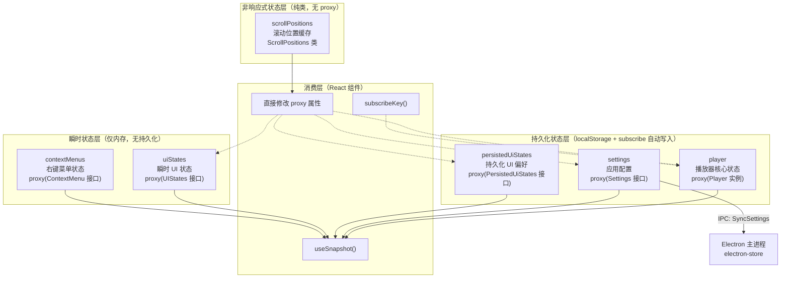

R3PLAYX 的 Web 前端采用 **Valtio** 作为核心状态管理方案，以极简的 Proxy-based 响应式模型取代了 Redux/Zustand 等传统方案。整个状态层由 6 个独立模块组成，分布在 `packages/web/states/` 目录下，按职责划分为**播放器状态**、**应用设置**、**界面状态**（瞬时与持久化两类）、**上下文菜单**和**滚动位置**。每个模块都遵循「Proxy 创建 → localStorage 持久化 → `useSnapshot` 消费」的一致范式，同时针对各自的业务特征做出了精细的差异设计——这正是本文要深入剖析的核心内容。

Sources: [player.ts](packages/web/states/player.ts), [settings.ts](packages/web/states/settings.ts), [uiStates.ts](packages/web/states/uiStates.ts), [persistedUiStates.ts](packages/web/states/persistedUiStates.ts), [contextMenus.ts](packages/web/states/contextMenus.ts), [scrollPositions.ts](packages/web/states/scrollPositions.ts)

## 架构全景：六模块分层体系

在深入每个模块之前，先从全局视角理解状态层的分层逻辑。下面的 Mermaid 图展示了 6 个状态模块的核心职责、持久化策略和消费方式之间的差异与关联。



各模块的关键特征对比如下：

| 状态模块 | Valtio API | 持久化 | 跨进程同步 | 特殊模式 |
|----------|-----------|--------|-----------|---------|
| `player` | `proxy` + `subscribe` | ✅ localStorage | ✅ IPC → 主进程 | Class 实例作为 proxy 目标 |
| `settings` | `proxy` + `subscribe` | ✅ localStorage | ✅ IPC SyncSettings | i18n 联动 + electron-store 双写 |
| `persistedUiStates` | `proxy` + `subscribe` | ✅ localStorage | ❌ | lodash merge 初始化 |
| `uiStates` | `proxy` | ❌ | ❌ | IPC 初始化 fullscreen 状态 |
| `contextMenus` | `proxy` + `ref` | ❌ | ❌ | `ref()` 包裹 DOM 元素引用 |
| `scrollPositions` | 无（纯 Class） | ❌ | ❌ | 不使用 proxy，非响应式 |

Sources: [player.ts](packages/web/states/player.ts#L1-L18), [settings.ts](packages/web/states/settings.ts#L1-L82), [uiStates.ts](packages/web/states/uiStates.ts#L1-L34), [persistedUiStates.ts](packages/web/states/persistedUiStates.ts#L1-L41), [contextMenus.ts](packages/web/states/contextMenus.ts#L1-L61), [scrollPositions.ts](packages/web/states/scrollPositions.ts#L1-L54)

## Valtio 核心机制：Proxy 响应式与快照读取

Valtio 的核心思想极为简洁：**用 ES Proxy 拦截对象属性读写，在读时追踪依赖、在写时触发更新**。R3PLAYX 使用的 Valtio API 可归纳为三种角色：

**创建者（`proxy`）**：将普通对象转为响应式代理，任何属性修改都会自动通知订阅者。项目中对 `proxy` 的使用分为两种模式——直接 proxy 纯对象（如 `settings`、`uiStates`）和 proxy Class 实例（如 `player`），后者带来更复杂的 getter/setter 交互，我们将在播放器状态一节详述。

**消费者（`useSnapshot`）**：React 组件通过 `useSnapshot(proxy)` 获取只读快照。Valtio 内部会自动追踪组件在渲染过程中访问了哪些属性，仅在这些属性变化时才触发重渲染，实现了精确的细粒度更新。例如在 `Controls` 组件中，`const { state, track } = useSnapshot(player)` 只订阅了 `state` 和 `track` 两个字段，其他字段变化不会导致重渲染。

**监听者（`subscribe` / `subscribeKey`）**：`subscribe(proxy, callback)` 在 proxy 的任意属性变化时执行回调，主要用于持久化写入。`subscribeKey(proxy, key, callback)` 来自 `valtio/utils`，仅监听特定 key 的变化，用于需要精确副作用的场景。

Sources: [player.ts](packages/web/states/player.ts#L2), [settings.ts](packages/web/states/settings.ts#L3), [NowPlaying/Controls.tsx](packages/web/components/NowPlaying/Controls.tsx#L5-L6), [NowPlaying/Cover.tsx](packages/web/components/NowPlaying/Cover.tsx#L9)

## 播放器状态：Class 实例与 Proxy 的深度交互

`player` 是整个状态层中最复杂的模块，它将一个完整的 `Player` 类实例包裹在 `proxy()` 中，实现了业务逻辑与响应式系统的深度耦合。

### 初始化与持久化流程

```typescript
const playerInLocalStorage = localStorage.getItem('player')
const player = proxy(new Player())

player.init((playerInLocalStorage && JSON.parse(playerInLocalStorage)) || {})

subscribe(player, () => {
  localStorage.setItem('player', JSON.stringify(player))
})
```

这里的关键设计在于：`Player` 类拥有私有属性（如 `_track`、`_volume`、`_repeatMode`）和公开的 getter/setter。当 `proxy()` 包裹这个实例时，**getter 的读取和 setter 的写入都会被 Proxy 拦截**，使得通过 setter 修改私有属性时，Valtio 能够正确追踪变化并触发响应式更新。`init()` 方法从 localStorage 恢复上次会话的状态（当前曲目、音量、循环模式、播放列表等），然后调用 `_playAudio(false)` 仅加载但不播放音频，实现「记住上次播放位置」的用户体验。

Sources: [player.ts](packages/web/states/player.ts#L1-L18), [player.ts (utils)](packages/web/utils/player.ts#L46-L85)

### getter/setter 驱动的细粒度响应式

`Player` 类中大量使用 getter/setter 来实现属性级别的响应式控制。以 `progress` 为例：

```typescript
get progress(): number {
  return this.state === State.Loading ? 0 : this._progress
}
set progress(value) {
  this._progress = value
  _howler.seek(value)
}
```

当组件通过 `useSnapshot(player)` 读取 `progress` 时，实际上调用的是 getter，Valtio 追踪到的是对 `_progress` 的读取（因为 getter 内部返回 `_progress` 的值）。当 `_progress` 被 setter 修改时，Valtio 检测到 `_progress` 属性的变化，通知所有订阅了 `progress` 的组件重渲染。这种「私有属性存储 + 公开 getter 暴露」的模式，让 Player 类的内部状态管理与 Valtio 的响应式系统无缝融合。

`volume` 的 setter 还内含了 `Howler.volume()` 调用——状态变更直接驱动 Howler.js 音频引擎，消除了中间层的延迟。

Sources: [player.ts (utils)](packages/web/utils/player.ts#L162-L179)

### subscribeKey 精确副作用：封面切换动画

`NowPlaying/Cover.tsx` 展示了 `subscribeKey` 的典型应用。当曲目切换时，封面图片需要执行淡出→替换→淡入的动画序列，这要求在 `track` 变化时执行命令式动画控制，而非简单的声明式渲染：

```typescript
const unsubscribe = subscribeKey(player, 'track', async () => {
  const coverUrl = player.track?.al?.picUrl
  await controls.start({ opacity: 0, transition: { duration: 0.2 } })
  setCover(coverUrl)
  if (!coverUrl) return
  const img = new Image()
  img.onload = () => {
    controls.start({ opacity: 1, transition: { duration: 0.2 } })
  }
  img.src = coverUrl
})
```

`subscribeKey` 只在 `track` 字段变化时触发回调，避免了 `subscribe` 那种「任何属性变化都触发」的性能开销。回调中的 `new Image()` 预加载确保图片就绪后才执行淡入动画，实现了流畅的视觉体验。值得注意的是，这个 `subscribeKey` 在 `useEffect` 中注册并返回 `unsubscribe` 函数作为清理逻辑，保证了组件卸载时不会内存泄漏。

Sources: [NowPlaying/Cover.tsx](packages/web/components/NowPlaying/Cover.tsx#L17-L36)

## 应用设置：双向持久化与跨进程同步

`settings` 模块是整个应用配置的核心，它不仅需要持久化到浏览器 localStorage，还需要在桌面端环境下同步到 Electron 主进程的 `electron-store`，实现渲染进程与主进程的设置一致性。

### 初始化策略：深度合并

```typescript
const initSettings: Settings = { /* 完整默认值 */ }
let statesInStorage = {}
try {
  statesInStorage = JSON.parse(localStorage.getItem(STORAGE_KEY) || '{}')
} catch { /* ignore */ }

const settings = proxy<Settings>(merge(initSettings, statesInStorage))
```

这里使用了 `lodash-es/merge` 将默认值与 localStorage 中的持久化值深度合并。这一设计至关重要：**当应用升级新增了配置项时，localStorage 中不存在这些新 key，`merge` 会自动用 `initSettings` 中的默认值填充，避免了 `undefined` 导致的运行时错误**。外层的 `try/catch` 防御了 localStorage 数据损坏（如用户手动编辑导致 JSON 格式错误）的极端情况。

Sources: [settings.ts](packages/web/states/settings.ts#L37-L72)

### 订阅回调：三重联动

`settings` 的 `subscribe` 回调实现了三个关键联动：

```typescript
subscribe(settings, () => {
  // 1. 语言联动：设置变更时同步 i18n
  if (settings.language !== i18n.language && supportedLanguages.includes(settings.language)) {
    i18n.changeLanguage(settings.language)
  }
  // 2. 本地持久化
  localStorage.setItem(STORAGE_KEY, JSON.stringify(settings))
  // 3. 跨进程同步：发送到 Electron 主进程
  window.ipcRenderer?.send(IpcChannels.SyncSettings, JSON.parse(JSON.stringify(settings)))
})
```

**语言联动**确保用户切换语言后 i18n 实例立即响应，整个 UI 瞬间切换。**本地持久化**保证 Web 端独立运行时设置不丢失。**跨进程同步**则通过 `JSON.parse(JSON.stringify(settings))` 实现了一次深拷贝——这是必要的，因为 Valtio 的 proxy 对象如果直接发送到 IPC 通道，Electron 的结构化克隆算法可能无法正确处理 Proxy 包装的对象。

在 Electron 主进程侧，`ipcMain.on(IpcChannels.SyncSettings, ...)` 接收设置并写入 `electron-store`，同时检测语言变更以更新系统托盘菜单的语言显示。

Sources: [settings.ts](packages/web/states/settings.ts#L74-L81), [ipcMain.ts](packages/desktop/main/ipcMain.ts#L163-L175)

## UI 状态的二元划分：瞬时与持久化

R3PLAYX 将 UI 状态划分为两个独立模块，体现了对「用户是否期望该状态在刷新后保留」这一业务语义的精确建模。

### 瞬时状态 `uiStates`：会话级生命周期

```typescript
interface UIStates {
  showLoginPanel: boolean
  hideTopbarBackground: boolean
  mobileShowPlayingNext: boolean
  blurBackgroundImage: string | null
  fullscreen: boolean
  playingVideoID: string | null
  isPauseVideos: boolean
}
```

这些状态的共同特征是**仅在当前会话中有意义**：登录面板的显示/隐藏、视频播放状态、移动端「下一首」面板的展开——用户刷新页面后期望回到初始状态，而非恢复上次的临时 UI 状态。唯一的例外是 `fullscreen`，它通过 IPC 从主进程获取初始值（窗口是否最大化），这确保了桌面端窗口状态与 UI 状态的一致性。

`uiStates` 只使用了 `proxy()` 而没有 `subscribe()`，意味着状态变更不会触发任何持久化操作。

Sources: [uiStates.ts](packages/web/states/uiStates.ts#L1-L29)

### 持久化 UI 状态 `persistedUiStates`：偏好级生命周期

```typescript
interface PersistedUiStates {
  lyricsBlur: boolean
  showDeskttopLyrics: boolean
  showDevices: boolean
  loginPhoneCountryCode: string
  loginType: 'phone' | 'email' | 'qrCode'
  minimizePlayer: boolean
  librarySelectedTab: 'daily' | 'playlists' | 'albums' | 'artists' | 'videos' | 'cloud' | 'recent'
}
```

这些状态代表用户的**持久偏好**：歌词模糊效果、登录方式偏好、播放器最小化模式、音乐库默认标签页——这些都是用户主动选择并期望在下次访问时保持的配置。其持久化机制与 `settings` 相同：`merge(initPersistedUiStates, statesInStorage)` 初始化 + `subscribe()` 自动写入 localStorage。

Sources: [persistedUiStates.ts](packages/web/states/persistedUiStates.ts#L1-L41)

## 上下文菜单：ref() 与 DOM 引用的特殊处理

`contextMenus` 模块是 Valtio `ref()` API 的唯一使用场景。右键菜单需要追踪触发菜单的 DOM 元素，以便在菜单外点击时关闭。但 **DOM 元素是复杂的宿主对象，不应被 Proxy 代理**——代理 DOM 元素会导致 Valtio 深度遍历其属性树，既浪费性能又可能触发浏览器安全限制。

```typescript
const contextMenus = proxy<ContextMenu>(initContextMenu)

export const openContextMenu = ({ event, type, dataSourceID, options }) => {
  const target = event.target as HTMLElement
  contextMenus.target = ref(target)  // ref() 标记为非响应式引用
  // ... 其他属性赋值
}

export const closeContextMenu = (event?: MouseEvent) => {
  if (event?.target === contextMenus.target) return  // 点击菜单自身不关闭
  assign(contextMenus, initContextMenu)  // lodash assign 重置状态
}
```

`ref(target)` 告诉 Valtio：**这个值是一个不可变引用，不要代理它的内部属性**。当 `target` 属性被设置为 `ref(target)` 后，Valtio 会跳过对 DOM 元素的深度代理，仅追踪 `target` 属性本身的引用变化。`closeContextMenu` 中使用 `lodash/assign` 批量重置状态而非逐个赋值，是因为 `assign` 在单次操作中修改多个属性，Valtio 会将其合并为一次更新通知，避免不必要的多次重渲染。

Sources: [contextMenus.ts](packages/web/states/contextMenus.ts#L1-L61)

## 滚动位置缓存：刻意避开 Proxy 的性能优化

`scrollPositions` 是唯一没有使用 Valtio proxy 的状态模块。它采用纯 JavaScript Class 实现，通过 `get/set` 方法管理路由级别的滚动位置缓存：

```typescript
class ScrollPositions {
  private _nestedPaths: string[] = ['/artist', '/album', '/playlist', '/search']
  private _positions: Record<string, { path: string; top: number }[]> = {}
  private _generalPositions: Record<string, number> = {}
  // ...
}
const scrollPositions = new ScrollPositions()
```

这个设计决策背后的逻辑是：**滚动位置以极高频率更新（每 200ms 节流一次），但不需要驱动任何 React 组件重渲染**。如果将其包裹在 `proxy()` 中，每次 `set()` 调用都会触发 Proxy 的 set 拦截和潜在的订阅通知，产生无意义的性能开销。`ScrollRestoration` 组件通过 `useLayoutEffect` 直接调用 `scrollPositions.set()` 和 `scrollPositions.get()`，完全绕过了 Valtio 的响应式系统。

`_nestedPaths` 的设计也值得注意：对于 `/artist/:id`、`/album/:id` 等嵌套路由，系统会缓存每个子路径的滚动位置（最多 10 个），而非仅缓存顶层路径。这使得用户在「专辑 A → 专辑 B → 返回专辑 A」的导航流程中，每个页面的滚动位置都能正确恢复。

Sources: [scrollPositions.ts](packages/web/states/scrollPositions.ts#L1-L54), [ScrollRestoration.tsx](packages/web/components/ScrollRestoration.tsx#L1-L20)

## 组件消费范式：读取与写入的分离

Valtio 在 React 组件中的使用遵循一个清晰的两面范式：**通过 `useSnapshot` 读取、通过直接修改 proxy 写入**。这种「读写分离」的设计消除了 Redux 的 action/reducer 样板代码，让状态操作既直观又类型安全。

### 标准消费模式

在设置页面 `Appearance.tsx` 中，这一范式被一致地应用：

```typescript
// 读取：通过 useSnapshot 获取只读快照
const { showBackgroundImage } = useSnapshot(settings)

// 写入：直接修改 proxy 属性
<Switch enabled={showBackgroundImage} onChange={value => (settings.showBackgroundImage = value)} />
```

`useSnapshot` 返回的是一个只读快照（`Snapshot`），任何对它的修改都不会影响原始 proxy。要更新状态，必须直接操作原始 proxy 对象（`settings.showBackgroundImage = value`）。这种设计天然防止了组件中意外修改快照的 bug，同时保持了写操作的简洁性。

### 自定义 Hook 封装

项目提供了一个 `useSettings` 自定义 Hook 对 `useSnapshot(settings)` 做了简单封装，统一了设置状态的访问入口。虽然目前只是透传，但为未来添加缓存优化或调试日志预留了扩展空间。

Sources: [Appearance.tsx](packages/web/pages/Settings/Appearance.tsx#L1-L157), [useSettings.ts](packages/web/hooks/useSettings.ts#L1-L9), [NowPlaying/Controls.tsx](packages/web/components/NowPlaying/Controls.tsx#L36-L42)

### 组件级本地状态：VideoInstance 的局部 proxy

并非所有 proxy 都需要提升到全局。`VideoPlayer/VideoInstance.tsx` 展示了一个组件级 proxy 的模式：

```typescript
const videoStates = proxy({
  currentTime: 0,
  duration: 0,
  isPaused: true,
  isFullscreen: false,
})
```

这个 `videoStates` 定义在模块顶层但不从 states 目录导出，仅在 `VideoInstance` 及其子组件 `Controls` 之间共享。视频播放器的 `timeupdate` 事件每秒触发多次，使用独立的 proxy 避免了全局状态树的频繁变更通知。同时，通过将事件处理函数中直接赋值 `videoStates.currentTime = video.currentTime * 1000`，状态更新和 UI 渲染之间的延迟被最小化。

Sources: [VideoInstance.tsx](packages/web/components/VideoPlayer/VideoInstance.tsx#L13-L18)

## 跨进程状态同步：渲染进程与 Electron 主进程的对话

在桌面端，Web 渲染进程中的状态需要同步到 Electron 主进程，以驱动系统托盘、任务栏按钮和 MPRIS 媒体控制。这一同步通过两条通道实现。

### 渲染进程 → 主进程（单向推送）

`IpcRendererReact.tsx` 是同步的核心枢纽。它通过 `useSnapshot(player)` 订阅播放器状态，并将关键变化推送到主进程：

```typescript
const { track, state, progress, trackID } = useSnapshot(player)

// 歌曲变化 → 更新系统托盘提示、窗口标题
useEffect(() => {
  window.ipcRenderer?.send(IpcChannels.SetTrayTooltip, { text, coverImg })
  window.ipcRenderer?.send(IpcChannels.MetaData, { track: JSON.stringify(track) })
  document.title = text
}, [track])

// 播放状态变化 → 更新任务栏按钮
useEffect(() => {
  window.ipcRenderer?.send(playing ? IpcChannels.Play : IpcChannels.Pause, {})
}, [isPlaying, state])
```

### 主进程 → 渲染进程（指令接收）

`ipcRenderer.ts` 注册了主进程向渲染进程发送的指令监听器。当用户通过系统托盘或全局快捷键操作时，主进程发送 IPC 消息，渲染进程接收后直接修改 proxy 状态：

```typescript
on(IpcChannels.Play, (e, { trackID }) => {
  if (!trackID) { player.play(true); return }
  player.trackID = trackID
})
on(IpcChannels.FullscreenStateChange, (e, isFullscreen) => {
  uiStates.fullscreen = isFullscreen
})
```

这种双向通道确保了渲染进程既是状态的真实来源（Source of Truth），又是主进程指令的执行者。

Sources: [IpcRendererReact.tsx](packages/web/IpcRendererReact.tsx#L11-L76), [ipcRenderer.ts](packages/web/ipcRenderer.ts#L1-L75)

## 开发体验：DEV 模式下的调试支持

项目在开发模式下将关键状态对象挂载到 `window` 上，方便在浏览器控制台直接检查和修改：

```typescript
if (import.meta.env.DEV) {
  ;(window as any).player = player      // player.ts
  ;(window as any).scrollPositions = scrollPositions  // scrollPositions.ts
  ;(window as any).howler = _howler     // player.ts (utils)
}
```

在控制台中可以直接执行 `window.player.track` 查看当前播放曲目，或 `window.player.volume = 0.5` 调整音量——Valtio 的 proxy 机制确保了这些直接赋值同样会触发响应式更新，使得调试体验与正式代码路径完全一致。

Sources: [player.ts](packages/web/states/player.ts#L13-L16), [scrollPositions.ts](packages/web/states/scrollPositions.ts#L49-L52), [player.ts (utils)](packages/web/utils/player.ts#L718-L720)

## 总结与延伸阅读

R3PLAYX 的状态管理架构展现了 Valtio 在真实项目中的成熟实践：以 `proxy` 为核心原语，通过 `subscribe` 实现自动持久化，通过 `useSnapshot` 实现精确重渲染，通过 `ref` 处理非代理对象，通过 `subscribeKey` 实现精确副作用。6 个状态模块各自承担明确职责，从 Class 实例 proxy 到纯 Class 无 proxy，体现了「按需选择响应式粒度」的工程智慧。

要进一步理解本架构涉及的上下游系统，建议阅读：
- 播放器状态背后的音频引擎实现：[播放器核心：Howler.js 音频引擎与播放控制](14-bo-fang-qi-he-xin-howler-js-yin-pin-yin-qing-yu-bo-fang-kong-zhi)
- 跨进程通信的完整通道定义：[Electron 进程间通信（IPC）：通道定义与类型安全](7-electron-jin-cheng-jian-tong-xin-ipc-tong-dao-ding-yi-yu-lei-xing-an-quan)
- API 数据层与状态的协作关系：[API 数据层：TanStack React Query 与请求缓存](15-api-shu-ju-ceng-tanstack-react-query-yu-qing-qiu-huan-cun)