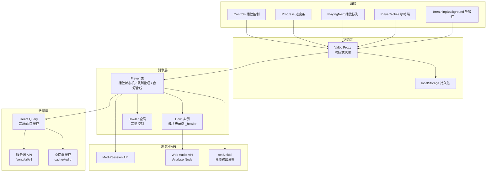
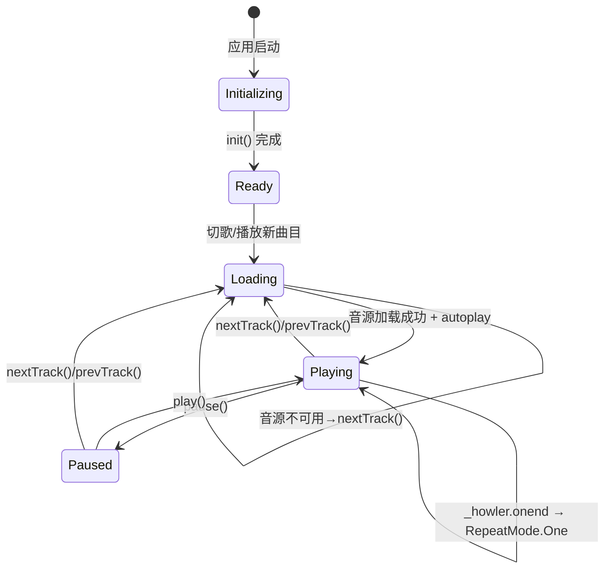
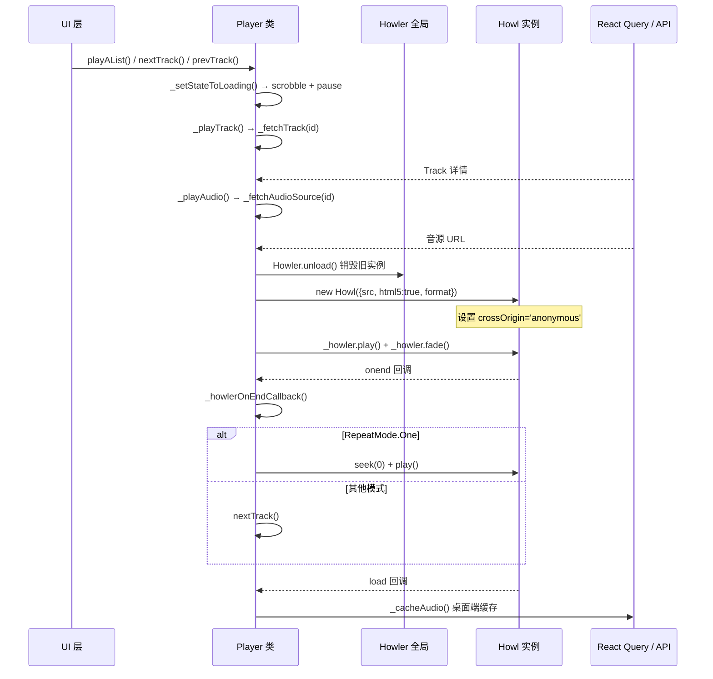
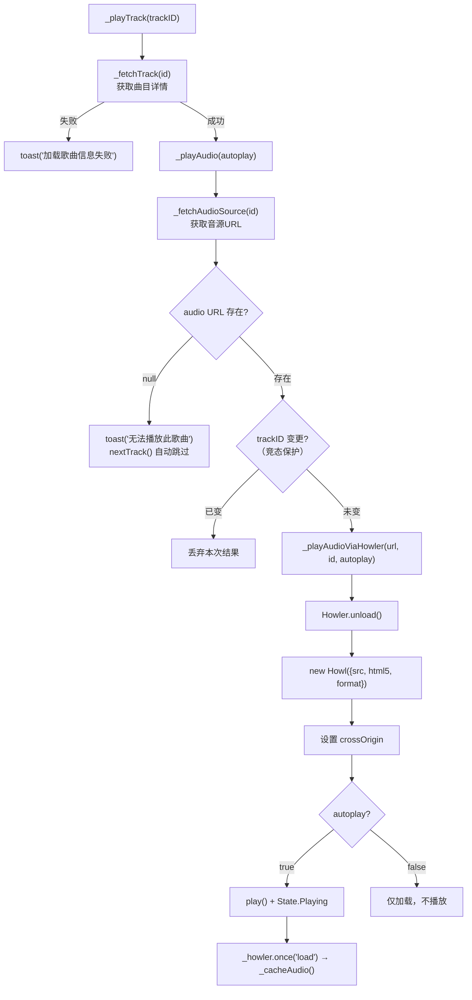

R3PLAYX 的播放器核心是一个围绕 **Howler.js** 构建的自定义音频引擎，由 `Player` 类封装全部播放逻辑，通过 Valtio 响应式代理与 UI 层无缝对接。本文将深入剖析从 Howl 实例生命周期、音源获取管线、播放状态机，到 MediaSession 集成、Web Audio API 音量分析、音频输出设备切换的完整技术链路，揭示播放器核心的设计决策与实现细节。

Sources: [player.ts](packages/web/utils/player.ts#L1-L721), [player.ts](packages/web/states/player.ts#L1-L19)

## 架构总览：分层解耦的播放引擎

播放器采用 **三层分离架构**：底层 Howler.js 负责音频解码与播放，中层 `Player` 类封装业务逻辑与状态管理，顶层 Valtio 代理提供响应式数据绑定。这种分层使得音频引擎的复杂性被完全封装在 `Player` 类内部，UI 组件只需通过 `useSnapshot(player)` 即可获取响应式状态。



**关键设计决策**：Howl 实例被声明为模块级变量 `_howler` 而非 Player 类的实例属性。这是因为每次切歌时需要销毁旧 Howl 并创建新实例（`Howler.unload()` 后 `new Howl()`），模块级变量避免了实例属性重建时的引用断裂问题。同时，Howl 实例被挂载到 `window.howler` 上，供 `useAudioVolume` Hook 在运行时访问底层 `<audio>` 元素。

Sources: [player.ts](packages/web/utils/player.ts#L45-L46), [player.ts](packages/web/utils/player.ts#L310-L347), [player.ts](packages/web/states/player.ts#L1-L19), [useAudioVolume.ts](packages/web/hooks/useAudioVolume.ts#L52-L61)

## 播放状态机：五态流转与过渡逻辑

Player 类定义了五个互斥的播放状态，构成一个有限状态机：

| 状态 | 枚举值 | 含义 | 触发条件 |
|------|--------|------|----------|
| **Initializing** | `initializing` | 初始化中 | 应用启动时，`init()` 执行前 |
| **Ready** | `ready` | 就绪 | `init()` 完成后 |
| **Playing** | `playing` | 播放中 | `_howler.play()` 成功 |
| **Paused** | `paused` | 已暂停 | `_howler.pause()` |
| **Loading** | `loading` | 加载中 | 切歌时，音源 URL 尚未获取 |



状态转换的几个关键细节值得注意：**Loading 状态是一个"过渡态"**，进入时立即暂停当前 Howl 播放（`_howler.pause()`）并触发 scrobble 听歌打卡，确保切歌前的播放记录被正确提交。若音源获取失败（`audio` 为 null），播放器会自动跳到下一首（`nextTrack()`），形成自动容错链。当 `init()` 时已存在 `trackID`，会调用 `_playAudio(false)` 仅加载音频而不自动播放，使用户重新打开应用时不会突然出声。

Sources: [player.ts](packages/web/utils/player.ts#L35-L41), [player.ts](packages/web/utils/player.ts#L63-L85), [player.ts](packages/web/utils/player.ts#L199-L203), [player.ts](packages/web/utils/player.ts#L279-L308)

## 双模式播放：TrackList 模式与 FM 模式

播放器支持两种截然不同的播放模式，通过 `mode` 属性切换：

| 维度 | TrackList 模式 | FM（私人 FM）模式 |
|------|---------------|-------------------|
| **曲目来源** | 用户主动选择（歌单/专辑/歌手） | 算法推荐流 |
| **队列管理** | `trackList: TrackID[]`，支持上/下一首 | `fmTrackList: TrackID[]`，仅支持下一首 |
| **当前曲目** | `_track`（通过 `_trackIndex` 索引） | `fmTrack`（独立存储） |
| **重复/随机** | 完整支持 RepeatMode + Shuffle | 不可用（UI 层隐藏按钮） |
| **队列操作** | addToFirstPlay / addToNextPlay / deleteFromPlaylist | fmTrash（垃圾桶跳过） |
| **预加载** | 无 | 自动预加载下一首封面图 |

FM 模式的队列补充机制采用了**低水位线策略**：当 `fmTrackList.length <= 5` 时触发 `_loadMoreFMTracks()`，从服务端获取新的推荐曲目 ID 并追加到队列尾部。切歌时通过 `shift()` 消费队首，同时异步预取下一首的曲目详情与封面图，确保流畅的无缝播放体验。

`trackID` 的 getter 根据当前模式返回不同来源：TrackList 模式返回 `trackList[_trackIndex]`，FM 模式返回 `fmTrackList[0]`。这种设计使得后续的音源获取逻辑无需感知模式差异。

Sources: [player.ts](packages/web/utils/player.ts#L31-L34), [player.ts](packages/web/utils/player.ts#L126-L132), [player.ts](packages/web/utils/player.ts#L368-L392), [player.ts](packages/web/utils/player.ts#L648-L667)

## Howl 实例生命周期与音频播放管线

每首曲目的播放都经历一个完整的 Howl 实例生命周期，核心流程如下：



**关键配置项解析**：

- **`html5: true`**：强制使用 HTML5 Audio 而非 Web Audio API 进行解码。这是必要选择——Web Audio API 会将整个音频文件下载到内存后解码，对于长曲目（尤其是 FLAC 格式）会导致巨大的内存开销和播放延迟；HTML5 Audio 支持流式播放，可以实现即点即播。
- **`format: ['mp3', 'flac', 'webm']`**：声明支持的格式优先级，Howler 据此选择最优解码路径。
- **`dash-id` URL 后缀**：在音源 URL 后附加 `?dash-id={trackId}` 参数，这是桌面端音频缓存系统的关键标识——缓存服务通过解析此参数确定曲目 ID，从而将下载的音频数据正确关联到本地存储。
- **`crossOrigin = 'anonymous'`**：在 Howl 创建后，立即访问底层 `_node`（即 `<audio>` 元素）设置跨域属性，使 Web Audio API 的 `AnalyserNode` 可以读取音频频率数据，驱动呼吸灯效果。若不设置此属性，CORS 策略将导致频率数据全为零。

Sources: [player.ts](packages/web/utils/player.ts#L310-L347), [player.ts](packages/web/utils/player.ts#L349-L366), [playerDataTypes.ts](packages/shared/playerDataTypes.ts#L1-L8)

## 淡入淡出与播放暂停过渡

播放器实现了基于 Howler `fade()` API 的平滑过渡效果，淡入淡出时长固定为 200ms（`PLAY_PAUSE_FADE_DURATION`）：

| 操作 | fade=false（默认） | fade=true |
|------|-------------------|-----------|
| **play()** | 直接播放，立即设置 `State.Playing` | 先 play()，等待 `play` 事件后从 0 渐变到 `_volume` |
| **pause()** | 直接暂停，立即设置 `State.Paused` | 先渐变到 0，等待 `fade` 事件完成后再 pause() |
| **playOrPause()** | 无 fade | 默认 fade=true，双向过渡 |

UI 层的 `playOrPause()` 调用默认启用 fade，而切歌操作（`nextTrack`/`prevTrack`）则不使用 fade——因为切歌时旧 Howl 已被 `Howler.unload()` 销毁，fade 过渡没有意义。这种区分确保了用户主动暂停/恢复时的听觉舒适度，同时避免了切歌时的冗余动画延迟。

Sources: [player.ts](packages/web/utils/player.ts#L43), [player.ts](packages/web/utils/player.ts#L398-L437)

## 进度追踪机制

进度追踪采用 **1 秒间隔轮询**策略，在 `_setupProgressInterval()` 中通过 `setInterval` 每秒读取 `_howler.seek()` 值并写入 `_progress`。这种设计牺牲了亚秒级精度（对进度条渲染而言完全足够），换取了极低的性能开销。

```typescript
// 每1000ms从Howler读取一次当前播放位置
this._progressInterval = setInterval(() => {
  if (this.state === State.Playing) this._progress = _howler.seek()
}, 1000)
```

`progress` 的 getter 对 Loading 状态做了特殊处理——返回 0 而非实际值，避免切歌瞬间进度条闪烁。setter 同时更新内部状态和 Howler 的播放位置（`_howler.seek(value)`），实现进度条拖拽 seek。UI 层的 `Progress` 组件通过 `onlyCallOnChangeAfterDragEnded={true}` 配置 Slider，确保拖拽过程中不频繁触发 seek 操作，仅在释放时一次性定位。

Sources: [player.ts](packages/web/utils/player.ts#L162-L168), [player.ts](packages/web/utils/player.ts#L205-L209), [Progress.tsx](packages/web/components/NowPlaying/Progress.tsx#L1-L33)

## 重复模式与随机播放

重复模式使用共享枚举 `RepeatMode`，但 Player 类内部仅使用三种核心状态：

| RepeatMode | 行为 | `_prevTrackIndex` | `_nextTrackIndex` |
|------------|------|-------------------|-------------------|
| **Off** | 不重复 | `index - 1`（不低于 0） | `index + 1`（不超过末尾→undefined） |
| **On** | 列表循环 | `index - 1`（首→末） | `index + 1`（末→首） |
| **One** | 单曲循环 | 当前 index | 当前 index |

**随机播放**（Shuffle）在 `RepeatMode` 枚举中虽然存在 `Shuffle`/`ShuffleOff` 值，但 Player 类的随机逻辑是独立于重复模式实现的。`shufflePlayList()` 使用 **Fisher-Yates 洗牌算法**，在洗牌前保存原始列表到 `originTrackList`，确保可以恢复原始顺序。洗牌时保持当前播放曲目的 index 不变（通过 `indexOf(playingSongID)` 重新定位），避免洗牌导致当前歌曲跳变。

值得注意的是，`_howlerOnEndCallback` 中对 `RepeatMode.One` 的处理是直接 `seek(0) + play()`，而非通过 `_nextTrackIndex` 逻辑——因为单曲循环不需要重新创建 Howl 实例，只需将播放位置归零即可，这避免了不必要的网络请求和实例重建开销。

Sources: [player.ts](packages/web/utils/player.ts#L94-L121), [player.ts](packages/web/utils/player.ts#L349-L356), [player.ts](packages/web/utils/player.ts#L581-L602), [playerDataTypes.ts](packages/shared/playerDataTypes.ts#L1-L8), [PlayingNext.tsx](packages/web/components/PlayingNext.tsx#L48-L112)

## 音源获取管线与容错机制

音源获取是播放管线中最复杂的环节，涉及多层 API 调用与容错策略：



**竞态保护**：`_playAudio` 中通过 `if (this.trackID !== id) return` 实现了简易的竞态条件防护。当用户快速连续切歌时，先发起的请求可能后返回，此时 `trackID` 已经改变，过时的结果将被丢弃。这是一种乐观更新策略——不取消进行中的请求，而是在结果返回时校验其有效性。

**HTTP→HTTPS 升级**：对于 `126.net`（网易云音乐 CDN）域名的音源 URL，自动将 `http://` 替换为 `https://`，确保在 HTTPS 页面中不会触发混合内容（Mixed Content）阻断。

**桌面端音频缓存**：Howl 加载完成后触发 `_cacheAudio()`，将音频文件下载并通过 `cacheAudio()` API 发送到本地 Fastify 服务器存储。缓存前会检查 URL 是否已包含应用名称（避免重复缓存），并从 URL 中解析 `dash-id` 参数获取曲目 ID。

Sources: [player.ts](packages/web/utils/player.ts#L247-L274), [player.ts](packages/web/utils/player.ts#L279-L366), [r3play.ts](packages/web/api/r3play.ts#L1-L27), [track.ts](packages/web/api/track.ts#L39-L51)

## 音量控制与 Web Audio API 分析

音量控制通过 `Howler.volume()` 全局 API 实现，Player 类的 `volume` setter 使用 `lodash` 的 `clamp` 确保值域在 `[0, 1]` 范围内。这与 Howl 实例级别的 `volume` 不同——全局音量影响所有 Howl 实例，而实例级音量仅影响单个实例。

`useAudioVolume` Hook 实现了更复杂的**双模式音量分析系统**，用于驱动呼吸灯背景效果：

| 策略 | 触发条件 | 原理 | 精度 |
|------|---------|------|------|
| **Web Audio API 主模式** | 初始默认 | 通过 `AnalyserNode.getByteFrequencyData()` 获取频率数据，计算 RMS 值 | 真实音频分析 |
| **模拟呼吸回退模式** | CORS 连续 60 帧全零 / Web Audio 异常 | 基于双频正弦叠加的数学模拟 `0.35 + 0.25*sin(phase) + 0.15*sin(2.3*phase+1.2)` | 视觉近似 |

主模式的工作流程：延迟 500ms 等待 Howler 初始化 → 通过 `window.howler` 获取底层 `<audio>` 元素 → 创建共享 `AudioContext` + `AnalyserNode` → `createMediaElementSource` 连接音频图 → 每 33ms（约 30fps）读取频率数据并计算 RMS。使用 `WeakSet` 跟踪已连接的音频元素，避免重复创建 `MediaElementSource`（同一元素只能创建一次）。

回退模式的检测机制非常精巧：连续 60 帧（约 2 秒）频率数据 RMS 为零时，判定为 CORS 限制导致的数据不可用，自动切换到模拟呼吸模式并停止 Web Audio 循环。这比抛出异常后回退更优雅——CORS 限制不会触发异常，只会静默返回全零数据。

Sources: [player.ts](packages/web/utils/player.ts#L173-L179), [useAudioVolume.ts](packages/web/hooks/useAudioVolume.ts#L1-L164), [BreathingBackground.tsx](packages/web/components/BreathingBackground.tsx#L1-L144)

## MediaSession API 集成

播放器完整集成了浏览器 `MediaSession` API，实现了操作系统级别的媒体控制：

**动作处理器注册**（`_initMediaSession`）：
- `play` / `pause`：对应播放器的 `play()` / `pause()`
- `previoustrack` / `nexttrack`：对应 `prevTrack()` / `nextTrack()`
- `seekto`：接收 `event.seekTime` 参数，直接设置 `progress`

**元数据更新**（`_updateMediaSessionMetaData`）：
每次 `_playTrack()` 成功获取曲目详情后调用，设置曲名、艺术家、专辑名和封面图（提供 256×256 和 512×512 两种尺寸）。封面 URL 使用网易云的图片参数 API（`?param=256y256`）动态调整尺寸。

这使得用户可以通过操作系统任务栏、锁屏界面、蓝牙设备的媒体按键控制播放器，是桌面端和 PWA 场景下的核心体验功能。

Sources: [player.ts](packages/web/utils/player.ts#L680-L715)

## 音频输出设备切换

`setDevice()` 方法通过 HTML5 的 `setSinkId()` API 实现音频输出设备切换，允许用户将音频路由到蓝牙耳机、USB 声卡等不同输出设备：

```typescript
setDevice(deviceId: MediaDeviceInfo['deviceId']) {
  const audioElement = (_howler as any)._sounds[0]._node
  audioElement.setSinkId(deviceId)
}
```

实现方式是直接访问 Howl 内部的 `_sounds[0]._node`（即底层 `<audio>` 元素），调用其 `setSinkId()` 方法。此功能仅在 Electron 桌面端启用（UI 层通过 `window.env?.isElectron` 判断），设备列表通过 `navigator.mediaDevices.enumerateDevices()` 获取，每 5 秒自动刷新以检测新接入设备。

Sources: [player.ts](packages/web/utils/player.ts#L234-L245), [Devices.tsx](packages/web/components/Tools/Devices.tsx#L1-L96)

## Valtio 代理与状态持久化

`Player` 类通过 Valtio 的 `proxy()` 包装为响应式对象，实现了以下关键能力：

**响应式绑定**：所有 Player 类的公共属性（`state`、`mode`、`trackList`、`shuffle`、`track` 等）和 getter（`progress`、`volume`、`repeatMode`）变化都会自动触发 UI 重渲染。UI 组件通过 `useSnapshot(player)` 获取只读快照。

**localStorage 持久化**：通过 `subscribe(player, ...)` 监听所有状态变化，将整个 proxy 序列化为 JSON 写入 localStorage。应用重启时通过 `init()` 方法从 `playerInLocalStorage` 恢复 `_track`、`_trackIndex`、`_volume`、`_repeatMode`、`trackList`、`mode` 等关键状态。

**开发调试**：在 DEV 模式下，Player 实例和 Howl 实例均挂载到 `window` 对象（`window.player`、`window.howler`），方便在浏览器控制台直接调试播放状态。

Sources: [player.ts](packages/web/states/player.ts#L1-L19), [player.ts](packages/web/utils/player.ts#L718-L721)

## UI 组件体系与播放器交互

播放器 UI 在桌面端和移动端采用完全不同的组件树，但共享同一个 `player` 状态代理：

**桌面端组件树**：
```
Player.tsx
├── PlayingNext.tsx（播放队列面板）
│   ├── Header（FM/Repeat/Shuffle 按钮）
│   └── TrackList（Virtuoso 虚拟滚动列表）
└── NowPlaying.tsx（当前播放面板）
    ├── Cover.tsx（封面 + 淡入淡出切换）
    ├── Info.tsx（曲目名 + 艺术家 + Progress）
    └── Controls.tsx（播放控制 + 音量滑块 + 设备切换）
```

**移动端组件树**：
```
PlayerMobile.tsx（紧凑条形播放器）
├── Cover（缩略封面）
├── TrackInfo + 水平拖拽切歌
├── LikeButton
└── Play/Pause 按钮

PlayingNextMobile.tsx（全屏播放列表面板）
└── PlayingNext.tsx（复用桌面端队列组件）
```

移动端的切歌交互采用 **水平拖拽手势**：通过 Framer Motion 的 `drag='x'` 监听拖拽偏移，超过 100px 阈值时触发上一首/下一首。播放列表面板则使用 **垂直拖拽** 关闭手势，下拉超过 150px 时收起面板。

`Cover.tsx` 的封面切换使用了 `subscribeKey(player, 'track', ...)` 订阅 track 变化，而非 `useSnapshot`。这是因为封面需要执行"先淡出→换图→等图加载→再淡入"的动画序列，`useSnapshot` 的即时渲染无法满足此需求。`useAnimation()` 提供了命令式的动画控制能力，配合 `Image` 预加载确保切换流畅。

Sources: [Player.tsx](packages/web/components/Player.tsx#L1-L43), [NowPlaying.tsx](packages/web/components/NowPlaying/NowPlaying.tsx#L1-L50), [Controls.tsx](packages/web/components/NowPlaying/Controls.tsx#L1-L248), [Cover.tsx](packages/web/components/NowPlaying/Cover.tsx#L1-L53), [PlayerMobile.tsx](packages/web/components/PlayerMobile.tsx#L1-L175), [PlayingNext.tsx](packages/web/components/PlayingNext.tsx#L1-L264)

## 键盘快捷键系统

`useApplyKeyboardShortcuts` Hook 将平台感知的快捷键映射到播放器操作：

| 快捷键名 | 播放器方法 | 说明 |
|---------|-----------|------|
| `playPause` | `player.playOrPause()` | 播放/暂停 |
| `next` | `player.nextTrack()` | 下一首 |
| `previous` | `player.prevTrack()` | 上一首 |
| `volumeUp` | `player.volume += 0.1` | 音量增加 10% |
| `volumeDown` | `player.volume -= 0.1` | 音量减少 10% |
| `favorite` | `likeATrack.mutateAsync(track.id)` | 收藏/取消收藏 |

快捷键匹配考虑了修饰键的平台差异（macOS 使用 Meta/Option，其他平台使用 Super/Alt），并在输入框聚焦时禁用快捷键，避免与文本编辑冲突。音量增减利用了 Player `volume` setter 的 `clamp(0, 1)` 保护，无需额外边界检查。

Sources: [useApplyKeyboardShortcuts.ts](packages/web/hooks/useApplyKeyboardShortcuts.ts#L1-L111)

## 听歌打卡（Scrobble）机制

`_scrobble()` 方法在每次进入 Loading 状态（即切歌）时触发，向服务端提交当前曲目的听歌记录。打卡条件有两个：曲目必须有 `id` 且有 `trackListSource`（来源歌单/专辑 ID）；播放进度必须超过曲目总时长的 1/3。第二个条件过滤了"快速跳过"的曲目，只记录真正被听过的歌。

```typescript
if (this.progress <= this.track.dt / 1000 / 3) return
```

`trackListSource` 记录了当前播放队列的来源类型和 ID（`{type: TrackListSourceType, id: number}`），仅在通过 `playPlaylist()`、`playAlbum()`、`playArtistPopularTracks()` 启动播放时设置。通过 `playAList()` 直接播放的队列没有 source 信息，因此不会触发 scrobble。

Sources: [player.ts](packages/web/utils/player.ts#L199-L223), [user.ts](packages/web/api/user.ts#L69-L82)

## Slider 组件：拖拽与即时反馈的平衡

`Slider` 组件是播放器和音量控制的基础交互元素，其核心设计在于 `onlyCallOnChangeAfterDragEnded` 属性：

| 模式 | 拖拽中 | 释放时 | 适用场景 |
|------|--------|--------|---------|
| `onlyCallOnChangeAfterDragEnded=true` | 仅更新本地 `draggingValue`，不触发 `onChange` | 一次性调用 `onChange(draggingValue)` | 进度条 seek |
| `onlyCallOnChangeAfterDragEnded=false` | 每帧调用 `onChange(newValue)` | 不额外调用 | 音量滑块 |

进度条使用前者是因为频繁 seek 会导致音频缓冲区反复重建，产生卡顿；音量滑块使用后者是因为音量变化需要即时听觉反馈。组件通过 `isDragging` 状态在拖拽期间用本地 `draggingValue` 替代外部 `value`，确保滑块视觉位置与用户手指同步，而不受外部状态更新频率的影响。

Sources: [Slider.tsx](packages/web/components/Slider.tsx#L1-L155)

## 延伸阅读

- 播放器的状态通过 Valtio 管理，详见 [状态管理架构：Valtio 响应式状态与持久化](13-zhuang-tai-guan-li-jia-gou-valtio-xiang-ying-shi-zhuang-tai-yu-chi-jiu-hua)
- 音源获取依赖 React Query 缓存层，详见 [API 数据层：TanStack React Query 与请求缓存](15-api-shu-ju-ceng-tanstack-react-query-yu-qing-qiu-huan-cun)
- 播放器 UI 的组件布局细节，详见 [UI 组件体系：布局、播放器、歌词与上下文菜单](16-ui-zu-jian-ti-xi-bu-ju-bo-fang-qi-ge-ci-yu-shang-xia-wen-cai-dan)
- 桌面端音频缓存依赖本地 Fastify 服务器，详见 [桌面端本地 Fastify 服务器与 API 路由](9-zhuo-mian-duan-ben-di-fastify-fu-wu-qi-yu-api-lu-you)
- 音源解锁（Unblock）机制在服务端实现，详见 [网易云音乐 API 代理与 Unblock 音源解锁](22-wang-yi-yun-yin-le-api-dai-li-yu-unblock-yin-yuan-jie-suo)
- 键盘快捷键的平台适配策略，详见 [跨平台键盘快捷键系统](27-kua-ping-tai-jian-pan-kuai-jie-jian-xi-tong)