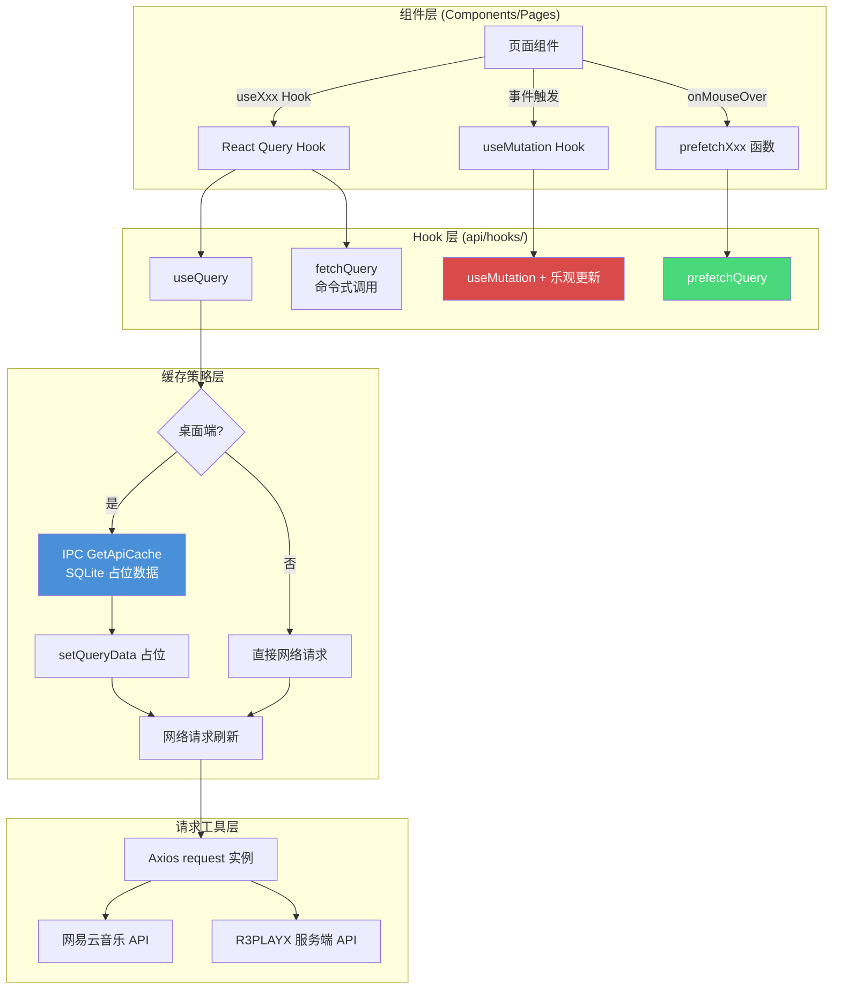
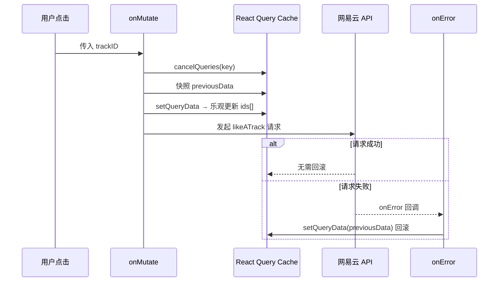

R3PLAYX 的数据获取层构建在 **TanStack React Query** 之上，采用「请求函数 → Hook 封装 → 组件消费」的三层架构，并针对桌面端场景引入了 **IPC 缓存桥接** 机制——在 Electron 环境中，所有查询都会优先从本地 SQLite 缓存读取数据作为占位，再发起网络请求刷新。这种设计让页面在冷启动时即可呈现上次的数据，大幅缩短了首屏白屏时间。本文将从整体架构出发，逐层拆解请求工具层、Query Key 体系、缓存桥接策略、Hook 的三种消费模式（useQuery / fetchQuery / prefetchQuery）、乐观更新 Mutation，以及无限滚动分页的实现。

Sources: [reactQueryClient.ts](packages/web/utils/reactQueryClient.ts#L1-L12), [request.ts](packages/web/utils/request.ts#L1-L38), [CacheAPIs.ts](packages/shared/CacheAPIs.ts#L1-L100)

## 整体架构概览

数据从服务端到达 UI 组件，经历以下关键阶段：



**核心设计原则**：所有 API 交互必须通过 `packages/web/api/` 目录下的 Hook 或命令式函数完成，组件中不直接调用 `request` 工具。Hook 层承担了缓存策略、数据转换、条件启用等横切关注点，组件层只关心「要什么数据」和「数据状态如何」。

Sources: [useAlbum.ts](packages/web/api/hooks/useAlbum.ts#L1-L56), [usePlaylist.ts](packages/web/api/hooks/usePlaylist.ts#L1-L119), [useTracks.ts](packages/web/api/hooks/useTracks.ts#L1-L119)

## 请求工具层：Axios 封装与代理配置

### Axios 实例与拦截器

请求工具位于 `packages/web/utils/request.ts`，基于 Axios 创建了统一的请求实例，核心配置包括：

| 配置项 | 值 | 说明 |
|--------|-----|------|
| `baseURL` | `DEV: '/netease'` / `PROD: VITE_APP_NETEASE_API_URL` | 开发环境走 Vite 代理，生产环境直连 |
| `withCredentials` | `true` | 自动携带 Cookie（网易云音乐 API 登录态依赖 Cookie） |
| `timeout` | `50000` | 50 秒超时 |

拦截器层面，响应拦截器会检测 `code === 301`（未登录状态码），并在控制台输出提示。请求拦截器目前为透传处理，保留扩展空间。

Sources: [request.ts](packages/web/utils/request.ts#L1-L38)

### Vite 开发代理

开发环境中，Vite 配置了两个代理规则，将前端请求转发至本地运行的 NeteaseCloudMusicApi 服务：

```typescript
// 网易云音乐 API 代理
'/netease/': {
  target: `http://127.0.0.1:${ELECTRON_DEV_NETEASE_API_PORT}`,
  changeOrigin: true,
  rewrite: path => (IS_ELECTRON ? path : path.replace(/^\/netease/, '')),
}
// R3PLAYX 自有 API 代理（Apple Music 等）
'/r3playx/': {
  target: `http://127.0.0.1:${ELECTRON_DEV_NETEASE_API_PORT}`,
  changeOrigin: true,
}
```

值得注意的是，Apple Music 相关的 API 请求在 `appleMusic.ts` 中显式覆盖了 `baseURL: '/'`，走 `/r3playx/apple-music/` 路径而非默认的 `/netease/` 路径，这确保了不同后端服务的正确路由。

Sources: [vite.config.ts](packages/web/vite.config.ts#L76-L87), [appleMusic.ts](packages/web/api/appleMusic.ts#L1-L32)

## Query Client 配置与 Key 命名体系

### QueryClient 全局配置

```typescript
const reactQueryClient = new QueryClient({
  defaultOptions: {
    queries: {
      refetchOnWindowFocus: false,  // 全局禁用窗口聚焦重新请求
    },
  },
})
```

项目**全局禁用**了 `refetchOnWindowFocus`，这避免了桌面端频繁切换窗口时产生的大量冗余请求。对于需要实时性的数据（如用户歌单、收藏列表），各 Hook 会**显式**覆盖此选项为 `true`。

Sources: [reactQueryClient.ts](packages/web/utils/reactQueryClient.ts#L1-L12)

### Query Key 命名规范

Query Key 采用 `[ApiNameEnum, params]` 二元组结构，其中 ApiNameEnum 定义在各共享 API 类型文件中：

| 共享类型文件 | 枚举名 | 示例 Key |
|-------------|--------|----------|
| `shared/api/Album.ts` | `AlbumApiNames` | `['fetchAlbum', { id: 123 }]` |
| `shared/api/Artist.ts` | `ArtistApiNames` | `['fetchArtist', { id: 456 }]` |
| `shared/api/Track.ts` | `TrackApiNames` | `['fetchTracks', { ids: [1,2,3] }]` |
| `shared/api/Playlists.ts` | `PlaylistApiNames` | `['fetchPlaylist', { id: 789 }]` |
| `shared/api/User.ts` | `UserApiNames` | `['fetchUserAccount']` |
| `shared/api/MV.ts` | `MVApiNames` | `['fetchMV', { mvid: 111 }]` |

这种基于枚举的 Key 设计有两个优势：**类型安全**——枚举值在编译期即可校验，避免字符串拼写出错；**跨模块寻址**——Mutation 中可通过枚举精确定位并更新其他 Query 的缓存数据，例如收藏专辑时需要同时更新用户专辑列表的缓存。

Sources: [Album.ts](packages/shared/api/Album.ts#L1-L25), [Artist.ts](packages/shared/api/Artist.ts#L1-L91), [Track.ts](packages/shared/api/Track.ts#L1-L117), [User.ts](packages/shared/api/User.ts#L1-L165), [Playlists.ts](packages/shared/api/Playlists.ts#L1-L133)

## IPC 缓存桥接：桌面端的占位数据策略

### 架构背景

在桌面端，R3PLAYX 的主进程维护了一个基于 better-sqlite3 的本地缓存数据库（详见 [桌面端 SQLite 数据库：better-sqlite3 缓存与迁移](10-zhuo-mian-duan-sqlite-shu-ju-ku-better-sqlite3-huan-cun-yu-qian-yi)）。Web 层通过 Electron 的 IPC 机制（`IpcChannels.GetApiCache`）访问此缓存。缓存 API 的枚举与类型映射定义在 `shared/CacheAPIs.ts` 中，涵盖了所有支持缓存的 API 端点及其参数/响应类型。

Sources: [CacheAPIs.ts](packages/shared/CacheAPIs.ts#L1-L100), [IpcChannels.ts](packages/shared/IpcChannels.ts#L25)

### 缓存占位模式（Cache-as-Placeholder）

这是项目中最核心的缓存桥接模式，以 `useAlbum` 为典型实现：

```typescript
export default function useAlbum(params: FetchAlbumParams) {
  const key = [AlbumApiNames.FetchAlbum, params]
  return useQuery(
    key,
    () => {
      // 1. 异步读取本地缓存作为占位
      fetchFromCache(params).then(cache => {
        const existsQueryData = reactQueryClient.getQueryData(key)
        if (!existsQueryData && cache) {
          reactQueryClient.setQueryData(key, cache)  // 仅当无数据时填充
        }
      })
      // 2. 同时发起网络请求
      return fetch(params)
    },
    {
      enabled: !!params.id,
      staleTime: 24 * 60 * 60 * 1000, // 24 hours
    }
  )
}
```

执行流程：① Hook 挂载时，queryFn 启动；② **异步**发起 IPC 缓存查询，一旦返回且当前 Query 无数据，立即通过 `setQueryData` 填充；③ 同时网络请求并行执行，成功后覆盖缓存占位数据。这种「先占位后刷新」的策略，让用户在应用冷启动时即可看到上次的数据，网络请求成功后再静默更新。

关键细节：`fetchFromCache` 使用 `.then()` 而非 `await`，这意味着缓存读取**不阻塞**网络请求的发起——两者真正并行。`existsQueryData` 的检查确保了只有在 React Query 缓存确实为空时才填充，避免覆盖更鲜活的网络数据。

Sources: [useAlbum.ts](packages/web/api/hooks/useAlbum.ts#L15-L42)

### 缓存优先模式（Cache-as-Initial-Data）

另一种变体出现在 `useLyric` 和 `useTracks` 中，它们采用 `await` 优先读取缓存：

```typescript
// useLyric - 缓存优先模式
async () => {
  const cache = await window.ipcRenderer?.invoke(IpcChannels.GetApiCache, {
    api: CacheAPIs.Lyric,
    query: { id: params.id },
  })
  if (cache) return cache           // 缓存命中，直接返回
  return fetchLyric(params)         // 缓存未命中，走网络
}
```

与占位模式不同，这种模式下如果缓存命中，**网络请求不会发起**——`staleTime: Infinity` 确保了这些数据永远不会被标记为过期。这适用于歌词和歌曲详情这类变更频率极低的数据。

Sources: [useLyric.ts](packages/web/api/hooks/useLyric.ts#L9-L28), [useTracks.ts](packages/web/api/hooks/useTracks.ts#L38-L59)

### 两种缓存策略对比

| 维度 | 缓存占位模式 (Cache-as-Placeholder) | 缓存优先模式 (Cache-as-Initial-Data) |
|------|--------------------------------------|--------------------------------------|
| 缓存读取方式 | 异步 `.then()` | 同步 `await` |
| 网络请求 | 始终发起 | 缓存命中时跳过 |
| 适用数据 | 可能变更的数据（专辑、歌单、歌手） | 几乎不变的数据（歌词、歌曲详情） |
| 首屏体验 | 缓存占位 + 网络刷新 | 缓存直接展示，无闪烁 |
| 典型 Hook | `useAlbum`、`usePlaylist`、`useArtist` | `useLyric`、`useTracks` |

Sources: [useAlbum.ts](packages/web/api/hooks/useAlbum.ts#L15-L42), [useLyric.ts](packages/web/api/hooks/useLyric.ts#L9-L28)

## Hook 的三种消费模式

项目中的每个 API 资源通常暴露三种消费方式，以专辑为例：

### 1. 声明式：useQuery Hook

```typescript
const { data: album, isLoading } = useAlbum({ id: 123 })
```

组件挂载时自动请求，卸载时自动清理。适合页面级数据加载，是最常用的模式。

### 2. 命令式：fetchQuery 函数

```typescript
export function fetchAlbumWithReactQuery(params: FetchAlbumParams) {
  return reactQueryClient.fetchQuery(
    [AlbumApiNames.FetchAlbum, params],
    () => fetch(params),
    { staleTime: Infinity }
  )
}
```

在非组件上下文中（如事件处理器、其他 Hook 内部）命令式地获取数据。如果缓存中已有非过期数据，则直接返回缓存值，不会重复请求。典型场景：[路由与页面结构](12-lu-you-yu-ye-mian-jie-gou-hashrouter-lan-jia-zai-yu-ye-mian-qie-huan-dong-hua)中 Discover 页面的数据加载。

Sources: [Discover.tsx](packages/web/pages/Discover.tsx#L3-L43), [useAlbum.ts](packages/web/api/hooks/useAlbum.ts#L44-L51)

### 3. 预取式：prefetchQuery 函数

```typescript
export async function prefetchAlbum(params: FetchAlbumParams) {
  if (await fetchFromCache(params)) return   // 缓存已有，无需预取
  await reactQueryClient.prefetchQuery(
    [AlbumApiNames.FetchAlbum, params],
    () => fetch(params),
    { staleTime: Infinity }
  )
}
```

在用户可能即将访问的页面上提前加载数据。项目中广泛运用于 **鼠标悬停预取**——在 `CoverRow`、`CoverWall`、`ArtistRow` 等列表组件中，`onMouseOver` 事件触发 `prefetchAlbum` / `prefetchPlaylist` / `prefetchArtist`，当用户真正点击进入详情页时，数据已就绪，实现零延迟页面切换。

Sources: [useAlbum.ts](packages/web/api/hooks/useAlbum.ts#L53-L56), [CoverRow.tsx](packages/web/components/CoverRow.tsx#L27-L29)

## Stale Time 策略矩阵

不同数据类型的「新鲜度」要求差异显著。项目为各类 API 设定了差异化的 `staleTime`：

| 数据类型 | staleTime | refetchOnWindowFocus | 理由 |
|----------|-----------|---------------------|------|
| 歌曲详情 (Track) | `Infinity` | `false` | 歌曲元数据几乎不变 |
| 歌词 (Lyric) | `Infinity` | `false` | 歌词内容固定 |
| 专辑详情 (Album) | 24 小时 | 继承全局 `false` | 专辑信息偶尔更新（如新增评论数） |
| 歌手详情 (Artist) | 5 分钟 | 继承全局 `false` | 歌手信息可能频繁变化 |
| 歌手专辑列表 | 1 小时 | 继承全局 `false` | 专辑列表中等频率变更 |
| 歌单详情 (Playlist) | 继承默认 | `true` | 歌单内容可能被实时修改 |
| 排行榜歌单 | 继承默认 | `true` | 需要保持最新排名 |
| 用户账户 | 继承默认 | `true` | 登录状态需实时同步 |
| 用户收藏列表 | 继承默认 | `true` | 收藏操作需即时反映 |
| 音源 URL (AudioSource) | `0` | — | URL 有时效性，必须每次重新获取 |
| MV 详情 | 5 分钟 | — | MV 信息相对稳定 |
| MV URL | 60 分钟 | — | 播放地址有效期较长 |
| 相似歌手 | 5 分钟 | — | 变更频率低但非零 |

`staleTime: Infinity` 意味着数据一旦获取就永不过期，React Query 不会自动重新请求。配合缓存优先模式，这些数据在桌面端几乎不产生网络开销。

Sources: [useTracks.ts](packages/web/api/hooks/useTracks.ts#L50-L55), [useLyric.ts](packages/web/api/hooks/useLyric.ts#L27-L32), [useAlbum.ts](packages/web/api/hooks/useAlbum.ts#L37-L41), [useArtist.ts](packages/web/api/hooks/useArtist.ts#L28-L34), [useMV.ts](packages/web/api/hooks/useMV.ts#L1-L39)

## 乐观更新 Mutation：即时响应的收藏操作

### 设计模式

收藏/取消收藏操作（歌曲、专辑、歌手、歌单）全部采用乐观更新模式，用户点击后 UI **立即**反映变更，无需等待服务端确认。以 `useMutationLikeATrack` 为核心范例：



### 歌曲「红心」实现

```typescript
onMutate: async trackID => {
  await reactQueryClient.cancelQueries(key)           // 取消进行中的 refetch
  const previousData = reactQueryClient.getQueryData(key)  // 快照旧值
  reactQueryClient.setQueryData(key, old => {         // 乐观更新
    const likedSongs = old as FetchUserLikedTracksIDsResponse
    const ids = likedSongs.ids
    const newIds = ids.includes(trackID)
      ? ids.filter(id => id !== trackID)               // 取消红心
      : [...ids, trackID]                               // 添加红心
    return { ...likedSongs, ids: newIds }
  })
  return { previousData }                               // 传给 onError 回滚
},
onError: (err, trackID, context) => {
  reactQueryClient.setQueryData(key, context.previousData)  // 失败时回滚
  toast(err.toString())
},
```

Sources: [useUserLikedTracksIDs.ts](packages/web/api/hooks/useUserLikedTracksIDs.ts#L44-L93)

### 复杂乐观更新：跨缓存数据聚合

专辑和歌单的收藏操作更复杂，因为 Mutation 的 `onMutate` 需要**跨 Query 缓存**获取数据来完成乐观更新。以 `useMutationLikeAPlaylist` 为例：

1. 先从 `[UserApiNames.FetchUserPlaylists, uid]` 缓存读取用户歌单列表
2. 判断目标歌单是否已收藏
3. 若未收藏，尝试从 `[PlaylistApiNames.FetchPlaylist, { id }]` 缓存获取歌单详情
4. 如果歌单详情不在缓存中，则 `fetchQuery` 主动获取
5. 将歌单详情插入用户歌单列表的 `playlist` 数组
6. `setQueriesData` 更新缓存

这种「从缓存中聚合关联数据」的模式，确保了乐观更新后的 UI 状态与服务端真实状态在数据结构上保持一致。

Sources: [useUserPlaylists.ts](packages/web/api/hooks/useUserPlaylists.ts#L55-L115), [useUserAlbums.ts](packages/web/api/hooks/useUserAlbums.ts#L46-L115), [useUserArtists.ts](packages/web/api/hooks/useUserArtists.ts#L36-L97)

## 特殊场景处理

### 长列表歌曲分片请求

网易云 API 对单次请求的 ID 数量有限制，`useTracks` 中实现了自动分片策略：当 `ids` 数组长度超过 500 时，将请求拆分为多个并行 Promise，最后合并 `songs` 和 `privileges` 字段：

```typescript
export async function fetchLongTracks(params: FetchTracksParams) {
  const len = Math.ceil(params.ids.length / 500)
  const promiseArr = []
  let offset = 0
  const totalIds = params.ids
  for (let i = 0; i < len; i++) {
    const req = new Promise((resolve, reject) => {
      params.ids = totalIds.slice(offset, offset + 500)
      resolve(fetchTracks(params))
    })
    promiseArr.push(req)
    offset += 500
  }
  const results = await Promise.all(promiseArr)
  // 合并所有分片的 songs 和 privileges
  return results.reduce((acc, curr) => {
    if (curr.songs) acc.songs.push(...curr.songs)
    Object.assign(acc.privileges, curr.privileges)
    return acc
  }, { code: 0, privileges: {} })
}
```

Sources: [useTracks.ts](packages/web/api/hooks/useTracks.ts#L12-L36)

### 无限滚动：useTracksInfinite

歌单详情页的歌曲列表使用 `useInfiniteQuery` 实现懒加载，每页 100 首，`getNextPageParam` 通过比较已加载页数与总 ID 数量来判断是否还有下一页：

```typescript
getNextPageParam: (lastPage, pages) => {
  return pages.length * offset < params.ids.length
    ? pages.length       // 返回下一页页码
    : undefined          // undefined → hasNextPage = false
}
```

配合 `staleTime: Infinity` 和全部 `refetch` 选项关闭，确保用户浏览长列表时不会触发意外的重新请求。

Sources: [useTracksInfinite.ts](packages/web/api/hooks/useTracksInfinite.ts#L1-L34)

### 个人 FM 的命令式获取

`usePersonalFM` 没有提供 `useQuery` Hook，仅暴露 `fetchPersonalFMWithReactQuery` 命令式函数。这是因为个人 FM 的数据获取时机完全由播放器逻辑控制（当前歌曲播放完毕时调用），而非由组件挂载驱动。函数内还包含了空数据检测——当返回的 `data` 数组为空时抛出错误，触发 React Query 的重试机制（最多 3 次）。

Sources: [usePersonalFM.ts](packages/web/api/hooks/usePersonalFM.ts#L1-L19)

### 音源 URL 的零缓存策略

`fetchAudioSourceWithReactQuery` 的 `staleTime` 设为 `0`，这意味着每次调用都会重新请求。这是必要的——音源 URL 有时效性，过期后无法播放。同时，该函数会从 `settings` 状态中注入第三方平台 Cookie（QQ 音乐、咪咕、Joox），用于 Unblock 音源解锁功能（详见 [网易云音乐 API 代理与 Unblock 音源解锁](22-wang-yi-yun-yin-le-api-dai-li-yu-unblock-yin-yuan-jie-suo)）。

Sources: [useTracks.ts](packages/web/api/hooks/useTracks.ts#L89-L103)

## 缓存 API 枚举与类型映射

`shared/CacheAPIs.ts` 定义了完整的缓存 API 类型系统，由三个部分组成：

| 类型 | 作用 | 示例 |
|------|------|------|
| `CacheAPIs` (enum) | 缓存键枚举，对应 SQLite 中的表名/键 | `'album'`、`'lyric'`、`'likelist'` |
| `CacheAPIsParams` (interface) | 各 API 的请求参数类型映射 | `Album: { id: number }`、`Likelist: void` |
| `CacheAPIsResponse` (interface) | 各 API 的响应数据类型映射 | `Album: FetchAlbumResponse` |

这种枚举+映射的类型设计，确保了 IPC 缓存调用时的**端到端类型安全**——从 Web 层的 `invoke` 参数到 Electron 主进程的 `handle` 返回值，类型始终一致。

Sources: [CacheAPIs.ts](packages/shared/CacheAPIs.ts#L1-L100)

## 目录结构总览

```
packages/web/api/
├── album.ts           # 专辑 API 请求函数
├── appleMusic.ts      # Apple Music API 请求函数
├── artist.ts          # 歌手 API 请求函数
├── auth.ts            # 登录/登出/二维码 API
├── mv.ts              # MV/视频 API 请求函数
├── personalFM.ts      # 私人 FM API（含类型定义）
├── playlist.ts        # 歌单 API 请求函数
├── r3play.ts          # R3PLAYX 自有 API（音源缓存）
├── search.ts          # 搜索 API 请求函数
├── track.ts           # 歌曲/歌词/音源 API 请求函数
├── user.ts            # 用户相关 API 请求函数
└── hooks/             # React Query Hook 封装层
    ├── useAlbum.ts         # 专辑查询 + 预取
    ├── useAppleMusicAlbum.ts
    ├── useAppleMusicArtist.ts
    ├── useArtist.ts        # 歌手查询 + 预取
    ├── useArtistAlbums.ts
    ├── useArtistMV.ts
    ├── useArtistSongs.ts
    ├── useArtists.ts       # 批量歌手查询
    ├── useLyric.ts         # 歌词查询
    ├── useMV.ts            # MV/视频查询
    ├── usePersonalFM.ts    # 个人 FM（命令式）
    ├── usePlaylist.ts      # 歌单查询 + 预取
    ├── useSimilarArtists.ts
    ├── useTracks.ts        # 歌曲查询 + 分片
    ├── useTracksInfinite.ts # 歌曲无限滚动
    ├── useUser.ts          # 用户账号查询
    ├── useUserAlbums.ts    # 用户收藏专辑 + Mutation
    ├── useUserArtists.ts   # 用户收藏歌手 + Mutation
    ├── useUserLikedTracksIDs.ts # 红心列表 + Mutation
    ├── useUserListenedRecords.ts # 听歌记录
    ├── useUserPlaylists.ts # 用户歌单 + Mutation
    └── useUserVideos.ts    # 用户收藏视频 + Mutation
```

Sources: [api directory](packages/web/api), [hooks directory](packages/web/api/hooks)

## 延伸阅读

- **桌面端缓存实现**：本文中的 IPC 缓存桥接仅覆盖了 Web 层的调用方式，缓存的具体存储机制详见 [桌面端 SQLite 数据库：better-sqlite3 缓存与迁移](10-zhuo-mian-duan-sqlite-shu-ju-ku-better-sqlite3-huan-cun-yu-qian-yi)
- **缓存 API 类型体系**：CacheAPIs 枚举的完整类型映射定义见 [缓存 API 枚举与类型映射](25-huan-cun-api-mei-ju-yu-lei-xing-ying-she)
- **通信架构差异**：桌面端与 Web 端的数据获取路径差异详见 [客户端-服务端通信架构：桌面端与 Web 端的差异](6-ke-hu-duan-fu-wu-duan-tong-xin-jia-gou-zhuo-mian-duan-yu-web-duan-de-chai-yi)
- **Unblock 音源解锁**：音源 URL 的第三方平台 Cookie 注入机制见 [网易云音乐 API 代理与 Unblock 音源解锁](22-wang-yi-yun-yin-le-api-dai-li-yu-unblock-yin-yuan-jie-suo)