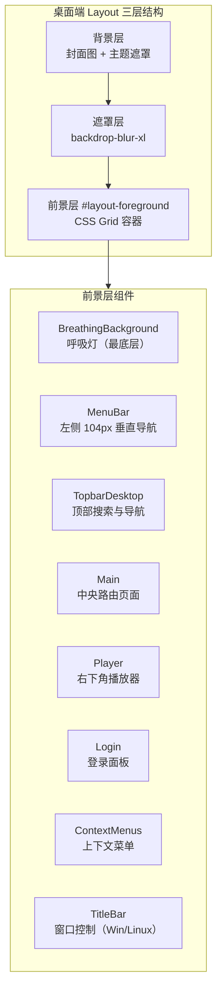
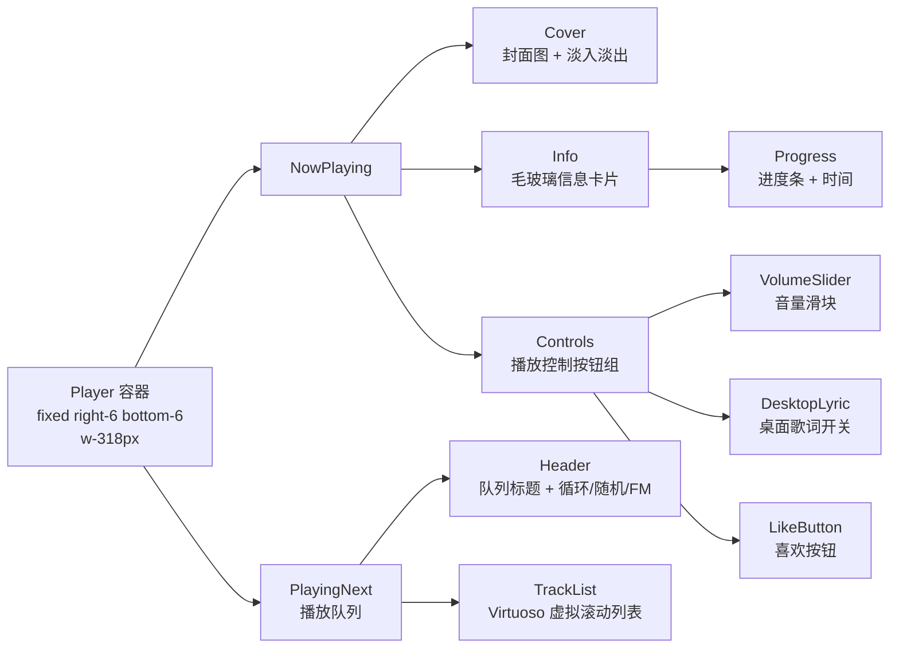
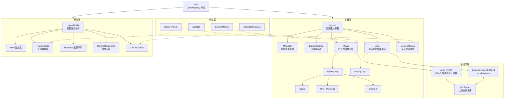

R3PLAYX 的 UI 层采用**桌面端/移动端双布局架构**，通过 `useIsMobile()` 在运行时切换整套组件树。桌面端以分层叠加（背景层 → 遮罩层 → 前景层）构建沉浸式视觉体验，移动端则采用底部固定的精简交互模式。整个 UI 体系围绕四个核心子系统展开：**布局容器**负责全局区域划分与层级编排，**播放器组件**承载音频控制与封面展示，**歌词页面**实现逐行高亮与自动滚动，**上下文菜单**提供类型驱动的右键交互。所有组件共享 Valtio 响应式状态驱动，并以 Framer Motion 动画库统一过渡效果。

Sources: [App.tsx](packages/web/App.tsx#L10-L25), [Layout.tsx](packages/web/components/Layout.tsx#L18-L125), [LayoutMobile.tsx](packages/web/components/LayoutMobile.tsx#L16-L87)

## 布局架构：桌面端分层与移动端固定底栏

布局系统的入口在 `App.tsx`，它根据 `useIsMobile()` 的检测结果条件渲染 `Layout`（桌面端）或 `LayoutMobile`（移动端），两者共享 `Router`、`Login`、`ContextMenus` 等全局组件，但在容器结构与交互模式上完全不同。

Sources: [App.tsx](packages/web/App.tsx#L13-L17)

### 桌面端三层叠加模型

桌面端 `Layout` 组件采用 **三层叠加** 策略构建视觉纵深：最底层是 `motion.div` 背景图层，将当前播放曲目的封面图 (`player.track?.al?.picUrl`) 以 `background-size: cover` 铺满全屏，配合主题色半透明遮罩；中间层是 `backdrop-blur-xl` 模糊遮罩层，确保文字可读性；最上层是前景层 `#layout-foreground`，承载所有交互组件。当 `showBackgroundImage` 设置关闭时，背景层回退为纯色；当 `enableBreathingEffect` 启用时，`BreathingBackground` 组件作为前景层最底层提供呼吸灯氛围光效。前景层内部按功能区域排布：左侧 `MenuBar`（104px 固定宽度）作为垂直导航栏，顶部 `TopbarDesktop` 覆盖导航按钮与搜索框，中央 `Main` 承载路由页面内容，右下角 `Player` 为播放器面板。Windows/Linux 平台还会额外渲染 `TitleBar` 提供窗口控制按钮。桌面端布局通过 CSS Grid 将这些区域组织在同一个 `h-screen` 容器内。

Sources: [Layout.tsx](packages/web/components/Layout.tsx#L24-L118)

### 移动端底部固定布局

移动端 `LayoutMobile` 的架构更为精简：主内容区 `#main` 占据全屏可滚动区域，底部固定一个容器同时承载迷你播放器 (`PlayerMobile`) 和底部导航栏 (`MenuBar`)。迷你播放器通过绝对定位浮于导航栏上方，利用 `safe-area-inset-bottom` 适配 iOS 刘海屏与 PWA 模式。移动端的"下一首播放"列表 (`PlayingNextMobile`) 以全屏拖拽面板的形式从底部滑出，使用 Framer Motion 的 `drag='y'` 手势控制，向下拖拽超过 150px 即关闭面板。

Sources: [LayoutMobile.tsx](packages/web/components/LayoutMobile.tsx#L30-L83), [PlayingNextMobile.tsx](packages/web/components/PlayingNextMobile.tsx#L18-L80)

### Main 区域的自适应边距

`Main` 组件根据播放器状态动态调整右侧边距：当播放器展开时，`margin-right` 为 382px（318px 播放器宽度 + 间距），为播放器面板留出空间；当播放器最小化或无曲目时，右侧边距缩减至 92px。切换过程通过 `useAnimation` 控制先淡出、再调整布局、最后淡入的动画序列实现平滑过渡。左侧始终保留 144px 为 `MenuBar` 让位。

Sources: [Main.tsx](packages/web/components/Main.tsx#L13-L55)

| 布局特征 | 桌面端 Layout | 移动端 LayoutMobile |
|---|---|---|
| 视觉分层 | 三层叠加（背景/遮罩/前景） | 单层 + 底部固定 |
| 导航位置 | 左侧垂直 MenuBar（104px） | 底部水平 MenuBar |
| 播放器形态 | 右下角固定面板 | 底栏内嵌迷你条 |
| 播放列表 | 侧面板 PlayingNext | 全屏拖拽面板 PlayingNextMobile |
| 窗口控制 | TitleBar（Win/Linux） | 无 |
| 背景效果 | 封面图 + 模糊 + 呼吸灯 | 无 |

Sources: [Layout.tsx](packages/web/components/Layout.tsx#L98-L118), [LayoutMobile.tsx](packages/web/components/LayoutMobile.tsx#L33-L67)

## 播放器组件体系

桌面端播放器由 `Player` 组件作为容器，内含 `NowPlaying`（封面+信息+控制）和 `PlayingNext`（播放队列）两个子模块。播放器支持**最小化模式**：当 `persistedUiStates.minimizePlayer` 为 `true` 时，封面和信息区隐藏，控制按钮垂直排列为紧凑侧栏，`Main` 区域自动扩展至全宽。

Sources: [Player.tsx](packages/web/components/Player.tsx#L9-L42)

### NowPlaying 子组件协作

`NowPlaying` 由四个职责明确的子组件构成，形成从视觉到控制的完整链路：

- **Cover**：使用 `valtio/utils` 的 `subscribeKey` 监听 `player.track` 变化，曲目切换时先将封面淡出（opacity→0），预加载新封面图片后在 `onload` 回调中淡入，避免加载过程中的视觉闪烁。封面可点击跳转到对应专辑页面。
- **Info**：叠加在封面底部的毛玻璃信息卡片（`bg-white/60 backdrop-blur-3xl dark:bg-black/70`），展示曲目名、`ArtistsInLine` 行内艺术家链接、以及进度条。
- **Progress**：基于自定义 `Slider` 组件实现，范围从 0 到曲目时长（秒），拖拽结束后才触发 `onChange`（`onlyCallOnChangeAfterDragEnded`），同时通过 `IpcChannels.SyncProgress` 将进度同步到 Electron 主进程。
- **Controls**：包含上一首/播放暂停/下一首、喜欢、最小化、音量滑块、桌面歌词开关、音频输出设备选择等按钮。最小化模式下，所有按钮通过 `animate={{ rotate: mini ? 90 : 0 }}` 旋转 90° 排列为竖列。

Sources: [NowPlaying.tsx](packages/web/components/NowPlaying/NowPlaying.tsx#L14-L49), [Cover.tsx](packages/web/components/NowPlaying/Cover.tsx#L11-L52), [Info.tsx](packages/web/components/NowPlaying/Info.tsx#L8-L37), [Progress.tsx](packages/web/components/NowPlaying/Progress.tsx#L7-L33), [Controls.tsx](packages/web/components/NowPlaying/Controls.tsx#L36-L157)

### PlayingNext 播放队列

`PlayingNext` 组件分为 `Header` 和 `TrackList` 两部分。`Header` 包含队列标题和三个功能按钮：**RepeatButton**（循环模式切换：关→开→单曲）、**ShuffleButton**（随机播放）、**FMButton**（私人 FM 模式），三者均使用 `useHoverLightSpot` Hook 实现鼠标悬停时的光斑跟随效果。`TrackList` 使用 `react-virtuoso` 的 `Virtuoso` 组件实现虚拟滚动，配合顶部和底部的 `mask-image` 渐变遮罩产生边缘淡出效果。每首曲目行 (`Track`) 可双击播放、右键打开上下文菜单，当前播放曲目前显示 `Wave` 动画组件。

Sources: [PlayingNext.tsx](packages/web/components/PlayingNext.tsx#L21-L261)

### 移动端 PlayerMobile

移动端播放器是一个紧凑的水平条，左侧显示封面缩略图（可点击跳转专辑），中间区域展示曲目名与艺术家，支持**水平拖拽切歌**（左滑下一首、右滑上一首，偏移阈值 100px），右侧依次排列喜欢按钮和播放/暂停按钮。播放器背景色通过 `useCoverColor` Hook 从封面图提取主色调并暗化处理，形成与封面协调的渐变底色。

Sources: [PlayerMobile.tsx](packages/web/components/PlayerMobile.tsx#L35-L172), [useCoverColor.ts](packages/web/hooks/useCoverColor.ts#L5-L17)

### Slider 通用滑块组件

`Slider` 是播放进度和音量控制的底层组件，采用原生 Pointer Events 实现拖拽交互，支持水平和垂直方向。关键设计点在于 `onlyCallOnChangeAfterDragEnded` 参数：当设为 `true` 时，拖拽过程中仅更新本地 `draggingValue` 状态用于视觉反馈，松手后才触发 `onChange` 回调——这避免了进度条拖拽时频繁 seek 导致的音频跳跃。Thumb 默认隐藏，仅在悬停或拖拽时显示。

Sources: [Slider.tsx](packages/web/components/Slider.tsx#L4-L154)

## 歌词系统

歌词系统包含两个独立页面：主应用内的 `Lyrics` 页面和桌面歌词窗口的 `LyricsDesktop` 页面。两者共享 `useLyric` Hook 和 `lyricParser` 工具函数，但在滚动行为和视觉效果上有显著差异。

Sources: [Lyrics.tsx](packages/web/pages/Lyrics/Lyrics.tsx#L17-L193), [LyricsDesktop.tsx](packages/web/pages/Lyrics/LyricsDesktop.tsx#L10-L134)

### LRC 歌词解析器

`lyricParser` 是歌词系统的数据处理核心，它将 LRC 格式文本解析为 `{ time, rawTime, content }` 对象数组。解析流程使用两个正则表达式：`extractLrcRegex` 提取每行的时间戳组和歌词内容，`extractTimestampRegex` 从时间戳组中提取分钟、秒、毫秒。解析器内置两项过滤逻辑：跳过"纯音乐，请欣赏"标记行，以及跳过作词/作曲/编曲等制作信息行。时间排序通过**二分查找插入**实现，确保歌词行始终按时间升序排列。

Sources: [lyric.ts](packages/web/utils/lyric.ts#L3-L87)

### 主歌词页面 Lyric

`Lyrics` 页面实现了完整的沉浸式歌词体验，核心机制包括：

- **逐行高亮**：通过遍历歌词数组，找到 `progress >= current.time && progress < next.time` 的行作为当前行，当前行以 1.1 倍缩放 + 全透明度 + 加粗字体突出，非当前行缩小至 0.95 倍并降低透明度。
- **模糊效果**：当 `persistedUiStates.lyricsBlur` 启用且鼠标未悬停时，非当前行应用 `blur(4px)` 模糊，悬停时临时取消模糊以便浏览上下文。
- **GSAP 自动滚动**：使用 GSAP 的 `ScrollToPlugin` 将当前行平滑滚动到容器垂直中心，动画时长 0.8 秒，缓动函数 `power2.out`。
- **用户滚动暂停**：监听 `wheel`/`touchstart`/`touchend` 事件，用户手动滚动时设置 `userScrollingRef` 标记为 `true` 并启动 3 秒定时器，定时器到期后恢复自动滚动。
- **翻译歌词**：逐行检查 `tlyrics` 数组中对应位置是否有翻译内容，有则在原文下方以较小字体显示。
- **双击跳转**：双击任意歌词行可跳转到该行对应的时间点播放。

Sources: [Lyrics.tsx](packages/web/pages/Lyrics/Lyrics.tsx#L33-L189)

### 桌面歌词窗口 LyricsDesktop

`LyricsDesktop` 是 Electron 桌面端独立歌词窗口的渲染页面，使用原生 `scrollIntoView({ behavior: 'smooth', block: 'center' })` 实现自动滚动（通过 `requestAnimationFrame` 延迟调用确保 DOM 更新完成）。与主歌词页不同，桌面歌词窗口使用居中对齐排版、`spring` 弹性动画变体（`bounce: 0.36`），当前行加粗并着色为主题强调色。窗口顶部集成了 `LyricsWindowTitleBar`，提供最小化、置顶（Pin）和关闭按钮，通过 IPC 通道控制 Electron 主进程的歌词窗口行为。

Sources: [LyricsDesktop.tsx](packages/web/pages/Lyrics/LyricsDesktop.tsx#L10-L134), [LyricsWindowTitleBar.tsx](packages/web/components/LyricsWindow/LyricsWindowTitleBar.tsx#L8-L77)

| 特性 | Lyrics（主页面） | LyricsDesktop（桌面窗口） |
|---|---|---|
| 滚动引擎 | GSAP ScrollToPlugin | 原生 scrollIntoView |
| 文本对齐 | 左对齐 | 居中对齐 |
| 当前行动画 | scale + opacity + blur | spring y偏移 |
| 模糊效果 | 支持（可配置） | 不支持 |
| 翻译歌词 | 支持 | 支持 |
| 用户滚动暂停 | 3 秒超时 | 无 |
| 窗口控制 | 无 | 独立标题栏（Pin/最小化/关闭） |

Sources: [Lyrics.tsx](packages/web/pages/Lyrics/Lyrics.tsx#L88-L189), [LyricsDesktop.tsx](packages/web/pages/Lyrics/LyricsDesktop.tsx#L39-L131)

## 上下文菜单系统

上下文菜单系统采用**状态驱动 + 类型分发**的架构模式：全局 Valtio 代理 `contextMenus` 持有当前菜单的状态（目标元素、光标位置、数据类型、数据 ID），三个类型专用菜单组件（`TrackContextMenu`、`AlbumContextMenu`、`ArtistContextMenu`）各自监听状态中的 `type` 字段，匹配时才渲染。

Sources: [contextMenus.ts](packages/web/states/contextMenus.ts#L1-L61), [ContextMenus.tsx](packages/web/components/ContextMenus/ContextMenus.tsx#L5-L17)

### 状态管理与打开/关闭机制

`openContextMenu` 函数接收右键事件对象、菜单类型、数据 ID 和选项参数，将事件目标以 `ref()` 包装存入状态（避免 Valtio 深度代理 DOM 节点），同时记录 `clientX/clientY` 作为光标位置。`closeContextMenu` 通过 `lodash-es/assign` 将状态重置为初始值。如果点击的目标与当前菜单目标相同，则视为切换操作直接关闭菜单。

Sources: [contextMenus.ts](packages/web/states/contextMenus.ts#L28-L61)

### BasicContextMenu 定位引擎

`BasicContextMenu` 是所有具体菜单的渲染基础，它通过 `react-use-measure` 先渲染一个不可见的 `MenuPanel`（位于 `x:99999, y:99999`）来测量菜单尺寸，然后根据定位策略计算实际位置：

- **光标定位模式** (`useCursorPosition`)：以右键点击坐标为基准，优先向右下方展开，空间不足时自动翻转到左侧或上方。
- **固定定位模式** (`fixedPosition`)：以目标元素边界为锚点，按 `top-left`/`top-right`/`bottom-left`/`bottom-right` 四个方位定位，偏移 8px 间距。
- **自动定位模式**（默认）：以目标元素底部为首选位置，同样支持四方向翻转。

菜单通过 `createPortal` 渲染到 `document.body`，确保不受父容器 `overflow: hidden` 或 `z-index` 的影响。`useClickAway` 监听菜单外部点击自动关闭，`useLockMainScroll` 在菜单打开期间锁定主内容区滚动。

Sources: [BasicContextMenu.tsx](packages/web/components/ContextMenus/BasicContextMenu.tsx#L10-L103)

### MenuPanel 与子菜单

`MenuPanel` 使用 Framer Motion 实现弹出动画（从 `scale: 0.96` 放大至 `1`，时长 0.1 秒），配合毛玻璃背景（`bg-white/90 backdrop-blur-3xl dark:bg-black/90`）。子菜单系统采用**双实例渲染**策略：第一个 `MenuPanel` 放置在屏幕外用于尺寸测量，第二个根据父级菜单项的 `DOMRect` 计算位置。子菜单定位同样支持四方向翻转，并通过 `transformOrigin` 确保缩放动画从正确方向展开。

Sources: [MenuPanel.tsx](packages/web/components/ContextMenus/MenuPanel.tsx#L21-L161)

### MenuItem 交互细节

`MenuItem` 根据 `ContextMenuItem.type` 渲染不同形态：`item` 为可点击菜单项，`divider` 为分隔线，`submenu` 为带右箭头的可展开项。子菜单的鼠标交互是 UX 难点——`MenuItem` 通过三个技巧确保鼠标从父项移动到子菜单时不会意外关闭：在菜单项右侧增加 24px 的隐形扩展区域、在右下角添加 12×12 的 45° 旋转三角形区域、以及 `onMouseLeave` 时检查 `relatedTarget` 是否属于 `.submenu` 类名。

Sources: [MenuItem.tsx](packages/web/components/ContextMenus/MenuItem.tsx#L6-L111), [types.ts](packages/web/components/ContextMenus/types.ts#L1-L13)

### 三种类型菜单的功能对比

Sources: [TrackContextMenu.tsx](packages/web/components/ContextMenus/TrackContextMenu.tsx#L54-L195), [AlbumContextMenu.tsx](packages/web/components/ContextMenus/AlbumContextMenu.tsx#L12-L88), [ArtistContextMenu.tsx](packages/web/components/ContextMenus/ArtistContextMenu.tsx#L11-L82)

| 菜单项 | TrackContextMenu | AlbumContextMenu | ArtistContextMenu |
|---|:---:|:---:|:---:|
| 播放 | ✅ | — | — |
| 添加到队列 | ✅ | ✅（播放整张专辑） | — |
| 从队列删除 | ✅ | — | — |
| 前往艺术家 | ✅ | — | — |
| 前往专辑 | ✅ | — | — |
| 添加到喜欢 | ✅ | — | — |
| 添加到播放列表 | ✅（子菜单） | — | — |
| 添加/移出资料库 | — | ✅ | — |
| 关注/取消关注 | — | — | ✅ |
| 复制网易云链接 | ✅ | ✅ | ✅ |
| 复制 R3PLAYX 链接 | ✅ | — | ✅ |
| 复制音频源链接 | ✅ | — | — |

## 辅助交互组件

### MenuBar 导航栏

桌面端 `MenuBar` 是一个固定在左侧 104px 宽度的垂直导航，包含四个 Tab 图标（MY MUSIC / DISCOVER / BROWSE / LYRICS），当前激活 Tab 以主题色高亮。底部通过 `writing-mode: vertical-rl` 竖排显示当前页面名称，切换时使用 `useAnimation` 实现淡入淡出。Tab 点击时触发 0.8 倍缩放弹性动画，并支持移动端 `navigator.vibrate` 触觉反馈。

Sources: [MenuBar.tsx](packages/web/components/MenuBar.tsx#L12-L166)

### Topbar 顶栏

`TopbarDesktop` 固定在顶部，左侧排列导航前进/后退按钮和搜索框，右侧排列主题切换、设置按钮和用户头像。其 `Background` 子组件根据页面路径和设置动态渲染背景：在专辑/艺术家/播放列表/歌词页启用毛玻璃背景，呼吸灯模式下完全移除顶栏背景以融入底层光晕。

Sources: [TopbarDesktop.tsx](packages/web/components/Topbar/TopbarDesktop.tsx#L15-L146)

### useHoverLightSpot 光斑跟随 Hook

播放队列按钮组使用的 `useHoverLightSpot` Hook 通过 `useMotionValue` 追踪鼠标位置，在按钮内部渲染一个 32px 的白色模糊圆形光斑，随鼠标移动而滑动，同时按钮本身产生微小的位移偏移（`buttonX/Y` 为鼠标距中心的 1/8），营造出类 macOS 的光照质感。

Sources: [useHoverLightSpot.tsx](packages/web/hooks/useHoverLightSpot.tsx#L5-L75)

## 架构关系总览

## 延伸阅读

- 播放器底层的音频引擎与播放控制逻辑，详见 [播放器核心：Howler.js 音频引擎与播放控制](14-bo-fang-qi-he-xin-howler-js-yin-pin-yin-qing-yu-bo-fang-kong-zhi)
- 播放队列中的虚拟滚动实现，详见 [虚拟滚动与图片预加载优化](17-xu-ni-gun-dong-yu-tu-pian-yu-jia-zai-you-hua)
- 呼吸灯背景与主题色系统，详见 [主题系统与动态背景效果](19-zhu-ti-xi-tong-yu-dong-tai-bei-jing-xiao-guo)
- 所有组件共享的响应式状态管理，详见 [状态管理架构：Valtio 响应式状态与持久化](13-zhuang-tai-guan-li-jia-gou-valtio-xiang-ying-shi-zhuang-tai-yu-chi-jiu-hua)
- 桌面歌词窗口的 IPC 通信机制，详见 [Electron 进程间通信（IPC）：通道定义与类型安全](7-electron-jin-cheng-jian-tong-xin-ipc-tong-dao-ding-yi-yu-lei-xing-an-quan)