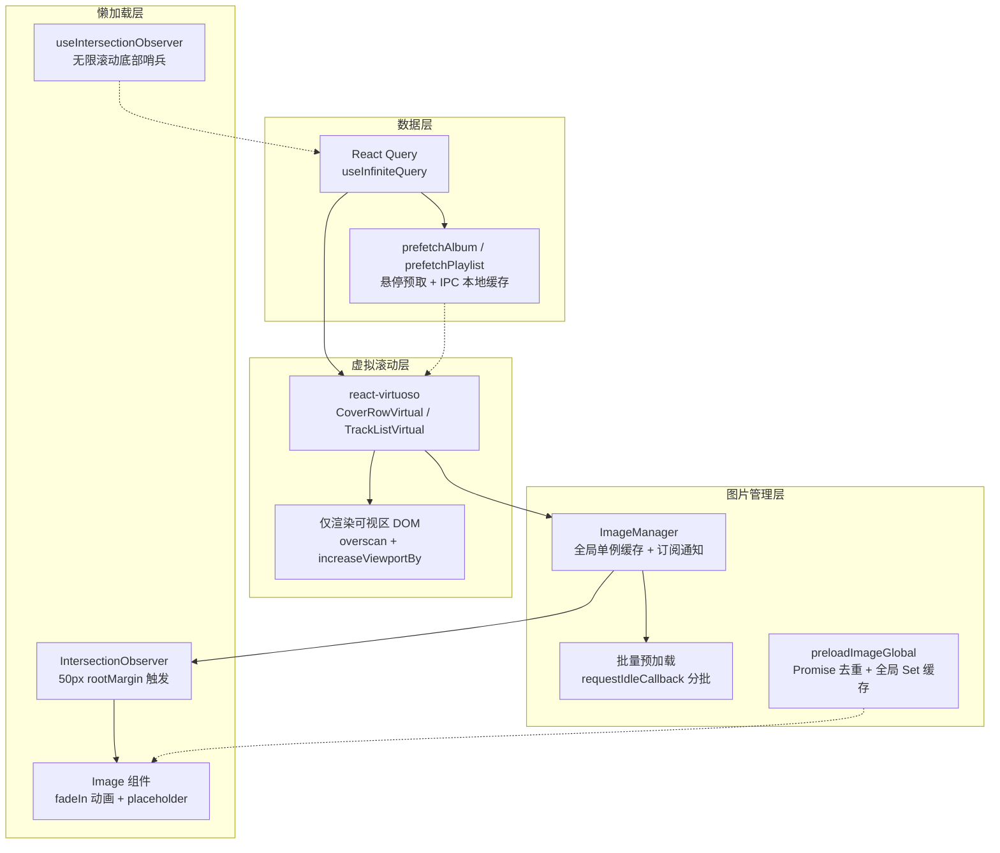
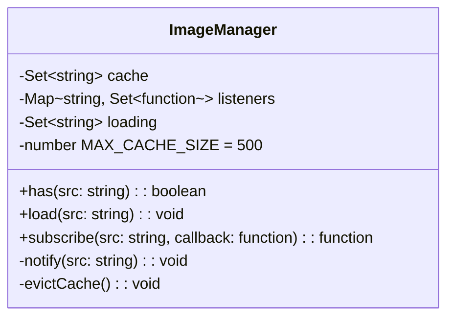

音乐播放器的核心体验之一是海量内容的流畅浏览——成百上千的封面、歌单和曲目列表需要在不卡顿的前提下即时呈现。R3PLAYX 围绕 **react-virtuoso 虚拟滚动**、**自定义图片管理器**、**IntersectionObserver 懒加载** 和 **React Query 数据预取** 四大支柱构建了一套分层渲染优化体系，确保无论是首页推荐列表还是搜索结果页，DOM 节点数量始终可控、图片加载时机精确、用户感知延迟最小化。

Sources: [CoverRowVirtual.tsx](packages/web/components/CoverRowVirtual.tsx#L1-L384), [TrackListVirtual.tsx](packages/web/components/TrackList/TrackListVirtual.tsx#L1-L174), [Image.tsx](packages/web/components/Image.tsx#L1-L217), [useIntersectionObserver.ts](packages/web/hooks/useIntersectionObserver.ts#L1-L45)

## 整体架构：四层优化流水线

内容从数据层到视觉层经过四道优化关卡，每一层都有独立的缓存与判断机制，避免了"单一瓶颈"问题：



**数据层**负责按需加载与悬停预取；**虚拟滚动层**控制 DOM 数量上限；**图片管理层**处理浏览器端图片解码缓存；**懒加载层**决定图片何时进入视口。四层协作使得即使列表包含数千项，实际 DOM 节点也始终维持在百级以内。

Sources: [CoverRowVirtual.tsx](packages/web/components/CoverRowVirtual.tsx#L1-L92), [Image.tsx](packages/web/components/Image.tsx#L7-L34), [useAlbum.ts](packages/web/api/hooks/useAlbum.ts#L50-L64), [usePlaylist.ts](packages/web/api/hooks/usePlaylist.ts#L109-L122)

## 虚拟滚动：react-virtuoso 的应用

### 两套组件的选择策略

项目为封面网格和曲目列表分别提供了**普通版**和**虚拟滚动版**两种实现，页面根据数据量大小选择合适的版本：

| 组件 | 普通版 | 虚拟滚动版 | 使用场景 |
|------|--------|-----------|---------|
| 封面网格 | `CoverRow` | `CoverRowVirtual` | 大数据量列表（Top、Hot、搜索） |
| 曲目列表 | `TrackList` | `TrackListVirtual` | 长列表页面（Playlist、Daily、Recent、Cloud、ArtistSongs） |

**选择原则**：当数据量可能超过屏幕可视区域两倍以上时，使用虚拟滚动版。例如专辑详情页的曲目通常在 10-20 首左右，使用普通 `TrackList` 即可；而歌单页面可能有数百首曲目，必须使用 `TrackListVirtual`。

Sources: [CoverRow.tsx](packages/web/components/CoverRow.tsx#L100-L139), [CoverRowVirtual.tsx](packages/web/components/CoverRowVirtual.tsx#L266-L381), [TrackList.tsx](packages/web/components/TrackList/TrackList.tsx#L183-L249), [TrackListVirtual.tsx](packages/web/components/TrackList/TrackListVirtual.tsx#L106-L173)

### CoverRowVirtual：网格虚拟化的关键配置

`CoverRowVirtual` 将封面数据按每行 4 个分组，然后将行数据交给 Virtuoso 进行虚拟化渲染。核心配置如下：

```typescript
// 将一维 items 按每行 4 个分组为二维 rows
const rows = useMemo(() => {
  return items.reduce((rows: Item[][], item: Item, index: number) => {
    const rowIndex = Math.floor(index / 4)
    if (rows.length < rowIndex + 1) {
      rows.push([item])
    } else {
      rows[rowIndex].push(item)
    }
    return rows
  }, [])
}, [items])
```

Virtuoso 的三个关键参数控制了渲染范围：

| 参数 | 值 | 作用 |
|------|----|------|
| `overscan` | `4800` (px) | 在可视区上下各额外渲染 4800px 的内容，防止快速滚动时出现白屏 |
| `defaultItemHeight` | `320` (px) | 初始高度估算值，帮助 Virtuoso 在首次渲染时计算滚动条 |
| `increaseViewportBy` | `{ top: 6400, bottom: 6400 }` | 扩大 Virtuoso 认为的"视口"范围，进一步提前渲染 |

`overscan` 和 `increaseViewportBy` 双重扩大策略确保即使在快速滑动时，用户也不会看到空白区域。`defaultItemHeight` 为 Virtuoso 提供初始估算，避免滚动条高度跳变。

Sources: [CoverRowVirtual.tsx](packages/web/components/CoverRowVirtual.tsx#L302-L379)

### TrackListVirtual：列表虚拟化的精简实现

`TrackListVirtual` 的实现更为直接——每一条曲目就是一个虚拟化单元，无需额外的行分组逻辑：

```typescript
<Virtuoso
  className='no-scrollbar'
  style={{ height: 'calc(100vh - 132px)' }}
  data={tracks}
  components={{ Header }}
  itemSize={el => el.getBoundingClientRect().height + 24}  // 动态测量 + 间距
  totalCount={tracks?.length}
  itemContent={(index) => (
    <Track
      key={tracks![index]?.id || 0}
      track={tracks![index] || undefined}
      index={index}
      playingTrackID={playingTrack?.id || 0}
      state={state}
      handleClick={handleClick}
    />
  )}
/>
```

注意 `itemSize` 回调函数：它通过 `getBoundingClientRect()` 动态测量每个已渲染项的实际高度，再加上 24px 的间距。这比固定高度估算更精确，使滚动条位置始终准确。代价是首次渲染时需要实际测量，但对于高度差异不大的列表项，Virtuoso 会自动缓存测量结果。

Sources: [TrackListVirtual.tsx](packages/web/components/TrackList/TrackListVirtual.tsx#L142-L167)

### 页面使用映射

虚拟滚动组件在项目中的分布如下：

| 页面 | 使用组件 | 数据特征 |
|------|---------|---------|
| Browse/Top | `CoverRowVirtual` | 无限滚动歌单，数百到数千项 |
| Browse/Hot | `CoverRowVirtual` | 无限滚动歌单，数百到数千项 |
| Browse/Recommend | `CoverRowVirtual` | 推荐歌单，中等数据量 |
| Search | `CoverRowVirtual` | 搜索结果歌单，数量不固定 |
| Playlist | `TrackListVirtual` | 歌单曲目，可能数百首 |
| My/Daily | `TrackListVirtual` | 每日推荐，约 30 首 |
| My/Recent | `TrackListVirtual` | 最近播放，可能很多 |
| My/Cloud | `TrackListVirtual` | 云盘曲目，可能很多 |
| Artist/ArtistSongs | `TrackListVirtual` | 歌手热门歌曲，可能很多 |
| Album | `TrackList`（普通版） | 专辑曲目，通常 10-20 首 |
| My/Collections | `CoverRow`（普通版） | 收藏的专辑/歌单，中等数量 |

Sources: [Top.tsx](packages/web/pages/Browse/Top.tsx#L1-L111), [Hot.tsx](packages/web/pages/Browse/Hot.tsx#L1-L106), [Recommend.tsx](packages/web/pages/Browse/Recommend.tsx#L4-L51), [Search.tsx](packages/web/pages/Search/Search.tsx#L12-L288), [Playlist.tsx](packages/web/pages/Playlist/Playlist.tsx#L3-L27), [Daily.tsx](packages/web/pages/My/Daily.tsx#L8), [Recent.tsx](packages/web/pages/My/Recent.tsx#L5), [Cloud.tsx](packages/web/pages/My/Cloud.tsx#L5), [ArtistSongs.tsx](packages/web/pages/Artist/ArtistSongs.tsx#L5), [Album.tsx](packages/web/pages/Album/Album.tsx#L5), [Collections.tsx](packages/web/pages/My/Collections.tsx#L5)

## 图片预加载：ImageManager 全局管理器

### 设计动机

虚拟滚动带来了一个特殊问题：**节点复用导致图片闪烁**。当 Virtuoso 回收一个 DOM 节点并赋予新的 `src` 时，浏览器需要重新下载和解码图片，即使该图片之前已经显示过。为解决这个问题，`CoverRowVirtual` 内部实现了一个 `ImageManager` 类，充当浏览器端的图片缓存协调器。

Sources: [CoverRowVirtual.tsx](packages/web/components/CoverRowVirtual.tsx#L23-L92)

### ImageManager 类结构



三个核心集合分工明确：

| 集合 | 类型 | 职责 |
|------|------|------|
| `cache` | `Set<string>` | 已完成加载的图片 URL 集合，快速判断是否命中缓存 |
| `loading` | `Set<string>` | 正在加载中的 URL，防止重复发起请求 |
| `listeners` | `Map<string, Set<callback>>` | 等待特定图片加载完成的回调订阅，实现发布-订阅通知 |

`ImageManager` 的工作流程如下：当 `CoverItem` 组件挂载或 `imageUrl` 变化时，首先检查 `cache.has(imageUrl)`——若命中，直接设置 `imageLoaded=true` 渲染图片；若未命中，调用 `imageManager.subscribe()` 注册回调并调用 `imageManager.load()` 触发加载。加载完成后，`onload` 回调将 URL 加入 `cache`，并通过 `notify()` 唤醒所有订阅者，订阅者随后更新 React 状态触发重渲染。

Sources: [CoverRowVirtual.tsx](packages/web/components/CoverRowVirtual.tsx#L24-L92)

### LRU 式缓存淘汰

当缓存大小达到 `MAX_CACHE_SIZE`（500）时，`load()` 方法会执行淘汰：

```typescript
if (this.cache.size >= this.MAX_CACHE_SIZE) {
  const entriesToDelete = Math.floor(this.MAX_CACHE_SIZE * 0.1) // 淘汰 10% = 50 条
  let deleted = 0
  for (const url of this.cache) {
    if (deleted >= entriesToDelete) break
    this.cache.delete(url)
    deleted++
  }
}
```

这种"达到上限时批量淘汰 10%"的策略是一种简化的 LRU——它按 `Set` 的插入顺序删除最早的条目。虽然不如真正的 LRU 精确（`Set` 迭代顺序是插入顺序而非访问顺序），但在实践中足以满足封面图片的访问模式：用户通常在局部范围内来回浏览，早期加载的图片很少被再次访问。

Sources: [CoverRowVirtual.tsx](packages/web/components/CoverRowVirtual.tsx#L37-L45)

### CoverItem 组件的图片状态管理

`CoverItem` 是虚拟滚动中的单个封面项，它通过与 `ImageManager` 的交互实现了**零闪烁**体验：

```typescript
const CoverItem = memo(({ item, goTo, prefetch, showTrackListName }) => {
  const imageUrl = useMemo(() => getImageUrl(item), [item])
  const [imageLoaded, setImageLoaded] = useState(() => imageManager.has(imageUrl))

  // Virtuoso 节点复用时重置状态
  useEffect(() => {
    setImageLoaded(imageManager.has(imageUrl))
  }, [imageUrl])

  // 订阅加载完成通知
  useEffect(() => {
    if (imageManager.has(imageUrl)) {
      if (!imageLoaded) setImageLoaded(true)
      return
    }
    const unsubscribe = imageManager.subscribe(imageUrl, () => setImageLoaded(true))
    imageManager.load(imageUrl)
    return () => unsubscribe()
  }, [imageUrl])

  return (
    
  )
})
```

关键设计点：`useState` 的初始值通过 `imageManager.has()` 同步判断，如果图片已缓存则直接显示，避免了先显示空白再闪烁出现的问题。`useEffect` 中的订阅-加载模式确保了即使多个组件同时请求同一张图片，也只会发起一次网络请求。

Sources: [CoverRowVirtual.tsx](packages/web/components/CoverRowVirtual.tsx#L205-L264)

### requestIdleCallback 分批预加载

`CoverRowVirtual` 在组件挂载时会主动预加载前 80 项图片，但不会一次性全部发起请求：

```typescript
useEffect(() => {
  if (items.length === 0) return
  const urlsToLoad = items.slice(0, 80).map(getImageUrl)
  let index = 0
  const batchSize = 12

  const loadBatch = () => {
    const batch = urlsToLoad.slice(index, index + batchSize)
    batch.forEach(url => imageManager.load(url))
    index += batchSize
    if (index < urlsToLoad.length) {
      requestIdleCallback ? requestIdleCallback(loadBatch) : setTimeout(loadBatch, 0)
    }
  }
  loadBatch()
}, [items])
```

每批加载 12 张图片，批间通过 `requestIdleCallback` 调度，确保图片加载不会阻塞主线程的用户交互。当浏览器空闲时自动执行下一批；若不支持 `requestIdleCallback`（如部分旧版浏览器），退化为 `setTimeout(loadBatch, 0)`。这种策略在首屏渲染速度和资源竞争之间取得了平衡。

Sources: [CoverRowVirtual.tsx](packages/web/components/CoverRowVirtual.tsx#L315-L335)

## Image 组件：桌面端与移动端的双轨实现

### 组件分流架构

`Image` 组件根据设备类型选择不同的渲染策略：桌面端使用 `framer-motion` 动画 + IntersectionObserver 懒加载 + 全局预加载缓存；移动端使用原生 `loading='lazy'` 属性，精简到极致。

```typescript
const Image = (props: Props) => {
  const isMobile = useIsMobile()
  return isMobile ? <ImageMobile {...props} /> : <ImageDesktop {...props} />
}
```

Sources: [Image.tsx](packages/web/components/Image.tsx#L211-L216)

### 桌面端 ImageDesktop：三阶段渲染

`ImageDesktop` 的渲染过程分为三个阶段：

**阶段一：IntersectionObserver 判断可见性**

```typescript
useEffect(() => {
  if (!lazyLoad || !src) { setInView(true); return }
  const observer = new IntersectionObserver(
    (entries) => {
      entries.forEach((entry) => {
        if (entry.isIntersecting) {
          setInView(true)
          observer.disconnect()  // 一次性观察
        }
      })
    },
    { rootMargin: '50px' }  // 提前 50px 触发
  )
  if (containerRef.current) observer.observe(containerRef.current)
  return () => observer.disconnect()
}, [lazyLoad, src])
```

`rootMargin: '50px'` 让图片在距离视口 50px 时就开始加载，用户滚动到时图片大概率已就绪。观察器在触发一次后立即 `disconnect()`，避免持续监听造成的性能开销。

Sources: [Image.tsx](packages/web/components/Image.tsx#L72-L98)

**阶段二：全局预加载缓存**

```typescript
const globalImageCache = new Set<string>()
const loadingImages = new Map<string, Promise<void>>()

const preloadImageGlobal = (src: string) => {
  if (!src || globalImageCache.has(src)) return
  if (loadingImages.has(src)) return  // 正在加载中，不重复请求
  const loadPromise = new Promise<void>((resolve, reject) => {
    const img = document.createElement('img')
    img.onload = () => { globalImageCache.add(src); loadingImages.delete(src); resolve() }
    img.onerror = () => { loadingImages.delete(src); reject() }
    img.src = src
  })
  loadingImages.set(src, loadPromise)
}
```

与 `ImageManager` 类似，`preloadImageGlobal` 也采用了"缓存 + 去重"策略，但实现方式不同——它用 `Map<string, Promise>` 跟踪正在加载的图片，利用 Promise 的单次性天然去重。任何组件对同一 URL 的并发请求都只会产生一次网络请求。

Sources: [Image.tsx](packages/web/components/Image.tsx#L7-L34)

**阶段三：framer-motion 渐入动画**

```typescript
const onLoad = () => {
  setLoaded(true)
  if (isAnimate) {
    animate.start({ opacity: 1 })
    placeholderAnimate.start({ opacity: 0 })
  }
}
```

图片加载完成后，通过 `framer-motion` 的 `useAnimation()` 控制 opacity 从 0 渐变到 1，同时 placeholder 渐变到 0，形成平滑的淡入效果。动画时长从原先的 0.6s 优化到 0.3s，减少用户感知等待。

Sources: [Image.tsx](packages/web/components/Image.tsx#L111-L138)

### 移动端 ImageMobile：原生懒加载

移动端完全跳过 IntersectionObserver 和动画，直接使用浏览器原生懒加载：

```typescript

```

`loading='lazy'` 由浏览器引擎直接控制加载时机，无需 JavaScript 开销。`decoding='async'` 允许浏览器在单独的线程中解码图片，避免阻塞主线程。`fetchPriority` 属性（支持 `'high' | 'auto' | 'low'`）让开发者可以提示浏览器该图片的加载优先级。

Sources: [Image.tsx](packages/web/components/Image.tsx#L184-L209)

### 两种图片缓存机制对比

| 特性 | ImageManager（CoverRowVirtual 内） | preloadImageGlobal（Image.tsx 内） |
|------|-------------------------------------|-------------------------------------|
| 缓存结构 | `Set<string>` + `Map<string, Set<cb>>` | `Set<string>` + `Map<string, Promise>` |
| 通知机制 | 发布-订阅，支持多个监听者 | Promise 单次 resolve |
| 缓存淘汰 | LRU 式（500 上限淘汰 10%） | 无淘汰，页面生命周期内持续增长 |
| 去重方式 | `loading` Set 检查 | `loadingImages` Map 检查 |
| 适用场景 | 虚拟滚动中的高频复用节点 | 通用图片组件的跨组件缓存 |
| 状态同步 | 回调驱动 React setState | 隐式（浏览器内存缓存） |

两套缓存虽然看似冗余，但服务于不同的场景：`ImageManager` 需要在虚拟滚动节点复用时精确控制 React 状态更新，因此需要订阅-通知机制；`preloadImageGlobal` 只需确保同一 URL 不重复请求，Promise 去重已足够。

Sources: [CoverRowVirtual.tsx](packages/web/components/CoverRowVirtual.tsx#L24-L92), [Image.tsx](packages/web/components/Image.tsx#L7-L34)

## 图片尺寸优化：resizeImage 服务端裁剪

所有图片 URL 在传入组件前都经过 `resizeImage()` 函数处理，利用网易云音乐和 Apple Music CDN 的服务端裁剪能力，按需请求合适尺寸的图片：

```typescript
export function resizeImage(url: string, size: 'xxs' | 'ms' | 'xs' | 'sm' | 'md' | 'lg'): string {
  const sizeMap = { xxs: '32', ms: '64', xs: '128', sm: '256', md: '512', lg: '1024' }
  // Apple Music CDN
  if (url.includes('mzstatic.com')) {
    return url.replace('{w}', sizeMap[size]).replace('{h}', sizeMap[size])
  }
  // 网易云音乐 CDN
  return `${url}?param=${sizeMap[size]}y${sizeMap[size]}`
    .replace(/http(s?):\/\/p\d.music.126.net/, 'https://p1.music.126.net')
}
```

不同组件根据显示尺寸选择不同的规格：

| 使用场景 | 尺寸参数 | 实际像素 | 传输节省（对比 lg） |
|----------|---------|---------|-------------------|
| 歌手头像（搜索结果） | `xs` | 128×128 | ~98% |
| Track 列表封面 | `sm` | 256×256 | ~94% |
| 封面网格默认 | `md` | 512×512 | ~75% |
| ArtworkViewer 全屏查看 | `lg` | 1024×1024 | 基准 |
| 封面颜色提取 | `xs` | 128×128 | ~98% |

`CoverWall` 组件更进一步，根据屏幕断点动态选择尺寸：

```typescript
const sizes = {
  small: { sm: 'sm', md: 'sm', lg: 'sm', xl: 'sm', '2xl': 'md' },
  large: { sm: 'md', md: 'md', lg: 'md', xl: 'md', '2xl': 'lg' },
}
// 使用：resizeImage(album.coverUrl, sizes[album.large ? 'large' : 'small'][breakpoint])
```

这种策略确保在小屏幕上不会下载大图浪费带宽，在大屏幕上又不会因图片过小而模糊。

Sources: [common.ts](packages/web/utils/common.ts#L14-L35), [CoverWall.tsx](packages/web/components/CoverWall.tsx#L9-L24), [CoverRowVirtual.tsx](packages/web/components/CoverRowVirtual.tsx#L96-L99), [Track.tsx](packages/web/components/TrackList/Track.tsx#L40)

## 无限滚动：IntersectionObserver + useInfiniteQuery

### 底部哨兵机制

Browse/Top 和 Browse/Hot 页面使用 `useIntersectionObserver` Hook 作为无限滚动的触发器。该 Hook 的核心参数为 `threshold: 0.1` 和 `rootMargin: '0px 0px 200px 0px'`——底部 200px 的扩展意味着用户还没滚到最底部时就开始加载下一页，减少了等待感知。

```typescript
// useIntersectionObserver Hook
const observer = new IntersectionObserver(
  ([entry]) => {
    if (timerRef.current) clearTimeout(timerRef.current)
    timerRef.current = setTimeout(() => {
      setOnScreen(entry.isIntersecting)
    }, 100)  // 100ms 防抖
  },
  { threshold: 0.1, rootMargin: '0px 0px 200px 0px' }
)
```

100ms 的 `setTimeout` 防抖避免了快速滚动时的多次触发。`InfiniteScrollFooter` 组件将一个 1px 高的 `div` 作为观察目标，当它进入视口时调用 `fetchNextPage()`。

Sources: [useIntersectionObserver.ts](packages/web/hooks/useIntersectionObserver.ts#L1-L45), [Top.tsx](packages/web/pages/Browse/Top.tsx#L8-L35), [Hot.tsx](packages/web/pages/Browse/Hot.tsx#L8-L35)

### TanStack React Query 分页集成

Top 和 Hot 页面使用 `useInfiniteQuery` 实现分页数据管理，与虚拟滚动的结合方式如下：

```typescript
const { data, fetchNextPage, hasNextPage, isFetchingNextPage } = useInfiniteQuery(
  ['topPlaylist', cat],
  async ({ pageParam = 1 }) => {
    const resp = await fetchTopPlaylist({ cat, limit: 40, offset: (pageParam - 1) * 40 || 0 })
    return { playlists: resp.playlists, hasMore: resp.more }
  },
  {
    getNextPageParam: (lastPage, pages) => lastPage.hasMore ? pages.length + 1 : undefined,
    refetchOnWindowFocus: false,
    refetchInterval: 1000 * 60 * 60,  // 1 小时后重新验证
  }
)

// 将多页数据扁平化为单一数组传递给 CoverRowVirtual
const dataSource = data?.pages.flatMap(page => page.playlists) || []
```

每次 `fetchNextPage()` 被触发后，新页数据通过 `flatMap` 合并到 `dataSource` 中，`CoverRowVirtual` 接收到新数据后自动更新虚拟列表。Virtuoso 会智能地保留当前滚动位置，不会因为数据追加而跳动。

Sources: [Top.tsx](packages/web/pages/Browse/Top.tsx#L37-L70), [Hot.tsx](packages/web/pages/Browse/Hot.tsx#L37-L66)

## 数据预取：悬停即加载

### React Query prefetch 策略

封面组件在用户鼠标悬停时会触发数据预取，将详情页数据提前加载到 React Query 缓存中：

```typescript
// CoverItem 组件
<div onMouseOver={() => prefetch(item.id)}>
  ...
</div>

// prefetch 实现（以 Album 为例）
export async function prefetchAlbum(params: FetchAlbumParams) {
  if (await fetchFromCache(params)) return  // IPC 本地缓存优先
  await reactQueryClient.prefetchQuery(
    [AlbumApiNames.FetchAlbum, params],
    () => fetch(params),
    { staleTime: Infinity }
  )
}
```

预取的优先级链为：**IPC 本地缓存 → 网络请求**。桌面端通过 `window.ipcRenderer.invoke(IpcChannels.GetApiCache, ...)` 查询 SQLite 缓存（详见[桌面端 SQLite 数据库：better-sqlite3 缓存与迁移](10-zhuo-mian-duan-sqlite-shu-ju-ku-better-sqlite3-huan-cun-yu-qian-yi)），若命中则跳过网络请求。`staleTime: Infinity` 确保预取的数据不会因为时间过期而被自动清理。

Sources: [useAlbum.ts](packages/web/api/hooks/useAlbum.ts#L50-L64), [usePlaylist.ts](packages/web/api/hooks/usePlaylist.ts#L109-L122), [CoverRowVirtual.tsx](packages/web/components/CoverRowVirtual.tsx#L240)

### 普通版 CoverRow 的预取

普通版 `CoverRow` 组件同样支持悬停预取，但通过 `Image` 组件的 `onMouseOver` 事件实现：

```typescript
<Image
  onClick={goTo}
  src={resizeImage(album?.picUrl || '', 'md')}
  className='aspect-square rounded-24'
  onMouseOver={prefetch}  // 悬停时预取 Album 详情
/>
```

两种版本在预取逻辑上完全一致，区别仅在于触发事件的宿主元素不同。

Sources: [CoverRow.tsx](packages/web/components/CoverRow.tsx#L27-L29), [CoverRow.tsx](packages/web/components/CoverRow.tsx#L75-L79)

## 滚动位置恢复

### ScrollRestoration 组件

`ScrollRestoration` 组件在全局范围内监听 `<main>` 元素的滚动事件，以 200ms 节流将滚动位置存储到 `scrollPositions` 状态管理对象中：

```typescript
const handleScroll = throttle(() => {
  scrollPositions.set(window.location.pathname, main?.scrollTop ?? 0)
}, 200)
```

当用户从列表页导航到详情页再返回时，页面组件会从 `scrollPositions.get(pathname)` 读取之前的位置并恢复。

Sources: [ScrollRestoration.tsx](packages/web/components/ScrollRestoration.tsx#L1-L21)

### 嵌套路由的位置管理

`ScrollPositions` 类对嵌套路由（如 `/artist/:id`、`/album/:id`）做了特殊处理：它按一级路径分组存储位置，每个分组最多保留 10 条记录，超出时淘汰最早的：

```typescript
class ScrollPositions {
  private _nestedPaths = ['/artist', '/album', '/playlist', '/search']
  private _positions: Record<string, { path: string; top: number }[]> = {}
  private _generalPositions: Record<string, number> = {}

  get(pathname: string) {
    const nestedPath = `/${pathname.split('/')[1]}`
    if (this._nestedPaths.includes(nestedPath)) {
      return this._positions?.[nestedPath]?.find(({ path }) => path === restPath)?.top
    }
    return this._generalPositions?.[pathname]
  }
}
```

普通路径（如首页 `/browse`）直接用 pathname 作为 key 存储单个位置值；嵌套路径（如 `/artist/12345`）则按一级路径分组，支持同时记住多个不同歌手页面的滚动位置。当某个分组超过 10 条记录时，`shift()` 移除最早的条目。

Sources: [scrollPositions.ts](packages/web/states/scrollPositions.ts#L1-L55)

## 性能优化策略总结

| 优化维度 | 策略 | 效果 |
|----------|------|------|
| DOM 数量 | react-virtuoso 虚拟滚动 | 千项列表 DOM 数量降至 ~50 |
| 图片请求 | 服务端裁剪 + 按需尺寸 | 单图带宽节省 75%-98% |
| 图片闪烁 | ImageManager 缓存 + 订阅通知 | 节点复用时零闪烁 |
| 首屏加载 | requestIdleCallback 分批预加载 | 不阻塞首屏交互 |
| 视口外图片 | IntersectionObserver 懒加载 | 仅加载可视区 + 50px 缓冲 |
| 重复请求 | Set/Map 去重 + Promise 去重 | 同一 URL 仅一次网络请求 |
| 页面切换 | 悬停预取 + IPC 缓存优先 | 点击详情页时数据已就绪 |
| 滚动体验 | overscan + increaseViewportBy | 快速滚动无白屏 |
| 滚动恢复 | 节流位置记录 + 嵌套路由分组 | 返回列表时恢复浏览位置 |
| 移动端适配 | 原生 lazy + async 解码 | 零 JS 开销的懒加载 |

Sources: [CoverRowVirtual.tsx](packages/web/components/CoverRowVirtual.tsx#L1-L384), [TrackListVirtual.tsx](packages/web/components/TrackList/TrackListVirtual.tsx#L1-L174), [Image.tsx](packages/web/components/Image.tsx#L1-L217), [common.ts](packages/web/utils/common.ts#L14-L35)

## 相关阅读

- [API 数据层：TanStack React Query 与请求缓存](15-api-shu-ju-ceng-tanstack-react-query-yu-qing-qiu-huan-cun) — 理解 `useInfiniteQuery` 和 `prefetchQuery` 的全局配置
- [桌面端 SQLite 数据库：better-sqlite3 缓存与迁移](10-zhuo-mian-duan-sqlite-shu-ju-ku-better-sqlite3-huan-cun-yu-qian-yi) — 理解 `fetchFromCache` 的 IPC 通道与本地缓存机制
- [状态管理架构：Valtio 响应式状态与持久化](13-zhuang-tai-guan-li-jia-gou-valtio-xiang-ying-shi-zhuang-tai-yu-chi-jiu-hua) — 理解 `scrollPositions` 的响应式状态管理
- [UI 组件体系：布局、播放器、歌词与上下文菜单](16-ui-zu-jian-ti-xi-bu-ju-bo-fang-qi-ge-ci-yu-shang-xia-wen-cai-dan) — 理解 `CoverRow`、`TrackList` 等组件在页面布局中的角色