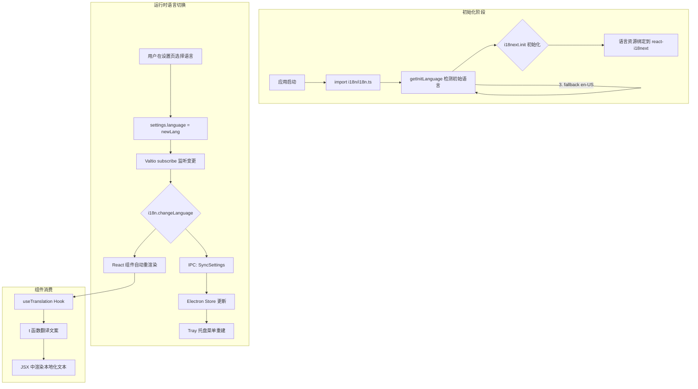
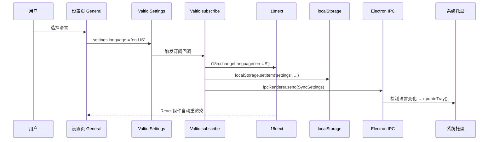

R3PLAYX 的国际化体系建立在 **i18next + react-i18next** 这对黄金搭档之上，采用静态 JSON 翻译资源 + Valtio 状态驱动语言切换的架构。当前支持中文（zh-CN）和英文（en-US）两种语言，翻译键按功能域划分，覆盖了从设置面板、上下文菜单到播放器控件的全部 UI 文案。本文将逐层拆解 i18n 的初始化流程、语言检测策略、翻译资源组织、组件中的使用模式，以及桌面端 Electron 主进程的适配方案。

Sources: [i18n.ts](packages/web/i18n/i18n.ts#L1-L54), [zh-cn.json](packages/web/i18n/locales/zh-cn.json#L1-L163), [en-us.json](packages/web/i18n/locales/en-us.json#L1-L164)

## 架构总览

在深入每个模块之前，先从全局视角理解 i18n 的数据流向——从用户触发语言切换到 UI 实际响应，中间经过了 Valtio 状态订阅、i18next 引擎切换、以及桌面端 IPC 同步三个关键环节。



Sources: [i18n.ts](packages/web/i18n/i18n.ts#L19-L37), [settings.ts](packages/web/states/settings.ts#L74-L81)

## 核心初始化：i18next 配置

i18n 的初始化集中在 [i18n.ts](packages/web/i18n/i18n.ts) 文件中，它作为应用入口的副作用模块被导入——在 [main.tsx](packages/web/main.tsx#L24) 中通过 `import './i18n/i18n'` 执行，无需显式调用。这种"导入即初始化"的模式确保了在任何组件渲染之前，i18next 引擎已经就绪。

**初始化配置的关键参数**：

| 配置项 | 值 | 说明 |
|--------|------|------|
| `returnNull` | `false` | 键缺失时返回键名字符串而非 null，避免渲染异常 |
| `resources` | 内联导入 JSON | 静态打包翻译资源，无异步加载延迟 |
| `lng` | `getInitLanguage()` | 动态检测初始语言 |
| `fallbackLng` | `'en-US'` | 翻译缺失时的兜底语言 |
| `supportedLngs` | `['zh-CN', 'en-US']` | 限定支持的语言列表 |
| `interpolation.escapeValue` | `false` | React 已内置 XSS 防护，无需 i18next 重复转义 |

Sources: [i18n.ts](packages/web/i18n/i18n.ts#L39-L53)

### TypeScript 类型安全增强

通过 `declare module 'react-i18next'` 的模块增强（Module Augmentation），项目为 `useTranslation` 的返回值注入了精确的类型定义。`CustomTypeOptions` 中指定了 `resources` 的结构以英文翻译文件的类型为基准，这使得 `t` 函数在 IDE 中具备完整的键名自动补全和类型检查能力。值得注意的是，中文翻译资源的类型同样引用 `typeof enUS`——这意味着两种语言的翻译文件必须保持结构一致，任何键的增删都会在编译期被捕获。

Sources: [i18n.ts](packages/web/i18n/i18n.ts#L9-L17)

## 语言检测策略：三级回退机制

`getInitLanguage()` 函数实现了一个**三级回退**的语言检测链，优先级从高到低：

1. **用户设置**：从 `localStorage` 中读取 `settings` 对象的 `language` 字段，若其值属于 `supportedLanguages` 则直接采用。这确保了用户选择的语言在刷新页面后依然生效。
2. **浏览器语言**：通过 `navigator.language.startsWith('zh-')` 检测，若浏览器语言为中文变体（zh-CN、zh-TW 等），则默认使用中文界面。
3. **兜底英文**：以上两种方式均未命中时，返回 `'en-US'` 作为最终兜底。

Sources: [i18n.ts](packages/web/i18n/i18n.ts#L19-L37)

## 翻译资源组织

翻译资源以 JSON 文件形式存放在 `packages/web/i18n/locales/` 目录下，当前包含两个文件：

| 文件 | 语言 | 键数量（约） |
|------|------|-------------|
| [zh-cn.json](packages/web/i18n/locales/zh-cn.json) | 简体中文 | ~100+ |
| [en-us.json](packages/web/i18n/locales/en-us.json) | 英文（美国） | ~100+ |

### 按功能域划分的命名空间

翻译键采用**点分隔的扁平层级结构**，顶层键按功能域划分，而非使用 i18next 的命名空间（namespace）机制。这种设计简化了配置，同时通过键名的层级前缀保持了语义清晰度。

| 功能域 | 覆盖范围 | 典型键示例 |
|--------|---------|-----------|
| `common` | 通用术语、桌面端功能标签 | `common.recent`、`common.lyricsBlur` |
| `navigation` | 导航操作 | `navigation.goBack`、`navigation.goForward` |
| `auth` | 登录/登出相关 | `auth.login`、`auth.scan-qr-code` |
| `player` | 播放器控件 | `player.play`、`player.enable-shuffle` |
| `toasts` | 操作反馈提示 | `toasts.copied`、`toasts.added-to-playlist` |
| `search` | 搜索功能 | `search.search` |
| `my` | 个人中心 | `my.xxxs-liked-tracks`、`my.playNow` |
| `settings` | 设置页面（含嵌套子域） | `settings.theme`、`settings.keyboard-shortcuts.title` |
| `context-menu` | 右键上下文菜单 | `context-menu.play`、`context-menu.add-to-queue` |
| `artist` | 艺人页面 | `artist.popular`、`artist.latest-releases` |
| `coverrow` | 封面行组件 | `coverrow.songs`、`coverrow.plays` |

Sources: [zh-cn.json](packages/web/i18n/locales/zh-cn.json#L1-L163)

### 复数形式处理

i18next 的复数功能通过 `_one` / `_other` 后缀键实现，配合 `{{count}}` 插值变量工作。项目在 `common` 域中定义了四组复数键：

```json
{
  "album_one": "Album",
  "album_other": "Albums",
  "album-with-count_one": "{{count}} Album",
  "album-with-count_other": "{{count}} Albums",
  "track_one": "Track",
  "track_other": "Tracks",
  "track-with-count_other": "{{count}} Tracks",
  "track-with-count_one": "{{count}} Track"
}
```

中文翻译中 `_one` 和 `_other` 的值相同（如 `"专辑"` / `"专辑"`），因为中文不区分单复数形式；而英文则正确区分了 `"Album"` / `"Albums"`。这种设计使得组件代码无需关心当前语言的复数规则，统一使用 `t('common.album', { count })` 即可。

Sources: [en-us.json](packages/web/i18n/locales/en-us.json#L4-L14), [zh-cn.json](packages/web/i18n/locales/zh-cn.json#L4-L16)

### 嵌套结构：设置页快捷键子域

`settings.keyboard-shortcuts` 是翻译资源中唯一使用了两层嵌套的子域，包含 10 个翻译键，覆盖快捷键绑定的全部 UI 文案。这种嵌套组织方式将逻辑上紧密相关的翻译键聚合在一起，避免了 `settings` 顶级域的过度膨胀。

Sources: [zh-cn.json](packages/web/i18n/locales/zh-cn.json#L116-L131), [en-us.json](packages/web/i18n/locales/en-us.json#L116-L131)

## 组件中的使用模式

### 模式一：useTranslation Hook + 模板字面量（主流模式）

绝大多数 React 组件采用 `useTranslation()` Hook 获取 `t` 函数，并通过**模板字面量语法** `t\`key\`` 直接作为 JSX 子元素使用。这是项目中最普遍的模式，约占全部 i18n 调用的 80% 以上。

```tsx
// 典型用法：模板字面量作为 JSX 子元素
const { t } = useTranslation()
return <div>{t`settings.theme`}</div>
```

此模式的优势在于简洁性——当翻译文本仅作为展示文案时，模板字面量比函数调用 `t('key')` 更直观。以下组件均采用此模式：

- [AccentColor](packages/web/components/Appearence/AccentColor.tsx#L39) — 强调色选择器标签
- [Appearance](packages/web/pages/Settings/Appearance.tsx#L13) — 设置页外观选项
- [SearchBox](packages/web/components/Topbar/SearchBox.tsx#L173) — 搜索框 placeholder
- [PlayingNext](packages/web/components/PlayingNext.tsx#L124) — 播放队列标题
- [TrackContextMenu](packages/web/components/ContextMenus/TrackContextMenu.tsx#L81) — 右键菜单项

Sources: [AccentColor.tsx](packages/web/components/Appearence/AccentColor.tsx#L8-L39), [Appearance.tsx](packages/web/pages/Settings/Appearance.tsx#L9-L16)

### 模式二：useTranslation Hook + i18n 语言判断

部分组件不仅需要翻译文案，还需要根据当前语言做条件渲染。此时解构出 `i18n` 对象，通过 `i18n.language` 获取当前语言标识符进行逻辑分支。

[LoginWithPhoneOrEmail](packages/web/components/Login/LoginWithPhoneOrEmail.tsx#L23-L24) 组件是一个典型例子——中文环境下显示"手机登录"/"邮箱登录"（追加"登录"后缀），而英文环境下显示"Login with Phone"/"Login with Email"（前置"Login with"前缀）：

```tsx
const { t, i18n } = useTranslation()
const isZH = i18n.language.startsWith('zh')

// 中文：手机登录 / 邮箱登录
// 英文：Login with Phone / Email
{!isZH && 'Login with '}
<span>{t`auth.phone`}{isZH && '登录'}</span>
```

Sources: [LoginWithPhoneOrEmail.tsx](packages/web/components/Login/LoginWithPhoneOrEmail.tsx#L22-L156)

### 模式三：直接导入 i18next 的 t 函数（非 React 上下文）

在 Electron 主进程中无法使用 React Hook，因此 [menu.ts](packages/desktop/main/menu.ts#L8) 直接从 `i18next` 包导入 `t` 函数。但值得注意的是，桌面端菜单的 i18n 覆盖率并不完整——大量菜单项仍然硬编码了中文字符串（如"控制"、"播放/暂停"、"帮助"等），仅有 `common.close-window` 使用了 `t` 函数。

```typescript
import { t } from 'i18next'
// ...
{ label: t`common.close-window`, accelerator: 'CmdOrCtrl+W', role: 'close' }
// 但旁边的菜单项仍然硬编码：
{ label: '播放/暂停', ... }
```

这表明桌面端菜单的 i18n 仍在逐步迁移中，尚未完全完成。

Sources: [menu.ts](packages/desktop/main/menu.ts#L8-L165)

### 模式四：基于设置的硬编码双语（Tray 托盘）

[tray.ts](packages/desktop/main/tray.ts#L74-L169) 中的系统托盘菜单采用了完全不同于上述模式的方法——从 `electron-store` 读取当前语言设置，然后用三元表达式硬编码中英文字符串：

```typescript
const lang = store.get("settings.language")
// ...
{ label: lang === 'en-US' ? 'Play' : '播放', ... },
{ label: lang === 'en-US' ? 'Pause' : '暂停', ... },
{ label: lang === 'en-US' ? 'Repeat Mode' : '循环模式', ... },
```

这种方式绕过了 i18next 引擎，将翻译逻辑直接内联到代码中。其优势是无需在主进程中初始化 i18next 实例，劣势则是翻译内容与代码耦合，增加维护成本。

Sources: [tray.ts](packages/desktop/main/tray.ts#L73-L169)

## 语言切换的响应式机制

语言切换并非简单地调用 `i18n.changeLanguage()` 就能完成——它需要与 Valtio 状态管理系统协同工作，确保语言变更同时反映在 UI 渲染和持久化存储中。整个流程的核心在 [settings.ts](packages/web/states/settings.ts#L74-L81)：



关键实现细节：`subscribe` 回调中首先**比较** `settings.language` 与 `i18n.language`，只有两者不一致时才调用 `changeLanguage`，避免了重复初始化。同时将完整的设置对象序列化到 `localStorage`，保证下次启动时 `getInitLanguage()` 能读取到用户选择的语言。若运行在 Electron 环境中，还通过 `IpcChannels.SyncSettings` 将设置同步到主进程，主进程检测到语言变化后会调用 `tray.updateTray()` 重建托盘菜单。

Sources: [settings.ts](packages/web/states/settings.ts#L74-L81), [ipcMain.ts](packages/desktop/main/ipcMain.ts#L167-L174)

## 设置页语言选择器

语言选择器的实现在 [General.tsx](packages/web/pages/Settings/General.tsx#L19-L38) 中，它定义了一个 `supportedLanguages` 数组，将语言显示名称与 `SupportedLanguage` 类型值绑定：

```tsx
const supportedLanguages: { name: string; value: SupportedLanguage }[] = [
  { name: 'English', value: 'en-US' },
  { name: '简体中文', value: 'zh-CN' },
]
```

选择器的 `onChange` 回调直接修改 `settings.language`，随后由 Valtio 订阅机制自动触发 i18next 语言切换。选择器本身使用 `useSnapshot(settings)` 读取当前语言值以保持 UI 同步。

Sources: [General.tsx](packages/web/pages/Settings/General.tsx#L19-L38)

## 非翻译层面的本地化：工具函数

除了 i18next 翻译体系外，项目还有一些工具函数直接处理本地化格式，它们独立于 i18next 运行，通过函数参数接收语言标识符。

### formatDate — 日期格式化

[formatDate](packages/web/utils/common.ts#L57-L68) 根据 locale 参数选择不同的 dayjs 格式模板：中文使用 `YYYY年MM月DD日`，英文使用 `MMM D, YYYY`。

### formatDuration — 时长格式化

[formatDuration](packages/web/utils/common.ts#L76-L110) 支持两种输出格式：`hh:mm:ss`（纯数字）和 `hh[hr] mm[min]`（带单位文字），后者通过硬编码的 `units` 映射表为 `en-US`、`zh-CN`、`zh-TW` 提供本地化的时间单位（如 "hr"/"小时"、"min"/"分钟"）。

这些工具函数接受 `SupportedLanguage` 类型作为 locale 参数，可以与 i18next 的当前语言联动，但其翻译逻辑完全独立于 JSON 翻译资源。

Sources: [common.ts](packages/web/utils/common.ts#L57-L110)

## i18n 覆盖率与已知局限

通过全代码库审计，当前 i18n 实现存在以下**未完全覆盖的区域**：

| 区域 | 问题描述 | 严重程度 |
|------|---------|---------|
| 桌面端菜单 | [menu.ts](packages/desktop/main/menu.ts#L19-L76) 中"控制"、"帮助"等菜单标题及大部分子项硬编码中文 | 高 |
| 桌面端托盘 | [tray.ts](packages/desktop/main/tray.ts#L74-L169) 采用硬编码三元表达式而非 i18next 翻译 | 中 |
| 错误提示 | [LoginWithPhoneOrEmail.tsx](packages/web/components/Login/LoginWithPhoneOrEmail.tsx#L67-L78) 中多处 `toast.error` 硬编码英文（如 "Please enter email"） | 中 |
| AlbumContextMenu | [AlbumContextMenu.tsx](packages/web/components/ContextMenus/AlbumContextMenu.tsx#L54) 中 `'Added to Library'` 未走翻译 | 低 |
| TrackContextMenu | [TrackContextMenu.tsx](packages/web/components/ContextMenus/TrackContextMenu.tsx#L134-L139) 中 `'Plz login first'`、`'Like Success'` 未走翻译 | 低 |
| 搜索建议 | [SearchBox.tsx](packages/web/components/Topbar/SearchBox.tsx#L131-L133) 中 suggestion type 直接用英文 `album/artist/track` 显示 | 低 |

Sources: [menu.ts](packages/desktop/main/menu.ts#L19-L159), [LoginWithPhoneOrEmail.tsx](packages/web/components/Login/LoginWithPhoneOrEmail.tsx#L67-L78), [AlbumContextMenu.tsx](packages/web/components/ContextMenus/AlbumContextMenu.tsx#L54)

## 扩展新语言的步骤

若需添加新语言（如日语 ja-JP），需要修改以下文件：

1. **新建翻译文件**：创建 `packages/web/i18n/locales/ja-jp.json`，结构需与 `en-us.json` 完全一致
2. **注册语言**：在 [i18n.ts](packages/web/i18n/i18n.ts#L6) 的 `supportedLanguages` 数组中添加 `'ja-JP'`
3. **导入资源**：在 [i18n.ts](packages/web/i18n/i18n.ts#L3-L4) 中 `import jaJP from './locales/ja-jp.json'`
4. **绑定资源**：在 `resources` 配置中添加 `'ja-JP': { translation: jaJP }`
5. **更新类型**：在 `CustomTypeOptions.resources` 中添加 `'ja-JP': typeof jaJP`
6. **更新检测**：在 `getInitLanguage()` 中添加浏览器语言匹配规则（如 `navigator.language.startsWith('ja-')`）
7. **更新选择器**：在 [General.tsx](packages/web/pages/Settings/General.tsx#L21-L24) 的 `supportedLanguages` 数组中添加新选项
8. **更新工具函数**：在 [common.ts](packages/web/utils/common.ts#L91-L104) 的 `units` 映射中添加日文单位
9. **更新桌面端**：在 [tray.ts](packages/desktop/main/tray.ts#L74) 的三元表达式中添加日文分支

Sources: [i18n.ts](packages/web/i18n/i18n.ts#L1-L53), [General.tsx](packages/web/pages/Settings/General.tsx#L19-L38), [common.ts](packages/web/utils/common.ts#L91-L104)

## 相关阅读

- [状态管理架构：Valtio 响应式状态与持久化](13-zhuang-tai-guan-li-jia-gou-valtio-xiang-ying-shi-zhuang-tai-yu-chi-jiu-hua) — 理解 settings 状态与 i18n 联动的底层机制
- [Electron 进程间通信（IPC）：通道定义与类型安全](7-electron-jin-cheng-jian-tong-xin-ipc-tong-dao-ding-yi-yu-lei-xing-an-quan) — 了解语言设置如何通过 IPC 同步到桌面端主进程
- [系统托盘、任务栏与 Touch Bar 集成](11-xi-tong-tuo-pan-ren-wu-lan-yu-touch-bar-ji-cheng) — 桌面端托盘菜单的语言适配细节
- [UI 组件体系：布局、播放器、歌词与上下文菜单](16-ui-zu-jian-ti-xi-bu-ju-bo-fang-qi-ge-ci-yu-shang-xia-wen-cai-dan) — 消费 i18n 翻译的核心组件全景