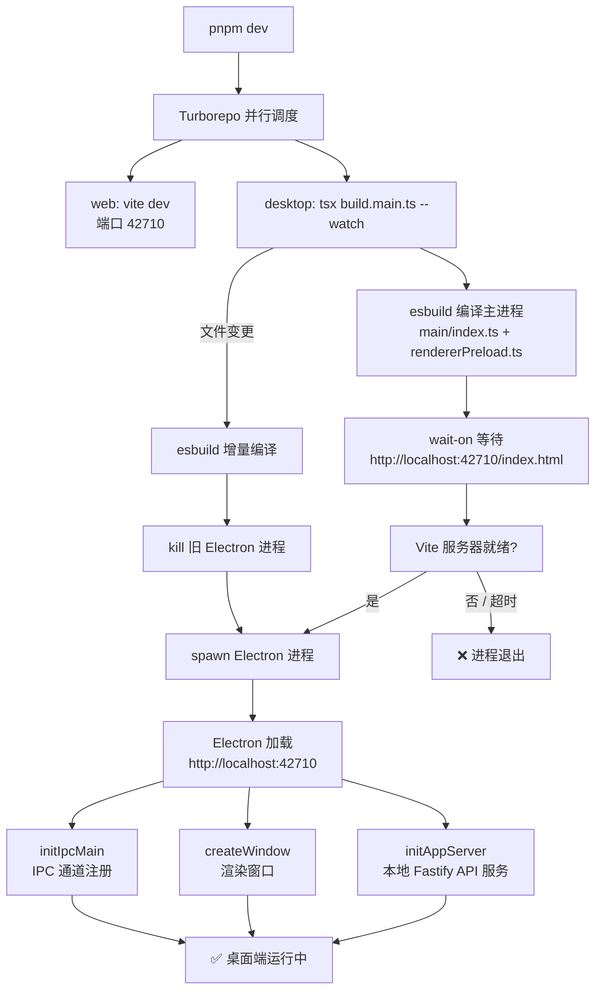
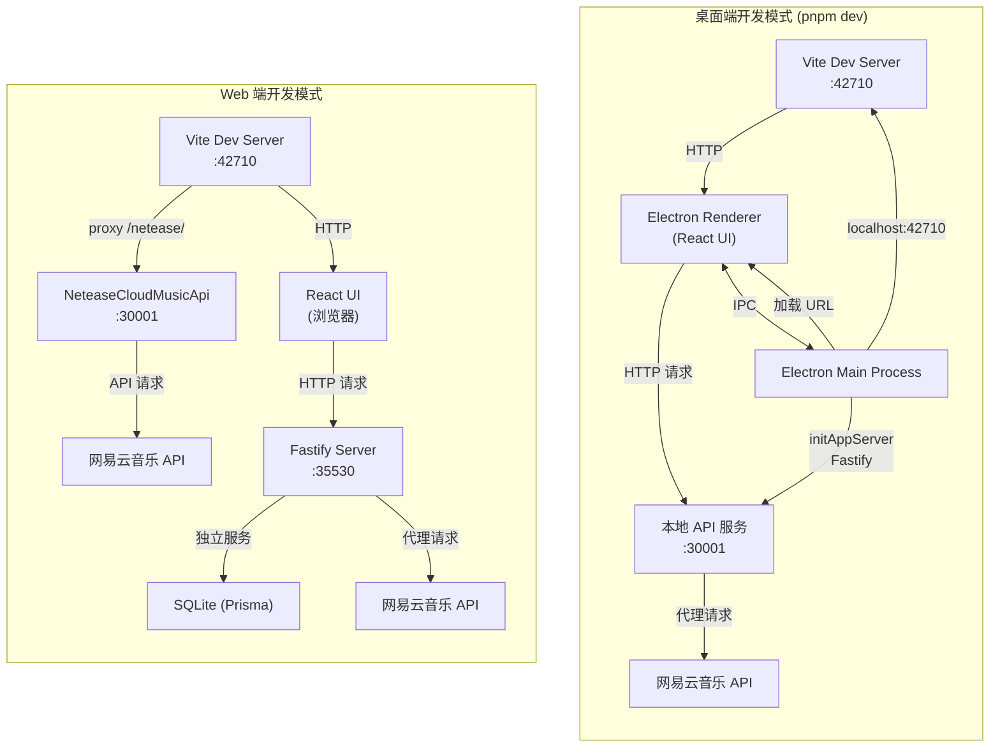

本文是 R3PLAYX 项目的开发环境搭建指南，涵盖从零开始配置本地开发环境到成功运行桌面端、Web 端与独立服务端的完整流程。无论你是希望贡献代码，还是仅想本地体验项目，按照以下步骤即可完成从克隆仓库到应用运行的全过程。

Sources: [CLAUDE.md](CLAUDE.md#L16-L34), [package.json](package.json#L1-L14)

## 前置条件

在开始之前，请确认你的开发环境满足以下要求：

| 依赖项 | 最低版本 | 推荐版本 | 说明 |
|--------|---------|---------|------|
| **Node.js** | ≥ 16.0.0 | v18.18.2 | 项目 `engines` 字段明确要求；CI 使用 18.18.2 |
| **PNPM** | — | v8.6.12 | 项目 `packageManager` 字段指定；monorepo 工作区必须使用 PNPM |
| **Git** | — | 最新稳定版 | 用于克隆仓库与版本管理 |
| **Python** | — | 3.x | Node-Gyp 编译原生模块（better-sqlite3）时需要 |
| **C++ 编译工具链** | — | — | Windows: Visual Studio Build Tools；macOS: Xcode Command Line Tools；Linux: gcc/g++ |

> **关于 PNPM 版本**：项目通过 `packageManager` 字段锁定了 `pnpm@8.6.12`。如果你使用 Corepack（Node.js 16.13+ 自带），可以直接运行 `corepack enable` 启用 PNPM，无需手动安装。也可通过 `npm i -g pnpm@8.6.12` 全局安装指定版本。

Sources: [package.json](package.json#L11-L14), [packages/desktop/package.json](packages/desktop/package.json#L20-L22), [.github/workflows/build-dev.yml](.github/workflows/build-dev.yml#L22-L29)

## 环境搭建步骤

### 第一步：克隆仓库

```bash
git clone https://github.com/sherlockouo/music.git
cd music
```

### 第二步：安装 PNPM

如果你已有 Corepack：

```bash
corepack enable
# 仓库内已锁定 pnpm@8.6.12，Corepack 会自动使用正确版本
```

或者手动全局安装：

```bash
npm i -g pnpm@8.6.12
```

### 第三步：配置 Electron 镜像（中国大陆用户）

由于 Electron 二进制文件托管在 GitHub Releases，中国大陆网络环境可能导致下载超时。建议在安装依赖前配置华为云镜像：

```bash
pnpm config set electron_mirror=https://repo.huaweicloud.com/electron/
```

### 第四步：复制环境变量文件

项目根目录提供了 `.env.example` 模板，需要复制为 `.env`：

```bash
cp .env.example .env
```

如果你计划开发独立服务端（`packages/server`），还需额外复制服务端的环境变量：

```bash
cp packages/server/.env.example packages/server/.env
```

### 第五步：安装依赖

```bash
pnpm install
```

这一步是整个搭建过程中最关键的环节。根目录的 `pnpm install` 会自动触发 Turborepo 并行执行各子包的 `postinstall` 脚本，具体包括：

- **desktop 包**：运行 `tsx scripts/build.sqlite3.ts`，为当前平台编译 better-sqlite3 的 Electron 原生二进制文件
- **server 包**：运行 `prisma generate`，生成 Prisma Client

整个安装过程的耗时主要取决于 better-sqlite3 原生模块的编译。该脚本首先尝试从 GitHub Releases 下载预编译二进制，若下载失败则回退到本地 `@electron/rebuild` 编译。

Sources: [package.json](package.json#L16-L17), [packages/desktop/package.json](packages/desktop/package.json#L10), [packages/server/package.json](packages/server/package.json#L8), [.env.example](.env.example#L1-L3), [packages/server/.env.example](packages/server/.env.example#L1-L6), [packages/desktop/scripts/build.sqlite3.ts](packages/desktop/scripts/build.sqlite3.ts#L66-L121)

## 环境变量配置

R3PLAYX 通过 `.env` 文件管理运行时配置。以下是根目录和服务端的环境变量说明：

### 根目录环境变量（`.env`）

| 变量名 | 默认值 | 说明 |
|--------|-------|------|
| `ELECTRON_WEB_SERVER_PORT` | `42710` | 桌面端 Vite 开发服务器 / 生产环境本地 Fastify 服务器端口 |
| `ELECTRON_DEV_NETEASE_API_PORT` | `30001` | 开发模式下网易云音乐 API 代理端口 |
| `VITE_APP_NETEASE_API_URL` | `/netease` | Web 前端请求网易云 API 时的路径前缀 |

### 服务端环境变量（`packages/server/.env`）

| 变量名 | 说明 |
|--------|------|
| `APPLE_MUSIC_TOKEN` | Apple Music API 的 Bearer Token，用于获取 Apple Music 专辑与艺术家信息 |
| `DATABASE_URL` | Prisma 数据库连接字符串；默认使用 SQLite（`file:./musicInfo.db`），可切换为 MySQL/PostgreSQL |

> **关于 DATABASE_URL**：服务端默认使用 SQLite 作为数据库，数据文件存储在 `packages/server/prisma/musicInfo.db`。如需切换到 MySQL 或 PostgreSQL，需同时修改 `packages/server/prisma/schema.prisma` 中的 `provider` 字段和此处的连接字符串。

Sources: [.env.example](.env.example#L1-L3), [packages/server/.env.example](packages/server/.env.example#L1-L6), [packages/server/prisma/schema.prisma](packages/server/prisma/schema.prisma#L5-L9), [packages/web/vite.config.ts](packages/web/vite.config.ts#L12-L15)

## 开发模式启动

R3PLAYX 的开发模式因目标平台不同而有所差异。下面分别说明桌面端、Web 端和独立服务端的启动方式。

### 桌面端（Electron）开发

```bash
pnpm dev
```

此命令通过 Turborepo 并行启动两个进程：

1. **Vite 开发服务器**（`packages/web`）：在 `ELECTRON_WEB_SERVER_PORT`（默认 42710）端口启动前端热更新服务
2. **Electron 主进程**（`packages/desktop`）：使用 esbuild 编译主进程代码，等待 Vite 服务器就绪后启动 Electron 窗口

桌面端开发模式的完整启动流程如下：



核心机制说明：桌面端采用 **Vite + Electron 分进程架构**。Vite 作为前端开发服务器提供 HMR，Electron 主进程通过 `wait-on` 库等待 Vite 就绪后再启动窗口加载页面。当主进程代码发生变更时，esbuild 触发增量编译并自动重启 Electron 进程。

Sources: [package.json](package.json#L21), [turbo.json](turbo.json#L7-L9), [packages/desktop/scripts/build.main.ts](packages/desktop/scripts/build.main.ts#L52-L85), [packages/desktop/main/index.ts](packages/desktop/main/index.ts#L48-L64), [packages/desktop/main/appServer/appServer.ts](packages/desktop/main/appServer/appServer.ts#L15-L42)

### Web 端开发

**仅启动 Web 前端**（不启动 Electron）：

```bash
pnpm run dev --filter web
```

**同时启动 Web 前端 + 独立后端服务**：

```bash
# 终端 1：启动独立服务端
pnpm run dev --filter server

# 终端 2：启动 Web 前端
pnpm run dev --filter web
```

Web 端开发模式使用 Vite 开发服务器，默认端口为 `ELECTRON_WEB_SERVER_PORT`（42710）。Vite 配置了代理规则，将 `/netease/` 路径的请求转发到本地网易云音乐 API 服务（端口 30001），实现前后端分离开发。

**独立启动网易云音乐 API 服务**（用于 Web 端开发调试）：

```bash
pnpm run api:netease --filter web
```

此命令通过 `npx NeteaseCloudMusicApi@latest` 在端口 30001 启动一个独立的网易云音乐 API 服务。

Sources: [packages/web/package.json](packages/web/package.json#L6-L17), [packages/web/vite.config.ts](packages/web/vite.config.ts#L96-L109), [packages/server/package.json](packages/server/package.json#L11-L12)

### 独立服务端开发

```bash
pnpm run dev --filter server
```

服务端开发模式使用 `concurrently` 同时运行 TypeScript 编译器（`tsc -w`）和 Fastify 应用，支持热重载。服务监听 `0.0.0.0:35530`，意味着可通过局域网访问。

Sources: [packages/server/package.json](packages/server/package.json#L11-L12)

### 命令速查表

| 场景 | 命令 | 说明 |
|------|------|------|
| 桌面端开发 | `pnpm dev` | 同时启动 Vite HMR + Electron 主进程 |
| Web 前端开发 | `pnpm run dev --filter web` | 仅启动 Vite 开发服务器 |
| 独立服务端开发 | `pnpm run dev --filter server` | 启动 Fastify + tsc watch |
| 网易云 API 服务 | `pnpm run api:netease --filter web` | 端口 30001，用于 Web 端代理 |
| 构建桌面端 | `pnpm build` | 编译所有子包（`IS_ELECTRON=yes`） |
| 构建 Web 端 | `pnpm build:web` | 仅构建 Web 前端 |
| 打包桌面端 | `pnpm package` | 构建 + electron-builder 打包 |
| 代码检查 | `pnpm lint` | ESLint 全量扫描 |
| 代码格式化 | `pnpm format` | Prettier 格式化 |

Sources: [package.json](package.json#L15-L23), [packages/desktop/package.json](packages/desktop/package.json#L9-L18), [packages/web/package.json](packages/web/package.json#L5-L16), [packages/server/package.json](packages/server/package.json#L6-L12)

## 开发模式架构总览

理解 R3PLAYX 开发模式下的进程与端口关系，是高效调试的关键。以下是两种主要开发模式的架构对比：



桌面端与 Web 端的核心差异在于：桌面端通过 Electron 主进程内嵌的 Fastify 服务器处理 API 请求，而 Web 端需要依赖独立部署的 Fastify 服务端。Vite 的代理配置仅在 Web 端模式下生效，用于将 `/netease/` 前缀的请求转发到网易云 API。

Sources: [packages/desktop/main/appServer/appServer.ts](packages/desktop/main/appServer/appServer.ts#L15-L42), [packages/web/vite.config.ts](packages/web/vite.config.ts#L96-L109), [packages/desktop/main/index.ts](packages/desktop/main/index.ts#L48-L64)

## 常见问题排查

| 问题 | 可能原因 | 解决方案 |
|------|---------|---------|
| `pnpm install` 卡在 electron 下载 | 网络问题，GitHub Releases 访问受限 | 配置镜像：`pnpm config set electron_mirror=https://repo.huaweicloud.com/electron/` |
| better-sqlite3 编译失败 | 缺少 C++ 编译工具链或 Python | macOS: `xcode-select --install`；Windows: 安装 Visual Studio Build Tools；Linux: `sudo apt install build-essential python3` |
| `pnpm dev` 启动后 Electron 窗口空白 | Vite 开发服务器未就绪，`wait-on` 超时 | 检查端口 42710 是否被占用；确认 `.env` 文件已正确配置 |
| Web 端网易云 API 请求 404 | 未启动 NeteaseCloudMusicApi 服务 | 运行 `pnpm run api:netease --filter web` 启动 API 服务 |
| Prisma Client 报错 | 未执行 `prisma generate` | 在 `packages/server` 目录下运行 `npx prisma generate` |
| 端口冲突 | 42710 或 30001 端口已被其他服务占用 | 修改 `.env` 中的 `ELECTRON_WEB_SERVER_PORT` 或 `ELECTRON_DEV_NETEASE_API_PORT` |
| `.npmrc` 中 `shamefully-hoist=true` 的作用 | better-sqlite3 等原生模块需要提升到根目录 | 保持 `.npmrc` 配置不变，该设置确保原生模块可被正确解析 |

> **关于 `.npmrc` 配置**：项目 `.npmrc` 设置了 `node-linker=hoisted`、`shamefully-hoist=true` 和 `strict-peer-dependencies=false`。这些配置是为了兼容 better-sqlite3 等需要提升到根 `node_modules` 的原生模块，以及避免严格的 peer dependency 检查导致的安装失败。不建议修改这些配置。

Sources: [.npmrc](.npmrc#L1-L5), [packages/desktop/scripts/build.sqlite3.ts](packages/desktop/scripts/build.sqlite3.ts#L123-L154), [packages/desktop/scripts/build.main.ts](packages/desktop/scripts/build.main.ts#L52-L65)

## 下一步

开发环境搭建完成后，建议按以下顺序深入了解项目架构：

1. [Monorepo 项目结构总览](3-monorepo-xiang-mu-jie-gou-zong-lan) — 理解 `packages/desktop`、`packages/web`、`packages/server`、`packages/shared` 四个子包的职责划分与依赖关系
2. [Turborepo 构建编排与 PNPM 工作区](5-turborepo-gou-jian-bian-pai-yu-pnpm-gong-zuo-qu) — 深入理解 `turbo.json` 的 pipeline 配置如何协调多包并行构建
3. [客户端-服务端通信架构：桌面端与 Web 端的差异](6-ke-hu-duan-fu-wu-duan-tong-xin-jia-gou-zhuo-mian-duan-yu-web-duan-de-chai-yi) — 理解两种模式下 API 请求路径的根本区别