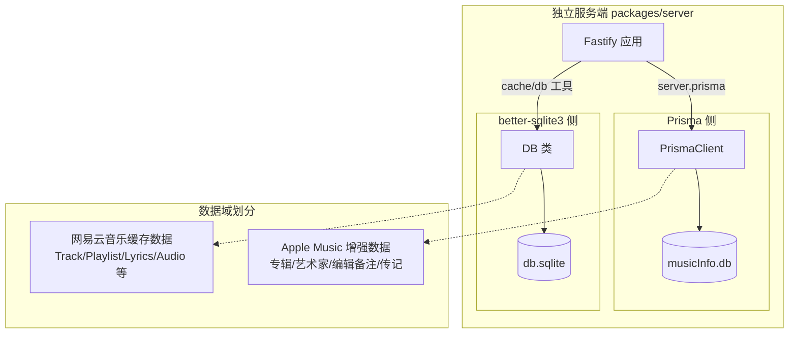
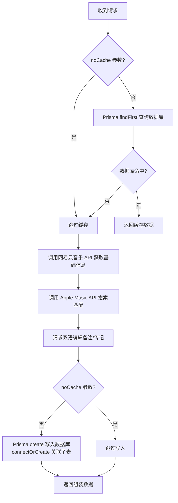

R3PLAYX 独立服务端（`packages/server`）中并存着两套 SQLite 数据访问机制：**Prisma ORM** 负责 Apple Music 增强数据的结构化存储，**better-sqlite3** 负责网易云音乐 API 的 JSON 缓存。本文聚焦于 Prisma ORM 这一侧——从 Schema 定义、关系模型、插件集成到路由层的实际查询模式，系统解析服务端如何利用 Prisma 实现类型安全的数据库操作。

Sources: [schema.prisma](packages/server/prisma/schema.prisma#L1-L46), [db.ts](packages/server/src/utils/db.ts#L1-L10)

## 双数据库架构概览

在深入 Prisma 细节之前，必须先理解一个关键的架构决策：服务端同时维护两个独立的 SQLite 数据库，分别服务于不同的数据域。



这种分离并非偶然——Prisma 管理的是**结构化、关系型**的 Apple Music 增强数据（专辑编辑备注、艺术家传记等具有明确字段边界的数据），而 better-sqlite3 管理的是**半结构化、以 JSON Blob 为主**的网易云音乐缓存数据。两者的数据特征和访问模式截然不同。

| 维度 | Prisma ORM（musicInfo.db） | better-sqlite3（db.sqlite） |
|------|---------------------------|---------------------------|
| **数据来源** | Apple Music API | 网易云音乐 API |
| **Schema 风格** | 强类型字段，关系模型 | id + JSON Blob + updatedAt |
| **关系支持** | 1:1 关系（Album ↔ EditorialNote） | 无关系，扁平表 |
| **迁移机制** | Prisma Migrate + init.sql | 版本号对比 + SQL 文件 |
| **主要消费者** | Apple Music 路由 | Cache 工具类 |
| **类型安全** | Prisma Client 自动生成 | 手动定义 TablesStructures 接口 |

Sources: [schema.prisma](packages/server/prisma/schema.prisma#L1-L9), [db.ts](packages/server/src/utils/db.ts#L81-L106), [init.sql (prisma)](packages/server/prisma/init.sql#L1-L33), [init.sql (migrations)](packages/server/src/migrations/init.sql#L1-L92)

## Prisma Schema 数据模型详解

### 数据源与生成器配置

Schema 文件定义了 Prisma 的核心配置：使用 `prisma-client-js` 生成器产出类型安全的客户端代码，数据源指向同目录下的 `musicInfo.db` SQLite 文件。值得注意的是 `relationMode = "prisma"` 这一设置——由于 SQLite 原生不支持外键约束的完整语义，Prisma 在应用层模拟关系行为，确保关联查询和数据完整性校验正常工作。

Sources: [schema.prisma](packages/server/prisma/schema.prisma#L1-L9)

### 四模型关系图

Prisma Schema 定义了 4 个模型，形成两组对称的 1:1 关系：

```mermaid
erDiagram
    Album ||--o| AlbumEditorialNote : "has"
    Artist ||--o| ArtistBio : "has"

    Album {
        Int id PK_UK
        Int neteaseId UK
        String name
        String neteaseName
        String artistName
        String neteaseArtistName
        String copyright
        String editorialVideo
        String artwork
    }

    AlbumEditorialNote {
        Int id PK_UK
        String en_US
        String zh_CN
    }

    Artist {
        Int id PK_UK
        Int neteaseId UK
        String name
        String artwork
        String editorialVideo
    }

    ArtistBio {
        Int id PK_UK
        String en_US
        String zh_CN
    }
```

**Album 模型**桥接了 Apple Music 和网易云音乐两个数据源：`id` 和 `name`、`artistName`、`artwork`、`copyright`、`editorialVideo` 来自 Apple Music；`neteaseId`、`neteaseName`、`neteaseArtistName` 则保留了对网易云原始数据的引用。这种双源映射设计使得应用可以通过网易云 ID 查询到对应的 Apple Music 增强信息。

**Artist 模型**采用类似的桥接策略，但字段更精简——Apple Music 侧仅保留 `artwork`（高清封面）和 `editorialVideo`（编辑视频），详细传记信息委托给关联的 `ArtistBio` 表。

**AlbumEditorialNote** 和 **ArtistBio** 是两个高度相似的关联表，均采用 `id` 作为主键同时兼作外键（`@relation(fields: [id], references: [id])`），存储中英文双语内容。`@map("en_US")` / `@map("zh_CN")` 注解确保 Prisma 生成的客户端属性名与数据库列名一致，因为 SQLite 列名中的下划线大小写敏感。

Sources: [schema.prisma](packages/server/prisma/schema.prisma#L11-L46)

### 关系模型的实现细节

两组 1:1 关系采用了相同的实现模式——子表的主键 `id` 同时作为指向父表 `id` 的外键，并标记为 `@unique`，从数据库层面保证一对一约束：

```
AlbumEditorialNote.id ──FK──▶ Album.id  (UNIQUE)
ArtistBio.id          ──FK──▶ Artist.id (UNIQUE)
```

这种"共享主键"模式在 Prisma 中是 1:1 关系的标准实现方式。其优势在于：查询父表时可以通过 `include` 一次性获取关联数据，无需额外的 JOIN 条件；子表的存在完全依赖于父表，语义清晰。

对应的 SQL DDL 验证了这一设计——`prisma/init.sql` 中 `AlbumEditorialNote.album` 和 `ArtistBio.artist` 列均声明为 `INTEGER UNIQUE REFERENCES`，双重约束确保一对一映射：

Sources: [schema.prisma](packages/server/prisma/schema.prisma#L24-L29), [schema.prisma](packages/server/prisma/schema.prisma#L40-L45), [init.sql](packages/server/prisma/init.sql#L13-L18), [init.sql](packages/server/prisma/init.sql#L28-L33)

## Fastify 插件集成与生命周期管理

### PrismaPlugin 实现

Prisma 通过 Fastify 插件机制集成到应用中，核心实现仅 25 行代码，但涵盖了完整的生命周期管理：

1. **实例化**：创建 `PrismaClient` 单例
2. **连接**：`await prisma.$connect()` 确保数据库可用后再继续启动
3. **装饰**：`server.decorate('prisma', prisma)` 将客户端挂载到 Fastify 实例
4. **清理**：注册 `onClose` 钩子，在服务关闭时调用 `$disconnect()`

TypeScript 模块扩充（`declare module 'fastify'`）为 `FastifyInstance` 添加了 `prisma` 属性的类型声明，使得路由处理函数中可以通过 `fastify.prisma` 获得完整的类型提示。

Sources: [prismaPlugin.ts](packages/server/src/plugins/prismaPlugin.ts#L1-L25)

### 自动加载与依赖顺序

插件通过 `@fastify/autoload` 自动注册。由于 `app.ts` 先加载 `plugins` 目录、再加载 `routes` 目录，Prisma 插件总是在路由注册之前完成初始化，路由处理函数中可以安全地访问 `fastify.prisma`。`fastify-plugin`（`fp`）的封装确保了插件的封装域不会隔离装饰器，使 `server.prisma` 在所有路由中可见。

Sources: [app.ts](packages/server/src/app.ts#L6-L17)

## 路由层的查询模式

Prisma 在路由层的使用集中在 Apple Music 的两个端点，均遵循**缓存优先（Cache-First）**的查询模式。

### 缓存优先查询流程



### Album 路由的 Prisma 操作

**读取**：通过 `findFirst` + `where: { neteaseId }` + `include: { editorialNote }` 一次性获取专辑及其双语编辑备注。`include` 的 `select` 子句仅提取 `en_US` 和 `zh_CN`，避免返回冗余的关联 ID。

**写入**：使用 `create` + `connectOrCreate` 组合。由于 `AlbumEditorialNote` 和 `Album` 共享主键，`connectOrCreate` 确保在子表记录已存在时建立关联、不存在时创建新记录，避免唯一约束冲突。整个写入操作被 `try-catch` 包裹，数据库写入失败不会阻断响应返回。

Sources: [album.ts](packages/server/src/routes/apple-music/album.ts#L22-L137)

### Artist 路由的 Prisma 操作

Artist 路由的 Prisma 使用模式与 Album 完全对称：`findFirst` + `where: { neteaseId }` + `include: { artistBio }` 用于读取，`create` + `connectOrCreate` 用于写入。两者的差异仅在于关联子表的名称（`artistBio` vs `editorialNote`）和父表字段（Artist 缺少 `copyright`，多了 `editorialVideo`）。

Sources: [artist.ts](packages/server/src/routes/apple-music/artist.ts#L17-L122)

### Prisma 查询模式总结

| 操作 | Prisma API | 场景 | 关键参数 |
|------|-----------|------|---------|
| 缓存读取 | `findFirst` | 按 neteaseId 查询 | `where`, `include` |
| 关联预加载 | `include` + `select` | 获取双语备注/传记 | 嵌套 `select` 仅取语言字段 |
| 创建主记录 | `create` | 首次获取 Apple Music 数据 | `data` 展开响应数据 |
| 关联子记录 | `connectOrCreate` | 创建/关联编辑备注 | `where: { id }`, `create` |

Sources: [album.ts](packages/server/src/routes/apple-music/album.ts#L42-L48), [album.ts](packages/server/src/routes/apple-music/album.ts#L117-L127), [artist.ts](packages/server/src/routes/apple-music/artist.ts#L38-L44), [artist.ts](packages/server/src/routes/apple-music/artist.ts#L105-L115)

## 数据库初始化与迁移策略

### Prisma 侧的初始化

`prisma/init.sql` 是 Prisma 数据库的初始建表脚本，包含 4 张表的 DDL。该文件在 Prisma Client 首次连接时用于确保表结构存在。值得注意的是，Prisma 的标准迁移机制（`prisma migrate`）在此项目中并未完整启用——项目依赖 `init.sql` 手动初始化，`package.json` 中的 `postinstall` 脚本仅执行 `prisma generate` 来生成客户端代码，而非 `prisma migrate deploy`。

Sources: [init.sql](packages/server/prisma/init.sql#L1-L33), [package.json](packages/server/package.json#L7)

### better-sqlite3 侧的迁移

作为对比，better-sqlite3 侧采用了基于版本号的自动迁移机制：`DB` 类在构造时读取 `AppData` 表中存储的应用版本号，与当前包版本比较，执行所有版本号大于已记录版本的 SQL 迁移文件。`CREATE TABLE IF NOT EXISTS` 保证初始化脚本的幂等性。这种机制简单但有效——每次应用更新后自动执行增量迁移，无需手动干预。

Sources: [db.ts](packages/server/src/utils/db.ts#L132-L162), [init.sql](packages/server/src/migrations/init.sql#L1-L92)

## 共享层类型定义与数据边界

`packages/shared/db/` 目录定义了 better-sqlite3 侧的三组类型枚举——`NeteaseTables`、`AppleMusicTables`、`ReplayTables`，它们与 `packages/server/src/utils/db.ts` 中的 `Tables` 枚举和 `TablesStructures` 接口形成类型镜像。然而 Prisma 侧的数据模型（Album、Artist 及其关联表）并不在此共享层中定义——Prisma Client 自动生成的类型取代了手动接口定义，这是两种数据访问策略在类型安全实现上的根本分歧。

Sources: [netease.ts](packages/shared/db/netease.ts#L1-L43), [appleMusic.ts](packages/shared/db/appleMusic.ts#L1-L15), [replay.ts](packages/shared/db/replay.ts#L1-L19)

## 延伸阅读

- 了解 better-sqlite3 在桌面端的完整缓存机制，参见 [桌面端 SQLite 数据库：better-sqlite3 缓存与迁移](10-zhuo-mian-duan-sqlite-shu-ju-ku-better-sqlite3-huan-cun-yu-qian-yi)
- 了解 Fastify 服务端的整体架构与插件自动加载，参见 [Fastify 服务端架构与自动加载机制](20-fastify-fu-wu-duan-jia-gou-yu-zi-dong-jia-zai-ji-zhi)
- 了解 Apple Music API 如何与 Prisma 数据模型协同工作，参见 [Apple Music API 集成](23-apple-music-api-ji-cheng)
- 了解缓存 API 枚举如何映射到 better-sqlite3 的表结构，参见 [缓存 API 枚举与类型映射](25-huan-cun-api-mei-ju-yu-lei-xing-ying-she)