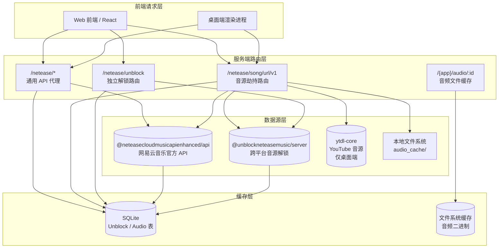
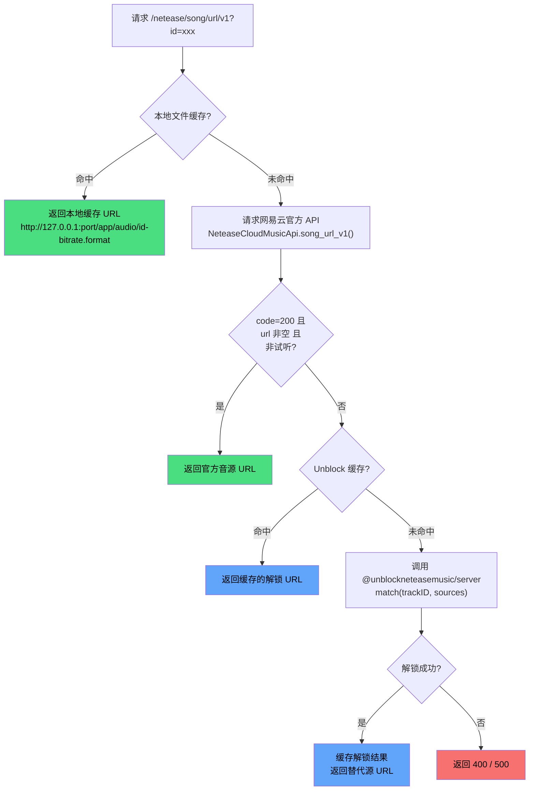

R3PLAYX 作为第三方网易云音乐播放器，其核心能力在于两层架构：**网易云音乐 API 的全量代理转发**与**受版权限制音源的跨平台解锁（Unblock）**。前者通过 `@neteasecloudmusicapienhanced/api` 将网易云官方 API 透传至本地服务端，实现登录、歌单、推荐等全部功能的数据获取；后者通过 `@unblockneteasemusic/server` 在网易云返回无效音源时，自动从 QQ 音乐、酷我、咪咕、酷狗、pyncmd、YouTube 等替代源检索并回填播放 URL。两者在 `/netease/song/url/v1` 这一关键路由上交汇——该路由被劫持为三级回退策略：本地文件缓存 → 网易云官方源 → Unblock 跨平台源，对外完全透明，前端调用方式与原始 API 完全一致。

Sources: [package.json](packages/server/package.json#L26-L27), [root.ts](packages/server/src/routes/root.ts#L1-L21)

## 整体架构

系统的 API 代理与 Unblock 解锁在**桌面端（Electron）**和**独立服务端（Docker/Vercel）**中各有独立实现，但路由结构与核心逻辑高度同构。两者均基于 Fastify 构建，注册相同的三组路由模块：



桌面端通过 [appServer.ts](packages/desktop/main/appServer/appServer.ts#L15-L42) 在本地启动 Fastify 实例，生产环境端口 `42710`、开发环境端口 `30001`；独立服务端通过 [app.ts](packages/server/src/app.ts#L6-L17) 使用 Fastify AutoLoad 自动加载路由，默认端口 `35530`。

Sources: [appServer.ts](packages/desktop/main/appServer/appServer.ts#L15-L42), [app.ts](packages/server/src/app.ts#L6-L17), [docker-compose.yml](docker-compose.yml#L10-L14)

## 通用 API 代理：动态路由注册

`netease.ts` 是网易云 API 的**全量透传代理**，其核心设计是通过运行时反射动态注册所有 API 端点，而非逐一手工声明。

`@neteasecloudmusicapienhanced/api` 导出的 `NeteaseCloudMusicApi` 对象是一个键值映射，键名为 API 方法名（snake_case），值为对应的请求函数。代理模块遍历该对象的每一个条目，通过 `change-case` 库将 snake_case 转换为 path-case（如 `song_detail` → `/song/detail`），然后在 Fastify 上注册对应的 GET 和 POST 路由。所有请求的 querystring 直接透传至网易云 API，同时将客户端的 cookie 一并转发以保持会话状态。

路由注册时有三个**例外项**被显式排除：`serveNcmApi`（服务启动函数，非 API）、`getModulesDefinitions`（模块定义函数，非 API）、以及 `song_url_v1`（音源 URL 接口，由 `audio.ts` 单独劫持处理）。对于 `Track`（歌曲详情）这类高频只读请求，代理层会在转发前先查询本地 SQLite 缓存，命中则直接返回，未命中才请求远端并写入缓存。

| 特性 | 实现方式 |
|------|---------|
| 路由注册 | 运行时遍历 `NeteaseCloudMusicApi` 对象，动态注册 |
| URL 命名 | `snake_case` → `path-case` 转换 |
| HTTP 方法 | GET 与 POST 同时注册 |
| Cookie 透传 | 从 `req.cookies` 提取，注入至 API 请求参数 |
| 缓存策略 | 仅 `Track` 类型走缓存优先路径 |
| 异常处理 | 400/301 状态码透传，其他返回 500 |

Sources: [netease.ts (server)](packages/server/src/routes/netease/netease.ts#L1-L62), [netease.ts (desktop)](packages/desktop/main/appServer/routes/netease/netease.ts#L1-L62)

## 音源劫持路由：三级回退策略

`audio.ts` 中的 `/netease/song/url/v1` 路由是整个 Unblock 机制的**核心入口**。该路由劫持了网易云官方的音源 URL 获取接口，实现了一个三级回退的音源解析策略，对外完全透明——前端调用 `fetchAudioSource()` 的方式与调用原始 API 毫无二致。



**第一级：本地文件缓存**。通过 `getAudioFromCache()` 查询 SQLite `Audio` 表，若命中且对应文件存在于 `audio_cache/` 目录，则构造一个指向本地 Fastify 静态服务（`/{app}/audio/{filename}`）的 URL 返回。这使得已缓存的歌曲可以完全离线播放。

**第二级：网易云官方源**。调用 `NeteaseCloudMusicApi.song_url_v1()` 获取官方音源。若返回 `code === 200`、URL 非空且非试听片段（`freeTrialInfo` 为 null），则直接返回官方 URL。

**第三级：Unblock 跨平台解锁**。当官方源不可用时，调用 `@unblockneteasemusic/server` 的 `match()` 函数，从替代音乐平台检索同名歌曲的音源 URL。解锁结果被缓存至 SQLite `Unblock` 表，后续相同歌曲的请求可直接命中缓存。

Sources: [audio.ts (server)](packages/server/src/routes/netease/audio.ts#L140-L229), [audio.ts (desktop)](packages/desktop/main/appServer/routes/netease/audio.ts#L146-L263)

## Unblock 解锁引擎：跨平台音源匹配

`@unblockneteasemusic/server`（简称 UNM）是 UnblockNeteaseMusic 项目的 Node.js 服务端实现，其核心函数 `match(trackID, sources)` 接收网易云音乐歌曲 ID 和音源平台列表，按顺序尝试从各平台检索匹配的音源。

### 桌面端与独立服务端的源列表差异

两个部署环境使用了不同的音源优先级策略：

| 音源平台 | 桌面端 `audio.ts` | 独立服务端 `audio.ts` | 独立服务端 `unblock.ts` |
|---------|-------------------|---------------------|------------------------|
| pyncmd | ✅ 优先 | ✅ 优先 | ✅ |
| bodian | ✅ | ✅ | ❌ |
| QQ 音乐 | ✅ | ✅ | ✅ |
| 咪咕 | ✅ | ✅ | ✅ |
| 酷我 | ❌ | ❌ | ✅ |
| 酷狗 | ❌ | ❌ | ✅ |
| JOOX | ✅ | ❌ | ✅ |
| YouTube | ✅ 条件性优先 | ✅ | ❌ |

桌面端的源列表具备**动态调整能力**：当用户开启 YouTube 解锁且配置了代理时，系统会先获取歌曲的艺术家和曲名信息，若均为英文（匹配 `/^[a-zA-Z\s]+$/`），则将 YouTube 提升至最高优先级源（`['youtube', 'qq', 'migu']`），否则保持默认的 `['pyncmd', 'bodian', 'qq', 'migu', 'joox', 'youtube']` 顺序。

Sources: [audio.ts (desktop)](packages/desktop/main/appServer/routes/netease/audio.ts#L218-L234), [audio.ts (server)](packages/server/src/routes/netease/audio.ts#L202), [unblock.ts (server)](packages/server/src/routes/netease/unblock.ts#L29), [unblock.ts (desktop)](packages/desktop/main/appServer/routes/netease/unblock.ts#L29)

### Cookie 注入与环境变量

UNM 引擎通过 `process.env` 环境变量接收各平台的认证 Cookie，这是解锁成功率的关键因素：

| 环境变量 | 用途 | 桌面端来源 | 独立服务端来源 |
|---------|------|-----------|--------------|
| `QQ_COOKIE` | QQ 音乐高级音源访问 | `store.get('settings.qqCookie')` | `req.query.qqCookie` |
| `MIGU_COOKIE` | 咪咕音乐高级音源访问 | `store.get('settings.miguCookie')` | `req.query.miguCookie` |
| `JOOX_COOKIE` | JOOX 音乐访问认证 | `store.get('settings.jooxCookie')` | `req.query.jooxCookie` |
| `ENABLE_FLAC` | 启用无损音质检索 | 硬编码 `'true'` | 硬编码 `'true'` |
| `ENABLE_LOCAL_VIP` | 模拟本地 VIP 权限 | 硬编码 `'true'` | 硬编码 `'true'` |

桌面端通过 Electron 的 `store`（基于 `electron-store`）持久化读取用户配置的 Cookie 值；独立服务端则从前端请求的 querystring 中接收 Cookie 参数，由前端 settings 状态在每次请求时注入。

Sources: [audio.ts (desktop)](packages/desktop/main/appServer/routes/netease/audio.ts#L198-L207), [audio.ts (server)](packages/server/src/routes/netease/audio.ts#L195-L199)

## YouTube 音源集成（仅桌面端）

桌面端独有 YouTube 音源通道，通过 `youtube.ts` 模块实现独立的 YouTube 搜索与音频提取能力。该模块使用 `ytdl-core` 库，核心流程为：

1. **搜索**：通过 `axios` 请求 YouTube 移动端搜索页面，解析 `ytInitialData` JSON 获取搜索结果
2. **匹配**：以 `{artist} {trackName} audio` 为关键词搜索，选取第一个结果
3. **提取**：调用 `ytdl.getInfo()` 获取视频的所有可用格式，筛选 MIME 类型为 `audio/webm; codecs="opus"` 且码率最高的格式
4. **代理**：通过 `http-proxy-agent` 支持用户配置的 HTTP 代理，解决 YouTube 的网络访问问题

YouTube 匹配设有 10 秒超时保护，超时则直接 reject，不阻塞其他音源平台的匹配。代理配置从 `store.get('settings.httpProxyForYouTube')` 读取，用户可在设置页面输入完整的代理 URL（如 `https://192.168.10.1:8080`）。

Sources: [youtube.ts](packages/desktop/main/youtube.ts#L1-L237)

## 独立解锁路由 `/netease/unblock`

除了 `audio.ts` 中嵌入的自动回退逻辑外，系统还提供了独立的 `/netease/unblock` 端点，用于**显式的手动解锁请求**。该端点接收 `track_id` 查询参数，执行缓存检查 → UNM `match()` 的两步流程。

此路由与 `audio.ts` 中的解锁逻辑相比更为简单：没有本地文件缓存检查、没有网易云官方源尝试、没有 YouTube 集成，仅作为纯解锁端点使用。前端通过 `unblock()` 函数直接调用，返回的 `UnblockResponse` 结构为 `{ code: number, url: string }`。

Sources: [unblock.ts (server)](packages/server/src/routes/netease/unblock.ts#L8-L45), [unblock.ts (desktop)](packages/desktop/main/appServer/routes/netease/unblock.ts#L8-L43), [track.ts (web API)](packages/web/api/track.ts#L16-L24)

## 音频文件缓存系统

当歌曲成功播放后，系统会将音频文件缓存至本地，实现离线播放能力。缓存系统由三层组成：**文件系统存储**、**SQLite 元数据索引**、**HTTP 分段传输服务**。

### 数据库模型

SQLite 中的 `Audio` 表记录每首缓存歌曲的元数据：

| 字段 | 类型 | 说明 |
|------|------|------|
| `id` | INTEGER (PK) | 歌曲 ID |
| `bitRate` | INTEGER | 比特率（如 128000、320000、165000 for OPUS） |
| `format` | TEXT | 音频格式（mp3/flac/ogg/m4a/opus/unknown） |
| `source` | TEXT | 来源平台（netease/youtube/qq/migu/kuwo/kugou/joox/bilibili/unknown） |
| `queriedAt` | DATETIME | 最近访问时间，用于 LRU 淘汰 |

Sources: [db.ts](packages/server/src/utils/db.ts#L46-L61), [init.sql](packages/server/src/migrations/init.sql#L56-L63)

### 缓存写入流程

前端播放器在 Howler.js 加载音频后触发缓存：通过 `cacheAudio()` 函数将音频二进制数据以 `multipart/form-data` POST 至 `/{app}/audio/{id}?url=xxx&bitrate=xxx`。服务端接收后：

1. 使用 `music-metadata` 的 `parseBuffer()` 解析音频元数据，提取实际比特率和编码格式
2. 对 OPUS 编码做特殊处理（固定码率 165000），其他格式取 `meta.format.bitrate`
3. 通过 URL 域名推断来源平台（`googlevideo.com` → YouTube，`126.net` → 网易云）
4. 将文件以 `{id}-{bitRate}.{format}` 命名写入 `audio_cache/` 目录
5. 在 SQLite `Audio` 表中 upsert 记录

Sources: [cache.ts (server)](packages/server/src/utils/cache.ts#L291-L339), [r3play.ts](packages/web/api/r3play.ts#L10-L27), [player.ts](packages/web/utils/player.ts#L358-L366)

### 缓存读取与 HTTP 分段传输

缓存命中时，`getAudioFromCache()` 构造一个指向本地 Fastify 服务的 URL（格式：`http://127.0.0.1:{port}/{app}/audio/{id}-{bitRate}.{format}`），该 URL 由 `/{app}/audio/:filename` 路由处理。路由处理器以 **HTTP 206 Partial Content** 响应，设置 `Accept-Ranges: bytes` 和 `Content-Range` 头，支持浏览器的范围请求，实现音频的流式播放与 seek 能力。若缓存文件大小为 0 字节，则自动删除文件及数据库记录并返回 404。

Sources: [cache.ts (server)](packages/server/src/utils/cache.ts#L265-L289), [audio.ts (server)](packages/server/src/routes/netease/audio.ts#L13-L64), [audio.ts (desktop)](packages/desktop/main/appServer/routes/netease/audio.ts#L18-L69)

## Unblock 缓存机制

Unblock 的解锁结果被缓存在 SQLite `Unblock` 表中，结构与 `Audio` 表类似但更为简单：

| 字段 | 类型 | 说明 |
|------|------|------|
| `id` | INTEGER (PK) | 歌曲 ID（即 track_id） |
| `json` | TEXT | JSON 序列化的 `{ id, url }` 对象 |
| `updatedAt` | DATETIME | 更新时间 |

缓存由 `Cache` 类统一管理。写入时（`cache.set(CacheAPIs.Unblock, data, trackID)`），将 `{ id, url }` 序列化为 JSON 存入数据库；读取时（`cache.get(CacheAPIs.Unblock, trackID)`），从数据库反序列化返回。在 `audio.ts` 的回退策略中，Unblock 缓存查询位于网易云官方源之后、UNM 实际调用之前，有效避免了重复的跨平台检索开销。

Sources: [cache.ts (server)](packages/server/src/utils/cache.ts#L46-L54), [cache.ts (server)](packages/server/src/utils/cache.ts#L182-L193), [init.sql](packages/server/src/migrations/init.sql#L28-L33)

## 前端集成：请求链路与设置联动

前端通过两个 API 函数与服务端交互：

- **`fetchAudioSource(params)`**：请求 `/song/url/v1`，触发三级回退策略。前端在请求时会自动附加 `qqCookie`、`miguCookie`、`jooxCookie` 参数（从 `settings` 状态读取），用于独立服务端场景下的 Cookie 传递。
- **`unblock(params)`**：请求 `/unblock`，用于显式解锁场景。

两者的调用均通过 `fetchAudioSourceWithReactQuery()` 封装，利用 TanStack React Query 管理请求缓存与重试。播放器核心 `_fetchAudioSource()` 调用此函数获取音频 URL，若返回的 URL 包含 `126.net` 域名则自动将 `http://` 升级为 `https://`。

### Vite 开发代理

开发环境下，前端通过 Vite 的 `server.proxy` 配置将 `/netease/` 前缀的请求代理至本地 Fastify 服务端。桌面端模式下路径原样转发，Web 模式下去除 `/netease` 前缀：

```typescript
proxy: {
  '/netease/': {
    target: `http://127.0.0.1:${ELECTRON_DEV_NETEASE_API_PORT}`,
    changeOrigin: true,
    rewrite: path => (IS_ELECTRON ? path : path.replace(/^\/netease/, '')),
  },
}
```

生产环境则通过 `VITE_APP_NETEASE_API_URL` 环境变量指定 baseURL，桌面端为 `/netease`（本地服务），Web 端可配置为远程服务端地址。

Sources: [useTracks.ts](packages/web/api/hooks/useTracks.ts#L104-L118), [track.ts (web API)](packages/web/api/track.ts#L16-L51), [player.ts](packages/web/utils/player.ts#L255-L273), [request.ts](packages/web/utils/request.ts#L4-L6), [vite.config.ts](packages/web/vite.config.ts#L96-L109)

## 用户设置与 Cookie 配置

前端的 `settings` 状态（基于 Valttio 响应式代理）管理着解锁相关的所有用户配置：

| 设置项 | 类型 | 默认值 | 说明 |
|--------|------|--------|------|
| `unlock` | boolean | `true` | 解锁功能总开关（当前代码未使用该标志做条件判断） |
| `qqCookie` | string | `''` | QQ 音乐认证 Cookie |
| `miguCookie` | string | `''` | 咪咕音乐认证 Cookie |
| `jooxCookie` | string | `''` | JOOX 认证 Cookie |
| `enableFindTrackOnYouTube` | boolean | `false` | YouTube 音源开关（仅桌面端可见） |
| `httpProxyForYouTube` | object | `{ proxy: '', host: '', port: 0, protocol: 'http' }` | YouTube 代理配置 |

Cookie 配置在设置页面的"Player"分区中提供输入框，并附有指向 UnblockNeteaseMusic 官方文档的链接说明 Cookie 的获取方式。设置变更通过 Valttio 的 `subscribe` 自动持久化至 `localStorage`，并通过 `IpcChannels.SyncSettings` 同步至 Electron 主进程的 `store`。

Sources: [settings.ts](packages/web/states/settings.ts#L7-L82), [Player.tsx](packages/web/pages/Settings/Player.tsx#L17-L200)

## 相关页面

- 了解 Fastify 服务端整体架构与自动加载机制：[Fastify 服务端架构与自动加载机制](20-fastify-fu-wu-duan-jia-gou-yu-zi-dong-jia-zai-ji-zhi)
- 了解缓存 API 枚举与类型映射的完整定义：[缓存 API 枚举与类型映射](25-huan-cun-api-mei-ju-yu-lei-xing-ying-she)
- 了解桌面端本地 Fastify 服务与 API 路由的注册方式：[桌面端本地 Fastify 服务器与 API 路由](9-zhuo-mian-duan-ben-di-fastify-fu-wu-qi-yu-api-lu-you)
- 了解播放器核心如何消费音源 URL：[播放器核心：Howler.js 音频引擎与播放控制](14-bo-fang-qi-he-xin-howler-js-yin-pin-yin-qing-yu-bo-fang-kong-zhi)
- 了解 Apple Music 的另一套音源集成：[Apple Music API 集成](23-apple-music-api-ji-cheng)