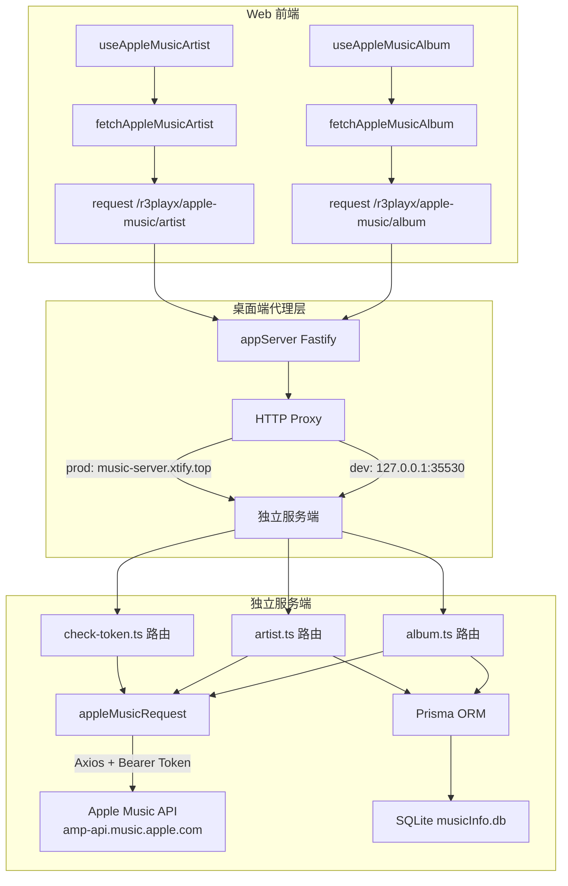
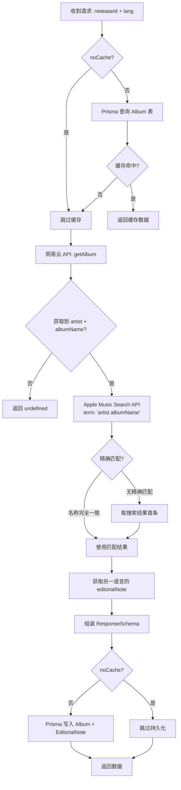
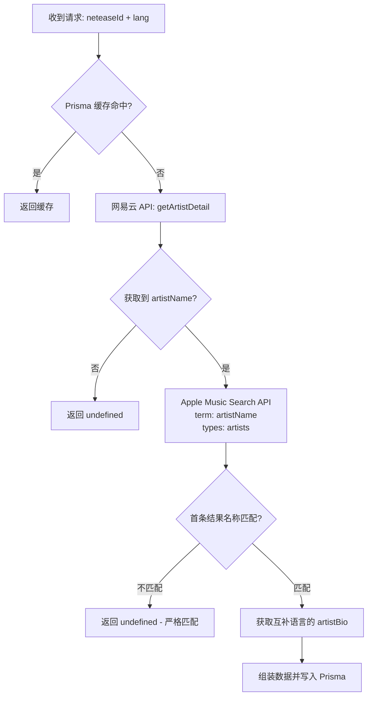

R3PLAYX 作为一款以网易云音乐为核心的第三方播放器，并未止步于单一音源的数据能力。**Apple Music API 集成**是项目中最具巧思的跨平台数据补充机制——它通过网易云的实体 ID 间接检索 Apple Music 的富媒体资源，为专辑/艺人页面注入编辑评论、动画封面和艺术家传记等网易云本身缺乏的高质量内容。这一集成横跨共享类型层、独立服务端、桌面端代理缓存和 Web 前端消费四个层级，形成了一条完整的跨平台数据管道。

Sources: [AppleMusic.ts](packages/shared/AppleMusic.ts#L1-L31), [AppleMusic.ts](packages/shared/api/AppleMusic.ts#L1-L35)

## 架构全景

Apple Music 数据的流转涉及三个运行时环境，每个环境承担不同的职责。理解这一分层是掌握集成机制的前提：



**核心设计原则**：Apple Music 数据永远以网易云 ID 为主键进行关联，通过"名称匹配"策略桥接两个平台的实体——先从网易云 API 获取艺人名/专辑名，再用此名称到 Apple Music 搜索接口进行模糊匹配。这种设计避免了要求用户在两个平台之间手动建立映射。

Sources: [appleMusic.ts](packages/desktop/main/appServer/routes/apple_music/appleMusic.ts#L1-L18), [appServer.ts](packages/desktop/main/appServer/appServer.ts#L1-L45)

## 服务端请求层：appleMusicRequest

所有对 Apple Music API 的 HTTP 请求都通过一个统一的 Axios 实例发出，封装在 `appleMusicRequest.ts` 中。该模块定义了三个关键配置：

| 配置项 | 值 | 说明 |
|--------|-----|------|
| **baseURL** | `https://amp-api.music.apple.com/v1/catalog/cn` | Apple Music 中国区目录端点 |
| **Authorization** | `process.env.APPLE_MUSIC_TOKEN` | Bearer 令牌，从环境变量注入 |
| **timeout** | `15000ms` | 15 秒超时 |

请求拦截器为每个请求自动注入两个固定参数：`platform: 'web'` 和 `with: 'serverBubbles'`，以及一组模拟 Apple Music Web 客户端的 HTTP 头（包括 `Referer: https://music.apple.com/`、`Origin: https://music.apple.com/` 和伪装的 Cider Electron User-Agent）。这些头信息确保 Apple Music API 将请求识别为合法的 Web 客户端调用。

**关于认证令牌**：项目并未实现 OAuth 流程或开发者令牌的自动刷新机制。`APPLE_MUSIC_TOKEN` 需要手动从 Apple Music Web 端捕获并配置到 `.env` 文件中。`check-token.ts` 路由提供了一种简单的令牌有效性检测——通过搜索 "Taylor Swift evermore" 专辑来判断令牌是否仍处于有效状态。

Sources: [appleMusicRequest.ts](packages/server/src/utils/appleMusicRequest.ts#L1-L52), [check-token.ts](packages/server/src/routes/apple-music/check-token.ts#L1-L31), [.env.example](packages/server/.env.example#L1-L6)

## 专辑数据路由：album.ts

`/r3playx/apple-music/album` 路由实现了**三级数据获取策略**：数据库缓存 → 网易云名称查询 → Apple Music 匹配搜索。其完整流程如下：



**名称匹配算法**是此路由的关键逻辑。搜索结果返回最多 10 条专辑，路由首先尝试**精确匹配**（不区分大小写比较 `name` 和 `artistName`），若无精确匹配则回退到搜索结果的第一条。这种策略在大多数场景下有效，但对于同名专辑或跨语言名称变体可能产生误匹配。

**双语 editorialNote** 的获取需要两次 API 调用：第一次搜索携带用户请求的 `lang` 参数获取对应语言的编辑评论，第二次用互补语言调用 `/albums/{id}` 详情接口获取另一语言的评论。最终将两者合并为 `{ en_US, zh_CN }` 结构存入 `AlbumEditorialNote` 关联表。

Sources: [album.ts](packages/server/src/routes/apple-music/album.ts#L1-L138)

## 艺人数据路由：artist.ts

`/r3playx/apple-music/artist` 路由与专辑路由遵循相同的三级策略，但在匹配逻辑上更为严格：



与专辑路由的关键差异在于：**艺人匹配采用严格策略**——仅取搜索结果的第一条，且必须与网易云艺人名称精确匹配（不区分大小写）。若不匹配则直接返回 `undefined`，不做回退。这是因为艺人同名的情况比专辑更常见，回退到首条结果会引入大量错误数据。

艺人搜索请求额外携带了 `'omit[resource:artists]': 'relationships'` 参数，排除了关联资源以减少响应体积；同时使用 `platform: 'web'` 确保返回适用于 Web 端的数据格式。

Sources: [artist.ts](packages/server/src/routes/apple-music/artist.ts#L1-L123)

## 数据模型与持久化

服务端和桌面端采用了**两套独立的持久化方案**，服务于不同的部署场景：

### 服务端：Prisma ORM + SQLite

| 模型 | 主键 | 唯一约束 | 关联关系 |
|------|------|----------|----------|
| **Album** | `id` (Apple Music ID) | `neteaseId` | → AlbumEditorialNote (1:1) |
| **AlbumEditorialNote** | `id` (同 Album.id) | — | → Album (归属) |
| **Artist** | `id` (Apple Music ID) | `neteaseId` | → ArtistBio (1:1) |
| **ArtistBio** | `id` (同 Artist.id) | — | → Artist (归属) |

`neteaseId` 的 `@unique` 约束确保每个网易云实体在数据库中只有一条对应的 Apple Music 记录。`AlbumEditorialNote` 和 `ArtistBio` 采用与父表共享主键的 `connectOrCreate` 策略——写入时先尝试连接已存在的子记录，不存在时才创建。

### 桌面端：better-sqlite3 + JSON 序列化

| 表名 | 结构 | 说明 |
|------|------|------|
| **AppleMusicAlbum** | `{ id, json, updatedAt }` | `json` 存储完整 Apple Music 专辑对象或 `'no'`（未找到标记） |
| **AppleMusicArtist** | `{ id, json, updatedAt }` | `json` 存储完整 Apple Music 艺人对象或 `'no'` |

桌面端采用更简单的 JSON 序列化方案，将 Apple Music 响应整体存入 `json` 字段。特殊的 `'no'` 值用于标记"已查询但无结果"的情况，避免对同一实体反复发起注定失败的请求。在 `Cache.get` 方法中，`'no'` 值被过滤掉不返回给调用方。

桌面端缓存还实现了**数据融合**逻辑：在读取 `CacheAPIs.Artist` 时，如果同时存在网易云和 Apple Music 的艺人缓存，会将 Apple Music 的 `artwork.url` 和 `artistBio` 直接覆盖到网易云数据的 `img1v1Url` 和 `briefDesc` 字段上，实现无缝的数据增强。

Sources: [schema.prisma](packages/server/prisma/schema.prisma#L1-L46), [db.ts](packages/desktop/main/db.ts#L14-L74), [cache.ts](packages/desktop/main/cache.ts#L126-L143), [cache.ts](packages/desktop/main/cache.ts#L211-L222), [appleMusic.ts](packages/shared/db/appleMusic.ts#L1-L16)

## 桌面端代理与路由转发

桌面端并不直接请求独立服务端，而是通过 Electron 主进程中启动的本地 Fastify 服务器进行代理转发：

```
Web 前端 → 本地 Fastify (/r3playx/apple-music/*) → HTTP Proxy → 独立服务端
```

`@fastify/http-proxy` 插件根据运行环境自动选择上游地址——开发环境指向 `http://127.0.0.1:35530/`，生产环境指向 `https://music-server.xtify.top/`。前缀 `/r3playx/apple-music` 被原样传递到上游，无需重写。这一代理层使得 Web 前端的请求代码无需感知部署环境差异。

Sources: [appleMusic.ts](packages/desktop/main/appServer/routes/apple_music/appleMusic.ts#L1-L18), [appServer.ts](packages/desktop/main/appServer/appServer.ts#L28-L31)

## Web 前端数据消费

### React Query Hooks

两个自定义 Hook 封装了 TanStack React Query 的调用逻辑：

| Hook | Query Key | 自动启用条件 | 刷新策略 |
|------|-----------|-------------|----------|
| `useAppleMusicAlbum` | `['useAppleMusicAlbum', id]` | `!!id` | 关闭窗口聚焦刷新 + 关闭定时刷新 |
| `useAppleMusicArtist` | `['useAppleMusicArtist', id]` | `!!id` | 关闭窗口聚焦刷新 + 关闭定时刷新 |

两者都将 `refetchOnWindowFocus` 和 `refetchInterval` 设为 `false`——因为 Apple Music 数据一旦获取并缓存到服务端，就不会频繁变化，无需重复请求。API 请求函数通过 `baseURL: '/'` 确保请求发往本地代理而非网易云 API 代理。

Sources: [useAppleMusicAlbum.ts](packages/web/api/hooks/useAppleMusicAlbum.ts#L1-L20), [useAppleMusicArtist.ts](packages/web/api/hooks/useAppleMusicArtist.ts#L1-L20), [appleMusic.ts](packages/web/api/appleMusic.ts#L1-L32)

### UI 消费场景

Apple Music 数据在前端有三个核心消费场景：

**1. 专辑页 — 编辑评论与动画封面**

专辑页 Header 组件同时请求网易云专辑数据和 Apple Music 专辑数据。`editorialNote` 按 `i18n.language` 优先选择对应语言版本，中文环境下回退到网易云自带的 `description`；`editorialVideo` 作为 `videoCover` 传入 `TrackListHeader`，替代静态封面图显示动画效果。

**2. 艺人页 — 传记与动画封面**

艺人信息组件和封面组件各自独立调用 `useAppleMusicArtist`。`ArtistInfo` 组件优先展示 Apple Music 的 `artistBio`，中文环境下回退到网易云的 `briefDesc`；`Cover` 组件用 Apple Music 的 `artwork` 替换网易云的 `img1v1Url`，并在存在 `editorialVideo` 时通过 `VideoCover` 组件播放 HLS 视频流。

**3. 动画封面播放 — VideoCover + HLS**

`VideoCover` 组件使用 `hls.js` 库解码 Apple Music 返回的 HLS (HTTP Live Streaming) 视频流。Safari 原生支持 HLS，直接使用 `<video>` 标签；其他浏览器通过 `hls.js` 的软解码方案。组件还会响应窗口焦点状态和全局暂停标志，在窗口失焦或播放其他视频时自动暂停动画封面。

Sources: [Header.tsx](packages/web/pages/Album/Header.tsx#L1-L107), [ArtistInfo.tsx](packages/web/pages/Artist/Header/ArtistInfo.tsx#L1-L92), [Cover.tsx](packages/web/pages/Artist/Header/Cover.tsx#L1-L55), [VideoCover.tsx](packages/web/components/VideoCover.tsx#L1-L74), [Cover.tsx](packages/web/components/TrackListHeader/Cover.tsx#L1-L41)

## 用户可配置项

Apple Music 集成提供了两个用户侧开关，均在设置页的 "Apple Music" 区块中：

| 设置项 | 默认值 | 作用 |
|--------|--------|------|
| `playAnimatedArtworkFromApple` | `true` | 控制是否播放 Apple Music 动画封面（影响 `VideoCover` 组件的 `hls.js` 初始化） |
| `priorityDisplayOfAlbumArtistDescriptionFromAppleMusic` | `true` | 控制是否优先展示 Apple Music 的专辑/艺人描述 |

这两个设置存储在 Valtio 的 `settings` 响应式状态中，通过 `localStorage` 持久化，并通过 IPC 同步到 Electron 主进程。

Sources: [settings.ts](packages/web/states/settings.ts#L24-L25), [General.tsx](packages/web/pages/Settings/General.tsx#L41-L66)

## 共享类型体系

Apple Music 相关的类型定义分布在三个共享文件中，各自服务于不同层级：

| 文件 | 主要类型 | 用途 |
|------|----------|------|
| `shared/AppleMusic.ts` | `AppleMusicAlbum`, `AppleMusicArtist` | 原始 API 响应结构（用于桌面端 IPC 返回值类型） |
| `shared/api/AppleMusic.ts` | `FetchAppleMusicAlbumParams/Response`, `FetchAppleMusicArtistParams/Response` | Web 前端请求/响应契约 |
| `shared/db/appleMusic.ts` | `AppleMusicTables`, `AppleMusicTablesStructures` | 桌面端 SQLite 表结构定义 |
| `shared/CacheAPIs.ts` | `CacheAPIs.AppleMusicAlbum/Artist` | 桌面端缓存键枚举及类型映射 |
| `shared/IpcChannels.ts` | `IpcChannels.GetAlbumFromAppleMusic/Artist` | IPC 通道定义（当前已注释停用） |

值得注意的是，`shared/AppleMusic.ts` 中定义的接口仅包含 `attributes` 子集（如 `editorialVideo`、`editorialNotes`、`artistBio`、`artwork`），而非 Apple Music API 的完整响应结构。这是一种有意的精简——项目只关心实际使用的字段。

Sources: [AppleMusic.ts](packages/shared/AppleMusic.ts#L1-L31), [AppleMusic.ts](packages/shared/api/AppleMusic.ts#L1-L35), [appleMusic.ts](packages/shared/db/appleMusic.ts#L1-L16), [CacheAPIs.ts](packages/shared/CacheAPIs.ts#L47-L49), [IpcChannels.ts](packages/shared/IpcChannels.ts#L40-L41)

## 设计权衡与演进痕迹

代码中留下了清晰的历史演进痕迹。`ipcMain.ts` 中存在三段被注释掉的 Apple Music IPC 处理器（`GetAlbumFromAppleMusic`、`GetArtistFromAppleMusic`），这表明项目曾考虑过在桌面端通过 IPC 通道直接获取 Apple Music 数据，而非经过 HTTP 代理。当前架构选择了 HTTP 代理方案，使得 Web 端和桌面端共享完全相同的 API 调用路径，降低了维护复杂度。

另一个设计权衡体现在缓存粒度上：服务端使用 Prisma 将 Apple Music 数据拆分为结构化的关系模型（Album → EditorialNote，Artist → ArtistBio），而桌面端则将完整响应 JSON 序列化存储。前者适合服务端的查询和分析需求，后者简化了桌面端的离线缓存逻辑。

Sources: [ipcMain.ts](packages/desktop/main/ipcMain.ts#L299-L332)

## 延伸阅读

- 了解服务端整体的自动加载与路由注册机制，参阅 [Fastify 服务端架构与自动加载机制](20-fastify-fu-wu-duan-jia-gou-yu-zi-dong-jia-zai-ji-zhi)
- 了解 Prisma 数据模型的完整定义，参阅 [Prisma ORM 与 SQLite 数据模型](21-prisma-orm-yu-sqlite-shu-ju-mo-xing)
- 了解桌面端本地服务器的路由代理体系，参阅 [桌面端本地 Fastify 服务器与 API 路由](9-zhuo-mian-duan-ben-di-fastify-fu-wu-qi-yu-api-lu-you)
- 了解桌面端 SQLite 缓存的底层实现，参阅 [桌面端 SQLite 数据库：better-sqlite3 缓存与迁移](10-zhuo-mian-duan-sqlite-shu-ju-ku-better-sqlite3-huan-cun-yu-qian-yi)
- 了解 React Query 在整个项目中的使用模式，参阅 [API 数据层：TanStack React Query 与请求缓存](15-api-shu-ju-ceng-tanstack-react-query-yu-qing-qiu-huan-cun)