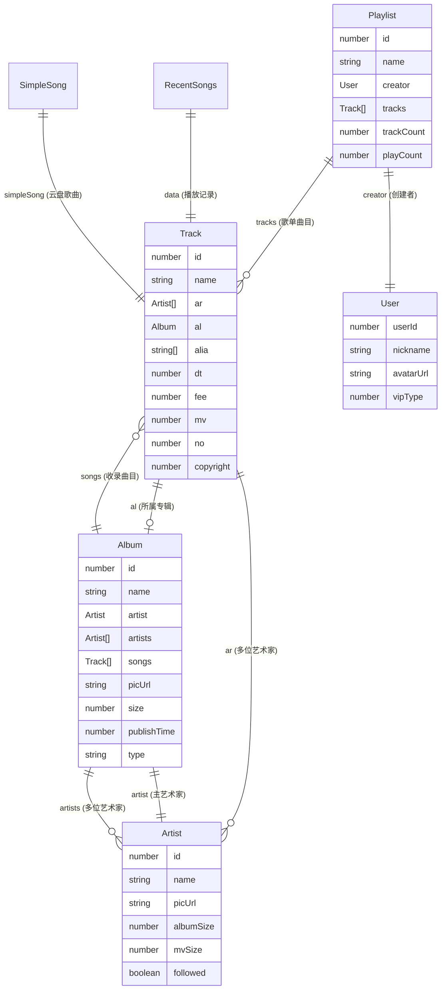
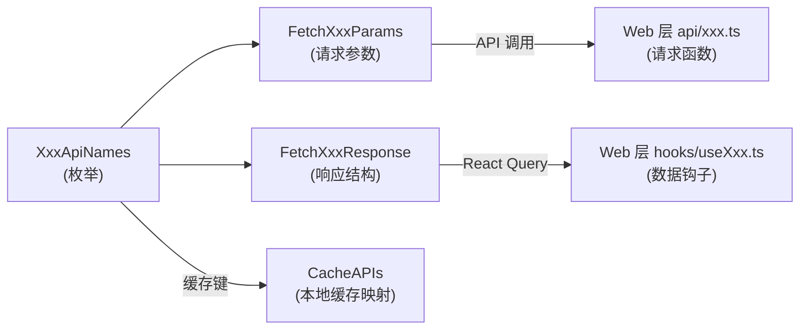
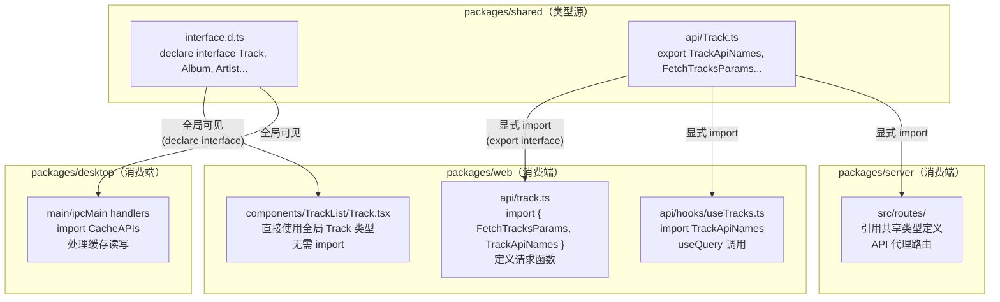

在 R3PLAYX 的 monorepo 架构中，`packages/shared` 是横跨桌面端、Web 端和独立服务端的**类型契约层**。所有核心数据模型（Track、Album、Artist、Playlist 等）均在此集中定义，确保三个包对网易云 API 响应结构的一致理解。本文将深入剖析共享层的类型分层策略、核心数据模型的字段语义，以及 API 类型参数/响应的约定模式。

Sources: [interface.d.ts](packages/shared/interface.d.ts), [api/](packages/shared/api)

## 双层类型架构：全局声明与模块导出

共享类型体系采用**双轨制**设计——顶层业务实体使用 `declare interface` 全局声明，API 请求/响应使用 `export interface` 模块导出。这一选择并非偶然：`Track`、`Album`、`Artist` 等核心实体在项目中被高频引用（组件 Props、状态管理、工具函数），全局声明让它们无需 `import` 即可在任何文件中直接使用；而 API 类型则按领域模块组织，通过显式导入控制依赖范围，避免命名冲突。

```
packages/shared/
├── interface.d.ts          ← 全局 declare interface（无需 import）
│   ├── Track, Album, Artist, Playlist, User, Video
│   ├── RecentSongs, SimpleSong
│   └── KeyboardShortcut*, RepeatMode 相关
├── api/                    ← 模块 export interface（需 import）
│   ├── Track.ts            ← TrackApiNames + Params/Response
│   ├── Album.ts            ← AlbumApiNames + Params/Response
│   ├── Artist.ts           ← ArtistApiNames + Params/Response
│   ├── Playlists.ts        ← PlaylistApiNames + Params/Response
│   ├── MV.ts               ← MVApiNames + Params/Response
│   ├── Search.ts           ← SearchApiNames + SearchTypes + Params/Response
│   ├── User.ts             ← UserApiNames + Params/Response
│   └── AppleMusic.ts       ← Apple Music Params/Response
├── playerDataTypes.ts      ← RepeatMode 枚举
├── AppleMusic.ts           ← Apple Music 原始响应类型
├── db/                     ← 本地数据库表结构映射
├── CacheAPIs.ts            ← 缓存 API 枚举与类型映射
├── IpcChannels.ts          ← IPC 通道定义与类型映射
└── defaultSettings.ts      ← 键盘快捷键默认配置
```

这一架构的运作机制依赖 TypeScript 的 `include` 配置：`packages/web/tsconfig.json` 和 `packages/desktop/tsconfig.json` 均通过 `"include": ["../shared/**/*.ts"]` 将共享类型纳入编译作用域，使得 `.d.ts` 文件中的 `declare interface` 自动成为全局可见类型，而 `export` 的模块类型则通过 `@/shared/api/xxx` 路径按需导入。

Sources: [interface.d.ts](packages/shared/interface.d.ts), [tsconfig.json](packages/web/tsconfig.json#L21-L23), [tsconfig.json](packages/desktop/tsconfig.json#L17)

## 核心实体关系图

以下 Mermaid 图展示了六个核心实体之间的引用关系。箭头方向表示"包含/引用"关系，例如 `Track.ar` 引用 `Artist[]`，`Track.al` 引用 `Album`：



Sources: [interface.d.ts](packages/shared/interface.d.ts#L1-L184)

## Track：曲目数据模型

**Track** 是整个音乐播放器的核心实体——播放队列、搜索结果、歌单列表、每日推荐，所有功能最终都汇聚到这个类型上。它的字段设计直接映射网易云 API 的 `song` 对象结构。

### 关键字段分组

| 字段分组 | 字段 | 类型 | 说明 |
|---------|------|------|------|
| **标识** | `id` | `number` | 网易云歌曲唯一 ID |
| **标识** | `name` | `string` | 歌曲标题 |
| **标识** | `alia` | `string[]` | 别名列表（如英文名） |
| **归属** | `ar` | `Artist[]` | 歌手列表，一首歌可有多位歌手 |
| **归属** | `al` | `Album \| undefined` | 所属专辑，可能无专辑信息 |
| **音频** | `h` / `m` / `l` | `{ br, fid, size, vd }` | 高/中/低音质元数据，`br` 为比特率，`size` 为文件大小 |
| **音频** | `dt` | `number` | 歌曲时长（毫秒） |
| **音频** | `duration` | `number \| undefined` | 时长的可空版本，部分场景使用 |
| **元数据** | `fee` | `number` | 付费标记：0=免费，1=VIP，4=购买专辑，8=免费低音质 |
| **元数据** | `copyright` | `number` | 版权状态标记 |
| **元数据** | `mv` | `number` | 关联 MV 的 ID，0 表示无 MV |
| **元数据** | `no` | `number` | 在专辑中的曲目序号 |
| **元数据** | `pop` | `number` | 热度指标 |
| **元数据** | `publishTime` | `number` | 发布时间戳 |
| **翻译** | `tns` | `(string \| null)[]` | 标题翻译列表 |

**`h/m/l` 音质字段**是 Track 类型中最具特色的结构。它使用 TypeScript 的**计算属性名**语法 `[key in ('h' | 'm' | 'l')]`，将三种音质等级映射为统一的结构 `{ br: number, fid: number, size: number, vd: number }`。其中 `br`（bitrate）以 kbps 为单位标识音质等级，`size` 以字节为单位标识文件大小，这两个字段在 UI 层常被用于音质标签展示和文件大小估算。

**`fee` 付费标记**在播放器中承担关键的权限判断角色——UI 层根据此值决定是否显示 VIP 标识、是否限制播放、是否需要购买提示。常见的枚举值映射为：`0`（免费）、`1`（VIP 专享）、`4`（需购买专辑）、`8`（免费低音质试听）。

Sources: [interface.d.ts](packages/shared/interface.d.ts#L77-L125)

## Album：专辑数据模型

Album 类型承载专辑的完整元数据，是专辑详情页、封面墙、歌手作品列表等场景的核心数据结构。它通过双向引用与 Track 和 Artist 建立关联：`Album.songs` 包含收录的 `Track[]`，`Album.artist` / `Album.artists` 指向创作者。

### 关键字段分组

| 字段分组 | 字段 | 类型 | 说明 |
|---------|------|------|------|
| **标识** | `id` | `number` | 专辑唯一 ID |
| **标识** | `name` | `string` | 专辑名称 |
| **标识** | `alias` | `unknown[]` | 别名列表 |
| **归属** | `artist` | `Artist` | 主艺术家 |
| **归属** | `artists` | `Artist[]` | 所有参与艺术家 |
| **内容** | `songs` | `Track[]` | 收录曲目列表 |
| **内容** | `size` | `number` | 曲目总数 |
| **视觉** | `picUrl` | `string` | 封面图 URL |
| **视觉** | `blurPicUrl` | `string` | 模糊封面 URL（常用于背景效果） |
| **分类** | `type` | `'专辑' \| 'Single' \| 'EP/Single' \| 'EP' \| '精选集'` | 专辑类型枚举 |
| **分类** | `subType` | `string` | 子类型 |
| **时间** | `publishTime` | `number` | 发行时间戳 |
| **商业** | `company` | `string` | 发行公司 |
| **商业** | `paid` | `boolean` | 是否付费 |
| **商业** | `onSale` | `boolean` | 是否在售 |

**`type` 字段**使用了 TypeScript 字面量联合类型，这是整个 `interface.d.ts` 中唯一的字面量类型约束。它精确枚举了网易云 API 返回的五种专辑分类，为 UI 层的类型安全分类标签提供了编译时保障。

**`blurPicUrl`** 是一个在 R3PLAYX 主题系统中被广泛使用的字段——它提供预模糊的封面图，避免了前端实时模糊计算的性能开销，直接用于 [主题系统与动态背景效果](19-zhu-ti-xi-tong-yu-dong-tai-bei-jing-xiao-guo) 中的背景渲染。

Sources: [interface.d.ts](packages/shared/interface.d.ts#L152-L184)

## Artist：艺术家数据模型

Artist 类型相对轻量，但承担了跨页面导航的核心职责。从搜索结果到专辑页、从播放列表到关注列表，Artist 始终作为"人"的标识贯穿整个应用。

| 字段分组 | 字段 | 类型 | 说明 |
|---------|------|------|------|
| **标识** | `id` | `number` | 艺术家唯一 ID |
| **标识** | `name` | `string` | 艺术家名称 |
| **标识** | `alias` | `unknown[]` | 别名列表 |
| **标识** | `trans` | `unknown` | 翻译名 |
| **统计** | `albumSize` | `number` | 专辑数量 |
| **统计** | `mvSize` | `number` | MV 数量 |
| **统计** | `musicSize` | `number \| undefined` | 歌曲数量（详情接口返回） |
| **视觉** | `picUrl` | `string` | 艺术家头像 URL |
| **视觉** | `img1v1Url` | `string` | 1:1 比例头像 URL |
| **关系** | `followed` | `boolean` | 当前用户是否已关注 |
| **元数据** | `accountId` | `number` | 关联的网易云账号 ID |
| **元数据** | `occupation` | `string \| undefined` | 职业（如"歌手"、"作词"） |

值得注意的设计细节：Artist 的 `alias`、`trans` 等字段类型为 `unknown[]` 或 `unknown`，表明这些字段在实际 API 响应中结构不稳定，项目选择了**显式的类型未知标记**而非 `any`，这是一种防御性类型策略——既承认了 API 的不确定性，又阻止了不安全的属性访问。

Sources: [interface.d.ts](packages/shared/interface.d.ts#L126-L151)

## Playlist、User、Video 与辅助类型

### Playlist（歌单）

Playlist 是网易云生态中内容组织的核心载体，字段最为庞杂。它通过 `creator: User` 记录创建者，通过 `tracks: Track[]` 或 `trackIds: { id, ... }[]` 提供曲目引用（注意两种引用模式：`tracks` 包含完整对象，`trackIds` 仅含 ID 列表——后者用于歌单列表接口的轻量返回）。

核心字段包括 `id`、`name`、`coverImgUrl`、`trackCount`、`playCount`，以及 `subscribed`（是否已收藏）和 `tags`（标签分类）。

Sources: [interface.d.ts](packages/shared/interface.d.ts#L1-L66)

### User（用户）

User 类型对应网易云用户资料，在 Playlist 的 `creator` 字段和搜索结果中出现。核心字段为 `userId`、`nickname`、`avatarUrl`、`vipType`、`signature`。`vipType` 字段决定了 UI 层的 VIP 标识展示策略。

Sources: [interface.d.ts](packages/shared/interface.d.ts#L185-L217)

### Video（视频）

Video 类型用于 MV 和短视频场景，与 Track 的 `mv` 字段形成关联。关键字段包括 `vid`（视频 ID）、`title`、`coverUrl`、`durationms`（时长毫秒）、`playTime`（播放量）和 `creator`（创作者数组）。

Sources: [interface.d.ts](packages/shared/interface.d.ts#L219-L233)

### RecentSongs（最近播放）

RecentSongs 封装了听歌记录的上下文：`resourceId` 和 `playTime` 记录播放行为元数据，`data: Track` 携带完整的曲目信息，`banned` 标记该记录是否被禁止。

Sources: [interface.d.ts](packages/shared/interface.d.ts#L68-L75)

### SimpleSong（云盘歌曲）

SimpleSong 是云盘功能的专用类型，它在 `simpleSong: Track` 的基础上附加了云盘特有的元数据（`bitrate`、`fileSize`、`fileName`、`songId` 等），用于 [CloudDiskInfoResponse](packages/shared/api/User.ts#L157-L164) 中。

Sources: [interface.d.ts](packages/shared/interface.d.ts#L235-L249)

## API 类型约定：Params/Response 模式

共享层的 `api/` 目录遵循一套统一的类型组织模式——每个领域模块包含三个组成部分：



### 三要素结构

**1. API 名称枚举**——为每个接口定义字符串标识，同时作为 React Query 的 query key 和 IPC 通信的方法名：

```typescript
export enum TrackApiNames {
  FetchTracks = 'fetchTracks',
  FetchAudioSource = 'fetchAudioSource',
  FetchLyric = 'fetchLyric',
  Unblock = 'unblock',
}
```

**2. 请求参数接口**——以 `FetchXxxParams` 命名，严格约束调用方传入的参数类型：

```typescript
export interface FetchAudioSourceParams {
  id: number
  level?: 'standard' | 'higher' | 'exhigh' | 'lossless' | 'hires'
  qqCookie?: string
  miguCookie?: string
  jooxCookie?: string
}
```

**3. 响应接口**——以 `FetchXxxResponse` 命名，定义 API 返回数据的完整结构，其中复用全局 `Track`、`Album` 等类型：

```typescript
export interface FetchAlbumResponse {
  code: number
  resourceState: boolean
  album: Album         // ← 全局类型，无需 import
  songs: Track[]       // ← 全局类型，无需 import
  description: string
}
```

Sources: [Track.ts](packages/shared/api/Track.ts), [Album.ts](packages/shared/api/Album.ts), [Artist.ts](packages/shared/api/Artist.ts)

### API 模块总览

| 模块文件 | 枚举名 | 主要接口 | 核心全局类型引用 |
|---------|--------|---------|---------------|
| `api/Track.ts` | `TrackApiNames` | 获取歌曲详情、音源 URL、歌词、解锁 | `Track` |
| `api/Album.ts` | `AlbumApiNames` | 专辑详情、收藏专辑 | `Album`, `Track` |
| `api/Artist.ts` | `ArtistApiNames` | 歌手详情、专辑列表、相似歌手、MV、歌曲 | `Artist`, `Album`, `Track` |
| `api/Playlists.ts` | `PlaylistApiNames` | 歌单详情、推荐、每日推荐、收藏 | `Playlist`, `Track`, `RecentSongs` |
| `api/MV.ts` | `MVApiNames` | MV 详情、MV URL、视频 URL | `Artist` |
| `api/Search.ts` | `SearchApiNames` | 搜索、云搜索、多重匹配、搜索建议 | `Track`, `Album`, `Artist`, `Playlist`, `User` |
| `api/User.ts` | `UserApiNames` | 账号、歌单、收藏、听歌记录、签到、云盘 | `Playlist`, `Album`, `Artist`, `Video`, `Track`, `SimpleSong` |
| `api/AppleMusic.ts` | — | Apple Music 专辑/艺术家映射 | — |

Sources: [api/](packages/shared/api)

## 搜索类型系统：SearchTypes 枚举

搜索模块定义了独立的 `SearchTypes` 枚举，将搜索类别映射为网易云 API 的数字代码：

| 枚举成员 | 值 | 搜索类型 |
|---------|-----|---------|
| `Single` | `'1'` | 单曲 |
| `Album` | `'10'` | 专辑 |
| `Artist` | `'100'` | 歌手 |
| `Playlist` | `'1000'` | 歌单 |
| `User` | `'1002'` | 用户 |
| `Mv` | `'1004'` | MV |
| `Lyrics` | `'1006'` | 歌词 |
| `Radio` | `'1009'` | 电台 |
| `Video` | `'1014'` | 视频 |
| `All` | `'1018'` | 综合 |

`SearchParams.type` 使用 `keyof typeof SearchTypes` 进行约束，确保调用方只能传入合法的搜索类别。`SearchResponse.result` 则将所有类别的搜索结果聚合在一个联合结构中，每种类别包含数据数组、`more` 分页标记和 `resourceIds`。

Sources: [Search.ts](packages/shared/api/Search.ts#L9-L26)

## 跨包类型流转机制

理解共享类型如何在不同包中被消费，是把握项目类型架构的关键。以下流程图展示了从 API 定义到 UI 渲染的完整类型流转路径：



**桌面端（Electron）的特殊路径**：在桌面端，Web 层通过 IPC 向主进程请求数据时，API 名称枚举（如 `TrackApiNames`）同时承担了 IPC 方法标识的角色。主进程的 IPC handler 接收到方法名后，调用本地 Fastify 服务或直接查询 SQLite 缓存，返回的 JSON 数据被自动反类型化为对应的 Response 接口。这条完整链路在 [Electron 进程间通信（IPC）：通道定义与类型安全](7-electron-jin-cheng-jian-tong-xin-ipc-tong-dao-ding-yi-yu-lei-xing-an-quan) 和 [缓存 API 枚举与类型映射](25-huan-cun-api-mei-ju-yu-lei-xing-ying-she) 中有详细分析。

Sources: [tsconfig.json](packages/web/tsconfig.json#L21-L23), [tsconfig.json](packages/desktop/tsconfig.json#L17)

## 设计权衡与注意事项

### 全局声明 vs 模块导出的取舍

`declare interface` 全局声明带来了便利性，但也引入了隐式依赖——任何文件可以直接使用 `Track` 而不导入它，这使得类型的来源不透明。在大型项目中，这可能导致重构时难以追踪类型使用范围。R3PLAYX 选择此策略的核心考量是：核心实体类型极度稳定（直接映射网易云 API），且使用频率极高，全局可见性带来的开发效率收益大于隐式依赖的风险。

### `unknown` 字段的防御性处理

`interface.d.ts` 中存在大量 `unknown` 和 `unknown[]` 类型字段（如 `Artist.alias`、`Artist.trans`、`Album.alias`）。这些并非疏忽，而是对网易云 API 不稳定字段的**显式标注**。TypeScript 的 `unknown` 类型要求使用前必须进行类型收窄（type narrowing），这比 `any` 更安全——它强制开发者面对 API 的不确定性，而非静默忽略。

### 字段命名的不一致来源

注意到 `Track.al`（缩写）与 `Track.album`（全称）并存、`Track.ar` 与 `Track.artist` 并存等现象。这些缩写源自网易云 API 的原始字段命名，共享层忠实保留了原始结构，避免映射层带来的维护负担和序列化/反序列化风险。在消费端，UI 组件通常通过解构或映射函数将这些缩写字段转换为更可读的本地变量。

Sources: [interface.d.ts](packages/shared/interface.d.ts#L77-L125)

## 延伸阅读

- [缓存 API 枚举与类型映射](25-huan-cun-api-mei-ju-yu-lei-xing-ying-she)——了解 `CacheAPIs` 如何将共享类型与本地 SQLite 缓存建立映射关系
- [Electron 进程间通信（IPC）：通道定义与类型安全](7-electron-jin-cheng-jian-tong-xin-ipc-tong-dao-ding-yi-yu-lei-xing-an-quan)——理解 IPC 通道如何利用共享类型实现进程间类型安全通信
- [API 数据层：TanStack React Query 与请求缓存](15-api-shu-ju-ceng-tanstack-react-query-yu-qing-qiu-huan-cun)——查看 `XxxApiNames` 枚举如何作为 React Query 的 query key
- [桌面端 SQLite 数据库：better-sqlite3 缓存与迁移](10-zhuo-mian-duan-sqlite-shu-ju-ku-better-sqlite3-huan-cun-yu-qian-yi)——了解 `db/netease.ts` 中定义的数据库表结构如何与全局类型协作