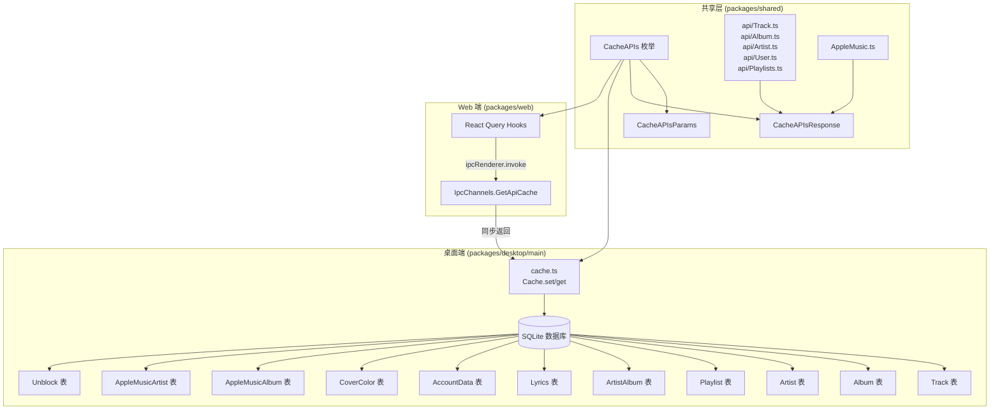

R3PLAYX 的离线体验核心建立在 `CacheAPIs` 枚举及其伴随的 `CacheAPIsParams` / `CacheAPIsResponse` 映射接口之上。这三个类型构造共同构成了一套**枚举驱动的类型安全缓存契约**——用一个枚举值同时索引请求参数类型和响应数据类型，使编译器能在缓存读写全链路中强制校验类型一致性。本文将拆解这套契约的定义结构、与 SQLite 数据库表的映射关系，以及在桌面端（Electron 主进程）与 Web 端（React Query Hooks）两侧的实际消费方式。

Sources: [CacheAPIs.ts](packages/shared/CacheAPIs.ts#L1-L100)

## 枚举定义：CacheAPIs

`CacheAPIs` 枚举是整个缓存体系的**命名空间核心**。每个枚举成员的字符串值直接对应网易云音乐 API 的 URL 路径片段（如 `album`、`song/detail`、`artist/songs`），或是自定义非网易云 API 的标识符（如 `cover_color`、`apple_music_album`）。这种设计使得枚举值同时充当**缓存键名**和**API 路由路径**双重角色，桌面端 Fastify 服务器据此自动注册路由并写入缓存。

Sources: [CacheAPIs.ts](packages/shared/CacheAPIs.ts#L25-L49)

枚举成员可按功能领域分为以下几类：

| 分类 | 枚举成员 | 字符串值 | 说明 |
|------|----------|----------|------|
| **歌曲** | `Track` | `song/detail` | 歌曲详情 |
| | `SongUrl` | `song/url/v1` | 音源 URL |
| | `Lyric` | `lyric` | 歌词 |
| | `Unblock` | `unblock` | 解锁音源 |
| **专辑** | `Album` | `album` | 专辑详情 |
| **歌手** | `Artist` | `artists` | 歌手详情 |
| | `ArtistAlbum` | `artist/album` | 歌手专辑列表 |
| | `ArtistSongs` | `artist/songs` | 歌手歌曲列表 |
| | `SimilarArtist` | `simi/artist` | 相似歌手 |
| **歌单** | `Playlist` | `playlist/detail` | 歌单详情 |
| | `Personalized` | `personalized` | 推荐歌单 |
| | `RecommendResource` | `recommend/resource` | 推荐资源 |
| **用户** | `UserAccount` | `user/account` | 用户账号 |
| | `UserPlaylist` | `user/playlist` | 用户歌单列表 |
| | `Likelist` | `likelist` | 喜欢的歌曲 ID |
| | `UserAlbums` | `album/sublist` | 收藏的专辑 |
| | `UserArtists` | `artist/sublist` | 收藏的歌手 |
| | `ListenedRecords` | `user/record` | 听歌排行 |
| **非网易云** | `CoverColor` | `cover_color` | 封面主色调 |
| | `AppleMusicAlbum` | `apple_music_album` | Apple Music 专辑 |
| | `AppleMusicArtist` | `apple_music_artist` | Apple Music 歌手 |

Sources: [CacheAPIs.ts](packages/shared/CacheAPIs.ts#L25-L49)

值得注意的是，最后三个成员（`CoverColor`、`AppleMusicAlbum`、`AppleMusicArtist`）的枚举值并非网易云 API 路径，而是项目自定义的缓存标识。它们不经过网易云 API 代理层，而是由桌面端独立计算或从 Apple Music API 获取后直接写入 SQLite 缓存。

## 类型映射接口：CacheAPIsParams 与 CacheAPIsResponse

枚举本身仅提供字符串标识，真正的类型安全来自两个**枚举键索引接口**（enum-keyed interface）。TypeScript 的映射类型语法 `[CacheAPIs.XXX]: Type` 将每个枚举成员映射到对应的参数类型和响应类型，形成编译期可推导的完整类型链。

Sources: [CacheAPIs.ts](packages/shared/CacheAPIs.ts#L51-L99)

### 参数映射：CacheAPIsParams

`CacheAPIsParams` 接口为每个 API 定义了其请求参数的精确结构。部分 API 无需参数，标记为 `void`：

| 枚举成员 | 参数类型 | 关键字段说明 |
|----------|----------|-------------|
| `Album` | `{ id: number }` | 专辑 ID |
| `Artist` | `{ id: number }` | 歌手 ID |
| `ArtistAlbum` | `{ id: number }` | 歌手 ID |
| `Likelist` | `void` | 无参数 |
| `Lyric` | `{ id: number }` | 歌曲 ID |
| `Personalized` | `void` | 无参数 |
| `Playlist` | `{ id: number }` | 歌单 ID |
| `RecommendResource` | `void` | 无参数 |
| `SongUrl` | `{ id: string }` | 歌曲 ID（字符串形式） |
| `Track` | `{ ids: string }` | 逗号分隔的歌曲 ID 串 |
| `UserAccount` | `void` | 无参数 |
| `UserAlbums` | `void` | 无参数 |
| `UserArtists` | `void` | 无参数 |
| `UserPlaylist` | `void` | 无参数 |
| `SimilarArtist` | `{ id: number }` | 歌手 ID |
| `ArtistSongs` | `{ id: number; order: string; offset: number; limit: number }` | 歌手歌曲分页查询 |
| `ListenedRecords` | `{ id: number; type: number }` | 用户 ID + 周/总排行类型 |
| `Unblock` | `{ track_id: number }` | 待解锁歌曲 ID |
| `CoverColor` | `{ id: number }` | 封面图片 ID |
| `AppleMusicAlbum` | `{ id: number }` | 专辑 ID |
| `AppleMusicArtist` | `{ id: number }` | 歌手 ID |

Sources: [CacheAPIs.ts](packages/shared/CacheAPIs.ts#L51-L74)

### 响应映射：CacheAPIsResponse

`CacheAPIsResponse` 接口为每个 API 定义其返回数据的类型。这些类型来源于 `packages/shared/api/` 目录下各领域模块的导出：

| 枚举成员 | 响应类型 | 类型来源文件 |
|----------|----------|-------------|
| `Album` | `FetchAlbumResponse` | [Album.ts](packages/shared/api/Album.ts#L9-L15) |
| `Artist` | `FetchArtistResponse` | [Artist.ts](packages/shared/api/Artist.ts#L27-L32) |
| `ArtistAlbum` | `FetchArtistAlbumsResponse` | [Artist.ts](packages/shared/api/Artist.ts#L40-L45) |
| `Likelist` | `FetchUserLikedTracksIDsResponse` | [User.ts](packages/shared/api/User.ts#L88-L92) |
| `Lyric` | `FetchLyricResponse` | [Track.ts](packages/shared/api/Track.ts#L72-L105) |
| `Personalized` | `FetchRecommendedPlaylistsResponse` | [Playlists.ts](packages/shared/api/Playlists.ts#L63-L68) |
| `Playlist` | `FetchPlaylistResponse` | [Playlists.ts](packages/shared/api/Playlists.ts#L49-L57) |
| `RecommendResource` | `FetchRecommendedPlaylistsResponse` | [Playlists.ts](packages/shared/api/Playlists.ts#L63-L68) |
| `SongUrl` | `FetchAudioSourceResponse` | [Track.ts](packages/shared/api/Track.ts#L37-L65) |
| `Track` | `FetchTracksResponse` | [Track.ts](packages/shared/api/Track.ts#L20-L26) |
| `UserAccount` | `FetchUserAccountResponse` | [User.ts](packages/shared/api/User.ts#L14-L70) |
| `UserAlbums` | `FetchUserAlbumsResponse` | [User.ts](packages/shared/api/User.ts#L98-L104) |
| `UserArtists` | `FetchUserArtistsResponse` | [User.ts](packages/shared/api/User.ts#L107-L112) |
| `UserPlaylist` | `FetchUserPlaylistsResponse` | [User.ts](packages/shared/api/User.ts#L78-L83) |
| `SimilarArtist` | `FetchSimilarArtistsResponse` | [Artist.ts](packages/shared/api/Artist.ts#L51-L54) |
| `ArtistSongs` | `FetchArtistSongsResponse` | [Artist.ts](packages/shared/api/Artist.ts#L17-L21) |
| `ListenedRecords` | `FetchListenedRecordsResponse` | [User.ts](packages/shared/api/User.ts#L127-L134) |
| `Unblock` | `UnblockResponse` | [Track.ts](packages/shared/api/Track.ts#L12-L15) |
| `CoverColor` | `string \| undefined` | 直接定义 |
| `AppleMusicAlbum` | `AppleMusicAlbum \| 'no'` | [AppleMusic.ts](packages/shared/AppleMusic.ts#L1-L15) |
| `AppleMusicArtist` | `AppleMusicArtist \| 'no'` | [AppleMusic.ts](packages/shared/AppleMusic.ts#L17-L30) |

Sources: [CacheAPIs.ts](packages/shared/CacheAPIs.ts#L76-L99)

其中 `CoverColor` 的响应是简单字符串（十六进制色值），`AppleMusicAlbum` 和 `AppleMusicArtist` 的联合类型中 `'no'` 是一个哨兵值，表示 Apple Music 数据库中不存在对应记录，用于区分"未查询"和"查询但无结果"两种状态。

## 三层架构：枚举 → 类型 → 数据库表

`CacheAPIs` 枚举、API 类型定义、SQLite 数据库表三者之间存在明确的映射关系。理解这种映射是掌握整个缓存系统运作方式的关键。



Sources: [CacheAPIs.ts](packages/shared/CacheAPIs.ts#L1-L100), [cache.ts](packages/desktop/main/cache.ts#L1-L349), [db.ts](packages/desktop/main/db.ts#L14-L74)

### 枚举到数据库表的映射

不同 API 的缓存数据在 SQLite 中被分配到不同的表。`cache.ts` 中的 `set` 和 `get` 方法通过 `switch` 语句实现枚举值到数据库表的路由：

| CacheAPIs 枚举 | SQLite 表 | 缓存策略 | 主键类型 |
|----------------|-----------|----------|----------|
| `UserPlaylist` | `AccountData` | 整体 JSON 替换 | `string`（枚举值） |
| `UserAccount` | `AccountData` | 整体 JSON 替换 | `string`（枚举值） |
| `Personalized` | `AccountData` | 整体 JSON 替换 | `string`（枚举值） |
| `RecommendResource` | `AccountData` | 整体 JSON 替换 | `string`（枚举值） |
| `UserAlbums` | `AccountData` | 整体 JSON 替换 | `string`（枚举值） |
| `UserArtists` | `AccountData` | 整体 JSON 替换 | `string`（枚举值） |
| `ListenedRecords` | `AccountData` | 整体 JSON 替换 | `string`（枚举值） |
| `Likelist` | `AccountData` | 整体 JSON 替换 | `string`（枚举值） |
| `Track` | `Track` | 逐条 upsert，按 ID 拆分 | `number`（歌曲 ID） |
| `Album` | `Album` | 整体 upsert，songs 合入 album | `number`（专辑 ID） |
| `Artist` | `Artist` | 整体 upsert | `number`（歌手 ID） |
| `ArtistAlbum` | `Album` + `ArtistAlbum` | 专辑拆分存储，ArtistAlbum 仅存 ID 列表 | `number`（歌手 ID） |
| `Playlist` | `Playlist` | 整体 upsert | `number`（歌单 ID） |
| `Lyric` | `Lyrics` | 整体 upsert | `number`（歌曲 ID） |
| `Unblock` | `Unblock` | 整体 upsert | `number`（歌曲 ID） |
| `CoverColor` | `CoverColor` | 颜色值直接存储（非 JSON） | `number`（封面 ID） |
| `AppleMusicAlbum` | `AppleMusicAlbum` | 整体 upsert，无结果存 `'no'` | `number`（专辑 ID） |
| `AppleMusicArtist` | `AppleMusicArtist` | 整体 upsert，无结果存 `'no'` | `number`（歌手 ID） |

Sources: [cache.ts](packages/desktop/main/cache.ts#L18-L145), [db.ts](packages/desktop/main/db.ts#L14-L74)

**AccountData 表的特殊设计**：所有与用户账号状态相关、无需按实体 ID 拆分的 API 响应（用户歌单列表、喜欢列表、推荐歌单等）统一写入 `AccountData` 表，以枚举字符串值本身作为主键。这意味着这些 API 的缓存总是**整体替换**——新数据到来时旧数据完全覆盖。

**ArtistAlbum 的拆分存储**：`ArtistAlbum` 枚举的缓存策略最为复杂。当写入时，`hotAlbums` 数组中的每个 `Album` 对象被单独拆分到 `Album` 表中存储，而 `ArtistAlbum` 表仅保存专辑 ID 数组引用。读取时再从 `Album` 表批量查询并还原完整对象。这种**规范化存储**避免了专辑数据的重复冗余。

Sources: [cache.ts](packages/desktop/main/cache.ts#L84-L103), [cache.ts](packages/desktop/main/cache.ts#L223-L238)

## 桌面端：缓存写入与读取

桌面端 Electron 主进程中的 `cache.ts` 实现了 `Cache` 类，提供 `set` 和 `get` 两个核心方法。缓存写入发生在 Fastify 本地服务器的 API 路由处理器中——当网易云 API 返回数据后，响应体同步写入 SQLite；缓存读取则通过 IPC 通道供渲染进程查询。

### 写入流程：Fastify 路由 → cache.set() → SQLite

```
HTTP 请求 → netease.ts 路由处理器 → 调用网易云 API → cache.set(枚举值, 响应体, 查询参数) → SQLite
```

在 [netease.ts](packages/desktop/main/appServer/routes/netease/netease.ts#L8-L39) 中，路由处理器通过 `Object.entries(NeteaseCloudMusicApi)` 自动循环注册所有网易云 API 端点。每个请求在获取到远端响应后，调用 `cache.set(name, result.body, req.query)` 将数据写入缓存。对于 `Track` API，还额外在请求前检查缓存，若命中则直接返回。

Sources: [netease.ts](packages/desktop/main/appServer/routes/netease/netease.ts#L8-L39)

[audio.ts](packages/desktop/main/appServer/routes/netease/audio.ts#L146-L200) 则劫持了 `song/url/v1` 接口，实现音频缓存的三级回退策略：本地音频文件缓存 → 网易云原始 URL → Unblock 音源解锁。

### 读取流程：渲染进程 IPC → ipcMain → cache.get() → SQLite

渲染进程通过 `IpcChannels.GetApiCache` 通道发起缓存查询。在 [ipcMain.ts](packages/desktop/main/ipcMain.ts#L262-L279) 中，同时注册了 `ipcMain.on`（同步返回）和 `ipcMain.handle`（异步返回）两种处理器。同步方式用于绝大多数 API 的缓存读取，异步方式目前仅用于 `user/account` 以支持异步缓存操作。

Sources: [ipcMain.ts](packages/desktop/main/ipcMain.ts#L262-L279)

## Web 端：React Query Hooks 中的缓存消费

Web 端的每个 React Query Hook 都遵循统一的缓存消费模式，通过 `window.ipcRenderer?.invoke(IpcChannels.GetApiCache, ...)` 跨进程查询 SQLite 缓存。根据缓存数据的使用方式，Hook 可分为两种模式：

### 模式一：缓存优先（Cache-First）

缓存命中时直接返回缓存数据，不再发起网络请求。适用于**变更频率低、一致性要求不高**的数据，如歌词、歌曲详情：

```typescript
// useLyric.ts — 缓存优先模式
const cache = await window.ipcRenderer?.invoke(IpcChannels.GetApiCache, {
  api: CacheAPIs.Lyric,
  query: { id: params.id },
})
if (cache) return cache  // 缓存命中，直接返回
return fetchLyric(params) // 缓存未命中，请求远端
```

此模式的 `staleTime` 通常设为 `Infinity`，表示缓存数据永不过期。

Sources: [useLyric.ts](packages/web/api/hooks/useLyric.ts#L8-L32), [useTracks.ts](packages/web/api/hooks/useTracks.ts#L58-L79)

### 模式二：缓存占位（Cache-Placeholder）

先异步查询缓存作为占位数据，同时发起网络请求获取最新数据。网络请求返回后替换占位数据。适用于**需要即时反馈但也要最新数据**的场景，如歌单详情、专辑详情：

```typescript
// useAlbum.ts — 缓存占位模式
fetchFromCache(params).then(cache => {
  const existsQueryData = reactQueryClient.getQueryData(key)
  if (!existsQueryData && cache) {
    reactQueryClient.setQueryData(key, cache) // 缓存作为占位
  }
})
return fetch(params) // 始终请求远端
```

Sources: [useAlbum.ts](packages/web/api/hooks/useAlbum.ts#L22-L42), [usePlaylist.ts](packages/web/api/hooks/usePlaylist.ts#L77-L97)

### 模式对比

| 特性 | 缓存优先 | 缓存占位 |
|------|----------|----------|
| 缓存命中后是否请求远端 | 否 | 是 |
| 首次渲染数据来源 | 缓存或远端 | 远端（缓存仅作过渡） |
| 适用数据特征 | 稳定、极少变更（歌词、歌曲详情） | 需要最新但需即时反馈（歌单、专辑） |
| `staleTime` 设置 | `Infinity` | `24h` 或 `1h` |
| 典型 Hook | `useLyric`、`useTracks` | `useAlbum`、`usePlaylist`、`useUser` |

Sources: [useLyric.ts](packages/web/api/hooks/useLyric.ts#L26-L31), [useAlbum.ts](packages/web/api/hooks/useAlbum.ts#L38-L40), [usePlaylist.ts](packages/web/api/hooks/usePlaylist.ts#L92-L95)

## 缓存清除与生命周期

桌面端提供 `IpcChannels.ClearAPICache` 通道用于一次性清除所有 API 缓存。在 [ipcMain.ts](packages/desktop/main/ipcMain.ts#L184-L193) 中，该操作会依次清空 Track、Album、Artist、Playlist、ArtistAlbum、AccountData、Audio 表，并执行 `VACUUM` 回收磁盘空间。

用户退出登录时，通过 `IpcChannels.Logout` 通道仅清除 `AccountData` 表，保留歌曲、专辑等实体缓存数据，下次登录后无需重新加载。

Sources: [ipcMain.ts](packages/desktop/main/ipcMain.ts#L184-L193), [ipcMain.ts](packages/desktop/main/ipcMain.ts#L336-L339)

## 类型安全的完整链路验证

`CacheAPIs` 的枚举键索引设计使得 TypeScript 编译器能在缓存读写全链路中进行类型校验。以 `Cache` 类的 `get` 方法签名为例：

```typescript
get<T extends keyof CacheAPIsParams>(api: T, params: any): any
```

虽然当前实现中 `params` 和返回值使用了 `any`（受限于 SQLite JSON 序列化的动态性），但 `T extends keyof CacheAPIsParams` 约束了传入的 `api` 参数必须是合法的 `CacheAPIs` 枚举成员。在 Web 端 Hook 中，`CacheAPIsResponse` 的类型映射则提供了更严格的返回类型推导——开发者能通过枚举值直接推断出响应的数据结构。

这套**枚举驱动的类型映射**模式本质上是一种轻量级的依赖注入：`CacheAPIs` 枚举作为类型令牌（type token），`CacheAPIsParams` 和 `CacheAPIsResponse` 作为类型注册表，在不引入运行时开销的前提下，将散落在各模块的 API 类型定义统一收束到一个可查询的类型空间中。

Sources: [CacheAPIs.ts](packages/shared/CacheAPIs.ts#L51-L99), [cache.ts](packages/desktop/main/cache.ts#L147)

## 延伸阅读

- 缓存数据的 SQLite 存储细节请参考 [桌面端 SQLite 数据库：better-sqlite3 缓存与迁移](10-zhuo-mian-duan-sqlite-shu-ju-ku-better-sqlite3-huan-cun-yu-qian-yi)
- 渲染进程与主进程的 IPC 通信机制请参考 [Electron 进程间通信（IPC）：通道定义与类型安全](7-electron-jin-cheng-jian-tong-xin-ipc-tong-dao-ding-yi-yu-lei-xing-an-quan)
- React Query 的缓存策略与 Hook 模式请参考 [API 数据层：TanStack React Query 与请求缓存](15-api-shu-ju-ceng-tanstack-react-query-yu-qing-qiu-huan-cun)
- 各响应类型中的 Track、Album、Artist 等核心数据结构请参考 [共享类型定义：Track、Album、Artist 等核心数据结构](24-gong-xiang-lei-xing-ding-yi-track-album-artist-deng-he-xin-shu-ju-jie-gou)