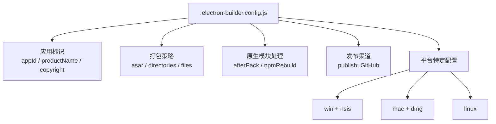
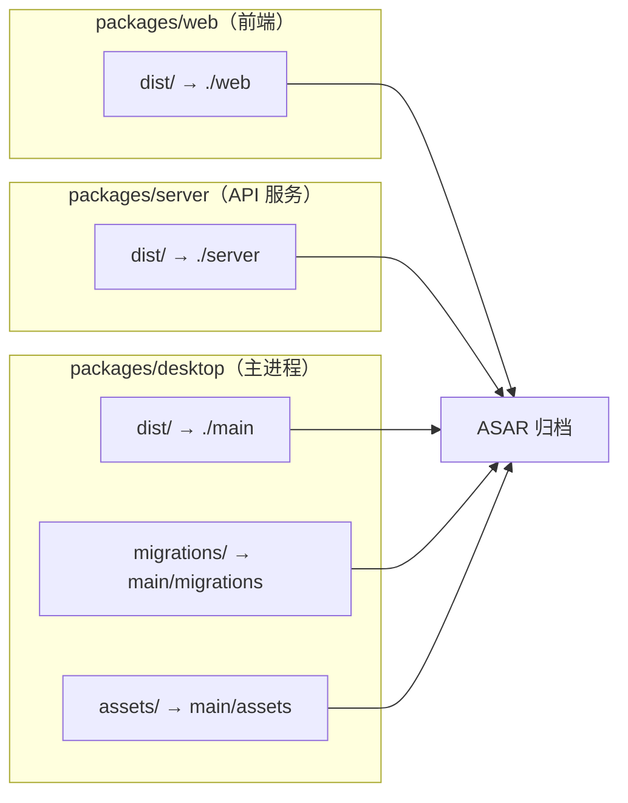
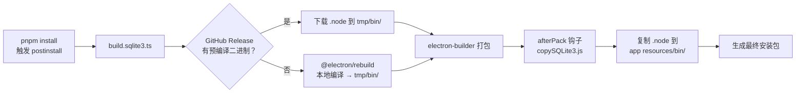
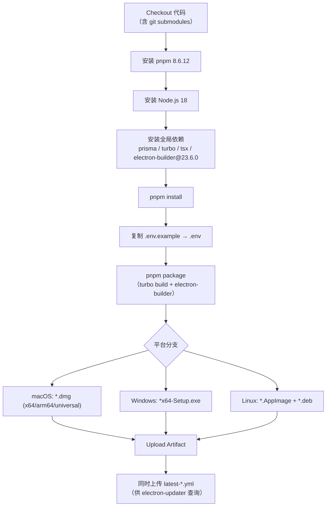

R3PLAYX 桌面端采用 **electron-builder** 作为打包引擎，通过精心设计的配置文件与构建脚本链，实现了跨 Windows、macOS、Linux 三平台的原生安装包生成。本文将深入剖析 `.electron-builder.config.js` 的每一项配置语义、原生模块 `better-sqlite3` 的跨平台编译与注入机制、构建流水线的编排逻辑，以及 GitHub Actions 驱动的自动分发体系——帮助你理解从源码到可分发安装包的完整链路。

## 配置文件总体架构

electron-builder 的配置以 CommonJS 模块形式定义在 [`.electron-builder.config.js`](packages/desktop/.electron-builder.config.js) 中，通过 `package` 脚本引用：`electron-builder build -c .electron-builder.config.js`。该配置文件的结构可划分为以下核心区域：



配置文件开头从 `package.json` 读取 `productName` 和 Electron 版本号，确保打包版本与开发依赖声明一致：`const electronVersion = pkg.devDependencies.electron.replaceAll('^', '')`。这是一个关键设计——Electron 版本号由 `package.json` 单一数据源驱动，避免配置漂移。

Sources: [.electron-builder.config.js](packages/desktop/.electron-builder.config.js#L1-L9), [package.json](packages/desktop/package.json#L1-L7)

## 应用标识与元数据

| 配置项 | 值 | 作用说明 |
|--------|------|----------|
| `appId` | `app.r3playx` | 应用唯一标识符，macOS 的 `CFBundleIdentifier` 和 Windows 的 `AppUserModelID` 均源自此值 |
| `productName` | `R3PLAYX`（取自 package.json） | 最终用户可见的应用名称，影响安装目录名、快捷方式名称、菜单项名称 |
| `executableName` | `R3PLAYX` | 可执行文件名（Linux 上尤其重要，决定 `/usr/bin/` 下的二进制文件名） |
| `copyright` | `Copyright © 2023 feng` | 版权声明，嵌入安装包元数据 |

`appId` 采用反向域名格式 `app.r3playx`，简洁且全局唯一。需要注意的是，macOS 上 `appId` 直接决定应用的偏好设置存储路径（`~/Library/Preferences/app.r3playx.plist`），修改 `appId` 等价于创建一个全新应用——用户数据不会自动迁移。

Sources: [.electron-builder.config.js](packages/desktop/.electron-builder.config.js#L9-L13)

## 打包策略：ASAR 归档与文件映射

### ASAR 归档

`asar: true` 启用 Electron 的 ASAR 归档打包——将应用源码合并为单个只读归档文件。这并非加密机制，但能有效避免 Windows 上 `node_modules` 路径超过 260 字符限制的问题，同时略微提升文件读取性能。值得注意的是，`better-sqlite3` 的 `.node` 原生二进制文件**不能**打包进 ASAR（Electron 无法从 ASAR 中加载原生模块），因此它通过 `afterPack` 钩子在归档之外单独注入。

### 输出目录与构建资源

```js
directories: {
  output: 'release',        // 产物输出到 packages/desktop/release/
  buildResources: 'build',  // 图标等构建资源位于 packages/desktop/build/
}
```

`buildResources` 指向 `packages/desktop/build/` 目录，其中包含多尺寸图标（16×16 到 1024×1024 的 PNG、macOS 专用的 `.icns` 等），electron-builder 在打包时自动从中选取对应平台所需格式。

### 文件映射：Monorepo 产物的聚合

`files` 字段是整个打包配置中最关键的部分——它定义了哪些文件被纳入安装包。由于 R3PLAYX 是 Monorepo 架构，最终安装包需要聚合来自**三个子包**的构建产物：



具体映射关系如下表：

| 源路径（构建产物） | 目标路径（ASAR 内） | 说明 |
|---|---|---|
| `./dist` | `./main` | esbuild 编译后的主进程代码（index.js、rendererPreload.js） |
| `../web/dist` | `./web` | Vite 构建的前端静态资源（HTML/JS/CSS） |
| `../server/dist` | `./server` | 服务端编译产物（Fastify API 服务） |
| `./migrations` | `main/migrations` | SQLite 数据库初始化脚本 `init.sql` |
| `./assets` | `main/assets` | 任务栏/触控栏/托盘图标等运行时资源 |

排除规则同样重要——配置排除了 TypeScript 源文件（`!**/*.ts`）、source map（`!**/*.map`）、macOS 系统文件（`!.DS_Store`）、版本控制目录（`!.git`）以及 `unlock.js`（音源解锁模块，不在桌面端打包范围内），确保安装包体积精简。

Sources: [.electron-builder.config.js](packages/desktop/.electron-builder.config.js#L14-L142)

## 原生模块处理：better-sqlite3 跨平台编译链

`better-sqlite3` 是一个 C++ 原生 Node.js 模块，必须针对**目标平台的 Electron 版本**编译二进制，否则运行时将因 ABI 不匹配而崩溃。R3PLAYX 为此设计了一套完整的"预编译 → 注入"两阶段机制。

### 第一阶段：postinstall 预编译

`package.json` 中声明了 `postinstall` 钩子：`tsx scripts/build.sqlite3.ts`，在 `pnpm install` 后自动执行。[build.sqlite3.ts](packages/desktop/scripts/build.sqlite3.ts) 的核心逻辑是：

1. **优先下载预编译二进制**：从 `better-sqlite3` 的 GitHub Release 下载与当前 Electron 版本和目标架构匹配的 `.node` 文件，解压并保存到项目根目录的 `tmp/bin/` 目录（如 `better_sqlite3_darwin_arm64.node`）。
2. **回退到本地编译**：如果下载失败（网络问题、预编译版本不存在），则调用 `@electron/rebuild` 在本地编译，同样将产物复制到 `tmp/bin/`。

该脚本根据当前操作系统自动决定编译哪些架构：macOS 编译 `x64` 和 `arm64`，Linux 编译 `x64` 和 `arm64`，Windows 仅编译 `x64`。同时支持命令行参数覆盖（`--x64`、`--arm64`）用于 CI 环境精细控制。

### 第二阶段：afterPack 注入

electron-builder 的 `afterPack: './scripts/copySQLite3.js'` 钩子在打包完成 ASAR 归档后、生成安装包前执行。[copySQLite3.js](packages/desktop/scripts/copySQLite3.js) 从 `tmp/bin/` 目录将预编译的 `.node` 文件复制到最终应用的 `resources/bin/` 路径下（macOS 路径为 `.app/Contents/Resources/bin/`，Windows/Linux 路径为 `resources/bin/`），跳过 macOS universal 构建（因为 x64 和 arm64 已分别注入）。



配置中的 `npmRebuild: false` 和 `buildDependenciesFromSource: false` 是此机制的关键配合——它们禁止 electron-builder 自行重新编译原生模块，避免与预编译产物冲突。

Sources: [build.sqlite3.ts](packages/desktop/scripts/build.sqlite3.ts#L1-L175), [copySQLite3.js](packages/desktop/scripts/copySQLite3.js#L1-L65), [.electron-builder.config.js](packages/desktop/.electron-builder.config.js#L19-L23)

## 平台特定配置

### Windows：NSIS 安装程序

```js
win: {
  target: [{ target: 'nsis', arch: ['x64'] }],
  publisherName: 'feng',
  icon: 'build/icons/icon.png',
},
nsis: {
  oneClick: false,
  perMachine: true,
  allowToChangeInstallationDirectory: true,
  deleteAppDataOnUninstall: true,
  artifactName: '${productName}-${version}-${os}-${arch}-Setup.${ext}',
},
```

| 配置项 | 值 | 设计意图 |
|--------|------|----------|
| `target` | `nsis` / `x64` | 仅生成 NSIS 安装程序，仅支持 64 位（portable 便携版被注释掉） |
| `oneClick` | `false` | 非一键安装，展示安装选项界面 |
| `perMachine` | `true` | 为所有用户安装（需管理员权限），避免单用户安装路径问题 |
| `allowToChangeInstallationDirectory` | `true` | 允许用户自定义安装路径 |
| `deleteAppDataOnUninstall` | `true` | 卸载时清除应用数据目录，彻底卸载 |
| `artifactName` | `${productName}-${version}-${os}-${arch}-Setup.${ext}` | 产物命名模板，生成如 `R3PLAYX-2.7.6-win-x64-Setup.exe` |

### macOS：DMG 镜像

```js
mac: {
  target: [{ target: 'dmg', arch: ['x64', 'arm64', 'universal'] }],
  artifactName: '${productName}-${version}-${os}-${arch}.${ext}',
  darkModeSupport: true,
  category: 'public.app-category.music',
  identity: null,
},
dmg: {
  icon: 'build/icons/icon.icns',
},
```

| 配置项 | 值 | 设计意图 |
|--------|------|----------|
| `target` | `dmg` / 三架构 | 同时生成 Intel (x64)、Apple Silicon (arm64) 和 Universal 三种 DMG |
| `darkModeSupport` | `true` | DMG 安装界面支持深色模式 |
| `category` | `public.app-category.music` | macOS App Store 分类标识（虽未上架，但影响 Launchpad 分类） |
| `identity` | `null` | **跳过代码签名**——未配置 Apple Developer 证书，适合个人开发者分发 |
| `dmg.icon` | `icon.icns` | DMG 窗口图标使用 macOS 专用格式 |

`identity: null` 意味着生成的 DMG 在 macOS Gatekeeper 下会被标记为"未验证应用"，用户需手动在"系统设置 → 隐私与安全性"中允许打开。这是未参与 Apple Developer Program 的常见取舍。

### Linux：deb + AppImage

```js
linux: {
  target: [
    { target: 'deb', arch: ['x64', 'arm64'] },
    { target: 'AppImage', arch: ['x64'] },
  ],
  artifactName: '${productName}-${version}-${os}-${arch}.${ext}',
  category: 'Music',
  icon: './build/icon.png',
},
```

| 目标格式 | 架构 | 说明 |
|----------|------|------|
| `deb` | `x64`, `arm64` | Debian/Ubuntu 系包管理器格式，覆盖主流桌面 Linux 和 ARM 设备 |
| `AppImage` | `x64` | 免安装便携格式，双击即运行，覆盖更广泛的发行版 |

被注释掉的格式包括 `snap`（Snapcraft 令牌失效）、`pacman`（Arch Linux）、`rpm`（Fedora/RHEL）和 `tar.gz`，可根据目标用户群按需启用。Linux 的 `category: 'Music'` 对应 FreeDesktop.org 的桌面分类标准，决定应用在应用启动器中的分类归属。

Sources: [.electron-builder.config.js](packages/desktop/.electron-builder.config.js#L33-L109)

## 自动更新机制

R3PLAYX 集成了 `electron-updater` 实现应用内自动更新检测。发布渠道配置指向 GitHub Releases：

```js
publish: [{
  provider: 'github',
  owner: 'sherlockouo',
  repo: 'music',
  vPrefixedTagName: true,
  releaseType: 'draft',
}],
```

| 配置项 | 值 | 说明 |
|--------|------|------|
| `provider` | `github` | 使用 GitHub Releases 作为更新源 |
| `vPrefixedTagName` | `true` | 版本标签带 `v` 前缀（如 `v2.7.6`） |
| `releaseType` | `draft` | 发布为草稿，需手动发布后才对用户可见——提供发布前的审查窗口 |

主进程在应用启动时调用 [`checkForUpdates()`](packages/desktop/main/updateWindow.ts)，该函数在非开发环境下通过 `autoUpdater.checkForUpdatesAndNotify()` 查询 GitHub Releases。当检测到新版本时，弹出对话框提示用户前往 GitHub 下载页手动下载——这是一个**半自动更新**设计，不执行静默下载安装，而是将用户引导至 `https://github.com/sherlockouo/music/releases`。electron-builder 在打包时会自动生成 `latest.yml`、`latest-mac.yml`、`latest-linux.yml` 等元数据文件，`electron-updater` 通过比对本地版本与这些文件中的版本号来判断是否有更新。

Sources: [.electron-builder.config.js](packages/desktop/.electron-builder.config.js#L24-L32), [updateWindow.ts](packages/desktop/main/updateWindow.ts#L1-L33), [index.ts](packages/desktop/main/index.ts#L22-L63)

## 构建流水线编排

### 本地构建命令

从根目录的 `package.json` 出发，完整的打包命令链为：

```
pnpm package → turbo run build → pnpm run --filter desktop package
```

`pnpm package` 先通过 Turborepo 按依赖拓扑执行 `build`（web → server → desktop），再通过 `--filter desktop` 精确触发桌面端打包。桌面端的 `package` 脚本定义为 `electron-builder build -c .electron-builder.config.js`，由 `electron-builder@23.6.0` 版本执行。测试打包可使用 `pack:test` 命令：`electron-builder build -c .electron-builder.config.js --publish never --mac --dir --arm64`，它会跳过发布步骤、仅构建 macOS arm64 目录结构，适用于本地快速验证。

### 主进程构建：esbuild 编译

electron-builder 打包前需要先将 TypeScript 主进程代码编译为 JavaScript。[build.main.ts](packages/desktop/scripts/build.main.ts) 使用 esbuild 执行编译，关键配置如下：

| 配置项 | 值 | 说明 |
|--------|------|----------|
| `entryPoints` | `index.ts`, `rendererPreload.ts` | 主进程入口和预加载脚本 |
| `platform` | `node` | 目标运行时为 Node.js（Electron 主进程） |
| `format` | `cjs` | CommonJS 模块格式（Electron 主进程不原生支持 ESM） |
| `external` | `electron`, `better-sqlite3`, 内置模块 | 这些模块不打入 bundle，运行时从 Electron 或 native 加载 |
| `minify` | `true` | 生产模式启用压缩 |

编译产物输出到 `packages/desktop/dist/`，然后通过 `files` 映射规则被 electron-builder 收纳入 ASAR 归档的 `./main` 路径下。

### CI/CD：GitHub Actions 多平台矩阵构建

项目配置了三条 CI 工作流，分别对应不同的发布阶段：

| 工作流 | 触发分支 | 用途 |
|--------|----------|------|
| [build.yaml](.github/workflows/build.yaml) | `release` | 正式发布构建 |
| [build-dev.yml](.github/workflows/build-dev.yml) | `dev` | 预发布/测试构建 |
| [build-unstable-dev.yml](.github/workflows/build-unstable-dev.yml) | `wdf_dev`, `yuzh_dev` | 开发分支不稳定构建 |

三条工作流共享相同的构建矩阵策略：在 `macos-latest`、`windows-latest`、`ubuntu-latest` 上并行构建，每条流水线执行的核心步骤为：



构建过程中注入的环境变量至关重要：

| 环境变量 | CI 中的值 | 作用 |
|----------|-----------|------|
| `ELECTRON_WEB_SERVER_PORT` | `42710` | 桌面端内嵌 Fastify 服务器监听端口 |
| `ELECTRON_DEV_NETEASE_API_PORT` | `30001` | 网易云 API 代理端口 |
| `VITE_APP_NETEASE_API_URL` | `/netease` | 前端请求网易云 API 的路径前缀 |
| `ENABLE_FLAC` | `true` | 启用 FLAC 无损音质 |
| `ENABLE_LOCAL_VIP` | `svip` | 本地 VIP 功能级别 |
| `GITHUB_TOKEN` | `${{ secrets.GITHUB_TOKEN }}` | electron-builder 发布到 GitHub Releases 所需令牌 |

每条 CI 流水线会上传 6-7 个 artifact：macOS 的三种架构 DMG、Windows NSIS 安装包、Linux AppImage 和 deb 包，以及各平台的 `latest-*.yml` 更新元数据文件。当 `GITHUB_TOKEN` 有效且 `releaseType: 'draft'` 配置生效时，electron-builder 会自动创建 GitHub Release 草稿并上传安装包。

Sources: [build.yaml](.github/workflows/build.yaml#L1-L152), [build-dev.yml](.github/workflows/build-dev.yml#L1-L152), [build.main.ts](packages/desktop/scripts/build.main.ts#L1-L105), [package.json](package.json#L15-L23)

## 构建产物总览

完成一次全平台构建后，`packages/desktop/release/` 目录将包含以下产物：

| 产物文件名模式 | 平台 | 格式 |
|---|---|---|
| `R3PLAYX-{version}-mac-x64.dmg` | macOS Intel | DMG |
| `R3PLAYX-{version}-mac-arm64.dmg` | macOS Apple Silicon | DMG |
| `R3PLAYX-{version}-mac-universal.dmg` | macOS 通用 | DMG |
| `R3PLAYX-{version}-win-x64-Setup.exe` | Windows 64位 | NSIS |
| `R3PLAYX-{version}-linux-x64.AppImage` | Linux 64位 | AppImage |
| `R3PLAYX-{version}-linux-amd64.deb` | Linux ARM64 | deb |
| `R3PLAYX-{version}-linux-arm64.deb` | Linux ARM64 | deb |
| `latest-mac.yml` | macOS 更新元数据 | YAML |
| `latest.yml` | Windows 更新元数据 | YAML |
| `latest-linux.yml` | Linux 更新元数据 | YAML |

Sources: [.electron-builder.config.js](packages/desktop/.electron-builder.config.js#L47-L109), [build.yaml](.github/workflows/build.yaml#L89-L151)

## 关键设计决策与注意事项

**代码签名状态**：`forceCodeSigning: false` + macOS `identity: null` 意味着所有平台的安装包均未签名。Windows 上 SmartScreen 会拦截首次运行；macOS 上 Gatekeeper 会标记为未验证应用。这是个人开发者项目在未购买代码签名证书情况下的务实选择。如需正式分发，应优先获取 Apple Developer ID 证书和 Windows 代码签名证书。

**electron-builder 版本锁定**：项目固定使用 `electron-builder@23.6.0`（在 `package.json` devDependencies 和 CI 全局安装中均显式指定），而非使用最新版。这是因为 electron-builder 的配置 API 在不同大版本间存在不兼容变更（如 24.x 对 `files` 映射规则的调整），锁定版本确保构建的可复现性。

**npmrc 与原生模块兼容**：[`.npmrc`](.npmrc) 中的 `node-linker=hoisted` 和 `shamefully-hoist=true` 配置将所有依赖提升到根 `node_modules`，这虽然偏离 pnpm 严格的隔离原则，但对 `better-sqlite3`、`@electron/rebuild` 等原生模块的路径发现至关重要——它们在编译时需要沿 `node_modules` 树向上查找头文件和绑定文件。

**构建顺序依赖**：`pnpm package` 通过 Turborepo 的 `dependsOn: ["^build"]` 拓扑排序，保证 `packages/web` 和 `packages/server` 的构建产物先于 `packages/desktop` 就绪，因为 electron-builder 的 `files` 映射直接引用了 `../web/dist` 和 `../server/dist`。若跳过此依赖直接执行 `electron-builder`，将因产物缺失导致打包失败。

Sources: [.electron-builder.config.js](packages/desktop/.electron-builder.config.js#L19-L22), [.npmrc](.npmrc#L1-L5), [turbo.json](turbo.json#L1-L38)

## 延伸阅读

- 了解桌面端主进程如何在启动时加载内嵌的 Fastify 服务器：[桌面端本地 Fastify 服务器与 API 路由](9-zhuo-mian-duan-ben-di-fastify-fu-wu-qi-yu-api-lu-you)
- 理解 better-sqlite3 在运行时如何被主进程调用：[桌面端 SQLite 数据库：better-sqlite3 缓存与迁移](10-zhuo-mian-duan-sqlite-shu-ju-ku-better-sqlite3-huan-cun-yu-qian-yi)
- 掌握构建编排的整体依赖关系：[Turborepo 构建编排与 PNPM 工作区](5-turborepo-gou-jian-bian-pai-yu-pnpm-gong-zuo-qu)
- 了解代码质量工具链如何与构建流程配合：[代码质量：ESLint、Prettier 与 TypeScript 严格模式](28-dai-ma-zhi-liang-eslint-prettier-yu-typescript-yan-ge-mo-shi)