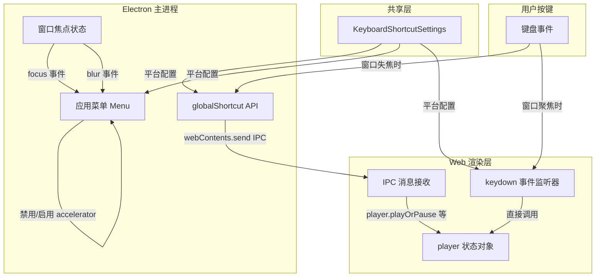

R3PLAYX 的键盘快捷键系统是一个跨越 Electron 主进程与 Web 渲染层的双通道架构——当窗口聚焦时由 Web 层的键盘事件监听器驱动，当窗口失焦时由 Electron 的 `globalShortcut` API 与应用菜单接管。这种设计确保了用户无论应用是否在前台，都能通过快捷键控制播放，同时避免了两种通道之间的重复触发问题。系统支持 macOS（darwin）、Windows（win32）、Linux 三平台差异化键位配置，并提供用户自定义绑定、冲突检测与一键恢复出厂等完整的设置界面。

Sources: [keyboardShortcuts.ts](packages/desktop/main/keyboardShortcuts.ts#L1-L141), [useApplyKeyboardShortcuts.ts](packages/web/hooks/useApplyKeyboardShortcuts.ts#L1-L111)

## 类型体系：三级类型模型

快捷键的类型定义位于共享层，采用三级类型嵌套，从原子项到平台聚合逐层构建：

- **`KeyboardShortcutItem`**：最基础的快捷键项，定义为 `[string[] | null, string[] | null]`——一个二元组，索引 `[0]` 为**应用内快捷键**（local），索引 `[1]` 为**全局快捷键**（global）。`null` 表示该槽位未绑定。数组元素使用 `KeyboardEvent.code` 格式的字符串（如 `'KeyP'`、`'Space'`、`'Cmd'`）。

- **`KeyboardShortcuts`**：单个平台的快捷键集合，包含 7 个功能项：`playPause`、`next`、`previous`、`volumeUp`、`volumeDown`、`favorite`、`switchVisibility`。

- **`KeyboardShortcutSettings`**：完整的用户配置，包含 `globalEnabled`（全局快捷键开关）、`localEnabled`（应用内快捷键开关），以及 `darwin`、`win32`、`linux` 三个平台的 `KeyboardShortcuts` 实例。

| 类型层级 | 作用域 | 关键字段 |
|---|---|---|
| `KeyboardShortcutItem` | 单个功能的双通道绑定 | `[local, global]` |
| `KeyboardShortcuts` | 单平台全部功能绑定 | `playPause`, `next`, `previous`, `volumeUp`, `volumeDown`, `favorite`, `switchVisibility` |
| `KeyboardShortcutSettings` | 跨平台完整配置 | `globalEnabled`, `localEnabled`, `darwin`, `win32`, `linux` |

Sources: [interface.d.ts](packages/shared/interface.d.ts#L251-L273)

## 默认键位配置

默认键位通过 `getKeyboardShortcutDefaultSettings()` 工厂函数生成，三平台采用差异化修饰键策略——macOS 使用 `Cmd`（`Meta` 键），Windows/Linux 使用 `Ctrl+Shift` 组合，以避免与系统级快捷键冲突：

| 功能 | macOS 应用内 | macOS 全局 | Windows/Linux 应用内 | Windows/Linux 全局 |
|---|---|---|---|---|
| 播放/暂停 | `Space` | `Cmd+P` | `Space` | `Ctrl+Shift+P` |
| 下一首 | `→` | `Cmd+→` | `→` | `Ctrl+Shift+→` |
| 上一首 | `←` | `Cmd+←` | `←` | `Ctrl+Shift+←` |
| 音量增加 | `↑` | `Cmd+↑` | `↑` | `Ctrl+Shift+↑` |
| 音量减少 | `↓` | `Cmd+↓` | `↓` | `Ctrl+Shift+↓` |
| 喜欢 | `L` | `Cmd+L` | `L` | `Ctrl+Shift+L` |
| 显示/隐藏 | `M` | `Cmd+M` | `M` | `Ctrl+Shift+M` |

注意 `switchVisibility`（显示/隐藏播放器）仅在全局通道中有意义——应用内时窗口已然可见，无需此功能，因此设置界面中该功能的 local 列被隐藏（`hideLocal` 属性）。

Sources: [defaultSettings.ts](packages/shared/defaultSettings.ts#L1-L31), [KeyboardShortcuts.tsx](packages/web/pages/Settings/KeyboardShortcuts.tsx#L307-L312)

## 架构全景：双通道快捷键分发

下面这张架构图展示了从用户按键到播放器动作的完整数据流，涵盖了两个通道的分发逻辑与它们之间的切换机制：

**核心设计原则**：窗口聚焦时，菜单快捷键被禁用（`isBindingShortcuts = false`），由 Web 层的 `keydown` 事件监听器处理按键，直接调用 `player` 状态对象的方法；窗口失焦时，菜单快捷键被启用，同时 Electron 的 `globalShortcut` API 注册全局热键，两者通过 IPC 通道向渲染层发送消息，由 `ipcRenderer.ts` 中的监听器转发给 `player`。

Sources: [keyboardShortcuts.ts](packages/desktop/main/keyboardShortcuts.ts#L21-L63), [useApplyKeyboardShortcuts.ts](packages/web/hooks/useApplyKeyboardShortcuts.ts#L85-L107), [ipcRenderer.ts](packages/web/ipcRenderer.ts#L29-L74)

## 主进程：全局快捷键注册与菜单快捷键

### 全局快捷键绑定

`bindingGlobalKeyboardShortcuts` 函数负责注册操作系统级的全局热键。它首先调用 `globalShortcut.unregisterAll()` 清除所有已注册的快捷键，然后检查 `globalEnabled` 开关——若关闭则直接返回。启用时，逐项读取当前平台的 `KeyboardShortcuts` 配置，将每个功能的全局键位（索引 `[1]`）通过 `formatForAccelerator` 转换为 Electron Accelerator 格式后注册到 `globalShortcut`。注册成功后，按键触发时会通过 `webContents.send` 向渲染进程发送对应的 IPC 通道消息（如 `IpcChannels.PlayOrPause`、`IpcChannels.Next` 等）。

### 格式转换器：formatForAccelerator

`formatForAccelerator` 函数将存储格式（`KeyboardEvent.code` 风格）转换为 Electron Accelerator 格式。它对数组中每个元素执行三步正则替换：`KeyX` → `X`（字母键）、`DigitN` → `N`（数字键）、`NumberPad` 前缀移除（小键盘），然后用 `+` 连接。例如 `['Cmd', 'KeyP']` 转换为 `"Cmd+P"`。

### 菜单快捷键与焦点切换

`createMenu` 函数构建 Electron 应用菜单，在"控制"子菜单中为每个功能项设置 `accelerator` 属性。关键在于第二个参数 `isBindingShortcuts`——当传入 `false` 时，所有菜单项的 `accelerator` 被设为 `undefined`，从而禁用菜单快捷键。

`bindingKeyboardShortcuts` 的核心逻辑是监听窗口的 `focus`/`blur` 事件，动态切换菜单快捷键的启用状态：

- **窗口聚焦**（`focus`）→ `mainWindowFocused = true` → `createMenu(webContexts, false)` → 菜单快捷键禁用，由 Web 层接管
- **窗口失焦**（`blur`）→ `mainWindowFocused = false` → `createMenu(webContexts, true)` → 菜单快捷键启用，弥补 Web 层无法接收按键的空缺

窗口关闭时（`close` 事件），监听器被移除并重置状态。

Sources: [keyboardShortcuts.ts](packages/desktop/main/keyboardShortcuts.ts#L65-L141), [menu.ts](packages/desktop/main/menu.ts#L1-L166)

## Web 层：键盘事件监听与动作分发

### useKeyboardShortcuts Hook

该 Hook 从 Valtio 设置状态中提取当前平台的快捷键配置。它组合 `useSettings`（获取完整的 `keyboardShortcuts` 配置）与 `useOSPlatform`（确定当前平台），通过 `useMemo` 返回当前平台的 `KeyboardShortcuts` 对象，避免不必要的重新计算。

Sources: [useKeyboardShortcuts.ts](packages/web/hooks/useKeyboardShortcuts.ts#L1-L17)

### useApplyKeyboardShortcuts Hook

这是 Web 层快捷键系统的核心执行器，在 `App.tsx` 顶层调用一次。其工作流程分为三层：

**1. 事件绑定层**：在 `useEffect` 中注册 `window` 的 `keydown` 事件监听器。监听器首先过滤掉 `INPUT` 和 `TEXTAREA` 元素上的按键（避免在输入框中触发快捷键），然后将事件传递给 `tryEmit`。

**2. 键位匹配层**（`tryEmit`）：遍历所有快捷键条目，对每一条执行五项检查——`metaKey` 与修饰键匹配、`altKey` 与修饰键匹配、`ctrlKey` 与修饰键匹配、`shiftKey` 与修饰键匹配、`event.code` 与键位数组最后一个元素匹配。平台差异通过修饰键名称映射处理：macOS 上 `Meta` 键对应 `Cmd`，其他平台对应 `Super`；macOS 上 `Alt` 键对应 `Option`，其他平台对应 `Alt`。匹配成功时调用 `event.preventDefault()` 阻止浏览器默认行为。

**3. 动作分发层**：通过 `switch` 语句将匹配到的功能名映射到 `player` 状态对象的方法调用：`playPause` → `player.playOrPause()`、`next` → `player.nextTrack()`、`previous` → `player.prevTrack()`、`volumeUp` → `player.volume += 0.1`、`volumeDown` → `player.volume -= 0.1`、`favorite` → `likeATrack.mutateAsync(track.id)`。

Sources: [useApplyKeyboardShortcuts.ts](packages/web/hooks/useApplyKeyboardShortcuts.ts#L1-L111), [App.tsx](packages/web/App.tsx#L9-L11)

### IPC 消息接收层

当全局快捷键或菜单快捷键在主进程触发后，通过 IPC 通道将消息发送到渲染层。`ipcRenderer.ts` 中注册了对应的监听器：`PlayOrPause` → `player.playOrPause()`、`Next` → `player.nextTrack()`、`Previous` → `player.prevTrack()`、`VolumeUp` → `player.volume += 0.1`、`VolumeDown` → `player.volume -= 0.1`。`Like` 通道在 `IpcRendererReact.tsx` 中单独处理，触发歌曲收藏操作。这使得无论快捷键从哪个通道进入，最终都汇聚到同一个 `player` 状态对象。

Sources: [ipcRenderer.ts](packages/web/ipcRenderer.ts#L29-L74), [IpcRendererReact.tsx](packages/web/IpcRendererReact.tsx#L20-L23)

## IPC 通信协议

快捷键系统使用三个专用 IPC 通道实现渲染层与主进程的协同：

| IPC 通道 | 方向 | 参数 | 用途 |
|---|---|---|---|
| `BindKeyboardShortcuts` | Renderer → Main | `{ shortcuts: KeyboardShortcutSettings }` | 用户修改快捷键后，将新配置同步到主进程重新注册 |
| `setInAppShortcutsEnabled` | Renderer → Main | `{ enabled: boolean }` | 控制是否响应菜单快捷键（调用 `setIgnoreMenuShortcuts`） |
| `PlayOrPause` / `Next` / `Previous` / `VolumeUp` / `VolumeDown` / `Like` | Main → Renderer | 各异 | 全局/菜单快捷键触发后通知渲染层执行播放控制 |

`BindKeyboardShortcuts` 在主进程的 `ipcMain.ts` 中被处理，调用 `bindingKeyboardShortcuts(ev.sender, shortcuts)` 重新注册所有快捷键。`setInAppShortcutsEnabled` 通过 `ev.sender.setIgnoreMenuShortcuts(!enabled)` 控制渲染进程是否忽略菜单快捷键事件。

Sources: [IpcChannels.ts](packages/shared/IpcChannels.ts#L44-L46), [IpcChannels.ts](packages/shared/IpcChannels.ts#L116-L117), [ipcMain.ts](packages/desktop/main/ipcMain.ts#L382-L393)

## 平台检测机制

平台信息在两个层面获取：

**主进程侧**：`getPlatform()` 直接调用 `os.platform()`，返回 `'darwin'`、`'win32'` 或 `'linux'`。渲染进程通过 `IpcChannels.GetPlatform` IPC 通道向主进程查询。

**渲染层侧**（`useOSPlatform` Hook）：优先通过 `window.ipcRenderer?.invoke(IpcChannels.GetPlatform)` 获取主进程返回的精确平台信息；若 `window.ipcRenderer` 不存在（即 Web 模式而非桌面模式），则回退到基于 `navigator.userAgent` 和 `navigator.platform` 的客户端检测。

Sources: [utils.ts](packages/desktop/main/utils.ts#L45-L47), [useOSPlatform.ts](packages/web/hooks/useOSPlatform.ts#L1-L34)

## 设置界面：绑定、冲突检测与恢复

设置界面位于 `Settings/KeyboardShortcuts.tsx`，包含三个组件模块：

### ShortcutSwitchSettings

全局快捷键总开关，切换 `settings.keyboardShortcuts.globalEnabled` 并通过 `IpcChannels.BindKeyboardShortcuts` 将变更同步到主进程。

### ShortcutBindingInput

快捷键绑定输入组件，实现交互式键位录制。用户点击组件进入绑定模式（`isBinding = true`），按下组合键后 `onKeyDown` 处理器将修饰键映射为平台特定名称（macOS: `Cmd`/`Option`；其他: `Super`/`Alt`），非修饰键以 `e.code` 格式存储。`Enter` 确认绑定，`Escape` 清除绑定。显示时通过 `keyNameMap` 将内部名称转换为平台原生的符号表示（如 macOS 上 `Cmd` → `⌘`、`Option` → `⌥`、`Shift` → `⇧`、`Control` → `⌃`）。

### 冲突检测

`updateBinding` 函数在用户确认绑定时执行两项验证：

1. **合法性校验**：应用内快捷键不允许以修饰键结尾（必须有普通键），全局快捷键必须包含至少一个修饰键（`length > 1`）。
2. **冲突检测**：遍历当前平台所有快捷键条目，检查新绑定值是否与同索引位或交叉索引位的已有绑定重复。冲突时弹出错误提示。

### RestoreFactorySettings

一键恢复出厂设置，调用 `getKeyboardShortcutDefaultSettings()` 重置全部快捷键配置并通过 IPC 同步到主进程。

Sources: [KeyboardShortcuts.tsx](packages/web/pages/Settings/KeyboardShortcuts.tsx#L1-L349)

## 配置持久化

快捷键配置通过两个路径持久化：

- **Web 层**：`settings` 状态对象基于 Valtio `proxy`，通过 `subscribe` 监听变更并写入 `localStorage`，同时通过 `IpcChannels.SyncSettings` 同步到主进程的 `electron-store`。
- **主进程层**：`bindingKeyboardShortcuts` 在接收到新配置时调用 `store.set('settings.keyboardShortcuts', shortcuts)` 写入 `electron-store`，下次启动时由 `readKeyboardShortcutSettings` 读取。

两层存储确保了即使 Web 层的 `localStorage` 被清除，主进程的 `electron-store` 仍能保留快捷键配置。

Sources: [settings.ts](packages/web/states/settings.ts#L63-L81), [keyboardShortcuts.ts](packages/desktop/main/keyboardShortcuts.ts#L7-L15), [store.ts](packages/desktop/main/store.ts#L1-L36)

## 主进程启动初始化

在 Electron 主进程的 `Main` 类构造函数中，`app.whenReady()` 回调内依次调用：

1. `createMenu(this.win!.webContents)` — 创建初始菜单（不绑定快捷键）
2. `bindingKeyboardShortcuts(this.win!.webContents, undefined, this.win!)` — 注册全局快捷键并设置焦点切换监听

第二个参数 `undefined` 表示使用存储中的配置（而非传入新配置），第三个参数传入 `BrowserWindow` 实例以启用焦点/失焦事件监听。

Sources: [index.ts](packages/desktop/main/index.ts#L58-L59)

## 延伸阅读

- 快捷键系统与 IPC 通道的定义密切相关，详见 [Electron 进程间通信（IPC）：通道定义与类型安全](7-electron-jin-cheng-jian-tong-xin-ipc-tong-dao-ding-yi-yu-lei-xing-an-quan)
- 快捷键触发后最终作用于 Valtio 播放器状态，详见 [状态管理架构：Valtio 响应式状态与持久化](13-zhuang-tai-guan-li-jia-gou-valtio-xiang-ying-shi-zhuang-tai-yu-chi-jiu-hua) 与 [播放器核心：Howler.js 音频引擎与播放控制](14-bo-fang-qi-he-xin-howler-js-yin-pin-yin-qing-yu-bo-fang-kong-zhi)
- 菜单快捷键作为应用菜单的一部分，与系统集成紧密相关，详见 [系统托盘、任务栏与 Touch Bar 集成](11-xi-tong-tuo-pan-ren-wu-lan-yu-touch-bar-ji-cheng)