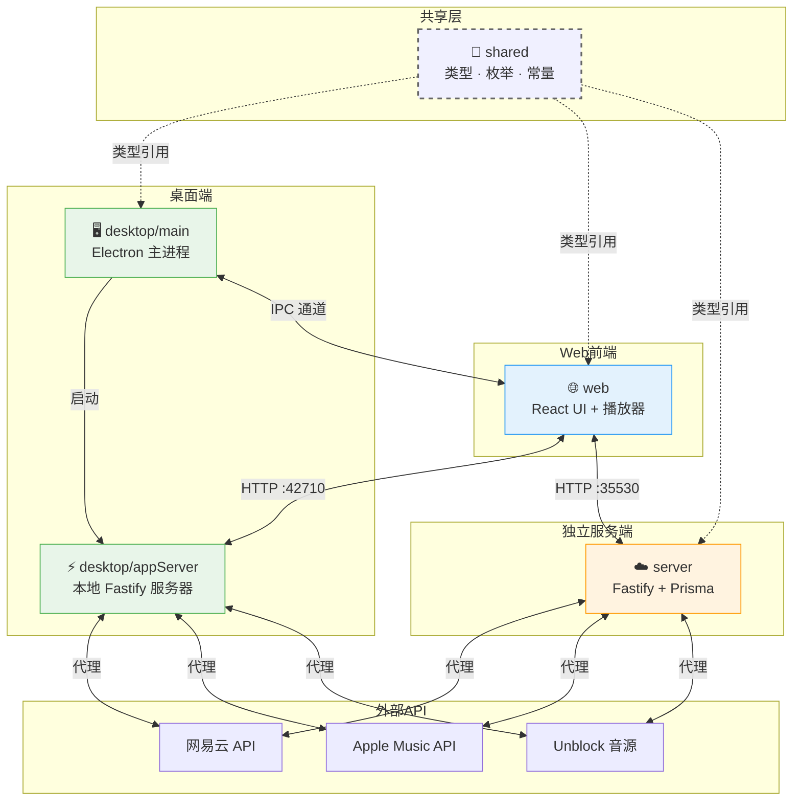

R3PLAYX 采用 **Monorepo（单体仓库）** 架构，将桌面端、Web 端、独立服务端和共享类型层统一管理在同一个 Git 仓库中。这种组织方式使得跨包的类型共享、依赖对齐和原子化提交成为可能，是理解整个项目开发工作流的基础前提。本文将从顶层目录出发，逐层拆解四个子包的职责边界与协作关系，帮助你建立对项目全局结构的清晰认知。

Sources: [package.json](package.json#L1-L49), [CLAUDE.md](CLAUDE.md#L1-L50)

## 顶层目录与工程配置

仓库根目录承载着全局工程配置，协调所有子包的构建、代码风格和依赖版本。核心文件一览：

| 文件 | 作用 |
|---|---|
| `pnpm-workspace.yaml` | 声明 PNPM 工作区，将 `packages/*` 下的所有目录识别为子包 |
| `turbo.json` | Turborepo 构建流水线定义，编排子包间的构建依赖与缓存策略 |
| `package.json` | 根包配置，定义全局脚本（`dev`、`build`、`lint` 等）和共享开发依赖 |
| `.eslintrc.js` | 全局 ESLint 规则，覆盖 React + TypeScript 代码风格 |
| `prettier.config.js` | Prettier 格式化规则，含 Tailwind CSS 类名排序插件 |
| `.env.example` | 环境变量模板，定义端口和 API 路径前缀 |
| `docker-compose.yml` | Docker Compose 编排，用于 Web + Server 容器化部署 |

根目录的 `package.json` 将 `pnpm@8.6.12` 锁定为包管理器，并通过 `engines` 字段要求 Node.js ≥ 16.0.0。全局脚本通过 `turbo run` 委托给 Turborepo 执行，例如 `pnpm dev` 实际运行的是 `cross-env-shell IS_ELECTRON=yes turbo run dev --parallel`，它会并行启动所有子包的开发服务器。`pnpm build` 则通过 `dependsOn: ["^build"]` 保证依赖包先于消费包构建，确保类型和产物的一致性。

Sources: [package.json](package.json#L11-L24), [pnpm-workspace.yaml](pnpm-workspace.yaml#L1-L3), [turbo.json](turbo.json#L1-L38), [.eslintrc.js](.eslintrc.js#L1-L28), [docker-compose.yml](docker-compose.yml#L1-L19)

## 四大子包概览

项目通过 `pnpm-workspace.yaml` 将 `packages/*` 声明为工作区成员，形成四个职责清晰的子包：

```
packages/
├── desktop/     🖥️  Electron 桌面端（主进程 + 本地服务器 + SQLite）
├── server/      ☁️  独立后端服务（Fastify + Prisma + SQLite）
├── shared/      🔗  共享类型定义与常量（IPC 通道、API 接口、数据模型）
└── web/         🌐  React 前端应用（Vite + Tailwind + Valtio）
```

每个子包拥有独立的 `package.json` 和 `tsconfig.json`，可以单独安装依赖、运行脚本和构建，但通过 PNPM 工作区和 Turborepo 实现统一编排。`shared` 包不产出运行时代码，而是作为纯类型层被其他三个包通过路径别名 `@/shared/...` 直接引用。

Sources: [pnpm-workspace.yaml](pnpm-workspace.yaml#L1-L3), [CLAUDE.md](CLAUDE.md#L104-L116)

### 子包职责与定位

| 子包 | 运行环境 | 核心技术栈 | 主要职责 |
|---|---|---|---|
| **desktop** | Electron 主进程 | Electron 28、Fastify 4、better-sqlite3 | 桌面端窗口管理、IPC 通信、本地 API 服务器、SQLite 缓存、系统托盘/快捷键 |
| **server** | Node.js 服务端 | Fastify 4、Prisma 5、SQLite | 独立部署的后端 API，代理网易云/Apple Music API，数据库持久化 |
| **shared** | 纯类型层（编译时） | TypeScript | IPC 通道枚举、缓存 API 类型映射、核心数据结构（Track/Album/Artist）、默认配置 |
| **web** | 浏览器 + Electron 渲染进程 | React 18、Vite 4、Valtio、Howler.js | 用户界面、播放器控制、状态管理、API 请求与缓存 |

Sources: [packages/desktop/package.json](packages/desktop/package.json#L1-L69), [packages/server/package.json](packages/server/package.json#L1-L47), [packages/web/package.json](packages/web/package.json#L1-L87), [packages/shared/tsconfig.json](packages/shared/tsconfig.json#L1-L19)

## 子包间依赖与数据流

四个子包并非孤立存在，它们通过明确的数据流和类型契约形成协作网络。下图展示了核心的数据流向和依赖关系：



**关键协作模式解读：**

- **shared → 所有子包**：通过路径别名 `@/shared/...` 实现编译时类型共享，虚线表示这是类型依赖而非运行时依赖。`IpcChannels.ts` 定义了 28 个 IPC 通道的枚举、参数类型和返回值类型，确保桌面端主进程与渲染进程之间的通信类型安全。
- **desktop/main ↔ web**：Electron 主进程与渲染进程（即 web 包的 React 应用）通过 IPC 通道双向通信，主进程处理窗口控制、系统托盘等原生能力，渲染进程负责 UI 交互。
- **web → desktop/appServer**：开发模式下 Vite 开发服务器将 `/netease/` 路径的请求代理到本地 Fastify 服务器（端口 30001 或 42710），生产模式下 Electron 直接加载 Fastify 提供的静态文件和 API。
- **web → server**：Web 独立部署模式下，React 前端通过 HTTP 请求连接独立服务端（端口 35530），无需 Electron 参与。

Sources: [packages/desktop/main/appServer/appServer.ts](packages/desktop/main/appServer/appServer.ts#L1-L44), [packages/desktop/main/index.ts](packages/desktop/main/index.ts#L47-L63), [packages/web/vite.config.ts](packages/web/vite.config.ts#L96-L109), [packages/shared/IpcChannels.ts](packages/shared/IpcChannels.ts#L1-L46)

## 各子包内部结构详解

### desktop — Electron 桌面端

`desktop` 包是整个项目最复杂的子包，它同时承担 Electron 主进程管理和本地 API 服务器两个角色。入口文件 `main/index.ts` 定义了 `Main` 类，在 `app.whenReady()` 后依次初始化本地 Fastify 服务器、创建窗口、注册 IPC 处理器、绑定快捷键和系统托盘。

```
packages/desktop/
├── main/                          # Electron 主进程源码
│   ├── index.ts                   # 主入口：Main 类，启动窗口与服务
│   ├── preload.ts                 # 预加载脚本：设置用户数据路径
│   ├── rendererPreload.ts         # 渲染进程预加载脚本
│   ├── ipcMain.ts                 # IPC 通道处理器注册
│   ├── appServer/                 # 本地 Fastify 服务器
│   │   ├── appServer.ts           # 服务器初始化与路由挂载
│   │   └── routes/                # API 路由（netease / apple_music）
│   ├── db.ts                      # better-sqlite3 数据库操作
│   ├── cache.ts                   # API 缓存管理
│   ├── store.ts                   # electron-store 配置持久化
│   ├── tray.ts                    # 系统托盘
│   ├── touchBar.ts                # macOS Touch Bar
│   ├── menu.ts                    # 应用菜单
│   ├── keyboardShortcuts.ts       # 全局快捷键
│   ├── windowsTaskbar.ts          # Windows 任务栏控制
│   ├── lyricsWindow.ts            # 桌面歌词窗口
│   ├── updateWindow.ts            # 自动更新
│   └── env.ts                     # 环境检测（dev/prod/mac/win/linux）
├── migrations/init.sql            # SQLite 初始化脚本（11 张缓存表）
├── scripts/
│   ├── build.main.ts              # esbuild 构建主进程
│   └── build.sqlite3.ts           # 编译 better-sqlite3 原生模块
├── assets/                        # 应用图标等静态资源
└── .electron-builder.config.js    # electron-builder 打包配置
```

桌面端的 SQLite 数据库采用 **JSON 序列化缓存** 策略——每张表（Track、Album、Playlist 等）仅存储 `id` 和完整的 `json` 字段，查询时反序列化返回。这与服务端的 Prisma ORM 形成了鲜明对比：桌面端追求极致的写入性能和零迁移成本，服务端则需要结构化查询能力。

Sources: [packages/desktop/main/index.ts](packages/desktop/main/index.ts#L28-L71), [packages/desktop/main/env.ts](packages/desktop/main/env.ts#L1-L7), [packages/desktop/migrations/init.sql](packages/desktop/migrations/init.sql#L1-L85)

### server — 独立后端服务

`server` 包是一个基于 Fastify CLI 脚手架搭建的独立后端，使用 **自动加载** 机制扫描 `plugins/` 和 `routes/` 目录，无需手动注册每个路由和插件。数据库层采用 Prisma ORM 管理 SQLite，定义了 Album、Artist 等结构化模型，与桌面端的 JSON 缓存表设计理念不同。

```
packages/server/
├── src/
│   ├── app.ts                     # Fastify 应用入口：注册 AutoLoad 插件和路由
│   ├── plugins/                   # Fastify 插件（Prisma、Sensible、Support）
│   ├── routes/                    # API 路由（按功能分目录）
│   │   ├── netease/               # 网易云音乐代理（netease / unblock / audio）
│   │   ├── apple-music/           # Apple Music 代理（album / artist / check-token）
│   │   └── root.ts                # 根路由
│   └── utils/                     # 工具函数（缓存、数据库、日志、Apple Music 请求）
├── prisma/
│   ├── schema.prisma              # Prisma 数据模型定义
│   ├── init.sql                   # 初始化 SQL
│   └── musicInfo.db               # SQLite 数据库文件
└── .env.example                   # 环境变量模板（Apple Music Token、数据库连接）
```

服务端默认监听 `0.0.0.0:35530`，适合 Docker 容器化部署。其核心职责是代理网易云音乐 API 和 Apple Music API，同时集成 Unblock 音源解锁服务。

Sources: [packages/server/src/app.ts](packages/server/src/app.ts#L1-L20), [packages/server/package.json](packages/server/package.json#L1-L13), [packages/server/prisma/schema.prisma](packages/server/prisma/schema.prisma#L1-L45)

### shared — 共享类型与常量层

`shared` 包是整个项目的 **类型契约中心**，它不产出任何运行时代码，而是通过 TypeScript 的路径别名机制被其他包直接引用。这种设计确保了桌面端和服务端对同一数据结构（如 Track、Album）的类型定义完全一致，避免了接口不匹配的运行时错误。

```
packages/shared/
├── IpcChannels.ts                 # IPC 通道枚举 + 参数/返回值类型映射（28 个通道）
├── CacheAPIs.ts                   # 缓存 API 枚举 + 请求参数/响应类型映射（18 个接口）
├── playerDataTypes.ts             # 播放器数据类型（RepeatMode 枚举）
├── AppleMusic.ts                  # Apple Music 数据类型（Album、Artist）
├── defaultSettings.ts             # 默认键盘快捷键配置（macOS / Windows / Linux）
├── interface.d.ts                 # 核心数据结构全局类型声明（Track / Album / Artist / User / Video）
├── api/                           # 各 API 响应类型定义
│   ├── Album.ts                   # 专辑 API 响应
│   ├── Artist.ts                  # 歌手 API 响应
│   ├── Track.ts                   # 歌曲与音源 API 响应
│   ├── Playlists.ts               # 歌单 API 响应
│   ├── Search.ts                  # 搜索 API 响应
│   ├── User.ts                    # 用户 API 响应
│   └── AppleMusic.ts              # Apple Music API 响应
├── db/                            # 数据库模型类型
│   ├── netease.ts                 # 网易云数据库类型
│   ├── appleMusic.ts              # Apple Music 数据库类型
│   └── replay.ts                  # Replay 数据库类型
└── tsconfig.json                  # 配置 @/* 路径别名指向 packages/
```

其中 `IpcChannels.ts` 是桌面端通信的类型安全基石——它通过 `const enum` 定义通道名称，再通过 `IpcChannelsParams` 和 `IpcChannelsReturns` 两个映射类型为每个通道的参数和返回值提供精确的类型约束。`CacheAPIs.ts` 采用相同的模式，为 18 个缓存 API 端点建立了完整的参数-响应类型链。`interface.d.ts` 使用全局类型声明（`declare interface`），使得 Track、Album、Artist 等核心类型在整个项目中无需显式导入即可使用。

Sources: [packages/shared/IpcChannels.ts](packages/shared/IpcChannels.ts#L1-L46), [packages/shared/CacheAPIs.ts](packages/shared/CacheAPIs.ts#L25-L49), [packages/shared/interface.d.ts](packages/shared/interface.d.ts#L1-L66), [packages/shared/defaultSettings.ts](packages/shared/defaultSettings.ts#L1-L31)

### web — React 前端应用

`web` 包是项目最庞大的子包，承载了全部用户界面逻辑。它同时服务于两个运行场景：作为 Electron 渲染进程（桌面端 UI）和作为独立 Web 应用（浏览器访问）。两个场景共享同一套 React 组件代码，通过 `IpcRendererReact` 组件检测运行环境自动适配通信方式。

```
packages/web/
├── main.tsx                       # 应用入口
├── App.tsx                        # 根组件：ErrorBoundary + Layout + IpcRendererReact
├── index.html                     # HTML 模板
├── components/                    # 60+ React 组件
│   ├── Layout.tsx / LayoutMobile.tsx  # 桌面/移动端布局
│   ├── Player.tsx / PlayerMobile.tsx  # 播放器组件
│   ├── Router.tsx                 # 路由定义
│   ├── TrackList/                 # 歌曲列表（含虚拟滚动）
│   ├── LyricsWindow/              # 歌词显示
│   ├── ContextMenus/              # 右键菜单
│   └── ...                        # 更多 UI 组件
├── pages/                         # 页面组件
│   ├── Discover.tsx               # 发现音乐
│   ├── My/                        # 我的音乐
│   ├── Browse/                    # 浏览
│   ├── Album/                     # 专辑详情
│   ├── Artist/                    # 歌手详情
│   ├── Playlist/                  # 歌单详情
│   ├── Search/                    # 搜索
│   ├── Settings/                  # 设置
│   └── Lyrics/                    # 歌词页
├── states/                        # Valtio 状态管理
│   ├── player.ts                  # 播放器状态（持久化到 localStorage）
│   ├── settings.ts                # 用户设置（持久化）
│   ├── uiStates.ts                # UI 状态（非持久化）
│   ├── persistedUiStates.ts       # 持久化 UI 状态
│   ├── contextMenus.ts            # 右键菜单状态
│   └── scrollPositions.ts         # 滚动位置记忆
├── api/                           # API 请求层（TanStack React Query）
├── hooks/                         # 自定义 React Hooks
├── i18n/                          # 国际化（zh-CN / en-US）
├── utils/                         # 工具函数
├── styles/                        # 全局样式 + 主题色 CSS
├── assets/                        # 静态资源（图标、字体、图片）
└── vite.config.ts                 # Vite 构建配置（含代理和 PWA 插件）
```

Web 包的 Vite 配置在开发模式下将 `/netease/` 路径代理到本地 API 服务器，并设置了 `IS_ELECTRON` 环境变量来切换构建目标（Electron 模式使用 `esnext`，Web 模式使用 `modules`）。当 `IS_ELECTRON=yes` 时，VitePWA 插件会启用以支持桌面端的离线缓存能力。

Sources: [packages/web/App.tsx](packages/web/App.tsx#L1-L27), [packages/web/vite.config.ts](packages/web/vite.config.ts#L20-L109), [packages/web/package.json](packages/web/package.json#L1-L87)

## 两种运行模式下的架构差异

理解 R3PLAYX 项目结构的关键在于把握 **桌面端模式** 和 **Web 模式** 的架构差异——同一个 `web` 包在两种模式下连接的后端完全不同：

| 维度 | 桌面端模式 | Web 模式 |
|---|---|---|
| 前端载体 | Electron BrowserWindow | 浏览器 |
| 后端服务 | desktop/appServer（本地 Fastify） | server 包（独立 Fastify） |
| 通信方式 | IPC 通道 + HTTP 请求 | 仅 HTTP 请求 |
| 数据库 | better-sqlite3（JSON 缓存表） | Prisma + SQLite（结构化模型） |
| API 代理 | desktop/appServer 内置路由 | server/src/routes/ |
| 启动端口 | Vite dev :42710 / API :30001 | server :35530 |
| 路由方式 | HashRouter | HashRouter |
| 离线支持 | VitePWA + 本地服务器 | 无 |

在桌面端模式下，Electron 主进程启动后首先初始化本地 Fastify 服务器（生产模式端口 42710），随后创建 BrowserWindow 加载该服务器提供的页面。渲染进程通过 IPC 通道与主进程通信（窗口控制、快捷键等），通过 HTTP 请求访问本地 API 代理。而在 Web 模式下，前端通过 Vite 开发服务器或静态文件部署，后端则连接独立的 server 包。

Sources: [packages/desktop/main/appServer/appServer.ts](packages/desktop/main/appServer/appServer.ts#L33-L44), [packages/web/vite.config.ts](packages/web/vite.config.ts#L96-L109), [packages/server/src/app.ts](packages/server/src/app.ts#L1-L20), [packages/desktop/main/index.ts](packages/desktop/main/index.ts#L144-L146)

## Turborepo 构建编排

Turborepo 负责协调子包间的构建顺序和并行策略。`turbo.json` 定义了四个流水线阶段：

| 阶段 | 依赖关系 | 缓存 | 产物目录 | 说明 |
|---|---|---|---|---|
| `post-install` | 无 | 关闭 | — | 安装后初始化（编译 SQLite、生成 Prisma Client） |
| `dev` | 无 | 关闭 | — | 并行启动所有子包的开发服务器 |
| `build` | `^build`（先构建依赖包） | 关闭 | `dist/**` | 按依赖拓扑序构建 |
| `pack` / `pack:test` | 无 | 关闭 | `release/**` | electron-builder 打包桌面端安装包 |

`build` 阶段的 `"dependsOn": ["^build"]` 是关键——符号 `^` 表示"先构建所有依赖包"，这确保了 `shared` 的类型定义在 `desktop`、`web`、`server` 构建之前已经就绪。所有阶段的缓存均设为 `false`，这是因为项目目前处于快速迭代期，缓存带来的不确定性高于收益。

Sources: [turbo.json](turbo.json#L1-L38), [package.json](package.json#L15-L23)

## 环境变量与端口配置

项目通过根目录 `.env` 文件统一管理端口和 API 路径，三个关键变量决定了开发模式下的网络拓扑：

| 变量 | 默认值 | 作用 |
|---|---|---|
| `ELECTRON_WEB_SERVER_PORT` | `42710` | Electron 生产模式下的本地 Web 服务器端口 |
| `ELECTRON_DEV_NETEASE_API_PORT` | `30001` | 开发模式下网易云音乐 API 代理端口 |
| `VITE_APP_NETEASE_API_URL` | `/netease` | Vite 代理的 API 路径前缀 |

桌面端主进程在开发模式下连接 `ELECTRON_DEV_NETEASE_API_PORT`（30001），生产模式下连接 `ELECTRON_WEB_SERVER_PORT`（42710）。Vite 开发服务器将 `/netease/` 路径的请求代理到对应端口，实现了前后端的开发时解耦。

Sources: [.env.example](.env.example#L1-L3), [packages/desktop/main/appServer/appServer.ts](packages/desktop/main/appServer/appServer.ts#L33-L39), [packages/web/vite.config.ts](packages/web/vite.config.ts#L99-L104)

## 推荐阅读路径

理解了 Monorepo 的整体结构后，建议按以下路径深入各个子领域：

1. **构建编排** → [Turborepo 构建编排与 PNPM 工作区](5-turborepo-gou-jian-bian-pai-yu-pnpm-gong-zuo-qu)：理解 `turbo.json` 的流水线定义与 PNPM 工作区的依赖提升机制
2. **通信架构** → [客户端-服务端通信架构：桌面端与 Web 端的差异](6-ke-hu-duan-fu-wu-duan-tong-xin-jia-gou-zhuo-mian-duan-yu-web-duan-de-chai-yi)：深入两种模式下前端与后端的通信方式差异
3. **IPC 机制** → [Electron 进程间通信（IPC）：通道定义与类型安全](7-electron-jin-cheng-jian-tong-xin-ipc-tong-dao-ding-yi-yu-lei-xing-an-quan)：了解 `shared/IpcChannels.ts` 的类型安全设计
4. **共享类型** → [共享类型定义：Track、Album、Artist 等核心数据结构](24-gong-xiang-lei-xing-ding-yi-track-album-artist-deng-he-xin-shu-ju-jie-gou) 和 [缓存 API 枚举与类型映射](25-huan-cun-api-mei-ju-yu-lei-xing-ying-she)：掌握类型契约的完整定义