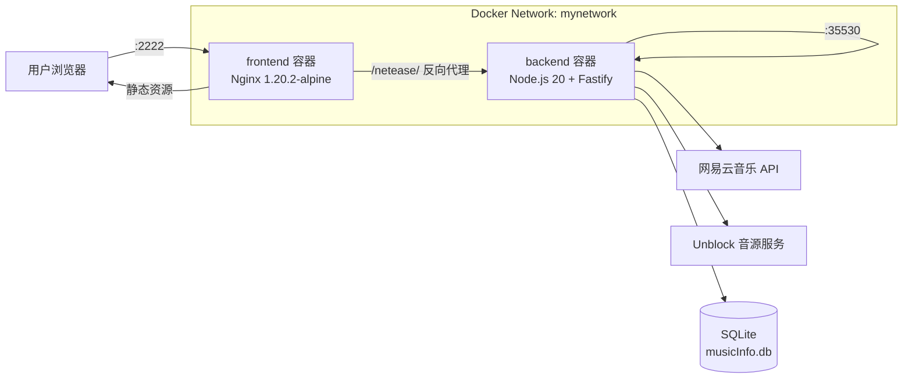
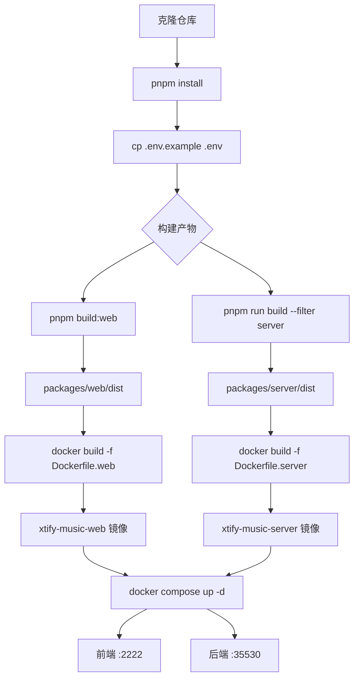

R3PLAYX 采用**双容器架构**将 Web 前端与独立服务端分离部署——前端由 Nginx 托管静态资源并反向代理 API 请求，后端以 Fastify 运行网易云音乐 API 代理与数据库服务。本文将从架构总览出发，逐一拆解 Dockerfile 编排、Nginx 反向代理配置、Docker Compose 编排，以及本地与多平台构建流程，帮助你快速完成容器化部署。

Sources: [docker-compose.yml](docker-compose.yml#L1-L19), [Dockerfile.web](Dockerfile.web#L1-L8), [Dockerfile.server](Dockerfile.server#L1-L40)

## 容器架构总览

在容器化部署中，R3PLAYX 舍弃了桌面端的 Electron 进程模型和本地 better-sqlite3 缓存，转而采用经典的前后端分离架构。前端容器仅负责静态资源托管与请求转发，后端容器承载所有业务逻辑——包括网易云音乐 API 代理、Unblock 音源解锁以及 Prisma + SQLite 数据持久化。

以下 Mermaid 图展示了两个容器之间的网络拓扑与请求流向：



**关键设计决策**：Dockerfile 采用"预构建产物拷贝"模式而非"全量源码构建"模式——即在宿主机完成 `pnpm build` 后，将 `packages/web/dist` 和 `packages/server/dist` 直接 `COPY` 进镜像。这一选择简化了 Dockerfile 的复杂度，但要求部署者在构建镜像前先完成本地构建。

Sources: [docker-compose.yml](docker-compose.yml#L1-L19), [docker/nginx.conf.example](docker/nginx.conf.example#L1-L28), [Dockerfile.web](Dockerfile.web#L1-L8), [Dockerfile.server](Dockerfile.server#L1-L40)

## 前端容器：Dockerfile.web

前端容器基于 `nginx:1.20.2-alpine` 轻量镜像，职责单一——托管 Vite 构建产物并提供反向代理：

```dockerfile
FROM nginx:1.20.2-alpine as app
COPY packages/web/dist /usr/share/nginx/html
COPY docker/nginx.conf.example /etc/nginx/conf.d/default.conf
EXPOSE 80
CMD ["sh", "-c", "nginx -g 'daemon off;'"]
```

该 Dockerfile 的构建上下文依赖于两个前提条件：① `packages/web/dist` 目录已包含 Vite 构建产物；② `docker/nginx.conf.example` 配置文件已就绪。其中 Nginx 配置替代了开发模式下 Vite 的 `server.proxy` 功能，将 `/netease/` 路径的 API 请求转发至后端容器。

| 配置项 | 值 | 说明 |
|--------|------|------|
| 基础镜像 | `nginx:1.20.2-alpine` | Alpine 变体，镜像体积约 7MB |
| 静态资源路径 | `/usr/share/nginx/html` | Nginx 默认静态文件目录 |
| 配置文件路径 | `/etc/nginx/conf.d/default.conf` | 替换默认 Nginx 配置 |
| 暴露端口 | 80 | 容器内部 HTTP 端口 |

Sources: [Dockerfile.web](Dockerfile.web#L1-L8)

## 后端容器：Dockerfile.server

后端容器的构建分为两个阶段——依赖安装与产物拷贝。与前端容器类似，它同样采用预构建产物拷贝模式，将宿主机上已编译的 `packages/server/dist` 直接复制进镜像：

```dockerfile
FROM node:20.0.0 AS builder

ENV NODE_ENV=production \
  ELECTRON_WEB_SERVER_PORT=42710 \
  ELECTRON_DEV_NETEASE_API_PORT=30001 \
  UNBLOCK_SERVER_PORT=30003 \
  VITE_APP_NETEASE_API_URL=/netease

RUN npm config set registry https://registry.npmmirror.com/
RUN pnpm config set registry https://registry.npmmirror.com/
RUN npm i -g pnpm prisma fastify-cli turbo tsx

COPY package.json /app/
WORKDIR /app
RUN pnpm i
RUN pnpm prune --prod

COPY packages/server/dist /app/
COPY packages/server/prisma /app/packages/server/prisma/
COPY packages/server/package.json /app/packages/server/
WORKDIR /app/packages/server/
RUN pnpm i
RUN pnpm prune --prod

WORKDIR /app/packages/
EXPOSE 35530
CMD ["sh", "-c", "fastify start --port 35530 --address 0.0.0.0 -l info server/src/app.js"]
```

**构建阶段解析**：容器内实际上执行了两轮依赖安装——首轮在 `/app` 根目录安装 monorepo 公共依赖，次轮在 `/app/packages/server/` 安装服务端专属依赖。两轮均使用 `pnpm prune --prod` 剔除 devDependencies，以压缩最终镜像体积。注意 Prisma schema 与数据库文件（`packages/server/prisma/`）被单独拷贝，用于在容器内生成 Prisma Client。

**启动命令**中 `--address 0.0.0.0` 是关键——Fastify 默认仅监听 `localhost`，在容器环境中必须绑定 `0.0.0.0` 才能接收来自容器网络的请求。启动路径 `server/src/app.js` 对应容器内 `/app/packages/server/src/app.js`，即 TypeScript 编译后的 Fastify 应用入口。

| 环境变量 | 默认值 | 用途 |
|----------|--------|------|
| `NODE_ENV` | `production` | 生产环境标识 |
| `ELECTRON_WEB_SERVER_PORT` | `42710` | Web 服务端口（桌面端配置，容器内不生效） |
| `ELECTRON_DEV_NETEASE_API_PORT` | `30001` | 网易云 API 端口（桌面端配置） |
| `UNBLOCK_SERVER_PORT` | `30003` | Unblock 音源端口 |
| `VITE_APP_NETEASE_API_URL` | `/netease` | 前端 API 请求前缀 |

Sources: [Dockerfile.server](Dockerfile.server#L1-L40), [packages/server/package.json](packages/server/package.json#L7-L12)

## Nginx 反向代理配置

[docker/nginx.conf.example](docker/nginx.conf.example) 是容器化部署的核心网络枢纽——它同时承担静态资源托管与 API 请求转发的双重职责：

```nginx
server {
  gzip on;
  listen       80;
  server_name  localhost;

  # 静态资源：SPA 路由回退
  location / {
    root      /usr/share/nginx/html;
    index     index.html;
    try_files $uri $uri/ /index.html;
  }

  # API 反向代理：转发至后端容器
  location /netease/ {
    proxy_buffers           16 32k;
    proxy_buffer_size       128k;
    proxy_busy_buffers_size 128k;
    proxy_set_header        Host $host;
    proxy_set_header        X-Real-IP $remote_addr;
    proxy_set_header        X-Forwarded-For $remote_addr;
    proxy_set_header        X-Forwarded-Host $remote_addr;
    proxy_set_header        X-NginX-Proxy true;
    proxy_pass              http://backend:35530/netease/;
  }
}
```

**静态资源路由**中 `try_files $uri $uri/ /index.html` 是 SPA 应用的标准配置——所有未匹配到静态文件的路径均回退至 `index.html`，由前端 HashRouter 接管路由。

**API 代理路由**中 `proxy_pass http://backend:35530/netease/` 使用了 Docker Compose 的服务名解析——`backend` 是 `docker-compose.yml` 中定义的服务名，Docker 内部 DNS 会自动将其解析为后端容器的 IP 地址。代理配置中调大了 `proxy_buffers` 和 `proxy_buffer_size`，以应对网易云音乐 API 返回的大体积 JSON 响应。

Sources: [docker/nginx.conf.example](docker/nginx.conf.example#L1-L28)

## Docker Compose 编排

[docker-compose.yml](docker-compose.yml) 定义了双服务 + 自定义网络的拓扑结构：

```yaml
version: '3'
services:
  frontend:
    restart: always
    image: sherlockouo/xtify-music-web:latest
    ports:
      - 2222:80
    networks:
      - mynetwork
  backend:
    restart: always
    image: sherlockouo/xtify-music-server:latest
    ports:
      - 35530:35530
    networks:
      - mynetwork
networks:
  mynetwork:
```

**端口映射**采用非默认端口策略——前端映射至 `2222` 而非 `80`，后端直接暴露 `35530`。前端端口使用非常规值可能是为了避免与宿主机已有 Web 服务冲突。后端端口同时暴露给宿主机，便于直接调试 API 而无需经过 Nginx 代理。

**`restart: always`** 策略确保容器在异常退出或 Docker 守护进程重启后自动恢复运行，适合生产环境无人值守场景。

**自定义网络 `mynetwork`** 为两个容器提供了隔离的通信域——Nginx 可以通过服务名 `backend` 直接访问后端容器，而外部流量仅能通过端口映射进入。

| 服务 | 镜像 | 宿主机端口 | 容器端口 | 作用 |
|------|------|-----------|---------|------|
| `frontend` | `sherlockouo/xtify-music-web:latest` | 2222 | 80 | Nginx 静态托管 + 反向代理 |
| `backend` | `sherlockouo/xtify-music-server:latest` | 35530 | 35530 | Fastify API 服务 |

Sources: [docker-compose.yml](docker-compose.yml#L1-L19)

## 构建与部署流程

### 本地构建（单平台）

[build-local-docker.sh](build-local-docker.sh) 提供了最简的本地构建入口，顺序构建两个镜像：

```bash
docker build -f Dockerfile.web  -t xtify-music-web . && 
docker build -f Dockerfile.server  -t xtify-music-server .
```

**前置条件**：执行构建脚本前，必须先在宿主机完成以下步骤，否则 Dockerfile 中的 `COPY` 指令将因缺少产物目录而失败：

```bash
# 1. 安装依赖
pnpm install

# 2. 构建 Web 前端
pnpm build:web

# 3. 构建服务端
pnpm run build --filter server
```

构建完成后，使用 Docker Compose 启动服务（需先将 `docker-compose.yml` 中的镜像名替换为本地标签 `xtify-music-web` 和 `xtify-music-server`）：

```bash
docker compose up -d
```

### 多平台构建与推送

[build-linux-docker.sh](build-linux-docker.sh) 使用 Docker Buildx 同时构建 `linux/amd64` 和 `linux/arm64` 两个架构的镜像，并直接推送至 Docker Hub：

```bash
docker buildx build --push --platform linux/amd64,linux/arm64 -f Dockerfile.web -t sherlockouo/xtify-music-web:latest . &
docker buildx build --push --platform linux/amd64,linux/arm64 -f Dockerfile.server -t sherlockouo/xtify-music-server:latest . & 
wait
```

两个构建任务通过 `&` 后台并行执行，`wait` 等待全部完成。这一脚本适用于维护者在发布新版本时，一次性生成跨架构镜像并推送至 `sherlockouo/` 命名空间下的 Docker Hub 仓库。

**Buildx 使用前提**：

```bash
# 创建并启用多架构构建器
docker buildx create --name multiarch --use
docker buildx inspect --bootstrap
```

Sources: [build-local-docker.sh](build-local-docker.sh#L1-L2), [build-linux-docker.sh](build-linux-docker.sh#L1-L3)

### 完整部署流程图

以下 Mermaid 流程图展示了从源码到运行容器的完整步骤：



Sources: [build-local-docker.sh](build-local-docker.sh#L1-L2), [.env.example](.env.example#L1-L3)

## 旧版 Dockerfile 与遗留问题

项目根目录存在一个名为 [dockerfile](dockerfile)（全小写）的遗留文件，头部标注 `# Todo: 构建docker版本`。该文件试图将 Nginx、Node.js 服务端和 Electron 桌面端打包到单一容器中——这与当前的双容器架构设计相悖，且存在以下问题：

| 问题 | 说明 |
|------|------|
| 基础镜像冲突 | 同时 `FROM nginx:latest` 和 `FROM node:16.20.1`，多阶段构建语法不正确 |
| 依赖源过时 | 使用 `registry.npm.taobao.org`（已停用），应改为 `registry.npmmirror.com` |
| 架构不合理 | 将桌面端 Electron 代码打包进 Docker 容器无实际意义 |
| 启动逻辑不完整 | 多个 `WORKDIR` 和 `node` 命令无法同时运行 |

**该文件已被 `Dockerfile.web` 和 `Dockerfile.server` 完全替代，不应在生产部署中使用。**

Sources: [dockerfile](dockerfile#L1-L52)

## 环境变量与数据持久化

### 环境变量

Docker 部署所需的环境变量与桌面端基本一致，但部分变量在容器上下文中有不同的生效方式：

| 变量名 | 位置 | Docker 场景说明 |
|--------|------|----------------|
| `VITE_APP_NETEASE_API_URL` | Dockerfile.server ENV | **构建时注入**，Vite 将其编译进前端 JS，运行时不可更改 |
| `ELECTRON_WEB_SERVER_PORT` | Dockerfile.server ENV | 仅桌面端生效，容器内无实际作用 |
| `ELECTRON_DEV_NETEASE_API_PORT` | Dockerfile.server ENV | 仅桌面端开发模式生效 |
| `UNBLOCK_SERVER_PORT` | Dockerfile.server ENV | Unblock 音源服务端口 |
| `APPLE_MUSIC_TOKEN` | packages/server/.env.example | Apple Music API 鉴权令牌，需通过 `docker compose` 环境变量注入 |

**重要提醒**：`VITE_APP_NETEASE_API_URL` 是编译时变量——它被 Vite 在构建阶段硬编码到前端 JavaScript 中，运行时无法修改。如需更改 API 代理路径，必须重新构建 Web 前端镜像。

Sources: [.env.example](.env.example#L1-L3), [Dockerfile.server](Dockerfile.server#L4-L9), [packages/server/.env.example](packages/server/.env.example#L1-L6)

### 数据持久化

当前 `docker-compose.yml` **未配置任何卷挂载**，这意味着后端容器的 SQLite 数据库（`packages/server/prisma/musicInfo.db`）在容器重建后将丢失。生产部署建议添加卷映射：

```yaml
backend:
  restart: always
  image: sherlockouo/xtify-music-server:latest
  ports:
    - 35530:35530
  volumes:
    - ./data:/app/packages/server/prisma  # 持久化 SQLite 数据库
  networks:
    - mynetwork
```

Sources: [docker-compose.yml](docker-compose.yml#L10-L16), [packages/server/prisma/schema.prisma](packages/server/prisma/schema.prisma#L1-L9)

## 部署检查清单

| 步骤 | 命令/操作 | 验证方式 |
|------|----------|---------|
| 1. 环境准备 | `cp .env.example .env` | 确认 `.env` 文件存在 |
| 2. 安装依赖 | `pnpm install` | 确认 `node_modules` 已生成 |
| 3. 构建前端 | `pnpm build:web` | 确认 `packages/web/dist/` 非空 |
| 4. 构建后端 | `pnpm run build --filter server` | 确认 `packages/server/dist/packages/server/src/app.js` 存在 |
| 5. 构建镜像 | `bash build-local-docker.sh` | `docker images` 显示两个镜像 |
| 6. 启动服务 | `docker compose up -d` | `docker compose ps` 显示两个容器 running |
| 7. 前端验证 | 浏览器访问 `http://localhost:2222` | 看到 R3PLAYX 界面 |
| 8. API 验证 | `curl http://localhost:35530/netease/` | 返回 JSON 响应 |

Sources: [build-local-docker.sh](build-local-docker.sh#L1-L2), [docker-compose.yml](docker-compose.yml#L1-L19), [.env.example](.env.example#L1-L3)

## 下一步阅读

完成容器化部署后，你可以继续深入了解 R3PLAYX 的内部架构：

- **[Turborepo 构建编排与 PNPM 工作区](5-turborepo-gou-jian-bian-pai-yu-pnpm-gong-zuo-qu)** — 理解 Docker 构建上游的 monorepo 编排机制，掌握 `pnpm build:web` 与 `pnpm run build --filter server` 的依赖图
- **[Fastify 服务端架构与自动加载机制](20-fastify-fu-wu-duan-jia-gou-yu-zi-dong-jia-zai-ji-zhi)** — 深入后端容器的路由注册与插件加载逻辑
- **[网易云音乐 API 代理与 Unblock 音源解锁](22-wang-yi-yun-yin-le-api-dai-li-yu-unblock-yin-yuan-jie-suo)** — 理解 Nginx `/netease/` 反向代理背后的 API 代理实现