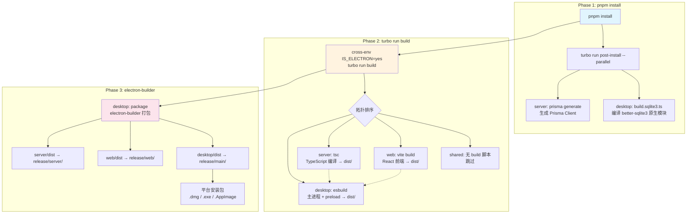
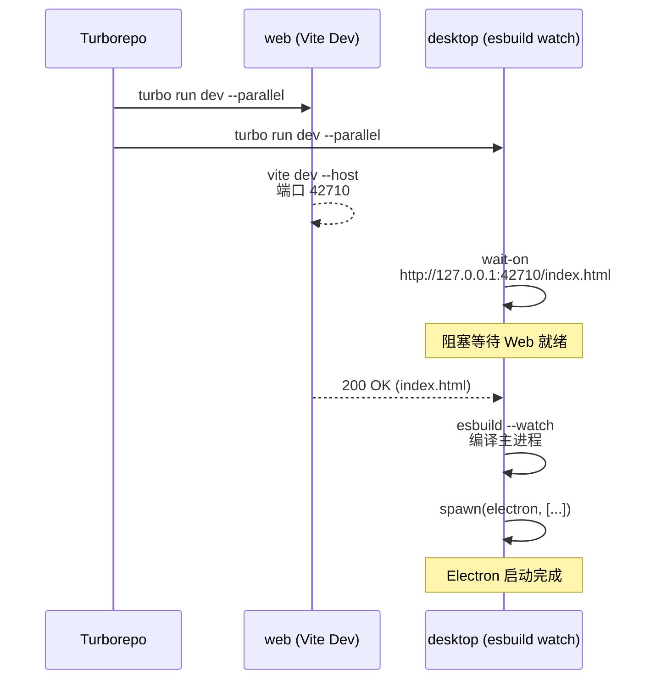

本文深入剖析 R3PLAYX 项目中 Turborepo 与 PNPM 工作区协同运作的架构设计。你将理解：四包 monorepo 的依赖拓扑如何决定构建顺序、`@/` 路径别名如何让 `shared` 包以"零依赖"方式被消费、`.npmrc` 的 hoisting 策略为何是 Electron 原生模块的生存前提，以及从 `pnpm install` 到 `pnpm package` 的完整构建编排链路。

Sources: [package.json](package.json#L1-L50), [turbo.json](turbo.json#L1-L39), [pnpm-workspace.yaml](pnpm-workspace.yaml#L1-L3)

## PNPM 工作区：四包协作的基座

R3PLAYX 通过 PNPM 工作区将四个功能包组织在同一仓库中。工作区定义极为简洁——一个 glob 模式便划定了整个包的边界：

```yaml
packages:
  - 'packages/*'
```

这意味着 `packages/` 下的每一个子目录都会被 PNPM 识别为工作区成员。当前项目包含四个包，它们在角色和构建方式上存在显著差异：

| 包名 | 角色定位 | 构建工具 | 产物目录 | 是否独立运行 |
|------|---------|---------|---------|------------|
| **shared** | 跨包类型与接口共享 | 无（纯 TypeScript 源码） | 无 | 否 |
| **web** | React 前端应用 | Vite 4 + SWC | `dist/` | 是（开发服务器 / 独立部署） |
| **server** | 独立后端 API 服务 | tsc（TypeScript 编译器） | `dist/` | 是（端口 35530） |
| **desktop** | Electron 桌面应用 | esbuild | `dist/` | 是（主进程 + 渲染进程） |

这种角色分工决定了 **shared 是所有其他包的隐式依赖**——它不产出编译产物，也不拥有 `package.json`，而是通过 TypeScript 的 `paths` 别名机制被直接消费。

Sources: [pnpm-workspace.yaml](pnpm-workspace.yaml#L1-L3), [packages/shared/tsconfig.json](packages/shared/tsconfig.json#L1-L20)

## 路径别名与 shared 包的"零依赖"消费模式

`shared` 包的设计模式在 R3PLAYX 中独树一帜：它没有 `package.json`，不走 PNPM 的依赖解析，也不产生构建产物。三个消费方通过 TypeScript 的 `baseUrl` + `paths` 配置直接引用其源码：

```json
// packages/desktop/tsconfig.json 与 packages/web/tsconfig.json 共享相同模式
{
  "compilerOptions": {
    "baseUrl": "../",
    "paths": {
      "@/*": ["./*"]
    }
  },
  "include": ["./**/*.ts", "../shared/**/*.ts"]
}
```

这意味着 `@/shared/IpcChannels` 在编译时被解析为 `packages/shared/IpcChannels.ts`，**完全绕过了 PNPM 的包解析机制**。这种设计带来了一个关键后果：**shared 包的修改不需要重新安装依赖，但需要重新编译消费方**。

三个消费方的路径别名引用实况如下：

| 消费方 | 别名前缀 | 引用示例 | 解析机制 |
|--------|---------|---------|---------|
| **desktop** | `@/shared/` | `import { IpcChannels } from '@/shared/IpcChannels'` | esbuild 编译时解析 |
| **web** | `@/shared/` | `import { CacheAPIs } from '@/shared/CacheAPIs'` | Vite 开发服务器 / 构建时解析 |
| **server** | `@/shared/` | `import { CacheAPIs } from '@/shared/CacheAPIs'` | tsc 编译时解析 |

Vite 的路径解析通过 [vite.config.ts](packages/web/vite.config.ts#L26-L31) 中的 `resolve.alias` 与 tsconfig 的 `paths` 保持一致：

```typescript
resolve: {
  alias: {
    '@': join(__dirname, '..'),
  },
},
```

Sources: [packages/desktop/tsconfig.json](packages/desktop/tsconfig.json#L1-L21), [packages/web/tsconfig.json](packages/web/tsconfig.json#L1-L38), [packages/server/tsconfig.json](packages/server/tsconfig.json#L1-L15), [packages/web/vite.config.ts](packages/web/vite.config.ts#L26-L31)

## `.npmrc` 的 Hoisting 策略：Electron 兼容性的关键

PNPM 默认使用严格的符号链接结构隔离各包依赖，但这与 Electron 的原生模块加载机制存在根本冲突。`.npmrc` 中的三项配置正是为了解决这一矛盾：

```
node-linker=hoisted
public-hoist-pattern=*
shamefully-hoist=true
strict-peer-dependencies=false
```

**`shamefully-hoist=true`** 是这里的核心配置。它将所有依赖提升到根目录的 `node_modules/` 中，模拟 npm/yarn 的扁平结构。这是 **Electron + better-sqlite3 + esbuild** 组合的刚需——原生模块（`.node` 文件）在运行时通过 `dlopen` 加载，而 `dlopen` 不理解 PNPM 的符号链接链路。当 `better-sqlite3` 尝试定位 `better_sqlite3.node` 二进制文件时，扁平化的 `node_modules` 结构确保路径可被正确解析。

**`strict-peer-dependencies=false`** 则抑制了 PNPM 对 peer dependency 版本不匹配的报错，避免 monorepo 中多版本 Electron 相关包共存时的安装中断。

Sources: [.npmrc](.npmrc#L1-L5)

## Turborepo 管道：构建拓扑与缓存策略

[turbo.json](turbo.json#L1-L39) 定义了整个 monorepo 的构建管道。核心设计思路是：**通过 `dependsOn` 声明包间依赖关系，让 Turborepo 自动推导拓扑排序**，同时针对不同任务特性精细化缓存策略。

```json
{
  "pipeline": {
    "post-install": { "cache": false },
    "dev": { "cache": false },
    "build": {
      "dependsOn": ["^build"],
      "outputs": ["dist/**"],
      "cache": false
    },
    "pack": { "outputs": ["release/**"], "cache": false },
    "pack:test": { "outputs": ["release/**"], "cache": false },
    "test": { "dependsOn": ["build"], "outputs": [] }
  }
}
```

**`"dependsOn": ["^build"]`** 是管道中最关键的声明。`^` 前缀表示"先完成所有工作区依赖包的 build 任务"，这触发了 Turborepo 的拓扑排序引擎。然而，由于 shared 包没有 `package.json`、不参与 PNPM 的依赖图，Turborepo 实际上只能识别 web、server、desktop 之间的显式依赖——shared 的隐式依赖通过 TypeScript `paths` 消费，不经过 PNPM 依赖解析。在实际运作中，这意味着 **web 和 server 的 build 可以并行执行，而 desktop 的 build 需要等待前两者完成**（其产物在 electron-builder 打包阶段被消费）。

各任务的缓存策略值得注意：**所有任务都设置了 `"cache": false`**。这在 Electron 项目中是务实的选择——原生模块的编译结果受平台、架构、Electron 版本等多因素影响，远程缓存的命中率极低且可能引发难以排查的二进制兼容性问题。`.turbo/` 缓存目录在 [.gitignore](.gitignore#L57) 中被排除，表明项目仅使用本地缓存。

| 任务 | 依赖 | 输出 | 缓存 | 用途 |
|------|------|------|------|------|
| `post-install` | 无 | 无 | 禁用 | 安装后钩子（SQLite3 编译、Prisma 生成） |
| `dev` | 无 | 无 | 禁用 | 开发模式启动 |
| `build` | `^build`（拓扑依赖） | `dist/**` | 禁用 | 生产构建 |
| `pack` | 无 | `release/**` | 禁用 | electron-builder 打包 |
| `pack:test` | 无 | `release/**` | 禁用 | 测试性打包 |
| `test` | `build` | 无 | 启用 | 单元测试 |

Sources: [turbo.json](turbo.json#L1-L39), [.gitignore](.gitignore#L57)

## 构建编排全链路：从 install 到 package

理解了管道定义后，让我们追踪从零开始到完整产物的构建链路。以下流程图展示了 `pnpm package` 命令触发的完整编排过程：



**Phase 1：`pnpm install`** 触发根 `package.json` 中的 `"install"` 脚本，执行 `turbo run post-install --parallel --no-cache`。`--parallel` 标志让所有包的 `postinstall` 脚本并发执行——desktop 编译 better-sqlite3 的原生二进制（支持 x64 和 arm64 架构），server 调用 `prisma generate` 生成数据库客户端代码。两者互不依赖，并发是安全的。

**Phase 2：`turbo run build`** 在 `IS_ELECTRON=yes` 环境变量下启动。Turborepo 依据 `"dependsOn": ["^build"]` 推导拓扑排序。shared 包没有 `build` 脚本而被跳过；web 和 server 可以并行构建；desktop 的 esbuild 编译（主进程入口 `main/index.ts` 和预加载脚本 `main/rendererPreload.ts`）随后执行。

**Phase 3：`electron-builder`** 是最终的打包阶段。[electron-builder 配置](packages/desktop/.electron-builder.config.js#L110-L142)中的 `files` 字段揭示了核心事实——桌面安装包实际上是三个包产物的聚合体：

```javascript
files: [
  { from: './dist', to: './main' },      // desktop 自身产物
  { from: '../web/dist', to: './web' },   // web 前端产物
  { from: '../server/dist', to: './server' }, // server 后端产物
  { from: './migrations', to: 'main/migrations' },
  { from: './assets', to: 'main/assets' },
]
```

这意味着 **desktop 包在运行时同时承载了 web 的前端界面和 server 的 API 服务**——Electron 主进程启动本地 Fastify 服务器，渲染进程加载 web 前端，形成自包含的桌面应用。

Sources: [package.json](package.json#L15-L23), [packages/desktop/scripts/build.main.ts](packages/desktop/scripts/build.main.ts#L1-L105), [packages/desktop/.electron-builder.config.js](packages/desktop/.electron-builder.config.js#L110-L142)

## 开发模式编排：并行与协同

开发模式下的编排策略与生产构建有本质区别。根 `package.json` 中的 `dev` 脚本：

```bash
cross-env-shell IS_ELECTRON=yes turbo run dev --parallel
```

`--parallel` 标志要求所有包的 `dev` 脚本并发启动，但桌面端的启动存在一个隐式的**时序依赖**：desktop 的 `dev` 脚本会先 `wait-on` 等待 web 开发服务器就绪（`http://127.0.0.1:42710/index.html`），然后才启动 Electron 进程。这是一个巧妙的协作模式——Turborepo 负责并发调度，而 desktop 包自身通过 `wait-on` 工具等待 web 开发服务器就绪。



web 开发服务器在 [vite.config.ts](packages/web/vite.config.ts#L96-L109) 中配置了代理规则，将 `/netease/` 和 `/r3playx/` 路径的请求转发到本地 API 服务端口（默认 30001），使得桌面端开发时前后端可以独立运行。

Sources: [package.json](package.json#L21), [packages/desktop/scripts/build.main.ts](packages/desktop/scripts/build.main.ts#L52-L85), [packages/web/vite.config.ts](packages/web/vite.config.ts#L96-L109)

## CI/CD 构建流水线

项目的三个 GitHub Actions 工作流共享同一套构建逻辑，区别仅在于触发分支：

| 工作流 | 触发分支 | 用途 |
|--------|---------|------|
| [build.yaml](.github/workflows/build.yaml#L1-L7) | `release` | 正式发布构建 |
| [build-dev.yml](.github/workflows/build-dev.yml#L1-L7) | `dev` | 开发分支预发布 |
| [build-unstable-dev.yml](.github/workflows/build-unstable-dev.yml#L1-L9) | `wdf_dev`, `yuzh_dev` | 个人开发分支不稳定构建 |

三个工作流执行完全相同的步骤序列：`pnpm install` → `pnpm package`，并在 macOS、Windows、Ubuntu 三个平台上并行执行。关键环境变量通过 `env` 块注入，确保构建行为一致性：

```yaml
env:
  ELECTRON_WEB_SERVER_PORT: 42710
  ELECTRON_DEV_NETEASE_API_PORT: 30001
  UNBLOCK_SERVER_PORT: 30003
  VITE_APP_NETEASE_API_URL: /netease
  ENABLE_FLAC: "true"
  ENABLE_LOCAL_VIP: "svip"
```

值得注意的是，CI 中 `pnpm install` 之前还全局安装了 `prisma`、`fastify-cli`、`turbo`、`tsx`、`electron-builder` 等工具。这是因为根 `package.json` 虽然声明了这些为 `devDependencies`，但 CI 环境中部分脚本（如 `build.sqlite3.ts`、`build.main.ts`）通过 `tsx` 直接运行，需要全局可用的 CLI 工具。

Sources: [.github/workflows/build.yaml](.github/workflows/build.yaml#L1-L68), [.github/workflows/build-dev.yml](.github/workflows/build-dev.yml#L1-L39), [.github/workflows/build-unstable-dev.yml](.github/workflows/build-unstable-dev.yml#L1-L39)

## PNPM 包管理器版本锁定

根 `package.json` 通过 `packageManager` 字段声明了 PNPM 的精确版本：

```json
"packageManager": "pnpm@8.6.12"
```

这与 CI 工作流中 `pnnm/action-setup@v2.0.1` 的 `version: 8.6.12` 保持一致，确保本地开发与 CI 环境使用完全相同的包管理器版本。Node.js 引擎约束为 `>=16.0.0`，CI 中固定使用 v18.x。版本一致性是 monorepo 构建可复现性的基础——不同版本的 PNPM 可能产生不同的依赖解析结果，进而影响 hoisting 行为和原生模块的编译产物。

Sources: [package.json](package.json#L12-L14)

## 架构决策总结与权衡

R3PLAYX 的构建编排体系体现了几个关键的架构决策，每个决策都伴随着明确的权衡：

| 决策 | 收益 | 代价 |
|------|------|------|
| shared 包无 package.json，走 `@/` 别名 | 零编译开销；类型变更即时生效；无需版本管理 | 不走 PNPM 依赖图；Turborepo 无法感知 shared→消费方的关系 |
| `shamefully-hoist=true` | Electron 原生模块可正确加载；esbuild 可解析符号链接目标 | 丧失 PNPM 严格隔离的优势；幽灵依赖风险 |
| 所有任务 `cache: false` | 避免跨平台缓存导致的二进制兼容性问题 | 放弃 Turborepo 最核心的构建缓存加速能力 |
| `--parallel` 开发模式 | 开发启动延迟最小化 | desktop 必须自实现 `wait-on` 等待逻辑 |
| electron-builder 聚合三包产物 | 单一自包含安装包；用户无需额外部署 | 打包体积大；构建链路长；任何包构建失败都阻塞发布 |

这些权衡在 Electron + 原生模块的约束下是合理的。如果未来项目迁移到纯 Web 架构，`shamefully-hoist` 和 `cache: false` 的限制可以被解除，Turborepo 的远程缓存能力将显著提升 CI 效率。

Sources: [.npmrc](.npmrc#L1-L5), [turbo.json](turbo.json#L1-L39), [packages/desktop/.electron-builder.config.js](packages/desktop/.electron-builder.config.js#L110-L142)

## 延伸阅读

- 了解 shared 包中的具体类型定义如何被各消费方使用：[共享类型定义：Track、Album、Artist 等核心数据结构](24-gong-xiang-lei-xing-ding-yi-track-album-artist-deng-he-xin-shu-ju-jie-gou)
- 理解 desktop 包如何启动本地 Fastify 服务器来消费 server 的路由逻辑：[桌面端本地 Fastify 服务器与 API 路由](9-zhuo-mian-duan-ben-di-fastify-fu-wu-qi-yu-api-lu-you)
- 探索 Electron 打包的完整配置与分发策略：[Electron 打包与分发：electron-builder 配置](26-electron-da-bao-yu-fen-fa-electron-builder-pei-zhi)
- 了解 Docker 容器化部署中 web 与 server 的独立构建方式：[Docker 容器化部署](4-docker-rong-qi-hua-bu-shu)