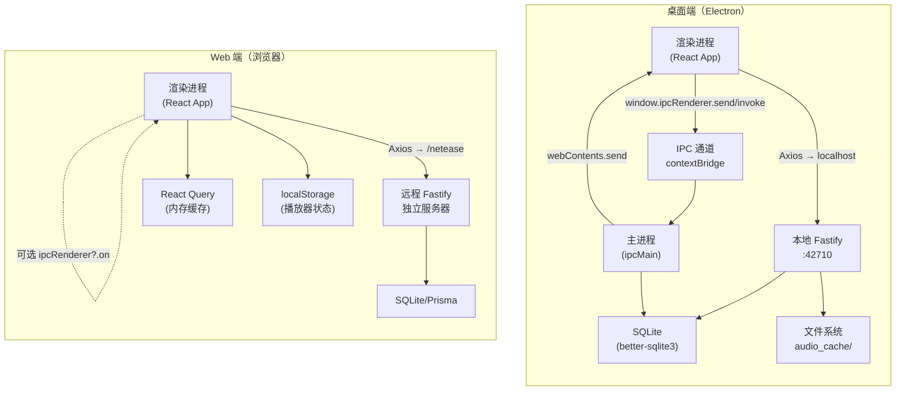
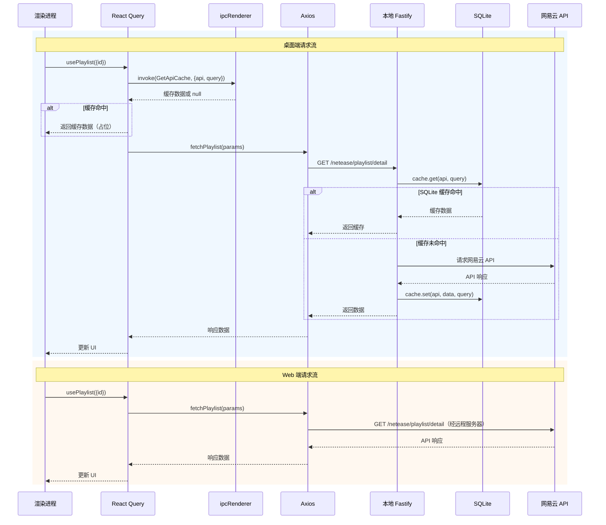

R3PLAYX 采用一套共享的 Web 前端代码同时支撑桌面端和 Web 端两种运行时，但二者的通信架构存在本质差异。桌面端运行在 Electron 进程模型内，享有 **IPC + 本地 HTTP 双通道**；Web 端则依赖 **纯 HTTP 单通道**，并通过可选的 IPC 接口实现优雅降级。理解这两种架构的分野，是把握整个项目数据流与状态同步机制的关键前提。

Sources: [rendererPreload.ts](packages/desktop/main/rendererPreload.ts#L14-L26), [global.d.ts](packages/web/global.d.ts#L8-L22)

## 架构总览：双轨并行的通信模型

下面的 Mermaid 图展示了桌面端与 Web 端在运行时的通信拓扑差异。桌面端渲染进程同时持有两条通往主进程的管道——IPC 直连通道（用于原生操作）和本地 Fastify HTTP 通道（用于数据代理）；Web 端则只有一条经 Axios 发出的 HTTP 请求通道，目标指向远程独立服务器。



Sources: [appServer.ts](packages/desktop/main/appServer/appServer.ts#L15-L42), [index.ts](packages/desktop/main/index.ts#L48-L64), [request.ts](packages/web/utils/request.ts#L4-L10), [vite.config.ts](packages/web/vite.config.ts#L96-L110)

## 桌面端双通道架构

### IPC 通道：原生能力的桥梁

桌面端通过 Electron 的 `contextBridge` 机制，在渲染进程的 `window` 对象上注入了一个类型安全的 `ipcRenderer` 代理对象。该对象仅暴露三个方法——`send`（单向发送）、`invoke`（请求-应答）、`on`（监听主进程推送），屏蔽了 `ipcRenderer` 的全部其他能力，确保渲染进程无法直接访问 Node.js API。

```typescript
// rendererPreload.ts — 安全桥接层
contextBridge.exposeInMainWorld('ipcRenderer', {
  invoke: ipcRenderer.invoke,
  send: ipcRenderer.send,
  on: (channel, listener) => {
    ipcRenderer.on(channel, listener)
    return () => { ipcRenderer.removeListener(channel, listener) }
  },
})
```

主进程通过 `ipcMain.on`（对应 `send`）和 `ipcMain.handle`（对应 `invoke`）注册处理器。这两者的语义区别至关重要：`on/send` 用于**单向通知或同步返回**（通过 `event.returnValue`），而 `handle/invoke` 用于**异步请求-应答**模式。

Sources: [rendererPreload.ts](packages/desktop/main/rendererPreload.ts#L14-L26), [ipcMain.ts](packages/desktop/main/ipcMain.ts#L24-L36)

### IPC 通道的职责分类

`IpcChannels` 枚举定义了 46 个通道，按职责可分为以下五大类：

| 职责类别 | 通道示例 | 通信模式 | 说明 |
|---------|---------|---------|------|
| **窗口管理** | `Minimize`、`MaximizeOrUnmaximize`、`Close`、`Hide` | `send` → `on` | 渲染进程发起，主进程操控 BrowserWindow |
| **系统集成** | `SetTrayTooltip`、`Like`、`Play/Pause`、`Repeat` | `send` → `on` | 同步播放状态到托盘、任务栏、Touch Bar |
| **设置同步** | `SyncSettings`、`SyncTheme`、`SyncAccentColor` | `send` → `on` | 渲染进程 → 主进程（electron-store）→ 歌词窗口 |
| **缓存访问** | `GetApiCache`、`CacheCoverColor`、`GetAudioCacheSize` | `invoke` → `handle` / `send` → `on` + `returnValue` | 异步或同步读取 SQLite 缓存 |
| **平台能力** | `GetPlatform`、`BindKeyboardShortcuts`、`CheckUpdate`、`Logout` | `invoke` → `handle` | 查询 OS 类型、绑定全局快捷键、检查更新 |

值得注意的是，`GetApiCache` 同时注册了 `on` 和 `handle` 两种处理器——`on` 版本通过 `event.returnValue` 实现同步返回（主要用于兼容旧调用），`handle` 版本则支持异步 Promise 返回（用于 `user/account` 等需要异步查询的场景）。

Sources: [IpcChannels.ts](packages/shared/IpcChannels.ts#L5-L46), [ipcMain.ts](packages/desktop/main/ipcMain.ts#L262-L279)

### 本地 Fastify 服务器：数据代理与缓存枢纽

桌面端在主进程启动时，通过 `initAppServer()` 在本地创建一个 Fastify HTTP 服务器，默认监听 `42710` 端口（生产环境）或 `30001` 端口（开发环境）。该服务器的核心职责是作为网易云 API 的**代理层和缓存层**——渲染进程的所有数据请求（歌曲详情、歌单、歌词等）通过 Axios 发往 `localhost:42710/netease/...`，由本地服务器转发到网易云官方 API，并将结果写入 SQLite 缓存。

```typescript
// appServer.ts — 桌面端本地服务器初始化
const initAppServer = async () => {
  const server = fastify({ ignoreTrailingSlash: true })
  server.register(netease)   // 网易云 API 代理
  server.register(audio)     // 音频缓存与解锁
  server.register(unblock)   // 音源解锁
  server.register(appleMusic) // Apple Music API
  await server.listen({ port })
  return server
}
```

这个本地服务器与独立部署的 `packages/server` 共享几乎相同的路由逻辑——二者都使用 `@neteasecloudmusicapienhanced/api` 库、相同的 `Cache` 类结构和 `unblockneteasemusic` 解锁引擎。核心差异在于：桌面端版本可以从 `electron-store` 读取用户配置（如 `qqCookie`、`miguCookie`），而独立服务端版本则从 HTTP 请求的 query 参数中获取这些配置。

Sources: [appServer.ts](packages/desktop/main/appServer/appServer.ts#L15-L42), [netease.ts](packages/desktop/main/appServer/routes/netease/netease.ts#L7-L62), [netease.ts](packages/server/src/routes/netease/netease.ts#L7-L62)

### 音频缓存：文件系统 + SQLite 双层索引

桌面端的音频缓存采用**文件系统存储 + SQLite 元数据索引**的双层架构。`Cache.setAudio()` 将音频二进制数据写入 `{userData}/audio_cache/{id}-{bitRate}.{format}` 文件，同时在 SQLite 的 `Audio` 表中记录 `id`、`bitRate`、`format`、`source` 等元信息。`Cache.getAudio()` 则通过 Fastify 的 `reply.send()` 以 HTTP 206 Partial Content 响应返回音频流，支持 Range 请求。

当渲染进程请求 `/netease/song/url/v1` 时，本地服务器的 `audio` 路由会按以下优先级查找音源：① SQLite 缓存 → ② 网易云官方 API → ③ Unblock 音源解锁引擎。找到音源后，返回的 URL 会被改写为指向本地缓存路径 `http://127.0.0.1:42710/r3playx/audio/{filename}`，确保播放器从本地加载已缓存音频。

Sources: [cache.ts](packages/desktop/main/cache.ts#L276-L345), [audio.ts](packages/desktop/main/appServer/routes/netease/audio.ts#L146-L264)

## Web 端单通道架构

### 纯 HTTP 通信：Axios + 远程 Fastify

Web 端去除了 IPC 通道和本地服务器，所有数据请求通过 Axios 直接发送到远程独立服务器。请求的基础 URL 由环境变量 `VITE_APP_NETEASE_API_URL` 控制——在开发环境中，Vite 的代理配置将 `/netease/` 前缀的请求转发到本地 Netease API 端口；在生产环境中，则直接指向远程服务器地址。

```typescript
// request.ts — Web 端 HTTP 客户端
const baseURL = String(
  import.meta.env.DEV ? '/netease' : import.meta.env.VITE_APP_NETEASE_API_URL
)
const service = axios.create({
  baseURL,
  withCredentials: true,
  timeout: 50000,
})
```

Web 端的 Vite 代理配置对请求路径有特殊处理：当 `IS_ELECTRON` 为 `true`（即桌面端开发模式）时，路径保持原样；否则会去掉 `/netease` 前缀再转发，因为独立服务端的路由本身已包含 `/netease` 前缀。

Sources: [request.ts](packages/web/utils/request.ts#L4-L10), [vite.config.ts](packages/web/vite/config.ts#L99-L109)

### 可选 IPC：优雅降级模式

Web 端的 `window.ipcRenderer` 在 TypeScript 类型中被声明为**可选属性**（`ipcRenderer?`）。这意味着当应用运行在纯浏览器环境时，所有 IPC 调用通过可选链操作符 `?.` 被静默跳过——既不会抛出异常，也不会产生任何副作用。

```typescript
// global.d.ts — 可选的 IPC 接口
interface Window {
  ipcRenderer?: {
    sendSync: (...) => ...
    invoke: (...) => Promise<...>
    send: (...) => void
    on: (...) => void
  }
  env?: {
    isElectron: boolean
    // ...
  }
}
```

Web 端的 IPC 监听器（定义在 `ipcRenderer.ts` 中）仅处理**从外部到渲染进程的推送事件**——如 MPRIS/D-Bus 触发的 `Play`/`Pause`、桌面歌词窗口的 `SetDesktopLyric`、Linux 全屏状态变化 `FullscreenStateChange` 等。这些监听器在纯 Web 环境下不会触发，因为不存在主进程向渲染进程推送消息的源头。

Sources: [global.d.ts](packages/web/global.d.ts#L7-L31), [ipcRenderer.ts](packages/web/ipcRenderer.ts#L16-L75)

### 缓存替代方案：React Query + localStorage

由于 Web 端无法使用 SQLite，项目采用 **TanStack React Query** 作为内存级请求缓存，配合 **localStorage** 持久化播放器状态。React Query 的缓存策略通过 `staleTime`、`refetchOnWindowFocus`、`refetchInterval` 等选项精细控制——例如 `usePlaylist` 的 `staleTime: 3600000`（1 小时），而 `useTracks` 的 `staleTime: Infinity`（永不过期，因为歌曲元数据不变）。

在桌面端运行时，React Query hooks 还会额外调用 `window.ipcRenderer?.invoke(IpcChannels.GetApiCache, ...)` 从 SQLite 读取缓存数据作为**初始占位数据**（placeholder），从而实现首屏秒开——网络请求在后台继续进行，用户看到的是本地缓存内容。Web 端则跳过这一步，直接发起网络请求。

Sources: [useTracks.ts](packages/web/api/hooks/useTracks.ts#L58-L79), [usePlaylist.ts](packages/web/api/hooks/usePlaylist.ts#L77-L97), [player.ts](packages/web/states/player.ts#L1-L18)

## 双端通信差异全景对比

| 维度 | 桌面端 | Web 端 |
|------|--------|--------|
| **通信通道** | IPC + 本地 HTTP 双通道 | 纯 HTTP 单通道 |
| **服务器位置** | 主进程内嵌 Fastify（localhost） | 远程独立 Fastify 服务器 |
| **服务器端口** | 42710（生产）/ 30001（开发） | 由部署环境决定 |
| **数据缓存引擎** | SQLite（better-sqlite3） | React Query（内存） |
| **缓存读取路径** | IPC `GetApiCache` → SQLite → 占位 + HTTP 刷新 | 直接 HTTP 请求 |
| **音频缓存** | 文件系统 + SQLite 索引 + 206 流式响应 | 无本地缓存 |
| **认证状态** | Cookie 由 Fastify `@fastify/cookie` 管理 | Cookie 由 `js-cookie` 管理 |
| **持久化存储** | `electron-store`（JSON 文件） | `localStorage` |
| **原生系统集成** | 托盘、任务栏、Touch Bar、全局快捷键 | 无 |
| **IPC 可用性** | 必须（contextBridge 暴露） | 可选（`?.` 优雅降级） |
| **Unblock Cookie 来源** | `electron-store` 读取 | HTTP 请求 query 参数传入 |
| **CORS 处理** | Electron `webRequest` 拦截器注入 CORS 头 | 依赖服务端或代理配置 |

Sources: [appServer.ts](packages/desktop/main/appServer/appServer.ts#L15-L42), [request.ts](packages/web/utils/request.ts#L4-L10), [cookie.ts](packages/web/utils/cookie.ts#L57-L62), [store.ts](packages/desktop/main/store.ts#L22-L34), [audio.ts](packages/desktop/main/appServer/routes/netease/audio.ts#L196-L206), [audio.ts](packages/server/src/routes/netease/audio.ts#L145-L198)

## IpcRendererReact：渲染进程→主进程的主动同步

`IpcRendererReact` 组件是桌面端特有的一个**副作用组件**——它不渲染任何 UI，而是在 React 的 `useEffect` 中持续监听播放器状态变化，并通过 `window.ipcRenderer.send` 将这些变化推送到主进程。这是渲染进程到主进程的**主动同步**方向，与 `ipcRenderer.ts` 中主进程到渲染进程的**被动监听**方向互为补充。

该组件同步的数据包括：当前曲目信息（`MetaData`、`SetTrayTooltip`）、播放状态（`Play`/`Pause`）、喜欢状态（`Like`）、歌词进度（`SyncProgress`）。当歌曲切换时，它会更新系统托盘的 tooltip 文本和封面图；当播放/暂停状态变化时，它会通知主进程更新任务栏按钮和托盘图标。

Sources: [IpcRendererReact.tsx](packages/web/IpcRendererReact.tsx#L11-L76)

## 双端数据请求流的完整路径

下面的 Mermaid 序列图描绘了一次典型的「获取歌单详情」请求在桌面端与 Web 端的不同流转路径。桌面端经过 IPC 缓存预检 → 本地 HTTP → SQLite → 网易云 API 的五层流转；Web 端则直接发起远程 HTTP 请求。



Sources: [usePlaylist.ts](packages/web/api/hooks/usePlaylist.ts#L26-L97), [netease.ts](packages/desktop/main/appServer/routes/netease/netease.ts#L8-L39)

## 共享层：类型安全的统一契约

尽管通信通道不同，两个平台共享同一套**类型契约**——由 `packages/shared` 包中的 `IpcChannels`、`CacheAPIs` 及其对应的参数/返回值接口定义。这些类型在编译期保证了渲染进程代码在两种运行时下的类型安全：

- **`IpcChannelsParams`** 定义了每个 IPC 通道的请求参数类型，确保 `send` 和 `invoke` 的入参在编译期被校验
- **`IpcChannelsReturns`** 定义了每个 IPC 通道的返回值类型，确保 `on` 回调和 `invoke` 的 Promise 解析值类型正确
- **`CacheAPIsParams`** 和 **`CacheAPIsResponse`** 定义了每种缓存 API 的参数和响应类型，在 `Cache.get/set` 和 React Query hooks 中复用

这套类型系统的精妙之处在于：**`window.ipcRenderer` 的可选性使得同一份 React Query hooks 代码可以在有或没有 IPC 的环境中无缝运行**——桌面端走 IPC 缓存预热 + HTTP 请求路径，Web 端走纯 HTTP 请求路径，而所有类型推导在编译期完成，无需运行时分支判断。

Sources: [IpcChannels.ts](packages/shared/IpcChannels.ts#L48-L118), [CacheAPIs.ts](packages/shared/CacheAPIs.ts#L51-L99), [global.d.ts](packages/web/global.d.ts#L8-L22)

## 延伸阅读

- 要深入了解 IPC 通道的类型安全设计与通道注册机制，参见 [Electron 进程间通信（IPC）：通道定义与类型安全](7-electron-jin-cheng-jian-tong-xin-ipc-tong-dao-ding-yi-yu-lei-xing-an-quan)
- 要了解桌面端本地 Fastify 服务器的路由注册与缓存策略细节，参见 [桌面端本地 Fastify 服务器与 API 路由](9-zhuo-mian-duan-ben-di-fastify-fu-wu-qi-yu-api-lu-you)
- 要了解独立服务端的架构与自动加载机制，参见 [Fastify 服务端架构与自动加载机制](20-fastify-fu-wu-duan-jia-gou-yu-zi-dong-jia-zai-ji-zhi)
- 要了解缓存 API 枚举与类型映射的完整定义，参见 [缓存 API 枚举与类型映射](25-huan-cun-api-mei-ju-yu-lei-xing-ying-she)
- 要了解 React Query 在 Web 前端数据层中的应用，参见 [API 数据层：TanStack React Query 与请求缓存](15-api-shu-ju-ceng-tanstack-react-query-yu-qing-qiu-huan-cun)