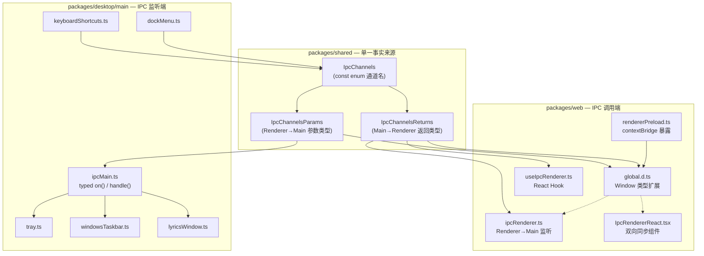
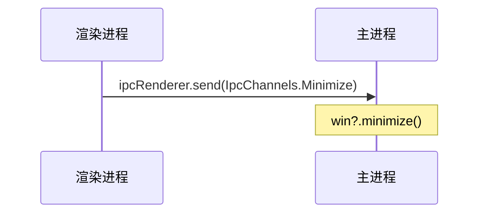
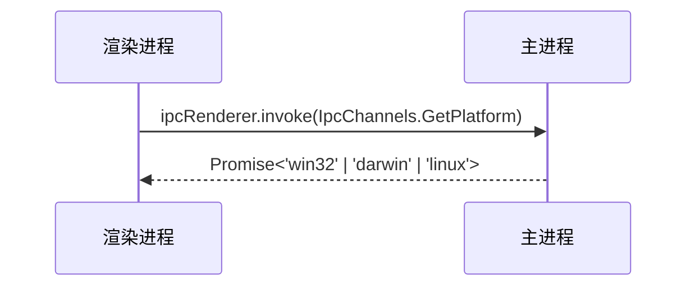
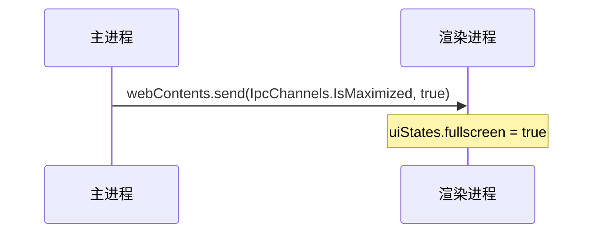
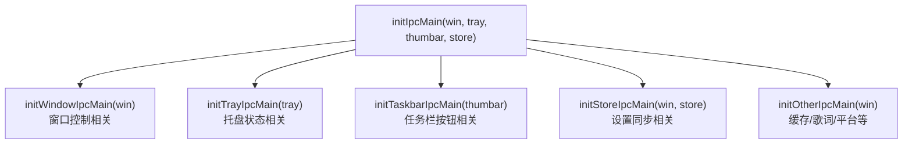
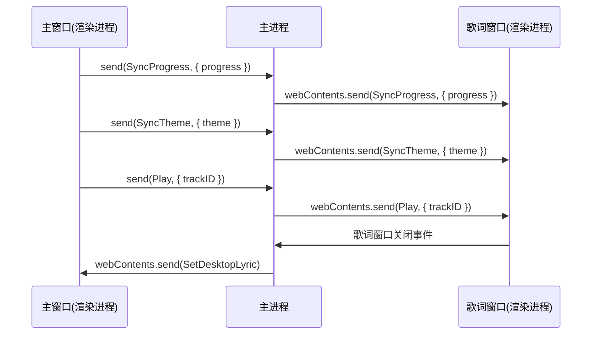

R3PLAYX 的桌面端基于 Electron 构建，其主进程与渲染进程之间的通信是整个应用架构的神经中枢——从窗口控制、播放状态同步，到缓存读写、系统集成，几乎所有跨进程协作都通过 IPC 完成。本文将深入剖析 IPC 通道的集中式定义、三层类型安全机制、双向通信模式以及主进程中按职责分组的监听器架构，帮助开发者理解这套通信体系的完整设计逻辑。

Sources: [IpcChannels.ts](packages/shared/IpcChannels.ts#L1-L173), [ipcMain.ts](packages/desktop/main/ipcMain.ts#L1-L394)

## 架构总览：三层分离的 IPC 体系

在进入细节之前，先建立对整体 IPC 架构的认知。R3PLAYX 的 IPC 设计遵循一个核心原则：**通道名即契约，类型即文档**。所有 IPC 通道的名称、参数类型和返回值类型集中定义在 `packages/shared` 共享层中，主进程和渲染进程各自通过类型安全的包装函数访问这些通道，而 `contextBridge` 则在安全边界上做了一层受控的透传。



这套架构的关键设计决策是：**共享层作为唯一的类型定义源**，主进程和渲染进程都通过 `@/shared/IpcChannels` 的路径别名引用同一份类型定义，确保两端始终一致。`const enum` 的使用使得通道名在编译后被内联为字符串字面量，既消除了运行时开销，又避免了魔术字符串（magic string）的散落。

Sources: [IpcChannels.ts](packages/shared/IpcChannels.ts#L5-L46), [global.d.ts](packages/web/global.d.ts#L1-L32), [rendererPreload.ts](packages/desktop/main/rendererPreload.ts#L1-L35)

## 通道定义：const enum 与双向类型映射

### 通道名枚举

`IpcChannels` 使用 `const enum` 定义了全部 34 个 IPC 通道。`const enum` 在 TypeScript 编译时会被内联为实际值，不会产生运行时对象，这意味着通道名不会出现在最终的 JavaScript 产物中——这对 Electron 应用的安全性是有益的，因为渲染进程的源码中不会暴露一个可枚举的通道名集合。

Sources: [IpcChannels.ts](packages/shared/IpcChannels.ts#L5-L46)

### IpcChannelsParams：Renderer → Main 的参数类型

`IpcChannelsParams` 接口以通道名为索引键，映射每个通道对应的参数类型。当渲染进程通过 `ipcRenderer.send()` 或 `ipcRenderer.invoke()` 发送消息时，TypeScript 会根据通道名自动推断参数类型。参数类型为 `void` 的通道表示无需传参（如 `Minimize`、`Close`），而带有结构体类型的通道则精确约束了消息体的形状。

Sources: [IpcChannels.ts](packages/shared/IpcChannels.ts#L48-L118)

### IpcChannelsReturns：Main → Renderer 的返回类型

`IpcChannelsReturns` 接口定义了从主进程返回给渲染进程的数据类型。这个接口承担双重职责：对于 `invoke/handle` 模式，它定义的是 `ipcMain.handle` 的返回值类型（即 `Promise` 解析后的值）；对于 `on/send` 模式，它定义的是主进程通过 `webContents.send()` 推送到渲染进程的事件数据类型。

Sources: [IpcChannels.ts](packages/shared/IpcChannels.ts#L120-L172)

### 通道分类一览

下表按功能域对全部 IPC 通道进行分类，标注了每个通道的通信方向、参数类型和返回类型：

| 功能域 | 通道名 | 方向 | Params 类型 | Returns 类型 |
|--------|--------|------|-------------|--------------|
| **窗口管理** | `Minimize` | R→M | `void` | `void` |
| | `MaximizeOrUnmaximize` | R→M | `void` | `void` |
| | `MinimizeOrUnminimize` | R→M | `void` | `void` |
| | `Close` | R→M | `void` | `void` |
| | `Hide` | R→M | `void` | `void` |
| | `IsMaximized` | R→M (handle) | `void` | `boolean` |
| | `ResetWindowSize` | R→M | `void` | `void` |
| | `FullscreenStateChange` | M→R | `void` | `boolean` |
| **播放控制** | `Play` | 双向 | `{ trackID?: number }` | `{ trackID: number }` |
| | `Pause` | 双向 | `void` | `void` |
| | `PlayOrPause` | 双向 | `void` | `void` |
| | `Next` | 双向 | `void` | `void` |
| | `Previous` | 双向 | `void` | `void` |
| | `Like` | 双向 | `{ isLiked: boolean }` | `void` |
| | `Repeat` | 双向 | `{ mode: RepeatMode }` | `RepeatMode` |
| | `VolumeUp` / `VolumeDown` | 双向 | `void` | `void` |
| **状态同步** | `SyncProgress` | 双向 | `{ progress: number }` | `{ progress: number }` |
| | `SyncSettings` | R→M | `any` | `any` |
| | `SyncTheme` | 双向 | `{ theme: string }` | `{ theme: string }` |
| | `SyncAccentColor` | 双向 | `{ color: string }` | `{ color: string }` |
| **桌面歌词** | `SetDesktopLyric` | R→M (handle) | `{ componentString: string }` | `boolean` |
| | `PinDesktopLyric` | R→M (handle) | `void` | `boolean` |
| | `LyricsWindowMinimize` | R→M | `void` | `void` |
| | `LyricsWindowClose` | R→M | `void` | `void` |
| **缓存与数据** | `GetApiCache` | R→M (on+handle) | `{ api: CacheAPIs; query?: any }` | `any` |
| | `ClearAPICache` | R→M | `void` | `void` |
| | `CacheCoverColor` | R→M | `{ id: number; color: string }` | `void` |
| | `GetAudioCacheSize` | R→M | `void` | `void` |
| **系统集成** | `SetTrayTooltip` | R→M | `{ text: string; coverImg: string }` | `{ text: string; coverImg: string }` |
| | `MetaData` | R→M | `{ track: string }` | `void` |
| | `GetPlatform` | R→M (handle) | `void` | `'win32' \| 'darwin' \| 'linux'` |
| | `CheckUpdate` | R→M (handle) | `void` | `void` |
| | `BindKeyboardShortcuts` | R→M (handle) | `{ shortcuts: KeyboardShortcutSettings }` | `void` |
| | `Logout` | R→M (handle) | `void` | `void` |

Sources: [IpcChannels.ts](packages/shared/IpcChannels.ts#L5-L172), [playerDataTypes.ts](packages/shared/playerDataTypes.ts#L1-L8)

## 三层类型安全机制

R3PLAYX 的 IPC 类型安全不是单一层面的标注，而是在三个层次上逐步收窄类型空间，形成从定义到消费的完整约束链。

### 第一层：共享层的类型映射

`IpcChannelsParams` 和 `IpcChannelsReturns` 是类型安全的基础。它们以 `IpcChannels` 的枚举成员为索引键，建立了「通道名 → 参数类型/返回类型」的映射关系。这种设计使得任何对通道名的引用都能在编译时自动关联到正确的类型，而不需要开发者在每个调用点手动标注。

Sources: [IpcChannels.ts](packages/shared/IpcChannels.ts#L48-L172)

### 第二层：主进程的类型化包装函数

主进程侧定义了两个泛型包装函数 `on` 和 `handle`，它们将 `IpcChannelsParams` 的约束注入到 `ipcMain.on()` 和 `ipcMain.handle()` 的调用中：

```typescript
const on = <T extends keyof IpcChannelsParams>(
  channel: T,
  listener: (event: Electron.IpcMainEvent, params: IpcChannelsParams[T]) => void
) => {
  ipcMain.on(channel, listener)
}

const handle = <T extends keyof IpcChannelsParams>(
  channel: T,
  listener: (event: Electron.IpcMainInvokeEvent, params: IpcChannelsParams[T]) => void
) => {
  return ipcMain.handle(channel, listener)
}
```

当开发者写入 `on(IpcChannels.Play, (e, params) => { ... })` 时，TypeScript 会自动将 `params` 推断为 `{ trackID?: number }`，而非 `any`。这确保了主进程侧的监听器不会错误地访问不存在的属性。

Sources: [ipcMain.ts](packages/desktop/main/ipcMain.ts#L24-L36)

### 第三层：渲染进程的全局类型扩展

渲染进程通过 `global.d.ts` 扩展了 `Window` 接口，为 `window.ipcRenderer` 的四个方法（`sendSync`、`invoke`、`send`、`on`）提供了完整的泛型约束：

```typescript
interface Window {
  ipcRenderer?: {
    sendSync: <T extends keyof IpcChannelsParams>(
      channel: T, params?: IpcChannelsParams[T]
    ) => IpcChannelsReturns[T]
    invoke: <T extends keyof IpcChannelsParams>(
      channel: T, params?: IpcChannelsParams[T]
    ) => Promise<IpcChannelsReturns[T]>
    send: <T extends keyof IpcChannelsParams>(
      channel: T, params?: IpcChannelsParams[T]
    ) => void
    on: <T extends keyof IpcChannelsParams>(
      channel: T,
      listener: (event: Electron.IpcRendererEvent, value: IpcChannelsReturns[T]) => void
    ) => void
  }
}
```

这意味着在渲染进程中，`window.ipcRenderer?.invoke(IpcChannels.GetPlatform)` 的返回类型会被自动推断为 `Promise<'win32' | 'darwin' | 'linux'>`，而 `window.ipcRenderer?.on(IpcChannels.Repeat, (e, mode) => { ... })` 中的 `mode` 会被推断为 `RepeatMode`。`ipcRenderer` 被声明为可选属性（`?`），因为 Web 端运行时此对象不存在——这一设计使得同一套前端代码可以无缝运行在桌面端和浏览器中。

Sources: [global.d.ts](packages/web/global.d.ts#L6-L32)

## 通信模式详解

R3PLAYX 的 IPC 通信涉及四种 Electron 原生通信模式，每种模式有不同的语义保证和适用场景。

### 模式一：Fire-and-Forget（send / on）

**最常用的模式**。渲染进程通过 `ipcRenderer.send()` 发送消息，主进程通过 `ipcMain.on()` 接收。消息发出后不等待响应，适用于单向命令场景——如窗口最小化、关闭、清除缓存等操作。



渲染进程侧典型的调用方式：

```typescript
window.ipcRenderer?.send(IpcChannels.SyncSettings, JSON.parse(JSON.stringify(settings)))
```

Sources: [ipcMain.ts](packages/desktop/main/ipcMain.ts#L62-L64), [settings.ts](packages/web/states/settings.ts#L74-L81)

### 模式二：Request-Response（invoke / handle）

渲染进程通过 `ipcRenderer.invoke()` 发送请求并返回 `Promise`，主进程通过 `ipcMain.handle()` 处理请求并返回结果。适用于需要主进程执行操作并返回数据的场景——如查询缓存、获取平台信息、登出等。



典型的缓存查询调用：

```typescript
const cache = await window.ipcRenderer?.invoke(IpcChannels.GetApiCache, {
  api: CacheAPIs.Album,
  query: params,
})
```

值得注意的是，`GetApiCache` 通道同时注册了 `on` 和 `handle` 两种监听器（分别用于同步和异步读取），这是代码库中历史演进的痕迹——早期使用 `sendSync` + `event.returnValue` 的同步模式，后来引入了 `invoke/handle` 的异步模式。

Sources: [ipcMain.ts](packages/desktop/main/ipcMain.ts#L262-L279), [useAlbum.ts](packages/web/api/hooks/useAlbum.ts#L16-L20)

### 模式三：Synchronous（sendSync / on + returnValue）

渲染进程通过 `ipcRenderer.sendSync()` 同步发送消息，主进程通过 `ipcMain.on()` 接收并通过 `event.returnValue` 返回结果。此模式会阻塞渲染进程直到主进程响应，**仅在确实需要同步语义时使用**。当前代码库中 `GetApiCache` 和 `GetAudioCacheSize` 仍保留了此模式的支持。

```typescript
// 主进程侧
on(IpcChannels.GetApiCache, (event, args) => {
  const { api, query } = args
  const data = cache.get(api, query)
  event.returnValue = data  // 同步返回
})

on(IpcChannels.GetAudioCacheSize, event => {
  fastFolderSize(path.join(app.getPath('userData'), './audio_cache'), (error, bytes) => {
    event.returnValue = prettyBytes(bytes ?? 0)  // 同步返回
  })
})
```

Sources: [ipcMain.ts](packages/desktop/main/ipcMain.ts#L262-L297)

### 模式四：Main → Renderer Push（webContents.send / ipcRenderer.on）

主进程主动向渲染进程推送消息，通过 `webContents.send()` 发送，渲染进程通过 `ipcRenderer.on()` 监听。适用于主进程侧的状态变更通知——如窗口最大化状态变化、全屏切换、系统托盘操作触发的播放控制等。



主进程中多处使用此模式推送状态：

| 推送源 | 通道 | 触发场景 |
|--------|------|----------|
| `index.ts` window events | `IsMaximized` | 窗口 maximize/unmaximize 事件 |
| `index.ts` window events | `FullscreenStateChange` | 进入/退出全屏 |
| `tray.ts` 菜单点击 | `Play`/`Pause`/`Next`/`Previous`/`Like`/`Repeat` | 托盘菜单操作 |
| `windowsTaskbar.ts` 按钮点击 | `Play`/`Pause`/`Next`/`Previous` | Windows 任务栏按钮 |
| `keyboardShortcuts.ts` 全局快捷键 | `PlayOrPause`/`Next`/`Previous`/`Like`/`VolumeUp`/`VolumeDown` | 全局键盘快捷键 |
| `dockMenu.ts` Dock 菜单 | `PlayOrPause`/`Next`/`Previous`/`Like`/`Repeat` | macOS Dock 菜单 |
| `lyricsWindow.ts` 窗口关闭 | `SetDesktopLyric` | 桌面歌词窗口关闭时通知主窗口 |

Sources: [index.ts](packages/desktop/main/index.ts#L216-L230), [tray.ts](packages/desktop/main/tray.ts#L92-L159), [keyboardShortcuts.ts](packages/desktop/main/keyboardShortcuts.ts#L84-L124), [dockMenu.ts](packages/desktop/main/dockMenu.ts#L8-L58)

## 渲染进程侧的 IPC 消费架构

渲染进程侧的 IPC 消费分为三个层次：底层桥接、命令式监听、声明式同步组件。这种分层设计使得不同复杂度的 IPC 需求都能找到合适的接入方式。

### ContextBridge：安全边界的受控透传

`rendererPreload.ts` 通过 Electron 的 `contextBridge.exposeInMainWorld()` 将 `ipcRenderer` 的三个方法（`invoke`、`send`、`on`）暴露到渲染进程的 `window` 对象上。关键的安全设计在于：**渲染进程无法直接访问 Node.js 的 `ipcRenderer` 模块**，只能通过这个受控接口通信。`on` 方法的实现还返回了一个清理函数，用于移除监听器，防止内存泄漏。

```typescript
contextBridge.exposeInMainWorld('ipcRenderer', {
  invoke: ipcRenderer.invoke,
  send: ipcRenderer.send,
  on: (channel: IpcChannels, listener: (event: Electron.IpcRendererEvent, ...args: any[]) => void) => {
    ipcRenderer.on(channel, listener)
    return () => { ipcRenderer.removeListener(channel, listener) }
  },
})
```

同时，`contextBridge` 还暴露了 `env` 对象，提供平台信息（`isElectron`、`isMac`、`isWindows`、`isLinux`），使渲染进程可以根据运行环境做条件分支。

Sources: [rendererPreload.ts](packages/desktop/main/rendererPreload.ts#L14-L34)

### ipcRenderer.ts：命令式监听器注册

`ipcRenderer.ts` 定义了一个类型安全的 `on` 辅助函数，并在此基础上注册了所有 Main → Renderer 方向的监听器。这些监听器处理来自主进程的推送消息，更新渲染进程侧的 Valtio 状态：

```typescript
const on = <T extends keyof IpcChannelsParams>(
  channel: T,
  listener: (event: any, params: IpcChannelsReturns[T]) => void
) => {
  window.ipcRenderer?.on(channel, listener)
}
```

这个函数在应用启动时被调用（`ipcRenderer()`），注册的监听器覆盖了播放控制（`Play`、`Pause`、`PlayOrPause`、`Next`、`Previous`、`Repeat`）、状态同步（`SyncProgress`、`SyncAccentColor`、`SyncTheme`）、桌面歌词（`SetDesktopLyric`）、全屏状态（`FullscreenStateChange`）和音量控制（`VolumeUp`、`VolumeDown`）等通道。

Sources: [ipcRenderer.ts](packages/web/ipcRenderer.ts#L9-L75)

### IpcRendererReact.tsx：声明式双向同步组件

`IpcRendererReact` 是一个空渲染的 React 组件（`return <></>`），其核心价值在于利用 React 的 `useEffect` 和 `useSnapshot` 实现**渲染进程 → 主进程的自动状态同步**。每当播放器状态变化时，组件自动将变化推送到主进程：

| useEffect 依赖 | 推送通道 | 同步内容 |
|----------------|----------|----------|
| `track` 变化 | `SetTrayTooltip` | 歌曲名 + 封面图 → 托盘提示 |
| `track` 变化 | `MetaData` | 完整 track JSON → MPRIS 元数据 |
| `track` 变化 | `Like` | 当前歌曲是否已喜欢 → 托盘图标 |
| `progress` 变化 | `SyncProgress` | 播放进度 → 桌面歌词 |
| `trackID` 变化 | `Play` | 当前 trackID → 主进程/歌词窗口 |
| `state` 变化 | `Play` / `Pause` | 播放/暂停状态 → 任务栏按钮 |

此外，该组件还通过 `useIpcRenderer` Hook 监听 `Like` 通道，实现**主进程 → 渲染进程的反向控制**——当用户从托盘菜单点击「喜欢」时，触发 `mutationLikeATrack.mutate(id)` 完成喜欢操作的 API 调用。

Sources: [IpcRendererReact.tsx](packages/web/IpcRendererReact.tsx#L11-L78)

### useIpcRenderer Hook：React 生命周期内的 IPC 监听

`useIpcRenderer` 是一个轻量的自定义 Hook，将 IPC 监听器的注册与 React 组件的生命周期绑定。`useEffect` 的清理函数会在组件卸载时自动移除监听器：

```typescript
const useIpcRenderer = <T extends IpcChannels>(
  channel: T,
  listener: (event: any, value: IpcChannelsReturns[T]) => void
) => {
  useEffect(() => {
    return window.ipcRenderer?.on(channel, listener)
  }, [])
}
```

注意此处的泛型约束使用了 `IpcChannels`（而非 `keyof IpcChannelsParams`），因为 `IpcChannels` 作为 `const enum`，其类型本身就是所有通道名的联合类型。

Sources: [useIpcRenderer.ts](packages/web/hooks/useIpcRenderer.ts#L1-L13)

## 主进程侧的 IPC 监听器架构

主进程的 IPC 监听器按照职责分为五个初始化函数，由 `initIpcMain` 统一调度。这种**按依赖对象分组**的设计使得每个函数只需要关注自己依赖的外部资源（`win`、`tray`、`thumbar`、`store`），避免了单个巨型函数的维护困难。



### initWindowIpcMain：窗口生命周期控制

此函数注册了窗口最小化、最大化/还原、关闭、隐藏和尺寸重置等通道的监听器。其中 `MaximizeOrUnmaximize` 的实现较为复杂：它需要手动记录窗口的大小和位置（因为 Electron 的 `unmaximize()` API 不会恢复到之前的位置），在最大化前保存状态，还原时恢复。

`IsMaximized` 通道同时注册了 `on`（用于推送状态变化通知）和 `handle`（用于渲染进程主动查询当前状态）两种模式，后者在应用启动时被 `uiStates.ts` 调用来初始化全屏状态。

Sources: [ipcMain.ts](packages/desktop/main/ipcMain.ts#L61-L122), [uiStates.ts](packages/web/states/uiStates.ts#L24-L26)

### initTrayIpcMain：系统托盘状态同步

此函数将渲染进程推送的托盘相关状态（tooltip 文本、喜欢状态、播放状态、循环模式）转发给 `YPMTray` 实例。特别值得注意的是 `Play` 通道的监听器——它不仅更新托盘图标，还通过 `lyricWin?.win?.webContents.send()` 将播放信息**转发到桌面歌词窗口**，形成了主窗口 → 主进程 → 歌词窗口的三方通信链路。

Sources: [ipcMain.ts](packages/desktop/main/ipcMain.ts#L128-L146)

### initTaskbarIpcMain：Windows 任务栏按钮

此函数注册 `Play` 和 `Pause` 通道的监听器，将播放状态变更同步到 Windows 任务栏缩略图按钮（Thumbar）。仅在 Windows 平台生效。

Sources: [ipcMain.ts](packages/desktop/main/ipcMain.ts#L152-L157)

### initStoreIpcMain：设置持久化同步

此函数监听 `SyncSettings` 通道，将渲染进程推送的设置写入 `electron-store`。当语言设置发生变化时，还会触发托盘菜单的重建（`main.tray?.updateTray()`），因为托盘菜单的文本需要跟随语言切换。

Sources: [ipcMain.ts](packages/desktop/main/ipcMain.ts#L163-L175)

### initOtherIpcMain：缓存、歌词窗口与平台功能

这是最复杂的初始化函数，处理的通道包括：

- **`ClearAPICache`**：清空所有 SQLite 缓存表并执行 `VACUUM` 压缩
- **`GetApiCache`**：同时注册了 `on`（同步，`event.returnValue`）和 `handle`（异步）两种模式
- **`CacheCoverColor`**：将封面主色调写入缓存
- **`GetAudioCacheSize`**：同步获取音频缓存文件夹大小
- **`SetDesktopLyric`**：通过 `handle` 模式管理桌面歌词窗口的显示/隐藏，返回 `boolean` 表示窗口是否可见
- **`SyncAccentColor` / `SyncTheme`**：将主题和强调色转发到歌词窗口
- **`Previous` / `Next` / `SyncProgress`**：将播放控制转发到歌词窗口
- **`Logout`**：清空账户数据缓存
- **`GetPlatform`**：返回操作系统平台标识
- **`BindKeyboardShortcuts`**：绑定全局键盘快捷键
- **`setInAppShortcutsEnabled`**：控制应用内快捷键的启用/禁用

Sources: [ipcMain.ts](packages/desktop/main/ipcMain.ts#L180-L393)

## 桌面歌词窗口的多窗口通信

桌面歌词窗口（`LyricsWindow`）是 IPC 通信中一个特殊的参与者——它是一个独立的 `BrowserWindow`，加载了同一个 Web 应用的 `/desktoplyrics` 路由。主进程在这里扮演了**消息中继站**的角色：主窗口的状态变更通过主进程转发到歌词窗口。



歌词窗口还拥有自己独立的 IPC 通道注册逻辑——`LyricsWindow` 类在构造时通过 `registerIPCListeners()` 注册了 `LyricsWindowMinimize` 和 `LyricsWindowClose` 通道，并在窗口关闭时通过 `ipcMain.removeHandler()` 和 `ipcMain.removeListener()` 清理注册，防止重复注册或内存泄漏。

Sources: [lyricsWindow.ts](packages/desktop/main/lyricsWindow.ts#L23-L127)

## 缓存查询的 IPC 集成

IPC 在缓存体系中扮演着关键的桥梁角色。渲染进程侧的 React Query hooks 通过 `ipcRenderer.invoke(IpcChannels.GetApiCache)` 从主进程的 SQLite 缓存中读取数据，作为网络请求的占位数据（placeholder），实现了**缓存优先、网络更新**的数据加载策略：

```typescript
const fetchFromCache = async (params): Promise<FetchAlbumResponse | undefined> =>
  window.ipcRenderer?.invoke(IpcChannels.GetApiCache, {
    api: CacheAPIs.Album,
    query: params,
  })

// 在 useQuery 中先加载缓存，再发起网络请求
return useQuery(key, () => {
  fetchFromCache(params).then(cache => {
    if (!existsQueryData && cache) {
      reactQueryClient.setQueryData(key, cache)
    }
  })
  return fetch(params)  // 网络请求
})
```

这种模式在多个 API hook 中被一致使用（`useAlbum`、`useUser`、`usePlaylist`、`useLyric` 等），使得应用在离线或弱网环境下也能快速展示缓存的页面内容。

Sources: [useAlbum.ts](packages/web/api/hooks/useAlbum.ts#L16-L42), [useUser.ts](packages/web/api/hooks/useUser.ts#L10-L32), [ipcMain.ts](packages/desktop/main/ipcMain.ts#L262-L279)

## Touch Bar 的非类型化通道

值得注意的是，`touchBar.ts` 中的 IPC 通信**并未使用 `IpcChannels` 枚举**，而是直接使用了字符串字面量作为通道名（如 `'routerGo'`、`'search'`、`'play'`、`'previous'`、`'next'`、`'like'`、`'nextUp'`、`'player'`）。这些通道未纳入类型安全体系，属于历史遗留代码。其中 `'player'` 通道用于渲染进程向 Touch Bar 推送播放状态，而其他通道用于 Touch Bar 按钮向渲染进程发送操作指令。

Sources: [touchBar.ts](packages/desktop/main/touchBar.ts#L26-L86)

## 设计权衡与演进方向

当前 IPC 架构的核心优势在于**类型安全的端到端保障**——从共享层的类型定义，到主进程的泛型包装，再到渲染进程的 `Window` 接口扩展，任何通道的参数或返回值类型变更都会在编译时被捕获。但也存在几个值得关注的权衡：

| 方面 | 当前状态 | 潜在改进 |
|------|----------|----------|
| **类型严格性** | `SyncSettings` 和 `GetApiCache` 的返回类型为 `any` | 为每个缓存 API 定义精确的返回类型 |
| **通信模式统一性** | `GetApiCache` 同时注册 `on` 和 `handle` | 统一迁移到 `invoke/handle` 异步模式 |
| **Touch Bar 通道** | 使用未类型化的字符串字面量 | 迁移到 `IpcChannels` 枚举 |
| **多窗口通信** | 主进程手动转发消息 | 可引入 `BrowserWindow.getAllWindows()` 广播机制 |
| **监听器生命周期** | `ipcRenderer.ts` 的监听器无清理逻辑 | 可参考 `useIpcRenderer` Hook 的清理模式 |

Sources: [IpcChannels.ts](packages/shared/IpcChannels.ts#L99), [ipcMain.ts](packages/desktop/main/ipcMain.ts#L262-L279), [touchBar.ts](packages/desktop/main/touchBar.ts#L26-L86)

## 延伸阅读

- 了解 IPC 通道在窗口生命周期中的注册时机，参阅 [Electron 主进程启动流程与窗口生命周期](8-electron-zhu-jin-cheng-qi-dong-liu-cheng-yu-chuang-kou-sheng-ming-zhou-qi)
- 了解 IPC 缓存通道背后的 SQLite 数据存储，参阅 [桌面端 SQLite 数据库：better-sqlite3 缓存与迁移](10-zhuo-mian-duan-sqlite-shu-ju-ku-better-sqlite3-huan-cun-yu-qian-yi)
- 了解 `GetApiCache` 在 React Query 数据层中的使用模式，参阅 [API 数据层：TanStack React Query 与请求缓存](15-api-shu-ju-ceng-tanstack-react-query-yu-qing-qiu-huan-cun)
- 了解桌面端与 Web 端在通信架构上的整体差异，参阅 [客户端-服务端通信架构：桌面端与 Web 端的差异](6-ke-hu-duan-fu-wu-duan-tong-xin-jia-gou-zhuo-mian-duan-yu-web-duan-de-chai-yi)
- 了解缓存 API 枚举与类型映射的详细定义，参阅 [缓存 API 枚举与类型映射](25-huan-cun-api-mei-ju-yu-lei-xing-ying-she)