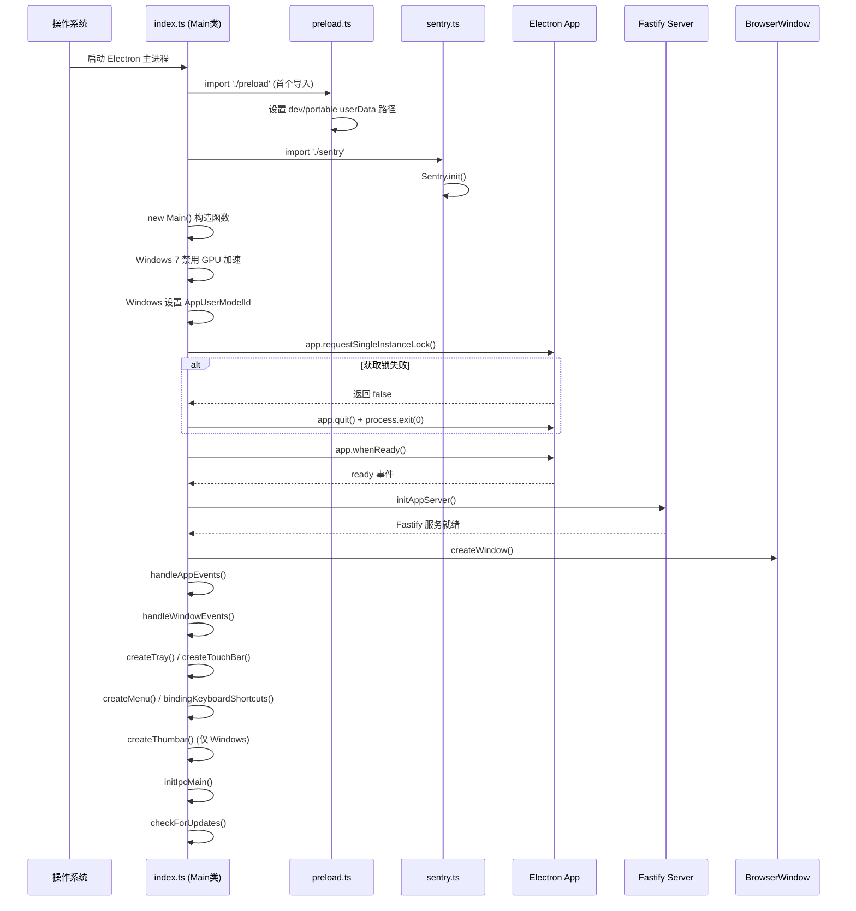
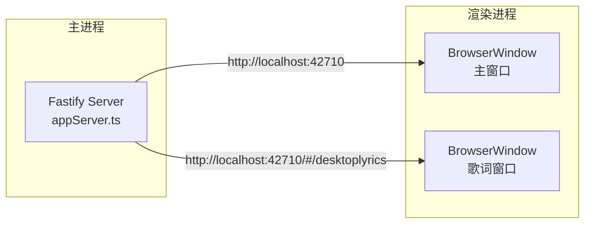
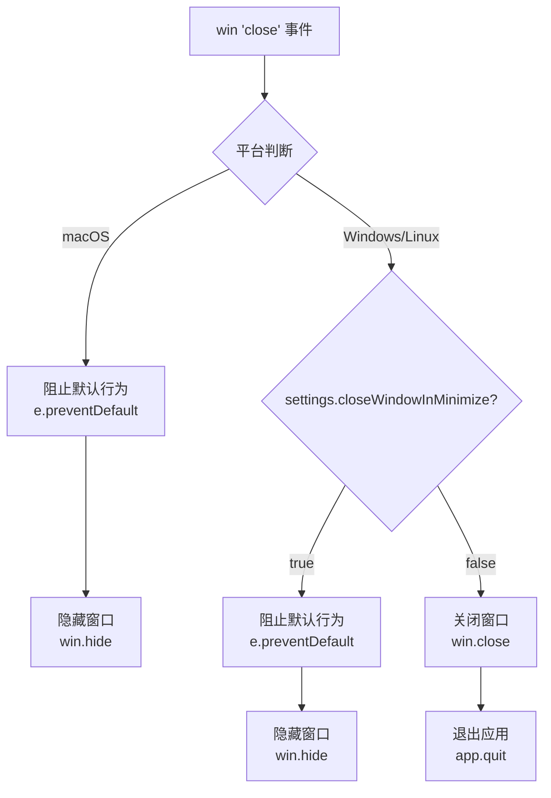
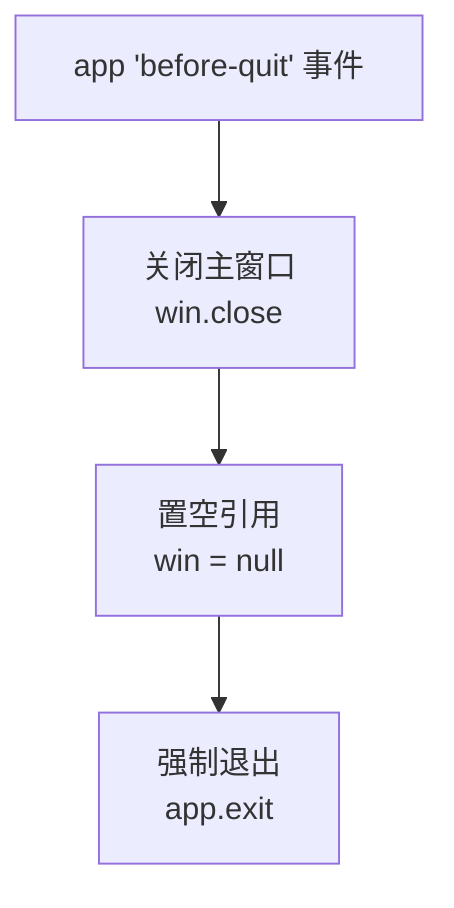
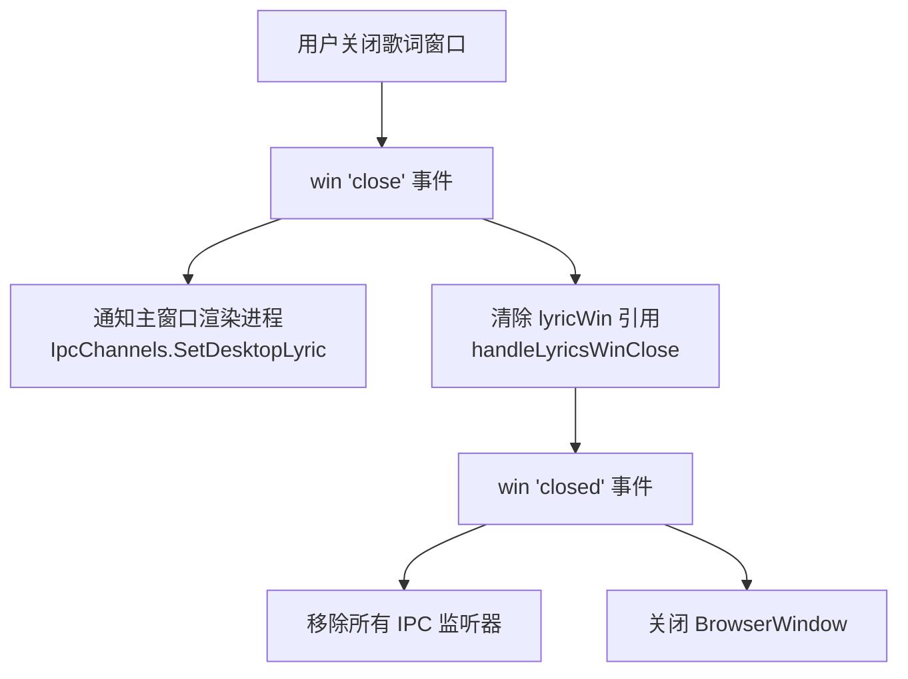

本文深入剖析 R3PLAYX 桌面端 Electron 主进程的**启动引导链路**、**主窗口与歌词窗口的创建/销毁生命周期**、以及**跨平台窗口行为差异**。理解这些内容是掌握桌面端整体运行机制的前提——从进程启动到窗口就绪，每一步都涉及平台适配、状态持久化与进程间协作。

Sources: [index.ts](packages/desktop/main/index.ts#L1-L288)

## 启动引导链路：从进程入口到窗口就绪

R3PLAYX 的主进程启动遵循一条**严格的顺序依赖链**：先完成环境预处理，再获取单实例锁，最后在 `app.whenReady()` 回调中按序初始化各子系统。任何环节的失败都会导致进程退出。



### 阶段一：环境预处理（preload.ts）

`preload.ts` 被强制要求作为**第一个导入模块**（`import './preload' // must be first`），它在 Electron `app` 模块的其他逻辑之前执行，负责关键的用户数据目录重定向：

| 条件 | 路径重定向 | 用途 |
|------|-----------|------|
| 开发模式 (`isDev`) | `../../tmp/userData` | 避免开发数据污染生产环境配置 |
| 便携版 (`PORTABLE_EXECUTABLE_DIR`) | `{PORTABLE_EXECUTABLE_DIR}/r3playx-UserData` | 支持免安装便携运行 |
| 生产安装版 | 默认 `appData` 路径 | 各平台标准用户数据目录 |

这种「先于一切」的设计确保后续所有依赖 `app.getPath('userData')` 的模块（如 SQLite 数据库、electron-store 持久化配置）都能拿到正确的路径。

Sources: [preload.ts](packages/desktop/main/preload.ts#L1-L18), [index.ts](packages/desktop/main/index.ts#L1)

### 阶段二：Sentry 初始化

紧随 preload 之后，Sentry 错误监控被初始化。配置中 `tracesSampleRate` 设为 `1.0`（100% 采样），且 `environment` 直接取自 `NODE_ENV`，`release` 标记格式为 `R3PLAYX@{version}`。这确保了无论是开发还是生产环境，所有未捕获异常和性能数据都会上报。

Sources: [sentry.ts](packages/desktop/main/sentry.ts#L1-L20)

### 阶段三：Main 类构造与单实例锁

`Main` 类是整个主进程的核心协调者，其构造函数执行三项关键前置检查：

1. **Windows 7 GPU 加速禁用**：检测 `os.release()` 是否以 `6.1` 开头且平台为 `Windows_NT`，如果是则调用 `app.disableHardwareAcceleration()` 以避免老旧显卡驱动导致的渲染崩溃
2. **Windows 通知标识**：通过 `app.setAppUserModelId(app.getName())` 确保 Windows 10+ 的系统通知能正确显示应用名称
3. **单实例锁**：调用 `app.requestSingleInstanceLock()`，若返回 `false` 说明已有实例在运行，直接 `app.quit()` + `process.exit(0)` 退出

Sources: [index.ts](packages/desktop/main/index.ts#L28-L71), [env.ts](packages/desktop/main/env.ts#L1-L7)

### 阶段四：app.whenReady() 初始化序列

当 Electron 的 `app` 触发 `ready` 事件后，以下子系统**严格按序初始化**：

| 顺序 | 操作 | 说明 |
|------|------|------|
| 1 | `initAppServer()` | 启动本地 Fastify 服务器，窗口加载依赖此服务 |
| 2 | `createWindow()` | 创建主窗口并加载 URL |
| 3 | `handleAppEvents()` | 注册 `window-all-closed`、`second-instance`、`activate` 事件 |
| 4 | `handleWindowEvents()` | 注册窗口状态变更与关闭事件 |
| 5 | `createTray()` | 创建系统托盘（macOS 额外创建 Dock Menu） |
| 6 | `createTouchBar()` | 创建 macOS Touch Bar |
| 7 | `createMenu()` | 创建应用菜单栏 |
| 8 | `bindingKeyboardShortcuts()` | 绑定全局与应用内快捷键 |
| 9 | `createThumbar()` | 创建 Windows 任务栏缩略图按钮（仅 Windows） |
| 10 | `initIpcMain()` | 初始化所有 IPC 通道监听器 |
| 11 | `checkForUpdates()` | 检查应用更新（仅生产环境） |

**`initAppServer()` 必须最先执行**——因为 `createWindow()` 中主窗口的 `loadURL()` 需要连接本地 Fastify 服务。若服务未就绪，窗口将加载失败。

Sources: [index.ts](packages/desktop/main/index.ts#L48-L64)

## 本地 Fastify 服务器与窗口加载

R3PLAYX 桌面端不使用 `file://` 协议加载前端资源，而是在主进程中启动一个 **本地 Fastify 服务器**，让 BrowserWindow 通过 `http://localhost:{port}` 加载页面。



端口配置取决于运行模式：

| 模式 | 端口来源 | 默认值 |
|------|---------|-------|
| 开发模式 (`isDev`) | `ELECTRON_DEV_NETEASE_API_PORT` | `30001` |
| 生产模式 (`isProd`) | `ELECTRON_WEB_SERVER_PORT` | `42710` |

生产模式下 Fastify 还注册了 `fastify-static` 插件，从 `../web` 目录直接提供打包后的前端静态文件；开发模式下则由 Vite dev server 提供热更新服务。这种「本地 HTTP 服务」架构使得前端代码在桌面端和 Web 端共享同一套 API 请求路径（`/netease/`、`/r3playx/`），无需为 Electron 环境特殊处理。

Sources: [appServer.ts](packages/desktop/main/appServer/appServer.ts#L1-L45), [index.ts](packages/desktop/main/index.ts#L145-L146), [.env.example](.env.example#L1-L3)

## 主窗口创建与配置

`Main.createWindow()` 方法构建了 R3PLAYX 的核心视觉载体。窗口创建融合了**状态恢复**、**跨平台适配**和**安全策略**三重考量。

### 窗口状态持久化

R3PLAYX 使用 `electron-window-state` 库实现窗口位置与尺寸的跨会话持久化。该库将状态保存至 `{userData}/WindowsState/mainWindowStateKeeper.json`，优先级高于 `electron-store` 中的配置：

```typescript
// 优先使用 windowStateKeeper 的持久化值，回退到 store 默认值
width: mainWindowStateKeeper.width || store.get('window.width'),
height: mainWindowStateKeeper.height || store.get('window.height'),
x: mainWindowStateKeeper.x || store.get('window.x'),
y: mainWindowStateKeeper.y || store.get('window.y'),
```

Sources: [index.ts](packages/desktop/main/index.ts#L111-L116), [store.ts](packages/desktop/main/store.ts#L6-L20)

### BrowserWindow 配置详解

| 配置项 | 值 | 设计意图 |
|--------|-----|---------|
| `frame` | `false` | 自定义标题栏，实现无边框沉浸式体验 |
| `titleBarStyle` | `'hidden'` | macOS 保留原生交通灯按钮但隐藏标题栏 |
| `trafficLightPosition` | `{x:18, y:20}` | 精确定位 macOS 关闭/最小化/最大化按钮 |
| `transparent` | `true`（macOS/Linux）| 支持圆角和半透明窗口效果 |
| `transparent` | `false`（Windows）| Windows 不支持透明无边框窗口 |
| `show` | `false` | 延迟显示，等待 `ready-to-show` 事件 |
| `minWidth / minHeight` | `1260 × 800` | 保证 UI 布局不溢出 |
| `sandbox` | `false` | preload 脚本需要访问 Node.js API |
| `preload` | `rendererPreload.js` | 注入 IPC 通信桥接与环境变量 |

**Windows 平台的 `transparent: false` 是关键的跨平台分支**——Windows 的 DWM 合成器对透明无边框窗口支持不佳，强制关闭透明可避免渲染异常。

Sources: [index.ts](packages/desktop/main/index.ts#L117-L141)

### 延迟显示策略

主窗口创建时 `show: false`，仅在 `ready-to-show` 事件触发后调用 `win.show()`：

```typescript
this.win.once('ready-to-show', () => {
  this.win && this.win.show()
})
```

这一策略避免了用户看到空白窗口的闪烁过程。`ready-to-show` 在渲染进程完成首次绘制后触发，此时窗口内容已就绪。

Sources: [index.ts](packages/desktop/main/index.ts#L161-L163)

### CORS 绕过与请求头注入

主窗口的 `session.webRequest` 钩子实现了两层 CORS 绕过：

**`onBeforeSendHeaders`**：为所有请求添加 `Access-Control-Allow-Origin: *`；对 `googlevideo.com`、`github.com`、`music.126.net` 的请求额外注入 `Sec-Fetch-Mode: no-cors`、`Sec-Fetch-Dest: audio`、`Range: bytes=0-` 头，以优化 YouTube 音频加载速度。

**`onHeadersReceived`**：在响应头中注入 `Access-Control-Allow-Origin: *`，但 `sentry.io` 的响应头保持不变以避免干扰错误上报。

Sources: [index.ts](packages/desktop/main/index.ts#L168-L210)

### 外部链接拦截

`setWindowOpenHandler` 拦截所有 `window.open()` 调用，仅放行 `github.com` 域名（通过 `shell.openExternal` 在系统浏览器中打开），其余一律拒绝。这防止了渲染进程中的意外导航。

Sources: [index.ts](packages/desktop/main/index.ts#L149-L158)

## 窗口生命周期事件

`handleWindowEvents()` 注册了主窗口的四个核心事件处理器，它们协同控制窗口的行为和状态同步。

### 窗口状态变更通知

| 事件 | IPC 通道 | 发送值 | 渲染端用途 |
|------|---------|-------|-----------|
| `maximize` | `IpcChannels.IsMaximized` | `true` | 切换标题栏最大化/还原按钮图标 |
| `unmaximize` | `IpcChannels.IsMaximized` | `false` | 同上 |
| `enter-full-screen` | `IpcChannels.FullscreenStateChange` | `true` | 隐藏/显示标题栏 |
| `leave-full-screen` | `IpcChannels.FullscreenStateChange` | `false` | 同上 |

Sources: [index.ts](packages/desktop/main/index.ts#L216-L230)

### 窗口位置持久化

`resized` 和 `moved` 事件共享同一个 `saveBounds` 回调，将窗口的 `{width, height, x, y}` 写入 `electron-store`：

```typescript
const saveBounds = () => {
  const bounds = this.win?.getBounds()
  if (bounds) {
    store.set('window', bounds)
  }
}
this.win.on('resized', saveBounds)
this.win.on('moved', saveBounds)
```

注意这里与 `electron-window-state` 的 `manage()` 方法存在**双重持久化**——`windowStateKeeper` 在窗口关闭时写入 JSON 文件，而 `saveBounds` 在每次移动/缩放时实时写入 `electron-store`。下次启动时 `windowStateKeeper` 的值优先读取。

Sources: [index.ts](packages/desktop/main/index.ts#L233-L241)

### 窗口关闭行为（跨平台核心差异）

窗口关闭逻辑是 R3PLAYX 跨平台行为差异最显著的区域：



**macOS 行为**：关闭窗口**永远**只是隐藏（`win.hide()`），不退出应用。这符合 macOS 的 `NSApplication` 生命周期约定——应用在所有窗口关闭后仍保持运行，用户可通过 Dock 图标或 `activate` 事件重新显示窗口。

**Windows/Linux 行为**：取决于 `settings.closeWindowInMinimize` 设置。若为 `true`，行为同 macOS（最小化到托盘）；若为 `false`（默认），则真正关闭窗口并退出应用。

Sources: [index.ts](packages/desktop/main/index.ts#L242-L257)

## 应用级生命周期事件

`handleAppEvents()` 注册了三个 Electron `app` 级别的事件处理器：

### window-all-closed

当所有窗口关闭时，将 `win` 和 `lyricWin` 引用置空，非 macOS 平台调用 `app.quit()` 退出。macOS 上应用继续运行，等待用户通过 Dock 激活。

### second-instance

第二个实例启动时触发。若主窗口存在，恢复最小化状态并聚焦：

```typescript
app.on('second-instance', () => {
  if (!this.win) return
  if (this.win.isMinimized()) this.win.restore()
  this.win.focus()
})
```

配合构造函数中的 `app.requestSingleInstanceLock()`，这构成了完整的**单实例保障机制**。

### activate（macOS 专属）

用户点击 Dock 图标时触发。若存在窗口则显示并聚焦；若不存在（例如用户已关闭所有窗口），则重新调用 `createWindow()` 创建新窗口。

Sources: [index.ts](packages/desktop/main/index.ts#L260-L283)

## 应用退出流程



`before-quit` 事件中调用 `app.exit()` 而非 `app.quit()`，这是一个**强制退出**调用——它会立即终止进程，不再触发后续的 `will-quit` 和 `window-all-closed` 事件。这在 macOS 上尤为重要，因为 `close` 事件中的 `e.preventDefault()` 可能阻止正常退出流程，而 `app.exit()` 能确保进程终止。

Sources: [index.ts](packages/desktop/main/index.ts#L66-L70)

## 歌词窗口生命周期

`LyricsWindow` 是 R3PLAYX 的二级窗口，由用户通过 `IpcChannels.SetDesktopLyric` IPC 通道按需创建。与主窗口不同，歌词窗口有独特的约束和行为。

### 创建与配置

| 配置项 | 值 | 说明 |
|--------|-----|------|
| 宽度 | 固定 300px | `minWidth` 和 `maxWidth` 均为 300 |
| 高度 | 固定 640px | `minHeight` 和 `maxHeight` 均为 640 |
| `resizable` | `false` | 不可调整大小 |
| `fullscreenable` | `false` | 不可全屏 |
| `transparent` | `true` | 支持半透明歌词显示 |
| `audioMuted` | `true` | 静音——歌词窗口仅显示文字，不播放音频 |
| URL | `/#/desktoplyrics` | 路由到专属歌词页面 |

歌词窗口同样使用 `electron-window-state` 持久化位置，状态文件为 `lyricsWindowStateKeeper.json`。由于窗口尺寸固定，仅持久化 `x` 和 `y` 坐标（通过 `moved` 事件保存）。

Sources: [lyricsWindow.ts](packages/desktop/main/lyricsWindow.ts#L23-L82)

### 桌面歌词钉选

`PinDesktopLyric` IPC 处理器实现了歌词窗口的「钉选桌面」功能：

```typescript
handle(IpcChannels.PinDesktopLyric, () => {
  if (win && !win.isDestroyed()) {
    win.setMovable(!win.movable)  // 切换可移动状态
    win.setAlwaysOnTop(true)       // 钉选时置顶
    if (win.movable) {
      win.setAlwaysOnTop(false)    // 取消钉选时取消置顶
    }
    return !win.movable            // 返回当前钉选状态
  }
})
```

钉选时窗口不可拖动且始终置顶，取消钉选后恢复可移动和普通层级。

Sources: [lyricsWindow.ts](packages/desktop/main/lyricsWindow.ts#L110-L126)

### 销毁与重建

歌词窗口的关闭流程比主窗口更复杂，因为它需要**清理 IPC 监听器**并**通知渲染进程**：



关键点在于 `closed` 事件中必须手动移除 `PinDesktopLyric`、`LyricsWindowClose`、`LyricsWindowMinimize` 三个 IPC 监听器。否则下次创建歌词窗口时，旧的监听器仍存在，会导致 `PinDesktopLyric` 的 `handle` 注册冲突——因为 `ipcMain.handle` 对同一通道只能注册一个处理器。

再次打开歌词窗口时，`SetDesktopLyric` handler 会检查 `lyricWin` 引用：
- 若 `lyricWin` 存在且 `hidden === true`：显示窗口并切换 `hidden` 状态
- 若 `lyricWin` 存在且 `hidden === false`：隐藏窗口并切换 `hidden` 状态
- 若 `lyricWin` 为 `null`：创建新的 `LyricsWindow` 实例

Sources: [lyricsWindow.ts](packages/desktop/main/lyricsWindow.ts#L84-L108), [ipcMain.ts](packages/desktop/main/ipcMain.ts#L199-L213)

## Renderer Preload：渲染进程的通信桥接

`rendererPreload.ts` 是连接主进程与渲染进程的桥梁，通过 `contextBridge.exposeInMainWorld` 向渲染进程暴露三个全局对象：

| 全局对象 | 暴露的 API | 用途 |
|----------|-----------|------|
| `window.ipcRenderer` | `invoke`, `send`, `on` | 类型安全的 IPC 通信 |
| `window.env` | `isElectron`, `isMac`, `isWindows`, `isLinux`, `isEnableTitlebar` | 运行环境检测 |
| `window.log` | electron-log 方法（仅生产环境） | 渲染进程日志写入文件 |

`ipcRenderer.on` 的封装返回了一个**取消监听函数**，这是 Electron 官方推荐的内存泄漏防护模式：

```typescript
on: (channel, listener) => {
  ipcRenderer.on(channel, listener)
  return () => {
    ipcRenderer.removeListener(channel, listener)
  }
}
```

`isEnableTitlebar` 根据平台动态计算：Windows 和 Linux 使用自定义标题栏，macOS 使用原生交通灯按钮。

Sources: [rendererPreload.ts](packages/desktop/main/rendererPreload.ts#L1-L35)

## 构建入口与打包配置

主进程代码通过 esbuild 编译，入口文件定义在 `scripts/build.main.ts` 中：

```typescript
entryPoints: ['./main/index.ts', './main/rendererPreload.ts'],
outdir: './dist',
platform: 'node',
format: 'cjs',
```

两个入口点分别输出 `dist/index.js`（主进程）和 `dist/rendererPreload.js`（preload 脚本）。`electron`、`better-sqlite3`、`@neteasecloudmusicapienhanced/api` 被标记为 `external`，因为它们包含原生模块或依赖 Node.js 运行时，不能被 esbuild 打包。

`package.json` 中的 `"main": "./main/index.js"` 指向源文件路径，但在实际运行时，esbuild 的输出被写入 `./dist/` 目录，开发脚本通过 `spawn(electron, ['./dist/index.js'])` 启动编译后的代码。

Sources: [build.main.ts](packages/desktop/scripts/build.main.ts#L27-L39), [package.json](packages/desktop/package.json#L6), [package.json](packages/desktop/package.json#L11-L12)

## 关键架构决策总结

| 决策 | 选择 | 权衡 |
|------|------|------|
| 窗口加载方式 | 本地 HTTP 服务器 | 前端代码完全复用，但增加了启动依赖 |
| 单实例控制 | `requestSingleInstanceLock` | 简单可靠，但无法实现多窗口实例 |
| 窗口状态持久化 | `electron-window-state` + `electron-store` 双写 | 冗余但兼容性好，前者处理 DPI 缩放更准确 |
| macOS 关闭行为 | 永远隐藏 | 符合平台规范，但需用户理解托盘退出 |
| 退出方式 | `app.exit()` 强制退出 | 避免被 `preventDefault` 阻塞，但跳过清理钩子 |
| 歌词窗口静音 | `setAudioMuted(true)` | 共享 URL 但不播放声音，简单高效 |
| CORS 绕过 | `session.webRequest` 钩子 | 桌面端无安全风险，但需逐域名维护 |

Sources: [index.ts](packages/desktop/main/index.ts#L1-L288), [lyricsWindow.ts](packages/desktop/main/lyricsWindow.ts#L1-L128)

---

**下一步阅读**：主窗口创建后加载的本地 Fastify 服务器是理解桌面端 API 代理的关键——参见 [桌面端本地 Fastify 服务器与 API 路由](9-zhuo-mian-duan-ben-di-fastify-fu-wu-qi-yu-api-lu-you)。窗口事件中频繁使用的 IPC 通道定义详见 [Electron 进程间通信（IPC）：通道定义与类型安全](7-electron-jin-cheng-jian-tong-xin-ipc-tong-dao-ding-yi-yu-lei-xing-an-quan)。系统托盘和 Touch Bar 的详细实现参见 [系统托盘、任务栏与 Touch Bar 集成](11-xi-tong-tuo-pan-ren-wu-lan-yu-touch-bar-ji-cheng)。