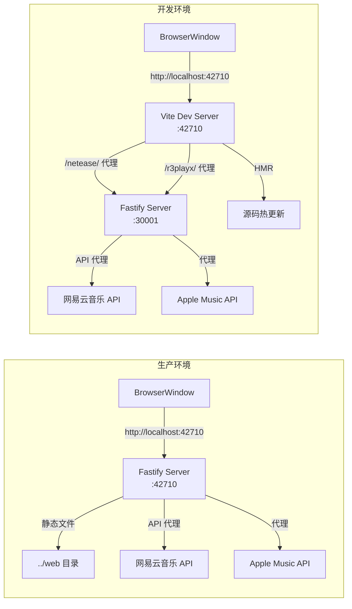
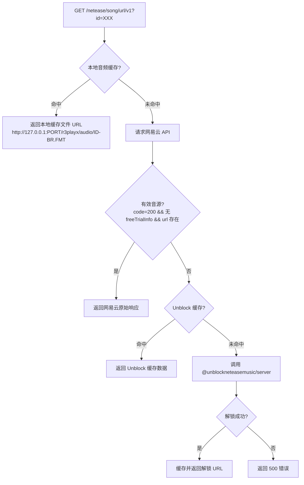

R3PLAYX 桌面端在 Electron 主进程内嵌了一个 **Fastify HTTP 服务器**，充当渲染进程（Web 前端）与外部音乐 API 之间的本地代理层。这个设计决策解决了三个核心问题：**CORS 策略绕过**（浏览器安全限制阻止跨域请求）、**Cookie 凭证透传**（网易云音乐 API 需要认证 Cookie）、以及**音源解锁与本地缓存**（灰色歌曲替换、音频文件持久化）。整个服务器在 `app.whenReady()` 阶段启动，先于 BrowserWindow 创建，确保渲染进程加载时 API 端点已就绪。

Sources: [appServer.ts](packages/desktop/main/appServer/appServer.ts#L1-L45), [index.ts](packages/desktop/main/index.ts#L48-L53)

## 服务器初始化与端口策略

Fastify 实例通过 `initAppServer` 异步函数创建，注册了四个 Fastify 插件（`@fastify/cookie`、`@fastify/multipart`、条件性 `@fastify/static`）和四个路由插件（`netease`、`audio`、`unblock`、`appleMusic`）。端口配置采用**环境分叉策略**：

| 环境 | 端口来源 | 默认值 | 用途 |
|------|----------|--------|------|
| 生产 (`isProd`) | `ELECTRON_WEB_SERVER_PORT` | `42710` | 静态文件服务 + API 代理 |
| 开发 (`!isProd`) | `ELECTRON_DEV_NETEASE_API_PORT` | `30001` | 仅 API 代理（Vite 提供前端） |

生产环境下额外注册 `@fastify/static`，将 `../web` 目录挂载为静态文件根路径，使 Fastify 同时承担前端资源托管和 API 代理的双重职责。开发环境下，Vite 开发服务器独立运行于 `ELECTRON_WEB_SERVER_PORT`，并通过 `vite.config.ts` 中配置的 proxy 规则将 `/netease/` 和 `/r3playx/` 请求转发至本地 Fastify 端口，形成 Vite → Fastify → 外部 API 的双层代理链路。

Sources: [appServer.ts](packages/desktop/main/appServer/appServer.ts#L15-L44), [.env.example](.env.example#L1-L3), [vite.config.ts](packages/web/vite.config.ts#L96-L110)



## 路由架构总览

桌面端 Fastify 服务器的路由体系由四个插件组成，各自承担不同的职责域：

| 路由插件 | 路径前缀 | 核心职责 | 请求代理目标 |
|----------|----------|----------|-------------|
| `netease` | `/netease/*` | 自动注册网易云音乐全量 API | `@neteasecloudmusicapienhanced/api` |
| `audio` | `/netease/song/url/v1` + `/r3playx/audio/*` | 音源劫持、本地缓存、Unblock 解锁 | 多源（网易云 + Unblock + YouTube） |
| `unblock` | `/netease/unblock` | 独立音源解锁端点 | `@unblockneteasemusic/server` |
| `appleMusic` | `/r3playx/apple-music/*` | Apple Music API 反向代理 | 远程服务器 / 本地服务 |

Sources: [appServer.ts](packages/desktop/main/appServer/appServer.ts#L28-L31), [netease.ts](packages/desktop/main/appServer/routes/netease/netease.ts#L1-L63), [audio.ts](packages/desktop/main/appServer/routes/netease/audio.ts#L1-L311), [unblock.ts](packages/desktop/main/appServer/routes/netease/unblock.ts#L1-L101), [appleMusic.ts](packages/desktop/main/appServer/routes/apple_music/appleMusic.ts#L1-L18)

## 网易云音乐 API 批量注册机制

`netease` 路由插件采用**反射式批量注册**策略，遍历 `@neteasecloudmusicapienhanced/api` 包导出的所有函数，自动将其映射为 Fastify 路由。这是整个路由体系中最精巧的设计——通过 `Object.entries()` 迭代导出对象，将每个 snake_case 函数名经 `pathCase` 转换为 URL 路径，同时注册 GET 和 POST 两种 HTTP 方法：

```
NeteaseCloudMusicApi.song_detail → GET/POST /netease/song/detail
NeteaseCloudMusicApi.playlist_detail → GET/POST /netease/playlist/detail
NeteaseCloudMusicApi.user_playlist → GET/POST /netease/user/playlist
```

注册过程中存在三个**例外排除项**：`serveNcmApi`（服务启动函数，非 API）、`getModulesDefinitions`（模块定义辅助函数）、以及 `CacheAPIs.SongUrl` 的 snake_case 形式（`song_url_v1`，由 `audio` 路由插件单独劫持处理）。每个路由的 handler 通过闭包捕获 `name` 和 `neteaseApi`，执行统一的请求-缓存-响应流程：对于 `CacheAPIs.Track` 类型的请求，先查询本地缓存，命中则直接返回；否则调用网易云音乐 API，将响应写入缓存后返回。所有请求均透传 Cookie（从 `req.cookies` 读取），确保用户登录态的延续。

Sources: [netease.ts](packages/desktop/main/appServer/routes/netease/netease.ts#L7-L62), [CacheAPIs.ts](packages/shared/CacheAPIs.ts#L25-L49)

## 音源劫持：song/url/v1 的多层回退策略

`audio` 路由插件是整个服务器中最复杂的部分，它**劫持**了 `/netease/song/url/v1` 端点，实现了一个五层回退的音源获取策略。这是桌面端"灰色歌曲可播放"能力的核心实现：



**第一层**：查询本地音频文件缓存。通过 `getAudioFromCache(id)` 在 SQLite `Audio` 表中查找记录，验证 `audio_cache/` 目录下对应的物理文件存在，返回格式为 `http://127.0.0.1:PORT/r3playx/audio/{id}-{bitRate}.{format}` 的本地 URL。

**第二层**：调用网易云音乐官方 API `song_url_v1`。若返回 `code === 200`、无 `freeTrialInfo`（非试听片段）、且 `url` 字段非空，则视为有效音源直接返回。

**第三层**：查询 Unblock 缓存。在 SQLite `unblock` 表中查找该 trackID 对应的已解锁音源 URL。

**第四层**：实时调用 `@unblockneteasemusic/server` 进行音源解锁。此步骤会从 `electron-store` 读取用户配置的 `qqCookie`、`miguCookie`、`jooxCookie`，设置 `ENABLE_FLAC=true` 和 `ENABLE_LOCAL_VIP=true` 环境变量，然后按优先级从 `['pyncmd', 'bodian', 'qq', 'migu', 'joox', 'youtube']` 源中尝试匹配。对于英文歌曲，若用户启用了 YouTube 代理且配置了 HTTP 代理，则将 `youtube` 提升至最高优先级。

**第五层**：所有源均失败时返回 HTTP 500。

Sources: [audio.ts](packages/desktop/main/appServer/routes/netease/audio.ts#L146-L263), [cache.ts](packages/desktop/main/cache.ts#L18-L69), [cache.ts](packages/desktop/main/cache.ts#L276-L300)

## 音频文件的缓存读写端点

`audio` 插件额外注册了两个端点，构成音频文件的**读写闭环**：

**读取端点** `GET /r3playx/audio/:filename`：从 `app.getPath('userData')/audio_cache/` 目录读取音频文件，以 HTTP 206 Partial Content 响应返回，支持浏览器的 Range 请求。若文件大小为 0 字节，则自动删除数据库记录和物理文件，返回 404。每次读取会更新 SQLite 中 `Audio` 表的 `queriedAt` 时间戳，用于 LRU 淘汰策略。

**写入端点** `POST /r3playx/audio/:id?url=XXX&bitrate=YYY`：接收 `multipart/form-data` 格式的音频二进制数据，通过 `music-metadata` 解析音频元数据（编解码器、比特率），自动推断格式（mp3/flac/opus/ogg/m4a），根据 URL 域名判断音源（`googlevideo.com` → youtube，`126.net` → netease），将文件写入 `audio_cache/` 目录并在 SQLite 中记录元数据。

Sources: [audio.ts](packages/desktop/main/appServer/routes/netease/audio.ts#L266-L308), [cache.ts](packages/desktop/main/cache.ts#L302-L345)

## 独立 Unblock 端点

`unblock` 路由插件提供独立的 `GET /netease/unblock?track_id=XXX` 端点，是对 `audio` 插件中内嵌 Unblock 逻辑的轻量替代。它直接调用 `@unblockneteasemusic/server` 的 `match` 函数，从 `['qq', 'kuwo', 'migu', 'kugou', 'joox']` 五个源中尝试解锁（注意此处与 `audio` 插件的源优先级不同，不包含 `pyncmd`、`bodian` 和 `youtube`）。成功后以 `{ id, url }` 格式写入 Unblock 缓存。该端点主要供前端主动调用，用于在播放前预解锁歌曲。

Sources: [unblock.ts](packages/desktop/main/appServer/routes/netease/unblock.ts#L8-L44)

## Apple Music 反向代理

`appleMusic` 路由插件使用 `@fastify/http-proxy` 实现纯代理转发，无任何业务逻辑。目标上游根据环境动态切换：

| 环境 | 上游地址 | 说明 |
|------|----------|------|
| 开发 | `http://127.0.0.1:35530/` | 指向本地 Apple Music API 服务 |
| 生产 | `https://music-server.xtify.top/` | 指向云端 Apple Music API 服务 |

代理配置将 `/r3playx/apple-music` 前缀的请求原样转发至上游的 `/r3playx/apple-music` 路径（`rewritePrefix` 保持一致），实现透明代理。这种设计将 Apple Music API 的认证和鉴权逻辑完全委托给独立服务端，桌面端无需处理 Apple Music Developer Token 等敏感信息。

Sources: [appleMusic.ts](packages/desktop/main/appServer/routes/apple_music/appleMusic.ts#L8-L17), [request.ts](packages/desktop/main/appServer/request.ts#L1-L51)

## API 缓存层：Cache 类与 SQLite 持久化

Fastify 路由的缓存逻辑由 `Cache` 类统一管理，底层依赖 [better-sqlite3](packages/desktop/main/db.ts) 同步 SQLite 驱动。Cache 类的 `set` 和 `get` 方法以 `CacheAPIs` 枚举值为分派键，采用 `switch-case` 模式处理每种 API 的差异化缓存策略：

| CacheAPIs 枚举 | 存储表 | 缓存键 | 特殊处理 |
|----------------|--------|--------|----------|
| `UserPlaylist` / `UserAccount` / `Personalized` 等 | `AccountData` | 枚举字符串本身 | 统一 JSON 序列化 |
| `Track` | `Track` | 歌曲 ID | 批量 upsert，查询时需全部命中 |
| `Album` | `Album` | 专辑 ID | 合并 `data.album` 和 `data.songs` |
| `Playlist` | `Playlist` | 歌单 ID | 存储完整歌单数据 |
| `Artist` | `Artist` | 歌手 ID | 读取时合并 Apple Music 头像和简介 |
| `ArtistAlbum` | `ArtistAlbum` + `Album` | 歌手 ID | 歌手专辑列表存 ID 数组，专辑详情分表存储 |
| `Lyric` | `Lyrics` | 歌曲 ID | 需 `query.id` 作为缓存键 |
| `Unblock` | `unblock` | 歌曲 ID | 存储 `{ id, url }` 结构 |
| `CoverColor` | `CoverColor` | 封面 ID | 颜色值格式校验（正则） |
| `AppleMusicAlbum` / `AppleMusicArtist` | 对应表 | ID | `'no'` 字符串表示无数据（避免重复查询） |

值得注意的是，`Track` 缓存采用**全量命中策略**：查询时必须所有请求的 ID 都在缓存中存在，否则返回 `undefined` 触发网络请求。`Artist` 缓存在读取时会自动合并 Apple Music 数据——若 Apple Music 表中存在该歌手信息，则将 `img1v1Url` 替换为 Apple Music 的高质量 artwork URL，`briefDesc` 替换为 Apple Music 的歌手简介，实现数据增强。

Sources: [cache.ts](packages/desktop/main/cache.ts#L1-L274), [CacheAPIs.ts](packages/shared/CacheAPIs.ts#L25-L99), [db.ts](packages/desktop/main/db.ts#L14-L74)

## 双通道缓存访问：HTTP 与 IPC

桌面端存在两条缓存访问路径，服务于不同的数据获取场景：

**HTTP 通道**（主路径）：渲染进程通过 `axios` 发起 HTTP 请求至本地 Fastify 服务器。Web 端 `request.ts` 根据环境设置 `baseURL`——开发环境为 `/netease`（由 Vite proxy 转发），生产环境为 `VITE_APP_NETEASE_API_URL`（直接请求同源 Fastify）。每个 API 请求到达 Fastify 后，handler 先查缓存，未命中则请求远程 API 并写入缓存。

**IPC 通道**（辅助路径）：渲染进程通过 `window.ipcRenderer.invoke(IpcChannels.GetApiCache, { api, query })` 直接从主进程的 Cache 实例读取数据，绕过 HTTP 层。这在 React Query hook 中用作**占位数据**（placeholder data）——先用 IPC 缓存填充 UI，再异步发起 HTTP 请求获取最新数据，实现"即时展示 + 后台刷新"的用户体验。IPC 缓存读取通过 `ipcMain.on` 同步返回（`event.returnValue`），以及 `ipcMain.handle` 异步返回（仅限 `user/account` API），两种模式并存。

Sources: [ipcMain.ts](packages/desktop/main/ipcMain.ts#L262-L279), [request.ts](packages/web/utils/request.ts#L1-L37), [useTracks.ts](packages/web/api/hooks/useTracks.ts#L58-L79), [useArtist.ts](packages/web/api/hooks/useArtist.ts#L16-L36)

## YouTube 音源匹配

`youtube.ts` 实现了 YouTube 音源的搜索与匹配能力，作为 Unblock 解锁的一个补充源。`YoutubeDownloader` 类的核心方法 `matchTrack(artist, trackName)` 执行以下流程：搜索 `${artist} ${trackName} audio` 关键词 → 解析 YouTube 搜索结果页的 `ytInitialData` JSON → 提取视频列表 → 选择首个结果 → 通过 `ytdl-core` 获取视频信息 → 筛选 `audio/webm; codecs="opus"` 格式中比特率最高的音源 → 返回 `{ url, bitRate, title, videoId, duration, channel }`。

该功能支持 HTTP 代理配置，用户可在设置中配置 `httpProxyForYouTube`，代理通过 `http-proxy-agent` 注入 `ytdl.getInfo` 的请求选项。`audio.ts` 中在调用 Unblock 之前会先判断歌曲名称是否为纯英文（正则 `/^[a-zA-Z\s]+$/`），仅在英文名称场景下才将 YouTube 加入高优先级源列表，避免对中文歌曲进行无效的 YouTube 搜索。

Sources: [youtube.ts](packages/desktop/main/youtube.ts#L1-L238), [audio.ts](packages/desktop/main/appServer/routes/netease/audio.ts#L218-L234)

## CORS 处理与请求头注入

由于 Electron 的 BrowserWindow 本质上是 Chromium 渲染进程，跨域请求仍受浏览器安全策略约束。`Main` 类通过 `webContents.session.webRequest` API 在协议层注入 CORS 头，绕过限制：

**`onBeforeSendHeaders`**：对所有请求注入 `Access-Control-Allow-Origin: *`；对 `googlevideo.com`（YouTube 音频）、`github.com`、`music.126.net`（网易云音乐资源）域名的请求额外注入 `Sec-Fetch-Mode: no-cors`、`Sec-Fetch-Dest: audio`、`Range: bytes=0-` 头，确保音频资源请求不被 CORS 预检阻断，且支持分段加载。

**`onHeadersReceived`**：在响应头中注入 `Access-Control-Allow-Origin: *`，使渲染进程能读取跨域响应。

这种在 Electron session 层面处理 CORS 的方式，使得前端代码无需关心跨域问题，`axios` 请求可以自由访问任意域名。

Sources: [index.ts](packages/desktop/main/index.ts#L168-L200)

## 请求工具：appServer/request.ts

`appServer/request.ts` 中的 `request` 函数是一个预配置的 Axios 实例，专用于 Apple Music API 代理场景。它指向 `http://127.0.0.1:35530`（本地 Apple Music API 服务），预置了模拟 Cider 播放器的 `User-Agent` 头和 `Sec-Fetch-*` 头，超时 15 秒，启用 `withCredentials` 透传 Cookie。此模块目前主要被 Apple Music 代理路由间接使用，作为上游服务间的通信工具。

Sources: [request.ts](packages/desktop/main/appServer/request.ts#L1-L51)

## 延伸阅读

- 了解 Fastify 服务器启动前的 Electron 主进程初始化全貌，参阅 [Electron 主进程启动流程与窗口生命周期](8-electron-zhu-jin-cheng-qi-dong-liu-cheng-yu-chuang-kou-sheng-ming-zhou-qi)
- 深入理解本地缓存的 SQLite 实现细节，参阅 [桌面端 SQLite 数据库：better-sqlite3 缓存与迁移](10-zhuo-mian-duan-sqlite-shu-ju-ku-better-sqlite3-huan-cun-yu-qian-yi)
- 了解桌面端与 Web 端在通信架构上的差异，参阅 [客户端-服务端通信架构：桌面端与 Web 端的差异](6-ke-hu-duan-fu-wu-duan-tong-xin-jia-gou-zhuo-mian-duan-yu-web-duan-de-chai-yi)
- 独立服务端的 Fastify 架构设计，参阅 [Fastify 服务端架构与自动加载机制](20-fastify-fu-wu-duan-jia-gou-yu-zi-dong-jia-zai-ji-zhi)
- 缓存 API 枚举与类型映射的完整定义，参阅 [缓存 API 枚举与类型映射](25-huan-cun-api-mei-ju-yu-lei-xing-ying-she)